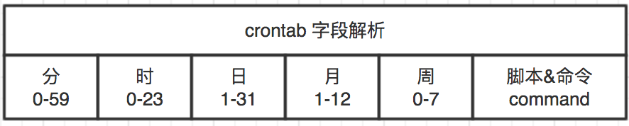

# 自动化任务
## 基础知识
系统管理中，往往需要定时去执行一些脚本或者程序，这些事情都是发生在未来的时间，由于种种原因，我们不可能一直守着主机在旁边等着时间达到，然后去执行。
这个时候我们可以使用系统中的自动化定时任务这个机制，定制精准的未来时间去执行某项任务。

## At（单次执行！！）
Linux系统用来计划“将来任务”之一的解决方案是"at"。"at"是一个系统守护进程,名为“atd”。在默认的Linux安装过程中，atd守护进程将自动安装和启用。

root用户可以使用命令行工具at为atd守护进程设置计划作业队列。Atd守护进程提供了a到z共26个队列，计划作业按字母顺序排列，队列越后，优先级越低。

## 计划作业：

使用at《timespec》可以设置新计划，at会读取从stdin执行命令。建议使用脚本文件（例如：at now+10min < myscript.sh）的输入重定向输入计划作业。手动输入命令时，可以按Ctrl+D来完成输入。

《timespec》允许许多种组合，用户可以自由地来说明计划作业的准确时间。通常，这些组合以时间（11:00pm、14:59）开头，后面接一个可选日期或将来的天数。

	实例如下：
	1：now +10min
	2: noon +4days
	3: 7pm aug 3 2015

### 创建计划作业：
	[root@localhost ~]# at 6pm aug 3 2017
	[root@localhost ~]# at 6pm +4days
	at> /root/test.sh
	at> <EOT>
### 检查计划作业：
	获得用户待处理计划作业的概述，可以使用命令atq或者别名 at –l
	[root@localhost ~]# at -l
	1	Wed Aug  3 20:00:00 2016 a root
	2	Wed Aug  3 20:00:00 2016 a root
### 输出的4个列如下：（左-->右））
	1：计划作业编号
	2：该计划作业执行时间和日期，第一行为2016年8月3日20:00:00
	3：计划作业所在队列，a在第一行
	4：计划作业所有者
>备注：普通非特权用户只能查看自己的作业，root用户可以查看和管理所有作业

### 删除计划作业：
删除计划作业可以先使用atq 或者 at –l来查看计划作业，当计划作业不需要的时候，可以使用atrm 《JOBNUMBER》来删除，例如：

	[root@localhost ~]# atrm <JOBNUMBER>

## 小结：
At自动化仅仅是执行一次，如果我们需要周期反复的执行，那么你有2种选择，一个是使用at不断的重复添加，另一个是使用cron计划周期性作业

## Cron计划周期性作业
使用at后，理论上，可以在执行一项计划作业之后，再重新提交计划作业，反反复复的提交，来实现周期性计划作业。实际上，这样对管理员来说非常痛苦的，并且大量人工操作使得出错几率非常高。

Crond守护进程是linux系统自带的周期性计划作业调度。并且默认安装和默认开启。Crond是由多个配置文件和系统范围内的文件控制的，每个用户对应一个配置文件。这些配置文件使用户和管理员拥有细微的控制权，可以控制应执行周期性计划作业的确切时间。

### 计划作业常用指令：
	crontab –l	列出当前用户的计划任务
	crontab –r	删除当前用户的所有计划任务
	crontab –e	编辑当前用户的计划任务
### 创建作业：
使用命令crontab –e 开启编辑器模式进行计划作业输入，默认是当前用户计划作业，如果要创建其他用户计划作业，可以使用 crontab –u username –e，使用-u参数指定用户。
	#crontab –e
	56 6 * * * /home/sysadmin/check/bin/Upload.sh > /dev/null 2>&1
### crontab文件解析：
用户所建立的crontab文件中，每一行都代表一项任务，每行的每个字段代表一项设置，它的格式共分为六个字段，前五段是时间设定段，第六段是要执行的命令段，格式如下：
	
	minute   hour   day   month   week   command
其中：

	minute： 表示分钟，从0到59之间的任何整数。
	hour：表示小时，从0到23之间的任何整数。
	day：表示日期，从1到31之间的任何整数。
	month：表示月份，从1到12之间的任何整数。
	week：表示星期几，从0到7之间的任何整数，这里的0或7代表星期日。
	command：要执行的命令，可以是系统命令，也可以是自己编写的脚本文件。

 
### 可以有如下表达式的书写方法：

	*    表示无关紧要 /始终
	x-y  表示范围，x 到 y （含）
	x，y  表示列表，例如：分钟可以写成 5,10-13,17 表示作业应当在每小时过去5分钟，10分钟，11分钟，12分钟，13分钟和17分钟后运行。
	*/x  表示x的时间间隔，例如分钟列表的*/7表示没7分钟运行一次作业。

### Crontab权限：

	文件：/etc/cron.deny
	说明：该文件中所列用户不允许使用crontab命令
	文件：/etc/cron.allow
	说明：该文件中所列用户允许使用crontab命令
	文件：/var/spool/cron/
	说明：所有用户crontab文件存放的目录,以用户名命名

### Crontab实例

	实例1：每1分钟执行一次command
	命令：* * * * * command
	实例2：每小时的第3和第15分钟执行
	命令：3,15 * * * * command
	实例3：在上午8点到11点的第3和第15分钟执行
	命令：3,15 8-11 * * * command
	实例4：每隔两天的上午8点到11点的第3和第15分钟执行
	命令：3,15 8-11 */2 * * command
	实例5：一月一号的4点重启smb 
	命令：0 4 1 jan * /etc/init.d/smb restart
>说明：
run-parts这个参数了，如果去掉这个参数的话，后面就可以写要运行的某个脚本名，而不是目录名了

### 注意事项
####  环境变量问题

有时我们创建了一个crontab，但是这个任务却无法自动执行，而手动执行这个任务却没有问题，这种情况一般是由于在crontab文件中没有配置环境变量引起的。
不要假定cron知道所需要的特殊环境变量，它其实什么都不知道。所以你要保证在shelll脚本中提供所有必要的路径和环境变量。所以注意如下3点：

1. 脚本中涉及文件路径时写全局路径；

2. 脚本执行要用到java或其他环境变量时，通过source命令引入环境变量，如：

	cat start_jboss.sh
	#!/bin/sh
	source /etc/profile
	export RUN_CONF=/home/xcl/conf/jbossplatform/jboss/work_jboss.conf
	/usr/local/jboss-4.0.5/bin/run.sh -c mev &

3. 当手动执行脚本OK，但是crontab死活不执行时。并可以尝试在crontab中直接引入环境变量解决问题。如：

	0 * * * * . /etc/profile;/bin/sh /var/www/java/work/bin/restart_jboss.sh

#### 其他事项

1. 新创建的cron job，不会马上执行，至少要过2分钟才执行。如果重启cron则马上执行。

2. 当crontab突然失效时，可以尝试/etc/init.d/crond restart解决问题。或者查看日志看某个job有没有执行/报错tail -f /var/log/cron。

3. 别乱运行crontab -r。它从Crontab目录（/var/spool/cron）中删除用户的Crontab文件。

4. 在crontab中%是有特殊含义的，表示换行的意思。如果要用的话必须进行转义\%，如经常用的date ‘+%Y%m%d’在crontab里是不会执行的，应该换成date ‘+\%Y\%m\%d’。

## 总结
Crontab是生产中常用的自动化周期性计划作业指定的方式，比如我们写了很多系统数据采集脚本，都是通过crontab来进行自动化执行的，还有统计每天的交易量，然后发邮件给管理员做统计，这些需要自动化的，周期性的执行任务，你可以放心的交给crond来执行！

