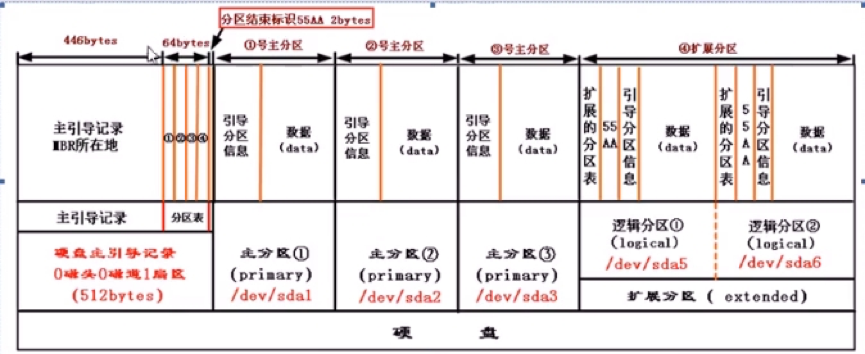

## 分区管理
#### 基础知识
* 什么是硬盘分区，分区用来做什么？ 
    - 分区就是硬盘的“段落”。Windows分区有自己的盘符（C：，D：等等），这些分区看起来都好像是一个独立的硬盘。 
    - 最简单的情况下就是将整个硬盘作为一个唯一的分区。如果您购买了一台已经预装了window的机器，基本上都是这种情况。 

* 在Linux下是不同的情况，它本身又有更多的分区--比如，根分区 “/” 和交换分区“swap”。 
* 分区类型`硬盘分区一共有三种：主分区，扩展分区和逻辑分区` 

* 在一块硬盘上最多只能有四个主分区。您可以另外建立一个扩展分区来代替四个主分区的其中一个，然后在扩展分区下您可以建立更多的逻辑分区。 
 
* Linux下的分区名称 
    - Linux下的分区命名比Windows下面将更加清晰详细，但是由此而来的名称不容易记住。不同于Windows下的盘符，Linux通常采用设备-名称（device-name）。一般的硬盘（比如IDE硬盘）将采用/dev/hdxy来命名。X表示硬盘（a是第一块硬盘，b是第二块硬盘，依次类推），y是分区的号码（从0开始，1，2，3等等）。SCSI硬盘将用/dev/sdxy来命名。光驱（不管是IDE类型或者SCSI）将和硬盘一样来命名。 

>提示：IDE（集成电路设备）和SCSI（小型计算机系统接口）是两个目前最流行的连接计算机硬盘，光驱或者软驱的系统。SCSI比IDE速度要快，但是同样价钱也要贵一些。SCSI通常可以用于文件服务器和数据库服务器。Linux支持这两种系统（当然可以同时在一台机器上拥有IDE和SCSI设备） 

* IDE硬盘和光驱设备将由内部连接来区分区定。/dev/hda表示第一个IDE信道的第一个设备（master），/dev/hdb表示第一个IDE信道的第二个设备（slave）。按照这个原则，/dev/hdc和/dev/hdd为第二个IDE信道的master和slave设备。被命名为/dev/had和/dev/hdc的两个设备在理论上是同样可以的，在这里不使用/dev/hdb。（这种情况下，设备被作为master连接在第一和第二个IDE信道上） 

* SCSI硬盘或者光驱设备依赖于设备的ID号码，不考虑遗漏的ID号码。比如三个SCSI设备的ID号码分别是0，2，5，设备名称分别是/dev/sda，/dev/sdb，/dev/sdc。如果现在再添加一个ID号码为3的设备，那么这个设备将被以/dev/sdc来命名，ID号码为5的设备将被称为/dev/sdd。 

* 分区的号码不依赖于IDE或者SCSI设备的命名，号码1到4位主分区或者扩展分区保留，从5开始才用来为逻辑分区命名。由于这个原因，经常会有号码漏洞。（比如1，2，5，6，在这里3和4就是号码漏洞）比如：第一块硬盘的主分区为hda1，扩展分区为hda2，扩展分区下的一个逻辑分区为hda5。 

###### 下面还有一些例子帮助大家来理解 

        /dev/hda          表示整个IDE硬盘 
        /dev/hda1         表示第一块IDE硬盘的第一个主分区 
        /dev/hda2         表示第一块IDE硬盘的扩展分区 
        /dev/hda5         表示第一块IDE硬盘的第一个逻辑分区 
        /dev/hda8         表示第一块IDE硬盘的第四个逻辑分区 
        /dev/hdb          表示第二个IDE硬盘 
        /dev/hdb1         表示第二块IDE硬盘的第一个主分区 
        /dev/sda           表示第一个SCSI硬盘 
        /dev/sda1          表示第一个SCSI硬盘的第一个主分区 
        /dev/sdd3          表示第四个SCSI硬盘的第三个主分区

#### 分区结构

硬盘主引导扇区由三部分组成，分别是：
        
        1、硬盘主引导记录（MBR）
        2、硬盘分区表（DPT）
        3、结束标志
* 其总共所占空间为512字节（512b）, 其中硬盘主引导记录（MBR）446字节（0000--01BD），硬盘分区表（DPT ）64字节（01BE--01FD），结束标志2字节。
* 硬盘主引导记录是用来存放引导程序（Bootloader）的，也就是Linux中Grub程序放置的地方，负责把操作系统的内核（kernel）读入内存。
硬盘分区表用来存放硬盘分区信息，64字节被平均分为4个部分，也就是每一部分16字节，系统用这每16个字节记录一个硬盘分区，我们把这样的分区叫做主分区（Primary Partition ）。
* 一个硬盘最多只能有4个主分区，这对于计算机的发展是很不利的，随着硬盘容量的扩大这个问题渐渐的明显了，但我们又不能打破以前的分区规则，怎么办呢？我们就把4个主分区中的一个拿出来当作特殊的分区处理，在它上面建立新的分区结构。我们把这个特殊的主分区叫做扩展分区（Extended Partition），在扩展分区上划分的新结构分区叫做逻辑分区（Logical Partition）。
* 根据规定IDE硬盘可以分63个区，SCSI硬盘可以分15个区。

#### 目录介绍
学习分区之前，先要了解一下Linux系统内部目录的功能，方便我们针对不同的要求对不同的目录进行单独的分区挂载和使用。

|目录|释义|
|:----|:----|
|bin|基本命令执行文件|
|boot|boot loader 的静态链接文件|
|dev |设备文件|
|etc |主机特定的系统配置|
|home|用户目录|
|lib |基本共享库以及内核模块|
|media|用于移动介质的挂载点|
|mnt |用于临时挂载文件系统|
|proc|系统信息的虚拟目录|
|root|root 用户的目录|
|sbin|基本系统命令执行文件|
|sys|系统信息的虚拟目录|
|tmp|临时文件|
|usr|第二级目录|
|var|不断变化的数据|
|srv|系统提供的用于service 的数据|
|opt|附加的应用程序软件包|

#### 重要目录功能介绍
* 根分区 / 必须总是物理地包含 /etc、/bin、/sbin、/lib 和 /dev，否则您将不能启动系统。典型的根分区需要5GB 大小空间。
* /usr：包含所有的用户程序(/usr/bin)，库文件(/usr/lib)，文档(/usr/share/doc)，等等。这是文件系统中耗费空间最多的部分。您需要提供至少 500MB 磁盘空间。总容量会依据您要安装的软件包数量和类型增长。宽松的工作站或服务器安装应该需要 4–6GB。
* /var：所有的可变数据，如新闻组文章、电子邮件、网站、软件包系统的缓存等等，将被放入这个目录。这个目录的大小取决于您计算机的用途，但是对大多数人来说，将主要用于软件包系统的管理工具。5GB的空间应该够用，依据系统用途进行扩展和分配。
* /tmp: 程序创建的临时数据大都存到这个目录。通常 5GB 应该足够。一些应用程序 — 包括归档处理程序、CD/DVD 制作工具和多媒体软件 — 可能会使用 /tmp 临时保存映像文件。如果要使用这些程序，应该相应地调整 /tmp 目录的大小。
* /home：每个用户将放置他的私有数据到这个目录的子目录下。其大小取决于将有多少用户使用系统，以及有什么样文件放在他们的目录下。根据规划的用途，应该为每个用户准备 1GB 空间，不过应该按您的需求调整。假如您在 home 目录下计划保存大量的多媒体文件(图片、MP3、电影)，该预备更多的空间。

#### 分区介绍
* Linux 系统3个基础分区介绍
    - /boot分区(不是必须的)：/boot分区用于引导系统，它包含了操作系统的内核和在启动系统过程中所要用到的文件，该分区的大小一般为256MB。
    - swap分区：swap分区的作用是充当虚拟内存，其大小通常是物理内存的两倍左右（当物理内存大于512MB时，swap分区为512MB即可）。
    例如物理内存是128MB，那么swap分区的大小应该是256MB。
    - /（根）分区：剩余空间CentOS将大部分的系统文件和用户文件都保存在/（根）分区上，所以该分区一定要足够大，一般要求大于5GB。

#### 分区建议
* 最基本分区方案：
    - / ：建议大小在 5GB 以上。 
    - swap ：即交换分区，建议大小是物理内存的 1~2 倍。
 
* 进阶分区方案：
    - /boot ：用来存放与 Linux 系统启动有关的程序，比如启动引导装载程序等，建议大小为 100MB 。 
    - / ： Linux 系统的根目录，所有的目录都挂在这个目录下面，建议大小为 5GB 以上。 
    - /home ：存放普通用户的数据，是普通用户的宿主目录，建议大小为剩下的空间。 
    - swap ：实现虚拟内存，建议大小是物理内存的 1~2 倍。
 
* 高级分区方案：
    - /boot ：用来存放与 Linux 系统启动有关的程序，比如启动引导装载程序等，建议大小为 100MB 。 
    - /usr ：用来存放 Linux 系统中的应用程序，其相关数据较多，建议大于 3GB 以上。 
    - /var ：用来存放 Linux 系统中经常变化的数据以及日志文件，建议大于 1GB 以上。 
    - /home ：存放普通用户的数据，是普通用户的宿主目录，建议大小为剩下的空间。 
    - / ： Linux 系统的根目录，所有的目录都挂在这个目录下面，建议大小为 5GB 以上。 
    - /tmp ：将临时盘在独立的分区，可避免在文件系统被塞满时影响到系统的稳定性。建议大小为 500MB 以上。 
    - swap ：实现虚拟内存，建议大小是物理内存的 1~2 倍。

* 简单总结如下：
    - 例如：如果是邮件服务器，那么/var就要多分点容量；
    - 如果是文件服务器，那么/home就要多分；
    - 如果玩桌面，那么/swap+/就好了

#### SWAP规则
创建swap分区是为了弥补物理内存的不足，也就是虚拟内存的概念，把硬盘的一部分划分作为虚拟内存，但这个空间不是越大越好，硬盘的速度远低于内存，设置不当反而拖慢系统的速度。

CentOS 7 交换分区设置规则

|物理内存|交换分区|
|:-----|:-----|
|小于等于4GB|至少2GB|
|4G~16G|至少4GB|
|16G~64G|至少8GB|
|64G~256G|至少16GB|

#### Fdisk分区
FDISK分区工具：fdisk是来自IBM的老牌分区工具，支持绝大多数操作系统，几乎所有的Linux的发行版本都装有fdisk，是基于MBR的分区工具。
* 查看分区信息
```
root登录系统
[root@bogon srv]# fdisk -l
Disk /dev/sdb: 10.7 GB, 10737418240 bytes, 20971520 sectors
Units = sectors of 1 * 512 = 512 bytes
Sector size (logical/physical): 512 bytes / 512 bytes
I/O size (minimum/optimal): 512 bytes / 512 bytes

Disk /dev/sda: 137.4 GB, 137438953472 bytes, 268435456 sectors
Units = sectors of 1 * 512 = 512 bytes
Sector size (logical/physical): 512 bytes / 512 bytes
I/O size (minimum/optimal): 512 bytes / 512 bytes
Disk label type: dos
Disk identifier: 0x00096f63

   Device Boot      Start         End      Blocks   Id  System
/dev/sda1   *        2048     1026047      512000   83  Linux
/dev/sda2         1026048   268435455   133704704   8e  Linux LVM
……..
我们将看到所有的磁盘信息，包含已经分区和未分区的，其中显示sda总大小为137.4GB已经分了2个分区，sda1和sda2，sda2是lvm格式，sda1是正常的Linux分区。Sdb未进行任何分区，总大小10.7GB。如果想看单独的磁盘可以如下操作：
[root@bogon ~]# fdisk -l /dev/sdb

Disk /dev/sdb: 10.7 GB, 10737418240 bytes, 20971520 sectors
Units = sectors of 1 * 512 = 512 bytes
Sector size (logical/physical): 512 bytes / 512 bytes
I/O size (minimum/optimal): 512 bytes / 512 bytes
```
* 对sdc进行分区
```
[root@bogon srv]# fdisk /dev/sdb
Welcome to fdisk (util-linux 2.23.2).
Changes will remain in memory only, until you decide to write them.
Be careful before using the write command.

Device does not contain a recognized partition table
Building a new DOS disklabel with disk identifier 0x5ce83731.

Command (m for help): m     （m键使用帮助）
Command action
   a   toggle a bootable flag
   b   edit bsd disklabel
   c   toggle the dos compatibility flag
   d   delete a partition
   g   create a new empty GPT partition table
   G   create an IRIX (SGI) partition table
   l   list known partition types
   m   print this menu
   n   add a new partition
   o   create a new empty DOS partition table
   p   print the partition table
   q   quit without saving changes
   s   create a new empty Sun disklabel
   t   change a partition's system id
   u   change display/entry units
   v   verify the partition table
   w   write table to disk and exit
   x   extra functionality (experts only)
Command (m for help): n    （添加分区）
Partition type:
   p   primary (0 primary, 0 extended, 4 free)
   e   extended
Select (default p): p  （主分区）
Partition number (1-4, default 1): 1  （序号1）
First sector (2048-20971519, default 2048):  （回车，默认起始位置）
Using default value 2048
Last sector, +sectors or +size{K,M,G} (2048-20971519, default 20971519): +2G（分区大小）
Partition 1 of type Linux and of size 2 GiB is set

Command (m for help): p （查看分区）

Disk /dev/sdb: 10.7 GB, 10737418240 bytes, 20971520 sectors
Units = sectors of 1 * 512 = 512 bytes
Sector size (logical/physical): 512 bytes / 512 bytes
I/O size (minimum/optimal): 512 bytes / 512 bytes
Disk label type: dos
Disk identifier: 0x5ce83731

   Device Boot      Start         End      Blocks   Id  System
/dev/sdb1            2048     4196351     2097152   83  Linux  （已经分出）

--继续创建扩展分区--

Command (m for help): n  (添加新分区)
Partition type:
   p   primary (1 primary, 0 extended, 3 free)
   e   extended
Select (default p): e   （选择扩展分区e）
Partition number (2-4, default 2): 2 （输入2序号，因为1已经被占用）
First sector (4196352-20971519, default 4196352): （回车，默认起始空间）
Using default value 4196352
Last sector, +sectors or +size{K,M,G} (4196352-20971519, default 20971519): （回车，默认结束空间，扩展分区大小无法输入，使用全部空间即可）
Using default value 20971519
Partition 2 of type Extended and of size 8 GiB is set
Command (m for help): p  （查看分区信息）

Disk /dev/sdb: 10.7 GB, 10737418240 bytes, 20971520 sectors
Units = sectors of 1 * 512 = 512 bytes
Sector size (logical/physical): 512 bytes / 512 bytes
I/O size (minimum/optimal): 512 bytes / 512 bytes
Disk label type: dos
Disk identifier: 0x5ce83731
（Sdb1和sdb2已经分出，1位主分区，2位扩展分区）
   Device Boot      Start         End      Blocks   Id  System
/dev/sdb1            2048     4196351     2097152   83  Linux
/dev/sdb2         4196352    20971519     8387584    5  Extended
--把扩展分区化为逻辑分区—
Command (m for help): n   （添加新分区）
Partition type:
   p   primary (1 primary, 1 extended, 2 free)
   l   logical (numbered from 5)
Select (default p): l （l 选择逻辑分区）
Adding logical partition 5
First sector (4198400-20971519, default 4198400):  （默认起始分区）
Using default value 4198400
Last sector, +sectors or +size{K,M,G} (4198400-20971519, default 20971519): +3G（设置逻辑分区大小）
Partition 5 of type Linux and of size 3 GiB is set

Command (m for help): p  （查看分区信息）

Disk /dev/sdb: 10.7 GB, 10737418240 bytes, 20971520 sectors
Units = sectors of 1 * 512 = 512 bytes
Sector size (logical/physical): 512 bytes / 512 bytes
I/O size (minimum/optimal): 512 bytes / 512 bytes
Disk label type: dos
Disk identifier: 0x5ce83731
（Sdb5逻辑分区已经完成）
   Device Boot      Start         End      Blocks   Id  System
/dev/sdb1            2048     4196351     2097152   83  Linux
/dev/sdb2         4196352    20971519     8387584    5  Extended
/dev/sdb5         4198400    10489855     3145728   83  Linux
Command (m for help): w（保存退出，输入w后回车即生效，如果此时退出将不会效）
The partition table has been altered!

Calling ioctl() to re-read partition table.
Syncing disks.
Command (m for help): q   （退出不保存，Ctrl-C 也可终止）
```
* 创建文件系统挂载使用
```
操作系统通过文件系统管理文件及数据，磁盘或分区需要创建文件系统之后才能够为操作系统使用，创建文件系统的过程又称之为格式化。
     输入：mke2fs -t ext4 /dev/sdb1（用命令mke2fs为sdb1主分区创建文件系统）
     输入：mke2fs -t ext4 /dev/sdb5（为sdb5逻辑分区创建文件系统）
[root@bogon srv]# mke2fs -t ext4 /dev/sdb1 
mke2fs 1.42.9 (28-Dec-2013)
Filesystem label=
OS type: Linux
……
Allocating group tables: done                            
Writing inode tables: done                            
Creating journal (16384 blocks): done
Writing superblocks and filesystem accounting information: done


[root@bogon srv]# mke2fs -t ext4 /dev/sdb5
mke2fs 1.42.9 (28-Dec-2013)
Filesystem label=
OS type: Linux
……

Allocating group tables: done                            
Writing inode tables: done                            
Creating journal (16384 blocks): done
Writing superblocks and filesystem accounting information: done


为什么没有sdb2呢？因为sdb2是扩展分区，扩展分区只有在转为逻辑分区之后才能格式化并挂载使用。
```
* 挂载文件系统
```
输入:mount /dev/sdb1    /mnt(把sdb1主分区挂载到/mnt/1上)
输入:mount /dev/sdb5    /mnt(把sdb5逻辑分区挂载到/mnt/5上)

[root@bogon srv]# mkdir /mnt/{1,5}
[root@bogon srv]# mount /dev/sdb1 /mnt/1
[root@bogon srv]# mount /dev/sdb5 /mnt/5
[root@bogon srv]# df -h 
Filesystem               Size  Used Avail Use% Mounted on
……
/dev/sdb1                2.0G  6.0M  1.8G   1% /mnt/1
/dev/sdb5                2.9G  9.0M  2.8G   1% /mnt/5
已经挂载成功并可以使用了。
```
* 删除分区
```
[root@bogon ~]# umount /mnt/5
[root@bogon ~]# fdisk /dev/sdb 
Welcome to fdisk (util-linux 2.23.2).
Changes will remain in memory only, until you decide to write them.
Be careful before using the write command.

Command (m for help): p   （查看分区状态）

Disk /dev/sdb: 10.7 GB, 10737418240 bytes, 20971520 sectors
Units = sectors of 1 * 512 = 512 bytes
Sector size (logical/physical): 512 bytes / 512 bytes
I/O size (minimum/optimal): 512 bytes / 512 bytes
Disk label type: dos
Disk identifier: 0x5ce83731

   Device Boot      Start         End      Blocks   Id  System
/dev/sdb1            2048     4196351     2097152   83  Linux
/dev/sdb2         4196352    20971519     8387584    5  Extended
/dev/sdb5         4198400    10489855     3145728   83  Linux  （删除sdb5）
Command (m for help): d    （删除分区）
Partition number (1,2,5, default 5): 5   （输入分区编号）
Partition 5 is deleted

Command (m for help): p   （查看分区状态）

Disk /dev/sdb: 10.7 GB, 10737418240 bytes, 20971520 sectors
Units = sectors of 1 * 512 = 512 bytes
Sector size (logical/physical): 512 bytes / 512 bytes
I/O size (minimum/optimal): 512 bytes / 512 bytes
Disk label type: dos
Disk identifier: 0x5ce83731

   Device Boot      Start         End      Blocks   Id  System
/dev/sdb1            2048     4196351     2097152   83  Linux
/dev/sdb2         4196352    20971519     8387584    5  Extended

Command (m for help): w     （保存分区状态）
The partition table has been altered!

Calling ioctl() to re-read partition table.
Syncing disks.
删除有风险，操作需谨慎！！
```

#### parted分区
* 通常我们用的比较多的一般都是fdisk工具来进行分区，但是现在由于磁盘越来越廉价，而且磁盘空间越来越大;而fdisk工具他对分区是有大小限制的，它只能划分小于2T的磁盘。但是现在的磁盘空间很多都已经是远远大于2T了，甚至达到2.5T和3T,那要怎么办能，有两个方法，其一是通过卷管理来实现，其二就是通过我们今天谈到的Parted工具来实现对GPT磁盘进行分区操作。
* GPT格式的磁盘相当于原来MBR磁盘中原来保留4个partition table的4*16个字节，只留第一个16个字节，类似于扩展分区，真正的partitiontable在512字节之后，GPT磁盘没有四个主分区的限制。
* 查看现有磁盘设备
```
[root@bogon ~]# fdisk -l /dev/sdf 
Disk /dev/sdf: 2199.0 GB, 2199022206976 bytes, 4294965248 sectors
…..
已经超过了2TB的空间大小，所以分区的时候可以直接使用parted来进行
```
* 使用parted进行分区
```
[root@bogon ~]# parted /dev/sdf
GNU Parted 3.1
Using /dev/sdf
Welcome to GNU Parted! Type 'help' to view a list of commands.
(parted) help                                                             
  align-check TYPE N       check partition N for TYPE(min|opt) alignment
……省略……
(parted) print                                                            
Model: ATA VBOX HARDDISK (scsi)
Disk /dev/sdf: 2199GB
Sector size (logical/physical): 512B/512B
Partition Table: msdos
Disk Flags: 

Number  Start  End  Size  Type  File system  Flags
（没有分区信息输出）
(parted) mklabel    （制作分区标签）                                                      
New disk label type? gpt
Warning: The existing disk label on /dev/sdf will be destroyed and all data on this disk will be lost. Do you want to continue?
Yes/No? yes                                                               
(parted) p        （查看分区信息）                                                         
Model: ATA VBOX HARDDISK (scsi)
Disk /dev/sdf: 2199GB
Sector size (logical/physical): 512B/512B
Partition Table: gpt
……
（添加新分区）
(parted) mkpart    （创建分区指令）                                                        
Partition name?  []? gpttest   （分区名称）
File system type?  [ext2]? ext4  （文件系统格式）                                                                                                               
Start? 1   （起始位置）
End? 2190GB      （结束位置）                                                          
(parted) p     （查看分区信息）                                                           
Model: ATA VBOX HARDDISK (scsi)
Disk /dev/sdf: 2199GB
Sector size (logical/physical): 512B/512B
Partition Table: gpt
Disk Flags: 

Number  Start   End     Size    File system  Name     Flags
 1      1049kB  2190GB  2190GB  ext4         gpttest
(parted) q   （退出即保存，操作需谨慎）                                                             
Information: You may need to update /etc/fstab.
```
* 格式化并挂载使用
```
[root@bogon ~]# mkfs.xfs -f /dev/sdf1
[root@bogon ~]# mount /dev/sdf1 /mnt/
[root@bogon ~]# df -h
Filesystem               Size  Used Avail Use% Mounted on
/dev/sdf1                2.0T   33M  2.0T   1% /mnt
使用XFS文件系统对大分区的支持，挂载尝试使用。
```
* 删除gpt分区
```
[root@bogon ~]# umount /mnt/
[root@bogon ~]# parted /dev/sdf
GNU Parted 3.1
Using /dev/sdf
Welcome to GNU Parted! Type 'help' to view a list of commands.
(parted) p     （查看分区信息）                                                                
Model: ATA VBOX HARDDISK (scsi)
Disk /dev/sdf: 2199GB
Sector size (logical/physical): 512B/512B
Partition Table: gpt
Disk Flags: 

Number  Start   End     Size    File system  Name     Flags
 1      1049kB  2190GB  2190GB  xfs          gpttest   （删除该分区）

(parted) rm 1       （删除序号1的分区）                                                      
(parted) p     （查看分区信息）                                                                
Model: ATA VBOX HARDDISK (scsi)
Disk /dev/sdf: 2199GB
Sector size (logical/physical): 512B/512B
Partition Table: gpt
Disk Flags: 

Number  Start  End  Size  File system  Name  Flags
（已删除分区，无分区信息）
(parted) q   （退出）                                                             
Information: You may need to update /etc/fstab.
操作需谨慎！
```

#### 交换分区
* SWAP就是LINUX下的虚拟内存分区,它的作用是在物理内存使用完之后,将磁盘空间(也就是SWAP分区)虚拟成内存来使用.
* 需要注意的是,虽然这个SWAP分区能够作为"虚拟"的内存,但它的速度比物理内存可是慢多了,因此如果楼主您需要更快的速度的话,并不能寄厚望于SWAP,最好的办法仍然是加大物理内存.SWAP分区只是临时的解决办法.

###### 分区添加swap 
* fdisk创建swap分区
```
[root@bogon ~]# fdisk /dev/sdc 
Welcome to fdisk (util-linux 2.23.2).

Changes will remain in memory only, until you decide to write them.
Be careful before using the write command.

Device does not contain a recognized partition table
Building a new DOS disklabel with disk identifier 0xe2422b0b.

Command (m for help): n
Partition type:
   p   primary (0 primary, 0 extended, 4 free)
   e   extended
Select (default p): p
Partition number (1-4, default 1): 1
First sector (2048-41943039, default 2048): 
Using default value 2048
Last sector, +sectors or +size{K,M,G} (2048-41943039, default 41943039): +4G
Partition 1 of type Linux and of size 4 GiB is set

Command (m for help): t
Selected partition 1
Hex code (type L to list all codes): L
……省略显示……
Hex code (type L to list all codes): 82
Changed type of partition 'Linux' to 'Linux swap / Solaris'

Command (m for help): w
The partition table has been altered!

Calling ioctl() to re-read partition table.
Syncing disks.
```
* 格式化并使用swap分区
```
[root@bogon ~]# partx -a /dev/sdc 
partx: /dev/sdc: error adding partition 1
[root@bogon ~]# mkswap /dev/sdc
sdc   sdc1  
[root@bogon ~]# mkswap /dev/sdc1
mkswap: /dev/sdc1: warning: wiping old ext4 signature.
Setting up swapspace version 1, size = 4194300 KiB
no label, UUID=9d78cfdc-b232-468d-b38b-b8623ca73097
[root@bogon ~]# free -m
              total        used        free      shared  buff/cache   available
Mem:           1840         293        1151           8         394        1365
Swap:          2047           0        2047
[root@bogon ~]# swapon /dev/sdc1 
[root@bogon ~]# free -m
              total        used        free      shared  buff/cache   available
Mem:           1840         295        1149           8         394        1363
Swap:          6143           0        6143
------开机挂载------
[root@bogon ~]# vim /etc/fstab
[root@bogon ~]# cat /etc/fstab 
/dev/sdc1		swap			swap	defaults	0 0
[root@bogon ~]# mount -a
```
* 文件添加swap
```
1：创建1G文件做为交换分区使用
[root@bogon ~]# dd if=/dev/zero of=/test/1.img bs=1M count=1024
2：格式化并挂载使用
[root@bogon ~]# mkswap /test/1.img 
Setting up swapspace version 1, size = 1048572 KiB
no label, UUID=db5e1539-00b5-4837-a528-ca25365d8328
[root@bogon ~]# free -m
              total        used        free      shared  buff/cache   available
Mem:           1840         290          97           8        1451        1354
Swap:          6143           0        6143
[root@bogon ~]# swapon /test/1.img
swapon: /test/1.img: insecure permissions 0644, 0600 suggested.
[root@bogon ~]# free -m
              total        used        free      shared  buff/cache   available
Mem:           1840         290          97           8        1452        1353
Swap:          7167           0        7167
-----------开机挂载------------
[root@bogon ~]# vim /etc/fstab
[root@bogon ~]# cat /etc/fstab 
/test/1.img		swap			swap	defaults	0 0
[root@bogon ~]# mount -a
```
>如果不需要使用已经挂载的swap分区，则可以注释掉/etc/fstab中的对应挂载，也可以在线使用swapoff命令卸载下来。
>[root@bogon ~]# swapoff /test/1.img


