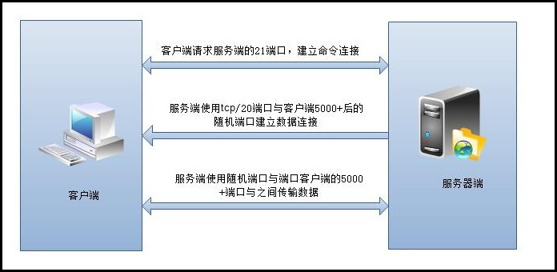
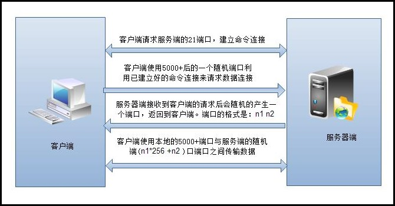
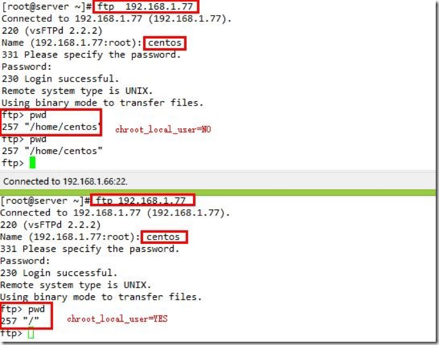
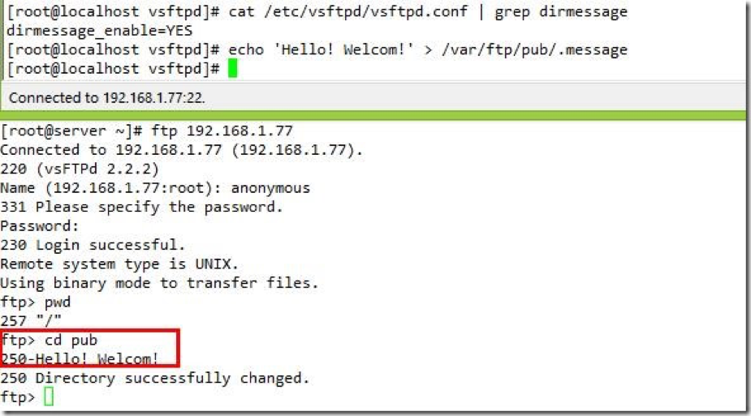

# 文件服务

## 基础知识
* 对于一个生产环境而言，配置和启用文件服务器是很有必要的，把重要的数据都集中存储和管理，这样的做法显然要比分别存储在不同的地方要可靠的多。
* 在Linux下常用的方式有3种，分别是：NFS服务器，Samba服务器，ftp服务器。
* ftp的客户可以来自于任何平台，只要你拥有ftp的shell或相对应的ftp客户端即可。
* Samba专门针对windows用户，但是Linux用户也可以使用。
* NFS则是针对Linux/Unix用户的。
#### 一个简单的表格对比如下：
|名称|客户端|常用范围|服务端口|
|---|:----:|:------:|-------|
|FTP|Windows/Linux/Unix/MacOS….|发布网站，文件共享|TCP/21、22、随机|
|Samba|Windows/Linux/Unix|文件共享（网上邻居）|TCP/445,TCP/139|
|NFS|Linux/Unix|发布网站，文件共享|TCP/2049|

### NFS介绍
* NFS是SUN Microsystem公司开发的网络文件系统，它是一种基于远程过程调用（RPC）的分布式文件系统架构。是Linux/Unix之间共享文件的主力军，其吞吐能力要好于samba。

* NFS全称是network file system，NFS允许一个系统在网络上与他人共享目录和文件。通过使用NFS，用户和程序可以像访问本地文件一样访问远端系统上的文件。

* 假如有三台机器A, B, C，它们需要访问同一个目录，目录中都是图片，传统的做法是把这些图片分别放到A, B, C. 但是使用NFS只需要放到A上，然后A共享给B和C即可。访问的时候，B和C是通过网络的方式去访问A上的那个目录的。

## NFS概念
* RPC（Remote Procedure Call Protocol远程过程调用协议）：
简单的说是函数调用（远程主机上的函数） 一部分功能由本地程序完成 另一部分功能由远程主机上的函数完成。客户端挂载了nfs服务器的文件系统时，进行一些操作，但是这些操作服务端如何知道呢？？这可是在内核级别上实现协议。RPC就解决了这个问题，它会将客户端的操作的函数调用发送到服务器端，由服务器端执行这些函数调用。

* idmapd：
想想这种情形，nfs客户端在挂载文件系统以后，在本地以某用户的身份创建了一个文件，在服务器端这个文件的属主和属组是哪个用户呢？早期是通过NIS（Network Information Services网络信息服务）来解决这个问题的，但是在传输账号和密码时，使用的是明文传输，现在使用LDAP+clbbler来实现的。但是，NFS使用的是idmapd这个服务，有rpc提供，将所有的用户后映射为nfsnobody，但是在访问的时候，还是以本地UID对应的本地用户来使用的。

* mounted:
NFS是通过什么来控制那些客户端可以访问，那些不可以访问的呢？NFS只支持通过IP来控制客户端，而这个功能是由守护进程mounted来实现的，它监听的端口是半随机的。所谓的半随机指的是，这个随机端口是由rpc服务来决定的，而rpc是通过随机的方式。作用等等同于小区大门保安的作用。

## NFS请求过程
* 在CentOS6.5中，NFS服务端监听在tcp和udp的2049端口，服务名是nfs、pc监听于tcp和udp的111号端口，服务名是portmapper。

* 请求过程：当客户端试这去挂载使用nfs共享的文件系统是，客户端首先回去与postmapper(tcp/111)端口去注册使用，此时postmapper会随机分配一个端口给mounted,然后mounted这个守护进程会来验证客户端的合法性，验证通过后，会把请求交给nfs服务，客户端此时可以挂载使用了，用户在创建文件时，会使用到idmapd的守护进程来映射属主。其实idmapd也是有rpc服务提供的，只不过在这里，nfs服务使用到用户映射的功能时，会自动的去调用此守护进程。

## NFS配置
* CentOS7在默认情况下支持NFSV4，并在该版本不可用的情况下自动回退到VFSv3和NFSv2。NFSv4使用TCP协议与服务器进行通信，较早的版本使用TCP或者UDP。
* NFS服务器安装要求安装nfs-utils软件包。此软件包提供了使用NFS将目录共享到客户端必须的所有使用程序。用于NFS服务器配置共享目录的文件为/etc/exports。

        这个文件的书写格式如下：
        共享目录    客户端  （选项1，选项2） 客户端（选项1，选项2） …  
        示例：
        /mydata   172.16.0.0/16（ro,async,no_root_squash)   www.example.com（ro）

        主机IP地址：例如 192.168.1.10
        网络地址：例如 172.16.0.0/24
        域名表示：例如 www.example.com（指定主机），*.example.com（对应域名下的所有主机）
        *:表示所有的主机

* 常见的选项

|选项|解释|
|:---:|:----:|
|rw|这个选项允许 NFS 客户机进行读/写访问。缺省选项是只读的。|
|secure|这个选项是缺省选项，它使用了 1024 以下的 TCP/IP 端口实现 NFS 的连接。指定 insecure 可以禁用这个选项。|
|async|异步存储（所有的客户端操作先在内存中缓存，等待cpu空闲的时候写入磁盘）。这个选项可以改进性能，但是如果没有完全关闭 NFS 守护进程就重新启动了 NFS 服务器，这也可能会造成数据丢失。与之相反的是syns，是同步写入磁盘。|
|no_wdelay|这个选项关闭写延时。如果设置了 async，那么 NFS 就会忽略这个选项。|
|nohide|如果将一个目录挂载到另外一个目录之上，那么原来的目录通常就被隐藏起来或看起来像空的一样。要禁用这种行为，需启用 hide 选项。|
|no_subtree_check|这个选项关闭子树检查，子树检查会执行一些不想忽略的安全性检查。缺省选项是启用子树检查。|
|no_auth_nlm|这个选项也可以作为 insecure_locks 指定，它告诉 NFS 守护进程不要对加锁请求进行认证。如果关心安全性问题，就要避免使用这个选项。缺省选项是 auth_nlm 或 secure_locks。|
|mp (mountpoint=path)|通过显式地声明这个选项，NFS 要求挂载所导出的目录。|
|fsid=num|这个选项通常都在 NFS 故障恢复的情况中使用。如果希望实现 NFS 的故障恢复，请参考 NFS 文档|

* 用户映射的选项

|选项|解释|
|:---:|:----:|
|root_squash|这个选项不允许 root 用户访问挂载上来的 NFS 卷。|
|no_root_squash|这个选项允许 root 用户访问挂载上来的 NFS 卷。|
|all_squash|这个选项对于公共访问的 NFS 卷来说非常有用，它会限制所有的 UID 和 GID，只使用匿名用户。缺省设置是 no_all_squash。|
|anonuid 和 anongid|这两个选项将匿名 UID 和 GID 修改成特定用户和组帐号。|

* 防火墙设置

* 启动和停止NFS服务

* NFS常用指令
        
        showmount是用来查看nfs服务的情况
        用法：showmount [ -adehv ] [ --all ] [ --directories ] [ --exports ] [ --help ] [ --version ] [ host ]
        可以使用短选型，也可以使用长选项。
        -a ：这个参数是一般在NFS SERVER上使用，是用来显示已经mount上本机nfs目录的cline机器。   
        -e ：显示指定的NFS SERVER上export出来的目录。
*
        exportfs:一般用在当NFS服务启动后，使用此命令来控制共享目录的导出
        用法：exportfs [-aruv] 
        -a ：全部mount或者unmount /etc/exports中的内容 
        -r ：重新mount /etc/exports中分享出来的目录 
        -u ：umount目录 
        -v ：在export的时候，将详细的信息输出到屏幕上。

* 范例： 

        # exportfs -au 卸载所有共享目录 
        # exportfs -rv 重新共享所有目录并输出详细信息

* NFS挂载使用

        先使用 showmont -e SER_NAME 来发现服务端的共享的目录
        然后使用mount挂载使用，格式：
        mount -t nfs SER_NAME:/data /parth/to/someponit [-o 选项]
        mount -t nfs 192.168.1.99:/mydat /mnt -o rsize=4096
        rsize 的值是从服务器读取的字节数。wsize 是写入到服务器的字节数。默认都是1024， 如果使用比较高的值，如8192,可以提高传输速度。


## Samba介绍

* 生产环境中并不是只有linux/unix,也不是由microsoft windows 独霸天下。而往往是很多系统参杂的使用，既有Linux/Uinx，也有Windows。而高效的NFS并不能满足Windows的访问，所以，开发了 linux给windows用户提供文件共享的工具Samba，算是Linux上的开源精神的体现么？！ 
* Samba服务类似于windows上的共享功能，可以实现在Linux上共享文件，windows上访问，当然在Linux上也可以访问到。
* 是一种在局域网上共享文件和打印机的一种通信协议，它为局域网内的不同计算机之间提供文件及打印机等资源的共享服务。 
* smb: Service Message Block
* CIFS: Common Internet File System通用网络文件系统，是windows主机之间共享的协议，samba实现了这个协议，所以可以实现wondows与linux之间的文件共享服务。

### Samba服务器配置
* 安装samba服务器
        
        #yum -y install samba
* 服务脚本：
      
      /etc/rc.d/init.d/nmb # 实现 NetBIOS协议
      /etc/rc.d/init.d/smb  # 实现cifs协议
* 主配置文件：
  
       /etc/samba/smb.conf
* samba用户：
        
      账号：都是系统用户, /etc/passwd
      密码：samba服务自有密码文件
      将系统用户添加为samba的命令：smbpasswd

* smbpasswd:
  
      -a Sys_User: 添加系统用户为samba用户
      -d ：禁用用户
      -e: 启用用户
      -x: 删除用户
* 配置文件：
        
      /etc/samba/smb.conf   配置文件包括全局设定，特定共享的设定，私有家目录，打印机共享，自定义共享
#### 配置范例
* 全局配置： 	
```
workgroup = MYGROUP  # 工作组
hosts allow = 127. 192.168.12. 192.168.13. # 访问控制，IP控制
interfaces = lo eth0 192.168.12.2/24 192.168.13.2/24 # 接口+ip控制

自定义共享：
[shared_name] #共享名称
path = /path/to/share_directory #共享路径
comment = Comment String # 注释信息
guest ok = {yes|no} | public = {yes|no} # 是否启用来宾账号
writable = {yes|no} |  read only = {yes|no} # 共享目录是否可写
write list = +GROUP_NAME  #
```

* 测试配置文件是否有语法错误，以及显示最终生效的配置：  	
        
        testparm
* 启动samba服务（补全）
* 防火墙配置（补全）

* 范例
```
要求共享一个目录，任何人都可以访问，即不用输入密码即可访问，要求只读 
[global]部分 MYGROUP 改为WORKGROUP 
security = user  改为 security = share 
末尾处加入：
[share] 
comment = share all 
path = /tmp/samba 
browseable = yes 
public = yes 
writable = no 

mkdir /tmp/samba 

chmod 777 /tmp/samba 
touch /tmp/samba/sharefiles 
echo "111111" > /tmp/samba/sharefiles 
启动：/etc/init.d/smb start  
检查配置的smb.conf是否正确  testparm  
测试：win机器浏览器输入 file://192.168.0.22/share 
或者运行栏输入： \\192.168.0.22
```
* 范例2
```
共享一个目录，使用用户名和密码登录后才可以访问，要求可以读写 
[global] 部分内容如下:  

[global] 
workgroup = WORKGROUP 
server string = Samba Server Version %v 
security = user 
passdb backend = tdbsam 
load printers = yes 
cups options = raw 

还有如下：
[myshare] 
comment = share for users 
path = /samba 
browseable = yes 
writable = yes 
public = no 

创建目录：mkdir /samba
修改权限：chmod 777 /samba
创建系统账号：
useradd user1
useradd user2
添加user1/user2为samba账户：
pdbedit -a user1
pdbedit -a user2 
列出samba所有账号: pdbedit –L
重启服务 service smb restart
测试：浏览器输入file://192.168.0.22/myshare
```
* Windows中samba使用
```
在windows中访问Linux的samba服务器，可以直接使用网上邻居或者是使用url来访问，例如192.168.56.101是共享服务器，客户端使用“\\192.168.56.101”来访问
```
* Linux中samba使用
```
交互式数据访问：
smbclient -L HOST -U USERNAME
获取到共享信息之后，
smbclint //SERVER/shared_name -U USERNAME
基于挂载的方式访问：
mount -t cifs //SERVER/shared_name  /mount_point -o username=USERNAME,password=PASSWORD
```

## FTP介绍
* FTP 是File Transfer Protocol（文件传输协议）的英文简称，而中文简称为 “文传协议” 用于Internet上的控制文件的双向传输。
* FTP的主要作用，就是让用户连接上一个远程计算机（这些计算机上运行着FTP服务器程序）查看远程计算机有哪些文件，然后把文件从远程计算机上拷到本地计算机，或把本地计算机的文件送到远程计算机去。
* 是一种C/S架构，基于套接字通信，用来在两台机器之间相互传输文件。FTP协议用到2种tcp连接：一是命令连接，用于客户端和服务端之间传递命令，监听在tcp/21端口；另一个是数据传输连接，用来传输数据，监听的端口是随机的。
* 在CentOS或者RedHat Linux上有自带的ftp软件叫做vsftpd  

##### FTP主动

主动模式存在的问题是，在客户端一般都会有防火墙的设置，当服务端与客户端数据进行数据通信时，客户端的防火墙会将服务端的端口挡在外面。此时，通信就会受阻。因此，被动模式就产生了。
##### FTP被动

被动模式也会存在防火墙的问题，客户端与服务端传输数据时，在服务端也会有防火墙，但在服务端的防火墙有连接追踪的功能，解决了防火墙的问题。因此，一般使用被动模式比较多。

* FTP的用户认证

      FTP支持系统用户，匿名用户，和虚拟用户三种用户认证。
      匿名用户：登陆用户名是anonymous，没有密码
      系统用户：是FTP服务器端的本地用户和对应的密码，默认访问的是用户家目录
      虚拟用户：仅用于访问服务器中特定的资源，常见的虚拟用户认证的方式有使用文件认证或使用数据库进行认证。最终也会将这些虚拟用户同一映射为一个系统用户，访问的默认目录就是这个系统用户的家目录。

* FTP配置
```
在CentOS上默认提供的是vsftpd（Very Secure FTP），以安全著称。
用户认证配置文件：/etc/pam.d/vsftpd      
服务脚本：/etc/rc.d/init.d/vsftpd      
配置文件目录：/etc/vsftpd       
主配置文件：vsftpd.conf       
匿名用户（映射为ftp用户）共享资源位置：/var/ftp       
系统用户通过ftp访问的资源的位置：用户自己的家目录       
虚拟用户通过ftp访问的资源的位置：给虚拟用户指定的映射成为的系统用户的家目录
```
* 常见的vsftpd的参数设置
```
匿名用户的配置：
anonymous_enable=YES    #允许匿名用户登录
anon_upload_enable=YES     #允许匿名用户上传文件
anon_mkdir_write_enable=YES    #允许匿名用户创建目录
anon_ohter_write_enable=YES    #允许其他的写权限（删除目录，文件）
```
```
系统用户的配置：
local_enable=YES    #允许本地用户的登录
write_enable=YES    # 本地用户可写
local_umask=022    # 本地用户的umask
```
```
禁锢所有的ftp本地用户于其家目录中：
chroot_local_user=YES      
#允许本地用户只能访问自己的家目录，不允许访问其他目录，适用于所有的用户
```

```
禁锢文件中指定的ftp本地用户于其家目录中：
chroot_list_enable=YES
chroot_list_file=/etc/vsftpd/chroot_list
```
```
目录消息：
dirmessage_enable=YES 
# 开启目录提示信息在对应的目录下创建一个.message的文件，里面的内容当我们在访问时此目录时，会看到提示的信息。
```

```
日志：
xferlog_enable=YES      # 打开传输日志
xferlog_std_format=YES   # 是否使用标准格式
xferlog_file=/var/log/xferlog  #日志文件路径
```
```
改变上传文件的属主：
chown_uploads=YES
chown_username=whoever #上传文件后立即改变文件的属主名
```
```
vsftpd使用pam完成用户认证，其用到的pam配置文件：
pam_service_name=vsftpd   #用户认证文件，在/etc/pam.d/目录下
```
```
是否启用控制用户登录的列表文件
userlist_enable=YES
userlist_deny=YES|NO   # 为yes的意思是，userlist_file是黑名单文件；是no的意思是userlist_file是白名单文件
userlist_file=/etc/vsftpd/user_list，默认文件为/etc/vsftpd/user_list
```
```
连接限制：
max_clients: 最大并发连接数；
max_per_ip: 每个IP可同时发起的并发请求数；
```
```
传输速率：
anon_max_rate: 匿名用户的最大传输速率, 单位是“字节/秒”;
local_max_rate: 本地用户的最大传输速率, 单位是“字节/秒”;
```
* 启动vsftpd服务
* 防火墙配置


##### 常见的实现FTP协议的工具
* 服务端：
Linux端：wu-ftpd，pureftp，vsftpd（Centos 6上默认提供的）
windows端：ServU，FileZilla-Server
* 客户端工具：
Linux操作系统：ftp，lftp，lftpget，wget，cul，gftp等
windows操作系统：FileZilla

