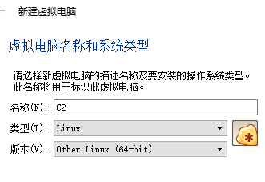
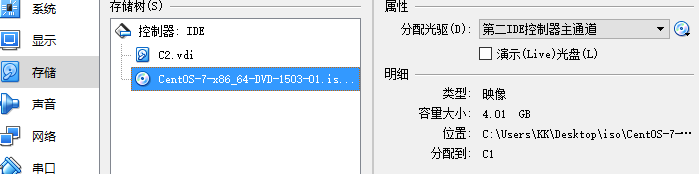
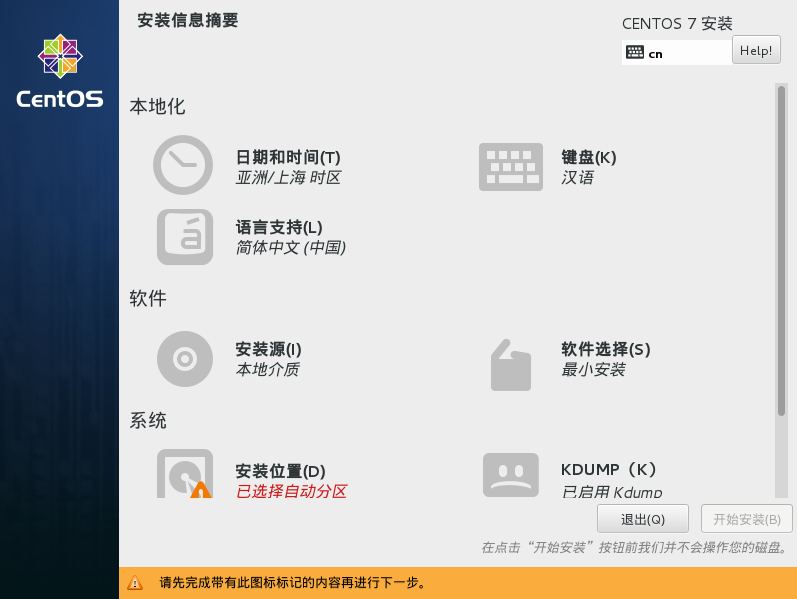
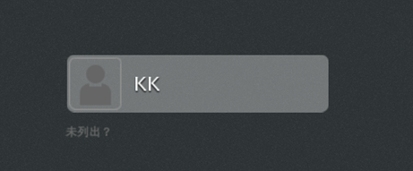

## 安装 CentOS 7
### CentOS 7介绍
CentOS（Community Enterprise Operating System，中文意思是：社区企业操作系统）是Linux发行版之一，它是来自于Red Hat Enterprise Linux依照开放源代码规定释出的源代码所编译而成。由于出自同样的源代码，因此有些要求高度稳定性的服务器以CentOS替代商业版的Red Hat Enterprise Linux使用。两者的不同，在于CentOS并不包含封闭源代码软件。

CentOS 是RHEL（Red Hat Enterprise Linux）源代码再编译的产物，而且在RHEL的基础上修正了不少已知的 Bug ，相对于其他 Linux 发行版，其稳定性值得信赖。
CentOS在2014初，宣布加入Red Hat。

### CentOS 加入红帽后不变的是：
1. CentOS 继续不收费
2. 保持赞助内容驱动的网络中心不变
3. Bug、Issue 和紧急事件处理策略不变
4. Red Hat Enterprise Linux 和 CentOS 防火墙也依然存在

### 变化的是：
1. 我们是为红帽工作，不是为 RHEL
2. 红帽提供构建系统和初始内容分发资源的赞助
3. 一些开发的资源包括源码的获取将更加容易
4. 避免了原来和红帽上一些法律的问题
### 本章所用软件
	1：Virtual Box
	https://www.virtualbox.org/
	2：CentOS 7 光盘镜像
	https://www.centos.org/download/
## 安装步骤（废话少说，开始干活！）
##### 创建虚拟机
（已经有基础的同学可以跳过该部分~没基础的话，一步一步完成吧）
1)	打开VirtualBox虚拟机软件，选择新建虚拟机，然后输入如下内容

>备注：虚拟机软件可以取网络下载，完全下一步，下一步的微软傻瓜式的安装方式。
2)	点击下一步，设置内存大小为1024MB
3)	选择【现在创建新虚拟磁盘（c）】，点击下一步
4)	选择【VDI（VirtualBox 磁盘镜像）】，点击下一步
5)	选择【动态分配（D）】，点击下一步
6)	设置磁盘大小为120G，点击【创建】
7)	点击选择创建的虚拟机选择【设置】，进入设置菜单
8)	选择【存储】，【光盘】，【添加光盘镜像】，点击确定

9)	设置光盘镜像路径后，使用主界面绿色箭头开启虚拟机即可

>到此，虚拟机新建完成，更多虚拟机详细内容不在这里废话，也不隶属于本书范围，有兴趣的同学可以参考VirtualBox方面的教材。
## 安装CentOS7
终于可以正式安装CentOS 7 了，下面我们一起来看看安装步骤和一些注意事项。
1)	虚拟机开启以后，我们会进入主引导安装界面，（特别想吐槽！~忍下来）选项以白色的光标为主。（眼神不好的多留意），``选择安装选择【Install CentOS 7】``

		此页面包含选项如下：
		选项1：Install CentOS 7  （安装选项）
		选项2：Test this media & Install CentOS 7  （先测试安装介质在安装系统）
		选项3：Troubleshooting （rescue修复模式和内存测试）

2)	选择【中文】，（个人习惯英文），点击下一步
3)	进入如下界面，设置不同安装选项：

4)	日期和时间，没什么好解释的，但是要注意的时区设置（选择中国时区）
5)	键盘选项默认即可，无需调整
6)	语言支持（进入后选择需要支持的语音，如果没有特殊需求默认即可）
7)	安装源（默认为光盘安装，无须修改）
8)	软件选择，选择【GNOME桌面】（如果您是有经验的用户，那么随意选择）
9)	安装目标位置，选择【自动分配分区】，如果觉得不匹配你的实际环境，可以选择【我要配置分区】，自定义分区和设置大小。
10)	Kdump 内核崩溃转储，默认开启即可
11)	Network & Hostname，默认即可，安装完成后可配置
12)	点击最右下角的【开始安装】
13)	安装过程中，可以设置root密码以及创建新的账户。

``个人建议：``
		
	1：root密码设置复杂一些，8位以上，复杂度4选3策略.
	2：新创建账户，尽量不使用root直接登录

## 图形界面
1)	我们选择的是GNOME桌面的安装方式，所以启动会默认进入图形界面

`Tip:开机自检之后会让我们选择以哪个内核启动，默认即可，因为第二个选项的内核是修复模式。`

2)	加载一系列内容之后，会看到用户登录界面，如果要使用root登录，选择【未列出】

3)	输入账户和密码后，首次登录会要求我们设置语言，设置为【汉语（中国）】即可
4)	设置【输入法】，默认即可，然后点击【start using CentOS Linux】
5)	弹出一个网页，提供一些基本的使用方法和教程，可以简单的看下
6)	到这里为止，我们已经启动并成功登录到CentOS 7 的图形界面
## 文本界面
图形界面固然好用，但是实际生产环境中我们往往是直接使用文本界面操作，很少用到图形界面来进行配置，所以重点要学习一下文本界面。

Linux默认打开7个屏幕，编号为tty1~tty7。X-window启动后，占用的是tty7号屏幕，tty1~tty6仍为字符界面屏幕。这就意味着你可以同时拥有X-window加上6个Console字符操作界面！
#### 实验环境切换键位为：
Alt+Ctrl+F（1~6），进入文本界面

Alt+Ctrl+F7 进入X-window界面

>`Tip：X-window 就是所谓的图形界面`

这里会有人问如何开机进入文本界面呢？这里先不说，因为，我们还没有学习其它的基本操作呢，后面会详细讲解的。

## 总结
希望各位能独立完成CentOS 7 的安装，为后续的学习打下良好基础，并且能够熟练切换文本和图形操作，为以后使用文本界面配置打好基础。
