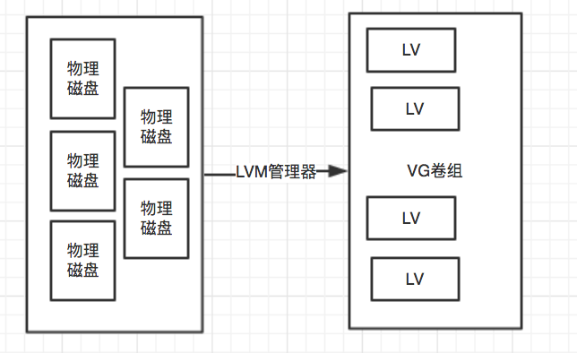
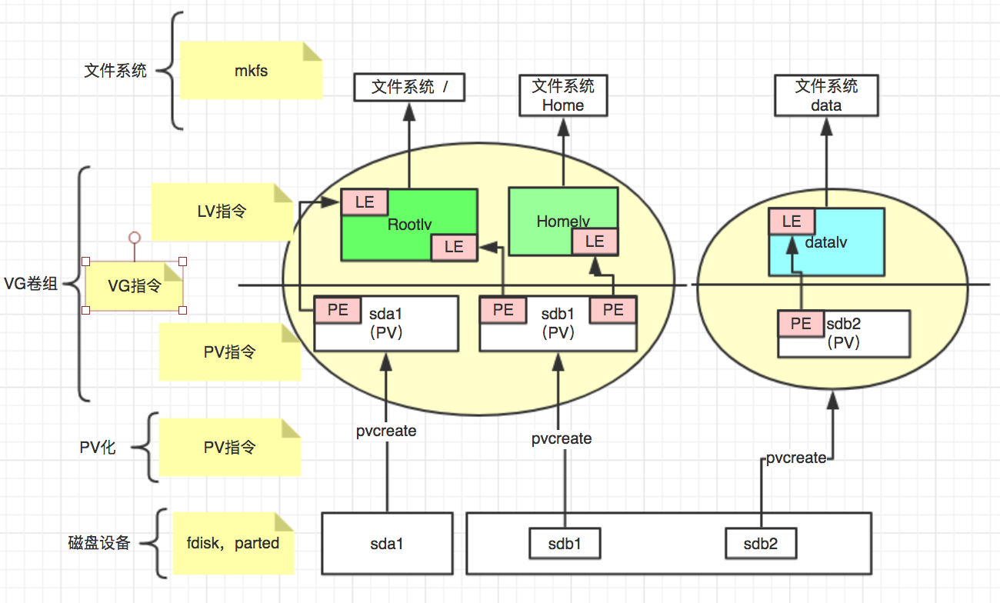

#  LVM 基础
## 1. LVM介绍及原理
### 1.1 LVM介绍
* 企业中所有服务器的使用空间都会因为业务的需求增长而不断扩展，传统的磁盘分区使用固定大小的物理分区，如果需要重新调整将会麻烦。
* 现在linux系统和其他的系统都使用着一个非常好用的磁盘系统工具，名为“逻辑卷管理（LVM）”。
* 逻辑卷管理（LVM）可以创建和管理逻辑卷，但是不能直接管理和使用磁盘。
* 逻辑卷管理（LVM）可以弹性的管理卷的扩大或者缩小，方便快捷，简单易用，并且对数据有绝对的保障。
* 可以随意将新的硬盘添加到LVM，并扩展到已经存在的逻辑卷，甚至不需要重新启动系统就可以让内核知道卷的存在，并进行使用。
* 逻辑卷可以用于单个物理磁盘分区、SAN、RAID等都可以被加入逻辑卷组中，然后在池化的卷组中，进行空间切分，并创建逻辑卷，以供使用。
* 如果某个磁盘启动失败，利用卷组将用于替换的磁盘册成一个物理卷，并且逻辑卷的扩展功能，可以将数据迁移到新的磁盘而不会丢失任何数据。

>图1-1展示LVM整体结构

### 1.2 LVM基本术语
* LVM实际是磁盘分区和文件系统之间的一个逻辑层，屏蔽下层磁盘分区，提供一个抽象的卷组池，在卷组的LV卷上建立文件系统。
* 先行熟悉以下几个比较重要的LVM术语：

1. 物理存储介质（The physical media）
    
        系统的存储设备：物理硬盘，例如：/dev/hda、/dev/sda等等，是存储系统最低层的存储单元。

2. 物理卷（physical volume）

        物理卷就是指硬盘分区或从逻辑上与磁盘分区具有同样功能的设备(如RAID)，是LVM的基本存储逻辑块，但和基本的物理存储介质（如分区、磁盘等）比较，却包含有与LVM相关的管理参数。

3. 卷组（Volume Group）

        LVM卷组类似于非LVM系统中的物理硬盘，其由物理卷组成。可以在卷组上创建一个或多个“LVM分区”（逻辑卷），LVM卷组由一个或多个物理卷组成。

4. 逻辑卷（logicalvolume）

        LVM的逻辑卷类似于非LVM系统中的硬盘分区，在逻辑卷之上可以建立文件系统(比如/home或者/usr等)。

5. PE（physical extent）

        每一个物理卷被划分为称为PE(Physical Extents)的基本单元，具有唯一编号的PE是可以被LVM寻址的最小单元。PE的大小是可配置的，默认为4MB。

6. LE（logical extent）
        逻辑卷也被划分为被称为LE(Logical Extents) 的可被寻址的基本单位。在同一个卷组中，LE的大小和PE是相同的，并且一一对应。

### 1.3 LVM原理

>图1-2展示LVM原理及组成

* 依据上图来看，最底层依然是物理磁盘设备，然后通过PV化将底层的屋里磁盘和分区整合到一个VG当中，在逻辑上形成一个较大的存储资源池，在vg中通过lv的形式进行输出。
* 物理卷PV化后，由大小等同的基本单元PE组成，VG创建LV后，由大小等同的基本单元LE组成，PE和LE有着一一对应的关系。
* 由上图可以看出，一个卷组由一个或多个物理卷组成，物理卷中的PE，可以分别对应多个LV，与LE形成对应关系。
* 然后在LV之上，可以在其上创建文件系统。

## 2. LVM 管理和使用

### 2.1 卷管理常用命令集合：

|名称|创建|激活|扩容|查找|查看|删除|
|:--|:--|:--|:--|:--|:--|:--|
|PV|pvcreate|pvchange|  |pvscan|pvdisplay|pvremove|
|VG|vgcreate|vgchange|vgextend|vgscan|vgdisplay|vgremove|
|LV|lvcreate|lvchange|lvextend|lvscan|lvdisplay|lvremove|

### 2.2 测试环境
|系统版本|磁盘数量|ip地址|主机名称|虚拟化|
|:---|:---|:---|:---|:---|
|CentOS 7.4|4Vdisk|192.168.56.101|LVM-Host|Vbox|

### 2.3 测试内容和环境说明
1. 完成LVM创建，使用sdb和sdc创建PV，形成VG卷组，在输出成LV，格式化文件系统并使用。
2. 完成LVM扩容，使用VG内free空间扩容、添加新PV进行扩容。
3. 完成LVM缩减，缩减15G空间。
4. 完成LVM删除，回收存储空间。

### 2.4 LVM 创建
* LVM创建顺序是从下至上的，"磁盘处理">>>>"PV化">>>>"组成VG池">>>>"划分出lv">>>>"格式化">>>>"挂载使用",根据以上的顺序我们进行如下操作：
1. 首先确认需要PV化的存储设备

        [root@LVM-Host ~]# lsblk -a
        NAME            MAJ:MIN RM  SIZE RO TYPE MOUNTPOINT
        sda               8:0    0  128G  0 disk
        ├─sda1            8:1    0    1G  0 part /boot
        └─sda2            8:2    0  127G  0 part
        ├─centos-root 253:0    0   50G  0 lvm  /
        ├─centos-swap 253:1    0    2G  0 lvm  [SWAP]
        └─centos-home 253:2    0   75G  0 lvm  /home
        sdb               8:16   0   10G  0 disk
        sdc               8:32   0   20G  0 disk
        sdd               8:48   0   30G  0 disk
        sde               8:64   0   40G  0 disk
        sr0              11:0    1 1024M  0 rom
        可以看出，当前的sda已经进行了PV化，并且已经输进行了lv输出，而sdb、sdc、sdd、sde没有PV化，所以这里就用sdb和sdc来做测试，初始化PV.
>lsblk命令用于列出所有可用块设备的信息，而且还能显示他们之间的依赖关系.
2. 如果想要初始化pv，最好先对磁盘进行分区并选择“8e”的分区code来使用分区的lvm格式（建议）。利用fdisk划分出sdb1和sdc1，共计约29~30G大小。

        再次查看存储信息如下：
        [root@LVM-Host ~]# lsblk
        NAME            MAJ:MIN RM  SIZE RO TYPE MOUNTPOINT
        ......
        sdb               8:16   0   10G  0 disk
        └─sdb1            8:17   0   10G  0 part
        sdc               8:32   0   20G  0 disk
        └─sdc1            8:33   0   20G  0 part
        .....
        
        进行pv化操作：
        [root@LVM-Host ~]# pvcreate /dev/sd{b,c}1
        Physical volume "/dev/sdb1" successfully created.
        Physical volume "/dev/sdc1" successfully created.
        
        查看结果如下：
        [root@bogon ~]# pvs
        [root@LVM-Host ~]# pvs
        PV         VG     Fmt  Attr PSize    PFree
        /dev/sda2  centos lvm2 a--  <127.00g   4.00m
        /dev/sdb1         lvm2 ---   <10.00g <10.00g
        /dev/sdc1         lvm2 ---   <20.00g <20.00g
        从左到右分别是：PV化的磁盘，所属卷组（但是sdb1和sdc1没有加入vg卷组，所以此处为空），lvm版本格式，属性，pv化以后的大小，以及free的空间大小。
>分区参考基础的fdisk或者parted章节。

3. 创建vg卷组，并将sdb1和sdc1加入卷组

        [root@LVM-Host ~]# vgcreate Book /dev/sdb1
        Volume group "Book" successfully created
        [root@LVM-Host ~]# vgextend Book /dev/sdc1
        Volume group "Book" successfully extended
        创建Book卷组将sdb1加入，然后将sdc1添加进Book卷组。
        Book为VG卷组名称。

        查看结果如下：（vg大小29.99g）
        [root@LVM-Host ~]# vgs
        VG     #PV #LV #SN Attr   VSize    VFree
        Book     2   0   0 wz--n-   29.99g 29.99g
        centos   1   3   0 wz--n- <127.00g  4.00m

4. 划分20g大小的lv来使用

        [root@LVM-Host ~]# lvcreate -n lvtest -L +20G Book
        Logical volume "lvtest" created.
        查看结果如下：（20g lv使用空间，名称为lvtest）
        -n 为lv名称、-L 为大小、最后的Book为VG名称（理解为在哪个VG中创建）

        查看结果
        [root@bogon ~]# lvs 
        LV    VG   Attr   LSize  Pool Origin Data%  Meta%  Move Log Cpy%Sync Convert
        lvtest Book   -wi-a----- 20.00g   

        [root@LVM-Host ~]# vgs（VG卷组free空间相对减少20g）
        VG     #PV #LV #SN Attr   VSize    VFree
        Book     2   1   0 wz--n-   29.99g 9.99g

5. lv划分后，还不能即刻使用，需要在lv逻辑卷上mkfs文件系统，然后在挂载，方可使用。

        [root@LVM-Host ~]# mkfs.ext4 /dev/Book/lvtest
        [root@LVM-Host ~]# mkdir /test
        [root@LVM-Host ~]# mount /dev/Book/lvtest /test
        [root@LVM-Host ~]# mount | grep test
        /dev/mapper/Book-lvtest on /test type ext4 (rw,relatime,seclabel,data=ordered)
> 如果需要自动挂载，别忘记写到/etc/fstab中哦~

### 2.5 LVM 扩容
* 在实际的应用环境中，经常会出现LV空间不足的情况，利用LVM逻辑卷可以`在线`扩展LV的空间，并且不会损伤数据。

1. LV扩容为2种情况，VG卷组内有free空间扩容 和 VG卷组中无free空间扩容

2. VG卷组中有Free空间，可以按如下操作进行
                                
        [root@LVM-Host ~]# vgs（剩余9.99g）
        VG     #PV #LV #SN Attr   VSize    VFree
        Book     2   1   0 wz--n-   29.99g 9.99g

        [root@LVM-Host ~]# lvextend /dev/Book/lvtest -L +9G
        Size of logical volume Book/lvtest changed from 20.00 GiB (5120 extents) to 29.00 GiB (7424 extents).
        Logical volume Book/lvtest successfully resized.
        
        [root@LVM-Host ~]# resize2fs /dev/Book/lvtest
        ......
        The filesystem on /dev/Book/lvtest is now 7602176 blocks long.
        resize2fs - ext2/ext3/ext4文件系统重定义大小工具

        [root@LVM-Host ~]# vgs
        VG     #PV #LV #SN Attr   VSize    VFree
        Book     2   1   0 wz--n-   29.99g 1016.00m

        [root@LVM-Host ~]# lvs
        LV     VG     Attr       LSize  Pool Origin Data%  Meta%  Move Log Cpy%Sync Convert
        lvtest Book   -wi-ao---- 29.00g

3. 如果vg卷组中不足所需扩展的空间，需要先对卷组进行扩容，然后在对LV进行扩容

        首先对sdd磁盘进行fdisk处理（参考前面章节），然后进行PV化：
        [root@LVM-Host ~]# pvcreate /dev/sdd1
        Physical volume "/dev/sdd1" successfully created.

        [root@LVM-Host ~]# vgextend Book /dev/sdd1
        Volume group "Book" successfully extended
    
        然后可以重复步骤2进行LV扩容

### 2.6 Lvm 缩减
* Lv缩减这是个有风险的动作，而且在生产环境中也很少使用缩减的动作，简单测试一下缩减的步骤和操作：
1. 先确认当前磁盘使用的空间大小，免得缩减太多导致文件系统崩溃。

        [root@LVM-Host ~]# df -h（使用477M，可用27G，也就是说我们缩减必须在27G之内）
        文件系统                 容量  已用  可用 已用% 挂载点
        /dev/mapper/Book-lvtest   29G  477M   27G    2% /test

2. 缩减的动作必须要先将LVM逻辑卷卸载之后才能进行

        [root@LVM-Host ~]# umount /dev/Book/lvtest
3. 检查文件系统错误

        [root@LVM-Host ~]# e2fsck -ff /dev/Book/lvtest
        e2fsck 1.42.9 (28-Dec-2013)
        第一步: 检查inode,块,和大小
        第二步: 检查目录结构
        第3步: 检查目录连接性
        Pass 4: Checking reference counts
        第5步: 检查簇概要信息
        /dev/Book/lvtest: 1080/1900544 files (0.8% non-contiguous), 274063/7602176 blocks
        注意：必须通过所有文件系统检查的5个步骤，若未完全通过，则你的文件系统可能存在问题。
4. 从新计算文件系统各大小空间 （保留10G）

        [root@LVM-Host ~]# resize2fs /dev/Book/lvtest 10G
        resize2fs 1.42.9 (28-Dec-2013)
        Resizing the filesystem on /dev/Book/lvtest to 2621440 (4k) blocks.
        The filesystem on /dev/Book/lvtest is now 2621440 blocks long.

5. 缩减文件系统（缩减15G）

        [root@LVM-Host ~]# lvreduce -L -15G /dev/Book/lvtest
        WARNING: Reducing active logical volume to 14.00 GiB.
        THIS MAY DESTROY YOUR DATA (filesystem etc.)
        Do you really want to reduce Book/lvtest? [y/n]: y
        Size of logical volume Book/lvtest changed from 29.00 GiB (7424 extents) to 14.00 GiB (3584 extents).
        Logical volume Book/lvtest successfully resized.

        [root@LVM-Host ~]# mount /dev/Book/lvtest /test/
        
        [root@LVM-Host ~]# df -h | grep test
        /dev/mapper/Book-lvtest  9.8G  469M  8.8G    5% /test
        
        [root@LVM-Host ~]# ls /test/* | more
        /test/a2ps-4.14-23.el7.i686.rpm
        /test/a2ps-4.14-23.el7.x86_64.rpm
        ......
        上述是缩减成功的情况，如果缩减过量，LV将损坏并无法挂载，如果是非常重要的数据，建议你事先备份，在进行缩减，缩减需谨慎！

### 2.7 LVM 删除 
* 创建LV的时候是自下而上，删除回收的时候要反其道而行之，自上而下，所有顺序是：“umount挂载点”>>>>“删除lv”>>>>"删除VG">>>>"删除PV"，相关操作步骤如下：
1. umount 挂载点
        
        [root@LVM-Host ~]# umount /test
2. 删除LV

       [root@LVM-Host ~]# lvremove /dev/Book/lvtest
        Do you really want to remove active logical volume Book/lvtest? [y/n]: y
        Logical volume "lvtest" successfully removed
3. 删除VG

        [root@LVM-Host ~]# vgremove Book
        Volume group "Book" successfully removed
4. 删除PV

        [root@LVM-Host ~]# pvremove /dev/sd{b,c,d}1
        Labels on physical volume "/dev/sdb1" successfully wiped.
        Labels on physical volume "/dev/sdc1" successfully wiped.
        Labels on physical volume "/dev/sdd1" successfully wiped.
>删除之前切记要备份数据，并且确认数据无用，方可进行。

## 总结
本篇为LVM基础操作，其中创建和扩容，是生产环境中应用最多的。在下一篇中将进行LVM的Cache和Snapshot的讲解。
