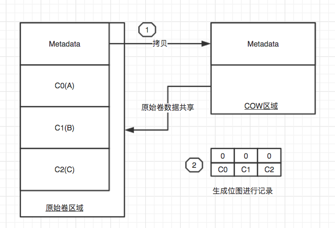
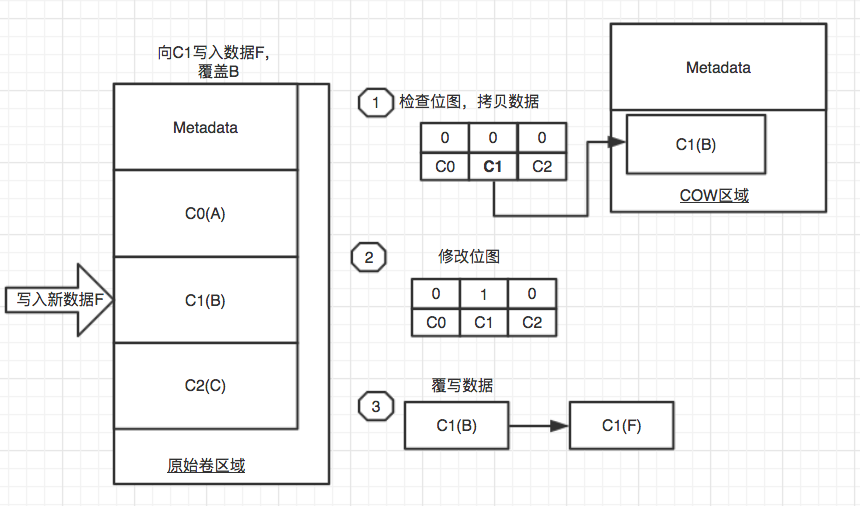
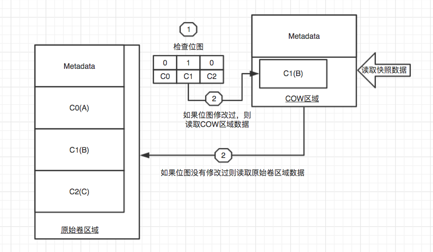

# LVM Cache & Snapshot
## 1. LVM Cache
### 1.1 Cache介绍 
* 现在的服务器大多数搭配SSD的磁盘，而SSD的磁盘也是总所周知的要比普通磁盘快很多，所以通常将SSD作为安装系统的磁盘来使用，然后数据还是要写入物理磁盘，外围系统和数据的响应依然要等待慢如牛的物理磁盘做出回复。瓶颈所在的原因是“系统加速不等于应用的数据读取和写入加速”，除非你将应用也放到ssd磁盘上来运行，但是ssd的设备还是相当昂贵的，所以必须找到一种折中的方案来利用ssd磁盘，达到整体加速的效果。

* 现在的LVM已经支持使用缓存技术来提升读写速度，为何不将ssd磁盘作为lvm的缓存来使用呢？这样就可以对整个lvm加速，换句话说，可以对整个系统lv和数据lv进行加速，这样的利用要远比单纯的给系统使用更有价值！

### 1.2 Cache & SSD
1. 在计算机中，无论是基础硬件设备，还是操作系统，以及应用软件中均能见到cache的身影。Cache是容量与性能之间取平衡的结果，以更低的成本，获得更高的收益。
2. 传统的机械硬盘逐步成为整个系统的瓶颈，技术突破和性能增长都十分缓慢。而现今能够提升IO性能的Flashdisk(SSD/FusionIO等)出现，改变了磁盘的定义和打破了这个一直以来的瓶颈。
3. Flash disk将硬盘从机械产品变成了电气产品，功耗更小，性能更好，时延更优。但Flash disk技术还存在一些问题，昂贵的价格以及稳定性，最主要的是磁盘的`使用寿命`。

### 1.3 LVM SSD缓存
* 为了最有性价比的利用SSD设备来加速整个系统，可以使用默认的DM-cache。当然也可以使用FlashCache等技术，由于CentOS 7 自身是支持LVM使用DM-cache，所以就用CentOS 7 自带的来配置缓存；当然FlashCache也是很好的选择。

### 1.4 DM-cache 简介
* dm-cache 使用 device mapper 核心，并在上面增加一个策略层。这个策略层很像一个插件接口，可以实现不同的策略。这些策略（以及缓存的内容）决定了缓存是否可以命中，是否需要进行数据迁移（在原始设备与缓存设备之间进行某个方向的数据移动）。

### 1.5 理解Lvm cache的相关术语

|术语|释义|
|:---|:---|
|origin LV |真实的LV卷，很大的慢速设备LV|
|cache data LV |数据卷  可以很小，但是必须很快，用来缓存数据|  
|cache metadata LV  | 元数据卷 可以很小，但是必须很快，用来缓存元数据|
|cache pool LV  |缓存池，包含 data+meta|
|cache LV   | 缓存卷，包含 真实的LV卷+缓存池| 
>实际的创建顺序也就是从上至下的步骤。

## 2. DM Cache 实例

### 2.1 试验环境
|系统版本|磁盘数量|ip地址|主机名称|虚拟化|
|:---|:---|:---|:---|:---|
|CentOS 7.4|4Vdisk|192.168.56.101|LVM-Host|Vbox|

### 2.2 测试内容和环境说明
1. 利用sdb1模拟ssd磁盘分区，为Originlv添加Cache。

### 2.3 LVM SSD缓存创建（DM-cache）
1. 确认设备

        [root@LVM-Host ~]# lsblk
        NAME            MAJ:MIN RM  SIZE RO TYPE MOUNTPOINT
        sdb               8:16   0   10G  0 disk
        └─sdb1            8:17   0   10G  0 part
        sdc               8:32   0   20G  0 disk
        └─sdc1            8:33   0   20G  0 part
        上例中，sdc为普通物理磁盘20G，sdb为SSD磁盘10G（模拟）

2. 创建VG和LVs

        [root@LVM-Host ~]# vgcreate CacheTestVG /dev/sdc1

        [root@LVM-Host ~]# lvcreate -L +15G -n Originlv CacheTestVG
        WARNING: ext4 signature detected on /dev/CacheTestVG/Originlv at offset 1080. Wipe it? [y/n]: y
        Wiping ext4 signature on /dev/CacheTestVG/Originlv.
        Logical volume "Originlv" created.
        创建真实卷，大小15G，真实的LV卷，很大的慢速设备LV

3. SSD设备加入慢速VG卷组

        所有的必须在一个卷组中，实际上就是一个VG卷组既包含慢速设备同时也要包含快速设备，所以必须将SSD设备加入到先前创建的卷组中
        [root@LVM-Host ~]# vgextend CacheTestVG /dev/sdb1
        Volume group "CacheTestVG" successfully extended

4. 创建SSD的LV缓存

        SSD设备需要创建2个LVs 。
        1. CacheDataLV ，数据缓存
        2. CacheMetaLV，是用于存储被高速缓存在CacheDataLV的数据块的索引
        3. CacheMetaLV  应该是千分之一的CacheDataLV的大小，但最少为8MB。可用空间快是10GB，按照1000:1的分裂比例，10M的CacheMetaLV，大方点给100M， 9G多的CacheDataLV。
        [root@LVM-Host ~]# lvcreate -L +100M -n lv_cache_meta CacheTestVG /dev/sdb1
        Logical volume "lv_cache_meta" created.
        [root@LVM-Host ~]# lvcreate -L +9.5G -n lv_cache_data CacheTestVG /dev/sdb1
        Logical volume "lv_cache_data" created.

5. 把 CacheDataLV和CacheMetaLV 放到“缓存池”

        [root@LVM-Host ~]# lvconvert --type cache-pool --poolmetadata CacheTestVG/lv_cache_meta CacheTestVG/lv_cache_data
        CacheTestVG/lv_cache_meta? [y/n]: y
        Converted CacheTestVG/lv_cache_data_cdata to cache pool.

        [root@LVM-Host ~]# lvs
        LV            VG          Attr       LSize  Pool Origin Data%  Meta%  Move Log Cpy%Sync Convert
        Originlv      CacheTestVG -wi-a----- 15.00g
        lv_cache_data CacheTestVG Cwi---C---  9.50g   （注意Attr属性部分已经标识为C，标识Cache）
6. 对接缓存池和Originlv 慢设备物理卷

        [root@LVM-Host ~]# lvconvert --type cache --cachepool CacheTestVG/lv_cache_data CacheTestVG/Originlv

        Do you want wipe existing metadata of cache pool CacheTestVG/lv_cache_data? [y/n]: y
        Logical volume CacheTestVG/Originlv is now cached.

        [root@LVM-Host ~]# lvs
        LV       VG          Attr       LSize  Pool            Origin           Data%  Meta%  Move Log Cpy%Sync Convert
        Originlv CacheTestVG Cwi-a-C--- 15.00g [lv_cache_data] [Originlv_corig] 0.00   1.27            0.00

8. 格式化并挂载使用

        [root@LVM-Host ~]# mkfs.ext4 /dev/CacheTestVG/Originlv 
        [root@LVM-Host ~]# mount /dev/CacheTestVG/Originlv /test/
9. 现在写入的数据都是经过Cache写入的，相对来讲速度得到一定的提升，比SSD略差

## 总结
LVM的DM-cache原生的支持使得LVM层面的加速得到了可能，大大提高了系统的IO能力，实际上我们也可以使用FlashCache来进行加速，只是DM-cache让加速变得更加Easy.
一定注意SSD的磁盘寿命。

## 3. LVM Snapshot
### 3.1 LVM Snapshot介绍
* LVM的快照可以让我们轻松的“备份数据”或者“历史回溯”，由于源LVM和Snapshot的关系，Snapshot只能够临时使用，不能脱离源lvm而存在；
* 可以在Snapshot的基础上进行某时间点的备份或其他操作，这样既不会影响原始数据也能够达到备份的需求。
* 如果在创建Snapshot后意外地删除了文件，可以在快照里找到所删除的文件的原始文件。
* 生产中坚决不要使用快照功能来替代“备份”工具。

### 3.2 LVM Snapshot原理
> LVM对LV提供的快照功能，只对LVM有效。
* snapshot创建时，仅仅是拷贝原始卷里数据的元数据(meta-data)，并不会有数据的物理拷贝。所以创建几乎是实时的。当原始卷上有写操作执行时，snapshot跟踪原始卷块的改变，这个时候原始卷上将要改变的数据在改变之前被拷贝到snapshot预留的空间里，因此这个原理的实现叫做写时复制(COW，copy-on-write)。
* 在写操作写入块之前，将原始数据移动到snapshot空间里去，这样就保证了所有的数据在snapshot创建时保持一致。而对于snapshot的读操作，如果是读取数据块是没有修改过的，那么会将读操作直接重定向到原始卷上，如果是要读取已经修改过的块，那么就读取拷贝到snapshot中的块。
* 创建snapshot的大小并不要求和原始卷一样大，大小可以考虑两个方面：从shapshot创建到释放这段时间内，估计块的改变量有多大;数据更新的频率。一旦snapshot的空间数据量超出大小限制，那么这个snapshot立刻被释放，从而导致这个snapshot无效。

### 3.3 创建快照
快照创建时，仅拷贝原始卷里“数据”的元数据，并生成位图记录原始卷的块数据变化。

> 创建快照图例
### 3.4 读写原始卷
原始卷的写请求处理流程如下：

> 写原始卷图例
原始卷的读请求处理流程如下：

>读原始卷图例
### 3.5 读快照 
快照的读请求，先检查位图是否修改，如果修改则从快照读取数据；未修改，则从原始卷读取数据。

>读快照卷图例
### 3.6 写快照 
在处理快照的写请求时， 检查位图是否修改，如果修改则直接写快照；如果未修改，则从原始卷拷贝数据到COW区域；然后修改位图；最后数据写入快照卷。

>写快照卷图例

## 4 Snapshot 测试

### 4.1 测试环境
|系统版本|磁盘数量|ip地址|主机名称|虚拟化|
|:---|:---|:---|:---|:---|
|CentOS 7.4|4Vdisk|192.168.56.101|LVM-Host|Vbox|

### 4.2 测试内容和环境说明
1. 为testlv创建快照空间。

### 4.3 Lvm snapshot创建
>理论上，您所建立的快照卷的大小应该是原始卷的1.1倍大小，寿比天高。 
1. lvs和vgs看看当前lv和vg卷组的状态，够不够空间创建快照;

        [root@lvm-host ~]# lvs
        LV     VG     Attr       LSize  Pool Origin Data%  Meta%  Move Log Cpy%Sync Convert
        testlv BooK   -wi-a----- 10.00g
        [root@lvm-host ~]# vgs
        VG     #PV #LV #SN Attr   VSize    VFree
        BooK     2   1   0 wz--n-   29.99g 19.99g
2. 创建快照

        [root@lvm-host ~]# lvcreate -L 2G -s -n lvtest-sanpshot BooK/testlv
        Using default stripesize 64.00 KiB.
        Logical volume "lvtest-sanpshot" created.
        参数：-s 为 snapshot的缩写,创建2G大小快照空间。
3. 查看快照lv

        [root@lvm-host ~]# lvs
        LV              VG     Attr       LSize  Pool Origin Data%  Meta%  Move Log Cpy%Sync Convert
        lvtest-sanpshot BooK   swi-a-s---  2.00g      testlv 0.00
        testlv          BooK   owi-aos--- 10.00g

        BooK-lvtest--sanpshot (253:6)
        ├─BooK-lvtest--sanpshot-cow (253:5)
        │  └─ (8:17)
        └─BooK-testlv-real (253:4)
        └─ (8:33)
        BooK-testlv (253:3)
        └─BooK-testlv-real (253:4)
        非常清晰的逻辑关系，BooK-lvtest--sanpshot 由BooK-testlv-real 和 BooK-lvtest--sanpshot-cow 这2部分组成，并且明确表示了物理卷的硬件位置，COW的区域上面已经解释过了。 

4. 快照卷无需做格式化等步骤，可以直接对快照卷进行挂载，卸载等操作，而且操作完成之后，就应该立即删除快照，以减轻系统的I/O负担。 快照不会自动更新，长久保留是没有意义的。

        dd写入测试数据
        [root@bogon ~]# dd if=/dev/zero of=/test/2.img bs=10M count=100
        [root@lvm-host ~]# lvs
        LV              VG     Attr       LSize  Pool Origin Data%  Meta%  Move Log Cpy%Sync Convert
        lvtest-sanpshot BooK   swi-a-s---  2.00g      testlv 49.03           
        快照控件已经使用了49.03%，当达到100%的时候，这个快照将会废弃无法再使用，一定要注意！

        [root@lvm-host ~]# lvdisplay
        --- Logical volume ---
        LV Path                /dev/BooK/lvtest-sanpshot
        LV Name                lvtest-sanpshot
        VG Name                BooK
        LV UUID                SD9foj-qh3Z-N8U7-k5H5-B1vT-NaTJ-PgjvoE
        LV Write Access        read/write
        LV Creation host, time lvm-host.com, 2018-02-05 11:38:06 +0800
        LV snapshot status     active destination for testlv
        LV Status              available
        # open                 0
        LV Size                10.00 GiB
        Current LE             2560
        COW-table size         2.00 GiB   ##COW区域大小
        COW-table LE           512
        Allocated to snapshot  49.03%   ## 注意这部分，使用百分比
        Snapshot chunk size    4.00 KiB
        Segments               1
        Allocation             inherit
        Read ahead sectors     auto
        - currently set to     8192
        Block device           253:6 
   
5. 挂载查看快照空间内的数据

        [root@lvm-host ~]# mkdir /snapshot 
        [root@lvm-host ~]# mount /dev/BooK/lvtest-sanpshot /snapshot/
        挂载之后可以使用dump和tar进行备份，也可以使用cp拷贝
        针对快照会出现2种处理方式，一是保留数据修改后的状态，二是回溯到快照时的状态。
6. 保留数据修改后状态，只需要删除快照即可

        [root@lvm-host ~]# umount /snapshot/
        [root@lvm-host ~]# lvremove /dev/BooK/lvtest-sanpshot 

        保留现有状态，备份快照状态这个是备份数据库时候的常用手段，因为想要不停机备份数据库，就需要数据库的数据不会修改，所以快照出来以后进行备份，然后删除快照即可。
        而新增的数据依然可以正常的写入到数据库中。流程是先做一个flush操作，并锁定表，任何创建snapshot，任何解锁，然后备份数据，最后释放snapshot。这样，MySQL几乎不会中断其运行。
7. 回溯到快照状态，通常是在修改数据之前，做快照，当修改错误，可以利用快照回溯

        [root@bogon /]# umount /dev/vgtest/lvabc  (回溯先要卸载lv)
        [root@bogon /]# lvconvert --merge /dev/vgtest/lvsnapshot

>千万注意！！！！

        [root@lvm-host ~]# lvs
        LV              VG     Attr       LSize  Pool Origin Data%  Meta%  Move Log Cpy%Sync Convert
        lvtest-sanpshot BooK   swi-a-s---  2.00g      testlv 49.03      
        已经使用49.03%的snapshot空间，如果超过100%将无法使用  

        [root@lvm-host ~]# lvs
        LV              VG     Attr       LSize  Pool Origin Data%  Meta%  Move Log Cpy%Sync Convert
        lvtest-sanpshot BooK   swi-a-s---  2.00g      testlv 100    
        [root@lvm-host ~]# lvdisplay
        --- Logical volume ---
        LV Path                /dev/BooK/lvtest-sanpshot
        LV Name                lvtest-sanpshot
        VG Name                BooK
        ……
        LV snapshot status     INACTIVE destination for testlv
        …….
        如果数据超过LV snapshot空间大小，将会失效，镜像卷将会无法使用。
        [root@lvm-host ~]# mount /dev/BooK/lvtest-sanpshot /snapshot/
        mount: /dev/BooK/lvtest-sanpshot: can't read superblock

>重要：要自动扩展快照，可以通过修改配置文件来实现。对于手动扩展，我们可以使用lvextend。
        
        使用vim编辑器打开lvm配置文件。
        # vim /etc/lvm/lvm.conf
        搜索autoextend。
        snapshot_autoextend_threshold = 100
        snapshot_autoextend_percent = 20
>修改此处的100为80，这样达到80%使用的时候，将自动扩展20%，这样，就可以自动扩容了。这将把快照从超载导致下线事故中拯救出来.

## 总结
产环境中，快照通常是用于数据某一时间点的备份，用完之后删除快照即可。
