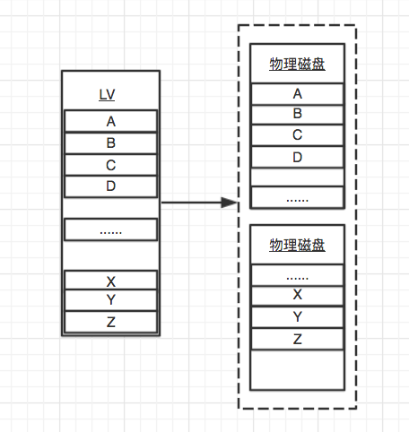
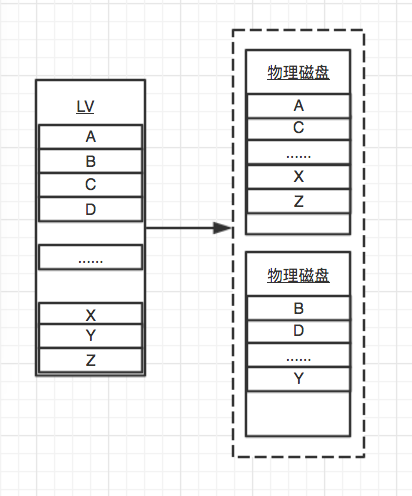

# LVM- 条带化（striped） 

## 1. 线性和条带简介
 LVM创建LV时有两种模式可以选择, 分别是线性(linear)和条带(striped), `默认情况下使用线性模式.`

### 1.1 线性工作模式

>LVM线性工作模式图例
按顺序分配磁盘空间, 逐一写入每块磁盘。

### 1.2 条带工作模式

>LVM条带工作模式图例
交错存储数据, 数据均匀地分布到 VG 中指定的磁盘中.对于 IO 密集的应用有良好效果, 比如数据库.

### 1.3 条带化简介
* 假设系统有2块磁盘，如果各个磁盘总计可以达到100 I/O的能力，则总和为200 I/O能力。如果使用线性模式，文件系统将横跨基础物理卷写入。例如，产生了一些数据需要进行I/O,这些数据到物理设备达到100 I/O（满载负荷），然后写入的时候将全部写到一个PV。如果在写入时使用条块化逻辑卷，它会均分100 I/O的压力，分别写入到2个驱动器中，这就是说每个驱动器中都会接收到50 I/O，这些写入的数据会在循环过程中完成。
* 如果条带化逻辑卷其中任何一个需要扩展，则必须添加对等的数量，上例中，必须添加所有2个pv来扩展逻辑卷大小。这是条块化特性的缺点之一，尽可能使用同等大小的设备。

### 1.3 条带化特点
* 条带化后可以均匀分布IO压力，会改善磁盘性能。
* 避免对单一磁盘的热点问题。
* 可以使数据分布均匀。

## 2. 条带化实例

### 2.1 试验环境
|系统版本|磁盘数量|ip地址|主机名称|虚拟化|
|:---|:---|:---|:---|:---|
|CentOS 7.4|4Vdisk|192.168.56.101|LVM-Host|Vbox|

### 2.2 测试内容和环境说明
1. 创建精简卷，并进行使用。

### 2.3 创建条带化lv
1. 确认相关实例信息
        
        [root@lvm-host ~]# pvs
        PV         VG     Fmt  Attr PSize    PFree
        /dev/sdb1         lvm2 ---   <10.00g <10.00g
        /dev/sdc1         lvm2 ---   <20.00g <20.00g
        /dev/sdd1         lvm2 ---   <30.00g <30.00g
        /dev/sde1         lvm2 ---   <40.00g <40.00g
        4个大小不一的PV卷，实例都按照最小空间取10G。（把每次磁盘都看成10G来操作）

2. 创建VG，并指定PE大小

        [root@lvm-host ~]# vgcreate -s 16M strip_vg /dev/sd{b,c,d,e}1 -v
        [root@lvm-host ~]# vgs
        VG       #PV #LV #SN Attr   VSize    VFree
        strip_vg   4   0   0 wz--n-  <99.94g <99.94g
        4个设备组成VG卷组，名称为strip_vg，PE块大小为16M。

3. 创建了一个名为lv_strp1，大小为2G的逻辑卷，它需要放到strip_vg卷组中。由于是4个PV设备，所以定义了4个条块，就是说数据在写入到我的逻辑卷时，需要条块化分散到4个PV中。

        [root@lvm-host ~]# lvcreate -L +2G -n lv_strp1 -i4 strip_vg
        Using default stripesize 64.00 KiB.
        Logical volume "lv_strp1" created.
        默认是64K的条块，可以使用-I（大写）定制，-i 条块化。

4. 查看条带卷信息

        [root@lvm-host ~]# lvdisplay -m
        --- Logical volume ---
        LV Path                /dev/strip_vg/lv_strp1
        LV Name                lv_strp1
        VG Name                strip_vg
        ......
        --- Segments ---
        Logical extents 0 to 127:
            Type                striped
            Stripes             4       #分布设备
            Stripe size         64.00 KiB   #默认条块大小
            Stripe 0:
            Physical volume   /dev/sdb1
            Physical extents  0 to 31
            Stripe 1:
            Physical volume   /dev/sdc1
            Physical extents  0 to 31
            Stripe 2:
            Physical volume   /dev/sdd1
            Physical extents  0 to 31
            Stripe 3:
            Physical volume   /dev/sde1
            Physical extents  0 to 31

5. 创建条带卷lv_strp2，条块大小128K，分布在3个PV
        
        [root@lvm-host ~]# lvcreate -L 1G -i3 -I 128 -n lv_strp2 strip_vg /dev/sdb1 /dev/sdc1 /dev/sdd1

        [root@lvm-host ~]# lvdisplay -m
        --- Logical volume ---
        LV Path                /dev/strip_vg/lv_strp2
        LV Name                lv_strp2
        VG Name                strip_vg
        ......
        --- Segments ---
        Logical extents 0 to 65:
            Type                striped
            Stripes             3        #分布设备
            Stripe size         128.00 KiB   #条块大小
            Stripe 0:
            Physical volume   /dev/sdb1
            Physical extents  32 to 53
            Stripe 1:
            Physical volume   /dev/sdc1
            Physical extents  32 to 53
            Stripe 2:
            Physical volume   /dev/sdd1
            Physical extents  32 to 53   

6. 由于条块做了映射，使用`dmsetup`来进行启用

        [root@lvm-host ~]# dmsetup deps /dev/strip_vg/lv_strp[1-2]
        /dev/strip_vg/lv_strp1: 4 dependencies  : (8, 65) (8, 49) (8, 33) (8, 17)
        /dev/strip_vg/lv_strp2: 3 dependencies  : (8, 49) (8, 33) (8, 17)

        这里可以看到lv_strip1 映射4个驱动器，lv_strip2 映射3个驱动器。

7. 挂载并使用
        
        [root@lvm-host ~]# mkdir /strip1
        [root@lvm-host ~]# mkdir /strip2
        [root@lvm-host ~]# mkfs.ext4 /dev/strip_vg/lv_strp1
        [root@lvm-host ~]# mkfs.ext4 /dev/strip_vg/lv_strp2
        [root@lvm-host ~]# mount /dev/strip_vg/lv_strp1 /strip1
        [root@lvm-host ~]# mount /dev/strip_vg/lv_strp2 /strip2   
8. 写入数据进行监控确认

        开启2个终端窗口，终端1号写入数据，终端2号使用iostat -d 5 进行监控。
        [root@lvm-host ~]# dd if=/dev/zero of=/strip1/1.img bs=1M count=1024
        1号窗口进行strip1数据写入。

        Device:            tps    kB_read/s    kB_wrtn/s    kB_read    kB_wrtn
        sda               3.32         9.21        15.09         36         59
        sdb             127.11         7.16     64163.68         28     250880
        sdc             125.58         1.02     64163.68          4     250880
        sdd             125.32         0.00     64163.68          0     250880
        sde             126.09         0.00     64163.68          0     250880 
        可以通过iostat看到4块磁盘均有数据写入。

        [root@lvm-host ~]# dd if=/dev/zero of=/strip2/1.img bs=1M count=1024
        1号窗口进行strip2的数据写入。

        Device:            tps    kB_read/s    kB_wrtn/s    kB_read    kB_wrtn
        sda               0.52         5.19         0.00         20          0
        sdb             169.35         0.00     84749.09          0     326284
        sdc             172.73         0.00     86623.38          0     333500
        sdd             171.43         0.00     86154.81          0     331696
        sde               0.00         0.00         0.00          0          0
        可以通过iostat看到3块磁盘均有数据写入。

## 总结
    条带化还是非常有优势的，可以针对IO密集型的应用或者数据库进行单独的创建，可以提升整体的性能。
