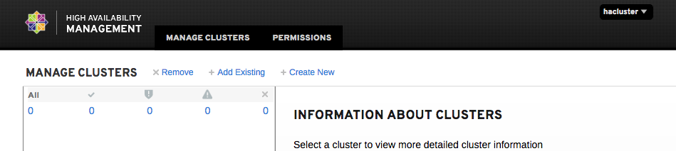
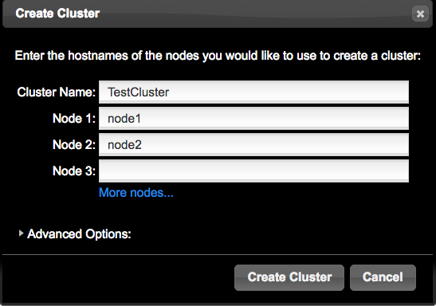
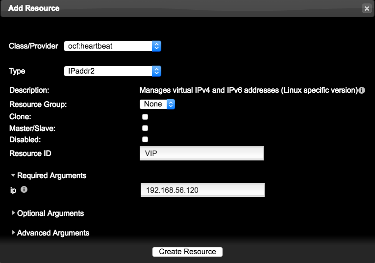
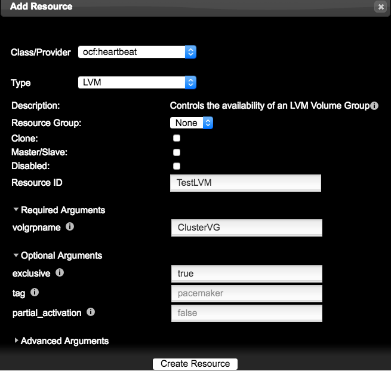
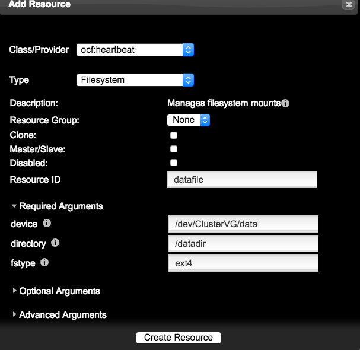
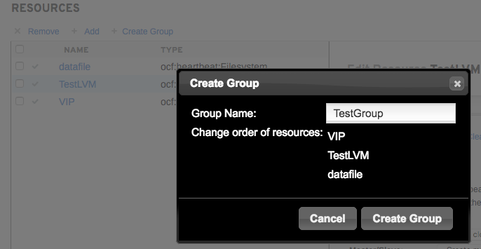

#pcs-2 Create Cluster
>补充集群的概念，内部术语,所用到的resource 和 service group 等地方，进行相关解释。
## Cluster介绍
CentOS 6 上支持的RHCS组件包主要有cman（心跳管理）、luci+ricci（配置工具）、rgmanager（资源管理），通过图形化配置相当简单，但是自CENTOS7开始，系统已经不再集成RHCS套件，并且在rpmfind上找不到支持centos7的RHCS组件包，在CENTOS7中默认采用corosync（心跳管理）、pacemaker（资源管理）、pcs（配置工具）同样可以构建HA集群，配置方法较之前有很大区别，但是原理相似。
## Cluster安装和配置（前置）
>欠缺架构图，待补全

1. 设置主机名(双侧主机都要设置，名称分别为ywdb1和 ywdb2)

        #hostnamectl set-hostname ｛ywdb1 或 ywdb2｝
2. 关闭防火墙或添加相应规则（双侧主机执行）

        关闭：
        #systemctl  stop firewalld
        #systemctl  disable firewalld
        添加规则：（如果防火墙已经关闭则无需配置）
        # firewall-cmd --permanent --add-service=high-availability
        # firewall-cmd --add-service=high-availability
3. 关闭Selinux（双侧主机都要关闭）

        #vim /etc/selinux/config 
        SELINUX= enforcing
        更改为
        SELINUX=disabled
4.	设置主机对应表（双侧主机都要设置）

        #vim /etc/hosts
        [root@ywdb2 ~]# cat /etc/hosts
        127.0.0.1   localhost localhost.localdomain localhost4 localhost4.localdomain4
        ::1         localhost localhost.localdomain localhost6 localhost6.localdomain6
        192.168.133.128  ywdb1
        192.168.133.130	ywdb2
5.	Bond网络
        
        配置参考基础部分
6.	链接存储，查看链路聚合

        [root@ywdb2 ~]# multipath -ll
        mpatha (36001405df9e284bb3f64722952c3eabd) dm-3 LIO-ORG ,server1.disk 
        size=5.0G features='0' hwhandler='0' wp=rw
        |-+- policy='service-time 0' prio=1 status=active
        | `- 3:0:0:0 sdb 8:16 active ready running
        `-+- policy='service-time 0' prio=1 status=enabled
        `- 4:0:0:0 sdc 8:32 active ready running
>补全iscsi实验部分，并且加入实际存储发现和链接

## Cluster安装
1.	安装pcs软件
    
        yum install pcs fence-agents-all 
    
2.	确定fence所需软件存在

        # rpm -q -a | grep fence 
        fence-agents-rhevm-4.0.2-3.el7.x86_64 
        fence-agents-ilo-mp-4.0.2-3.el7.x86_64 
        fence-agents-ipmilan-4.0.2-3.el7.x86_64
        ...
        
3.	如果需要使用Cluster Lvm 和 GFS 可以安装如下软件包

        yum install lvm2-cluster gfs2-utils
## Cluster WEB UI
1.	双侧主机执行如下指令，为hacluster用户设置密码
        
        #passwd hacluster

2.	双侧主机启动pcs，并且随机启动

        # systemctl start pcsd.service  //页面访问
        # systemctl enable pcsd.service

3.	配置节点之间的相互认证

        [root@ywdb1 ~]# pcs cluster auth ywdb1 ywdb2
        Username: hacluster
        Password: 
        ywdb1: Authorized
        ywdb2: Authorized

4.	访问WEB UI，双侧主机IP均可

        https://192.168.255.128:2224/login
        认证账户为hacluster
>需要注意的是，有证书问题，我使用的是FireFox可以添加例外，如果使用其它浏览器在Windows下需要将证书安装后才可访问成功。

5.	主面板样式，注意核对后面的选项

## 创建新集群
1.	创建集群

选择Create New，然后设置Cluster Nmae，添加节点主机名（节点主机名需要互相在/etc/hosts中进行相互映射，切记/etc/hosts添加的是私网IP） 集群内部通讯走私有网络，切勿和对外服务IP混杂在一起。

>指令创建：
        
    #pcs cluster setup --name Clustername  ywdb1 ywdb2
>备注提示：
        
    pcs在执行以上命令时会生产corosync.conf文件，corosync.conf问corosync的配置文件，这个配置文件是集群的核心配置，重装系统时建议做好这个配置文件的备份。

2.	开启集群
    
        pcs cluster start --all  开启集群
        pcs cluster enable --all 设置集群自动启动

>集群投票原理：

在一个集群中当有2分之1以上的节点存活时,这个集群就认为自己拥有绝对的能力工作,是“合法”的,计算的方法如下：

    公式: total_nodes < 2 * active_nodes
    4节点计算：
        每个节点1票，总票数为4，即total_nodes 为 4
        4节点存活即 total_nodes(4) < 2 * active_nodes(4) = 4<2*4
        3个节点存活即 4<2*3 ,依然“合法”继续工作
        2个节点存活即 4<2*2, 不满足条件，集群处于“非法”状态，停止工作

根据上述理论双节点的集群中只有当两者全部在线时才是“合法”的的这个规则会让“双节点集群”毫无意义，所以“2节点的HA”是一个特殊的集群模式，我们必须控制Pacemaker发现集群达不到票数时候的行为。
>在两个节点的情况下设置以下值：（忽略quorum票数）
        
        pcs property set no-quorum-policy=ignore
        同时开启集群故障时候服务迁移
        pcs resource defaults migration-threshold=1

3.	确认集群状态

注意所有红色标记内的状态全部为Running，这里有个小提示，初始化完成后Pacemaker Connected 可能会有1分钟左右的未连接状态，稍微等待即可。

>指令确认：

    [root@ywdb2 ~]# pcs cluster status
    Cluster Status:
    Last updated: Wed Oct  7 17:58:39 2015
    Last change: Wed Oct  7 17:29:43 2015
    Stack: corosync
    Current DC: ywdb2 (2) - partition with quorum
    Version: 1.1.12-a14efad
    2 Nodes configured
    3 Resources configured

    PCSD Status:
    ywdb1: Online
    ywdb2: Online
>配置检查

    [root@ywdb2 ~]#  crm_verify -L –V  //没有提示既是正常
>如果出现以下提示：

    [root@ywdb2 ~]# crm_verify -L -V
    error: unpack_resources:     Resource start-up disabled since no STONITH resources have been defined
    error: unpack_resources:     Either configure some or disable STONITH with the stonith-enabled option
    error: unpack_resources:     NOTE: Clusters with shared data need STONITH to ensure data integrity
    Errors found during check: config not valid

    暂时关闭stonish，后面再详细讲讲stonish的配置。
    #pcs property set stonith-enabled=false
    该处也可以点击Cluster Properties，选择取消Stonith Enabled 选项

## 添加resource（IP）
1.	添加服务IP资源（VIP）

点击面板resources ，点击Add，Class选择OCF，Type选择IPaddr，resource ID 处输入resource 资源名称，最后写入IP地址（VIP，要与公网IP在同一个网段），点击create resource。

>指令创建：
    
    #pcs resource create VIP ocf:heartbeat:IPaddr2 ip=192.168.56.170 cidr_netmask=24 op monitor interval=30s

## 添加resource（LVM）这部分需要重新实验，在新版本中！！重新确认。
1.	写在前面的话

    * 这里千万不要和Cent OS 6相比，去更改lvm.conf的锁文件，在Cent OS 7中我们使用的HA-LVM模式，不是lvm-cluster模式。
    * HA-LVM必须保证/etc/lvm/lvm.conf 中的 “locking_type 的值是1” 很多doc说要将usr_lvmetad 设置为0 ，但是在7.1版本你设置为0 会出现如下提示：
        
            WARNING: lvmetad is running but disabled. Restart lvmetad before enabling it!
    * 所以不要更改，等到7.2的时候使用lvmconf –enable-halvm 就可以了,要不然脑裂之后LVM会无法启动,卷信息不同步。切记！
    * 这里采用的是单机锁，然后一侧创建，然后全部节点重启同步即可
    * 那么有人会问，这样安全么？很肯定的告诉你除非人为激活另一侧的vg卷组，否则另一侧永远是”非激活”状态，因为要用到volume_list参数，向下看就知道了。
2.	创建lvm（一侧创建，一侧同步）

        fdisk /dev/mapper/mpatha  //对多链路进行分区，别忘记partprobe双侧
        pvcreate /dev/mapper/mpatha1
        vgcreate hadb /dev/mapper/mpatha1
        lvcreate -n dbdata -L +4G /dev/hadb
        mkfs.xfs /dev/hadb/dbdata
3.	修改volume_list 标签

        [root@ywdb2 ~]#  vgs --noheadings -o vg_name
        centos
        hadb  
        [root@ywdb2 ~]# vim /etc/lvm/lvm.conf    //双侧主机都要修改
        volume_list = [ "centos” ]

>这个标签将用于激活VGS或LVS。不包括所使用ha-lvm共享卷组的名称
>记得改完重启系统

4.	更新所有节点的initramfs

        #dracut -H -f /boot/initramfs-$(uname -r).img $(uname -r)
	    ！！更新后重新启动所有节点！！

5.	确认双侧都有相同的LVM信息(最好是重新启动双侧主机在确认)

        创建一侧为ACTIVE
        [root@ywdb1 ~]# lvscan 
        inactive            '/dev/hadb/dbdata' [4.00 GiB] inherit
        被动同步的一侧为inactive
        [root@ywdb2 ~]# lvscan 
        inactive          '/dev/hadb/dbdata' [4.00 GiB] inherit
6.	添加LVM资源

>指令创建：

    #pcs resource create lvm LVM volgrpname=hadb exclusive=true 
    Lvm 小写为Resource ID ，大写为资源类型。

## 添加resource (Filssystem)

> 别忘记双侧主机先创建挂载点”mkdir /dbdata”

>执行创建：
   
    #pcs resource create dbfs Filesystem device="/dev/hadb/dbdata" directory="/dbdata" fstype="xfs"

## 创建service group

    #pcs resource group add db2group VIP lvm dbfs
    这里一定要注意的是资源的顺序，如果顺序错了，还要写别的策略调整，非常费事，所以一开始就设置正确减少不必要的麻烦。
    策略添加的思维如下：
    1：IP 资源为最优先启动
    2：lvm的资源，vg资源激活
    3：filesystem 资源必须在lvm资源激活后才能挂载
    4：启动脚本的资源最后

>指令查看,使用pcs status 查看资源资源顺序是否正确

    #pcs status
    …….
    Full list of resources:

    Resource Group: db2group
        VIP	(ocf::heartbeat:IPaddr2):	Started ywdb1 
        lvm	(ocf::heartbeat:LVM):	Started ywdb1 
        dbfs	(ocf::heartbeat:Filesystem):	Started ywdb1
    ………..

## 断VIP网络切换测试
1.	VIP 离线测试
断开外网IP（即VIP网络）不是心跳网络，一定要搞清楚！！亲~现在没有fence设备，断掉就脑裂！你问我什么是脑裂,什么是fence？后面我详细告诉你！
正常状态：
    
        #pcs status    
        Online: [ ywdb1 ywdb2 ]

        Resource Group: db2group
            VIP        (ocf::heartbeat:IPaddr2):	Started ywdb1
            lvm        (ocf::heartbeat:LVM):   Started ywdb1
            dbfs	(ocf::heartbeat:Filesystem):    Started ywdb1
断开VIP网络后：

        #pcs status
        Online: [ ywdb1 ywdb2 ]

        Resource Group: db2group
            VIP        (ocf::heartbeat:IPaddr2):	Started ywdb2
            lvm        (ocf::heartbeat:LVM):   Started ywdb2
            dbfs	(ocf::heartbeat:Filesystem):    Started ywdb2

        Failed actions:
            VIP_monitor_10000 on ywdb1 'unknown error' (1): call=304, status=complete, exit-reason='[findif] failed', last-rc-change='Wed Oct  7 18:55:30 2015', queued=0ms, exec=0ms

>全部在ywdb2上运行了，但是注意一个问题，就是错误部分，集群不会刷新，这是个很严重的问题，即使你的ywdb1恢复了，这时候ywdb2在断开外部网络，也没有办法切到ywdb1上了，因为在集群的记录中，ywdb1的VIP 网络是坏掉的，除非你使用clear指令来清除，但是在生产上我们不可能实时关注集群，所以我们还是要有个策略来自己搞定

参数：failure-timeout ，失效多少秒后可以回切资源到失效的主机

    #pcs resource meta VIP failure-timeout=30    //单位秒
    #pcs resource meta lvm failure-timeout=30
    #pcs resource meta dbfs failure-timeout=30

图形界面选择这里输入即可：

这个时候你在恢复好网络 ，然后断开网互相切换试试看，记得要等待30秒哦。

2.	如何解决回切问题
* 很头疼的问题来了，如上面的实例，我们的ywdb1坏掉，服务切换到ywdb2上进行工作，然是1分钟以后ywdb1恢复正常了？会发生什么情况？？？？？
* 那就是你的服务很有可能会切换回ywdb1上去运行，生产环境，你这样飘来飘去，你的老板肯定疯掉！同样我们要找个参数来处理这个问题。
* 参数：resource-stickiness 资源对主机的黏贴性
* 在ywdb1恢复后，为防止ywdb2资源迁回ywdb1（迁来迁去对还是会对业务有一定影响）

        #pcs resource defaults resource-stickiness=100

我这里设置的defaults参数，就是飘到哪就到哪运行，不回切！
>再次深入这个参数100 和0 的概念

3.	启动优先级 （明确启动优先级影响）

        pcs constraint location db2group prefers ywdb1=200 
        指定ywdb1优先启动db2group

crm_simulate -sL 查看资源黏性值，集群业务优先在资源黏性值高的节点上运行。

    [root@ywdb2 ~]# crm_simulate -sL
    ……
    Allocation scores:
    group_color: db2group allocation score on ywdb1: 200
    group_color: db2group allocation score on ywdb2: 0
    ……
    Transition Summary:

## 断心跳测试（脑裂的防范）
1.	脑裂（双节点无fence设备）
将心跳网络断开，大家就会看到脑裂的情况了，不用解释，看图便明白脑裂是啥了！

ywdb1 主机信息:

    Online: [ ywdb1 ]
    OFFLINE: [ ywdb2 ]
    Resource Group: db2group
        VIP        (ocf::heartbeat:IPaddr2):	Started ywdb1
        lvm        (ocf::heartbeat:LVM):   Started ywdb1
            dbfs	    (ocf::heartbeat:Filesystem):    Started ywdb1

ywdb2 主机信息:

    Online: [ ywdb2 ]
    OFFLINE: [ ywdb1 ]
    Resource Group: db2group
        VIP        (ocf::heartbeat:IPaddr2):	Started ywdb2
        lvm        (ocf::heartbeat:LVM):   Started ywdb2
            dbfs	    (ocf::heartbeat:Filesystem):    Started ywdb2

经典的脑裂状态，双方都无法感知对方，认为对方死掉了，双侧资源发生争抢！后果是什么呢？这时候你写点数据试试就知道了~！极有可能会文件系统崩溃~！后果就是数据都没了！！！你可以下岗回家了！

>这部分在确认一下
脑裂条件如下：
	资源运行一方，心跳断掉将会脑裂
	资源不运行一方，心跳断掉不会争抢资源，但是心跳恢复会出现重新计算情况。

2.	怎样可以预防脑裂呢？

        a. 很多人会想到，将心跳网络设置成为bond的active和backup模式！
        很好，你答对了，可以采用,而且我也在使用，但是不是最终的解决办法。
        b. Fence设备！！
        正确！最终的方法就是fence设备，一旦脑裂，fence会将一端主机强制关机或者重启，这取决于你对fence的设置，从根本上避免了双侧同时使用资源的根本可能。
        c. 双心跳！！
        其实双心跳和active/backup网络有异曲同工的之处，稍后详细讲解如何设置

3.	Bond网络设置（网络ACTIVE/BACKUP）
不在多说了，参考数的其它章节，有专门讲bond的设置

## 双心跳
1. 配置冗余环协议（RRP）

使用 pcs cluster setup 命令创建集群时，可使用冗余环协议，通过为每个节点同时指定两个接口配置集群。使用默认 udpu 传送指定集群节点时，可指定 ring 0 地址，后接 ‘,’，然后是 ring 1 地址。

例如：下面的命令配置有两个节点（节点 A 和节点 B）的集群 my_rrp_clusterM。节点 A 有两个接 口：nodeA-0 和 nodeA-1。节点 B 有两个接口： nodeB-0 和 nodeB-1。要使用 RRP 将这些节点配置 成一个集群，请执行以下命令。

    # pcs cluster setup --name my_rrp_cluster nodeA-0,nodeA-1 nodeB-0,nodeB-1 

有关在集群中使用 udp 传输配置 RRP 的详情，请查看 pcs cluster setup 的帮助页面。

2. 添加双心跳

        #vim /etc/corosync.conf
        在totem {}
        定义：
        rrp_mode: passive  #默认为none，修改为passive才可以支持两个网段

        nodelist {
        node{
            ring0_addr:ywdb1
            ring0_addr:ywdb11  - ywdb11为第二个心跳 
            }
        node{
            ring0_addr: ywdb2
            ring0_addr: ywdb22  - ywdb22为第二个心跳 
            }

                }

3. 修改host表对应关系(添加补全)
4. 检查状态

        [root@ywdb1 ~]# pcs cluster auth ywdb11 ywdb22
        Username: hacluster
        Password: 
        Ywdb11: Authorized
        Ywdb22: Authorized

>出现以下显示表示认证成功，重启集群

## Fence设置

* 查看本系统支持的fence设备
    
    pcs stonith list

* 查看即将要使用的fence设备相关信息

    pcs stonith describe ipmilan  --未确定
    fence_ipmilan但是必须要加lanplus="true"参数

* 生产初始配置文件stonith_cfg
    
    pcs cluster cib stonith_cfg

* 2侧主机配置fence

    pcs -f stonith_cfg stonith create ipmi-fence-ywdb1 fence_ipmilan parms lanplus="true" pcmk_host_list="ywdb1" pcmk_host_check="static-list" action="reboot" ipaddr="192.168.133.129" login=USERID passwd=password op monitor interval=60s

    pcs -f stonith_cfg stonith create ipmi-fence- ywdb2 fence_ipmilan parms lanplus="true" pcmk_host_list=" ywdb2" pcmk_host_check="static-list" action="reboot" ipaddr="192.168.133.131" login=USERID passwd=password op monitor interval=60s

>解释：创建一个名为ipmi-fence-node01的fence设备名称用于建ywdb1的fence，pcmk_host_check="static-list"的功能是将ywdb1与192.168.133.129对应，后面login=USERID passwd=password op monitor interval=60s不解释。

* 检查stonith_cfg中stonith配置信息

        pcs -f stonith_cfg stonith 
* 上文关闭了stonish，现在开启stonish

        pcs -f stonith_cfg property set stonith-enabled=true 
* 检查stonith_cfg中stonith是否已经开启

        pcs -f stonith_cfg property
* 将stonith_cfg写入cib.xml
    
        pcs cluster cib-push stonith_cfg 
* 测试fence
    
        ywdb2上测试FENCE是否成功stonith_admin --reboot ywdb1
        ywdb1上测试FENCE是否成功stonith_admin --reboot ywdb2
>当看到主机重启的时候，这部分也就完成了。

总结： 待补全