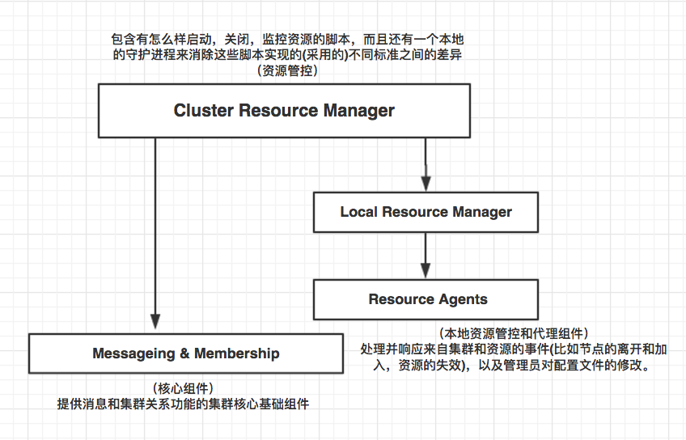
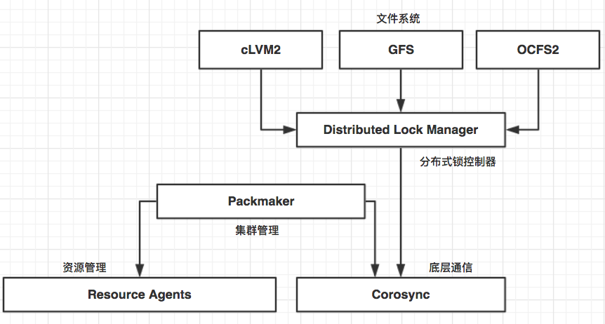
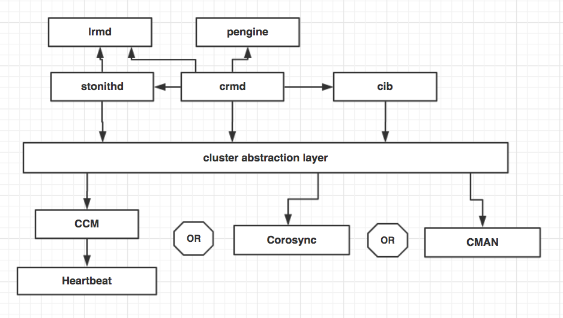
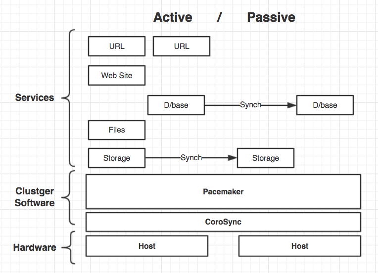
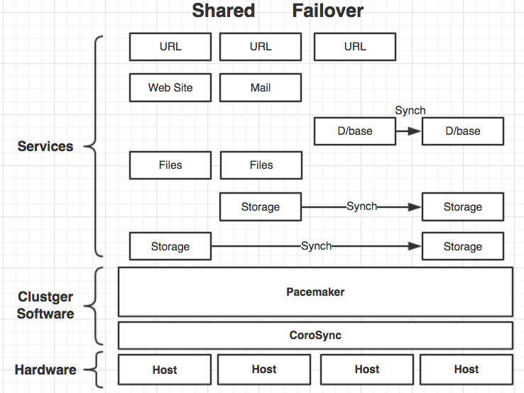
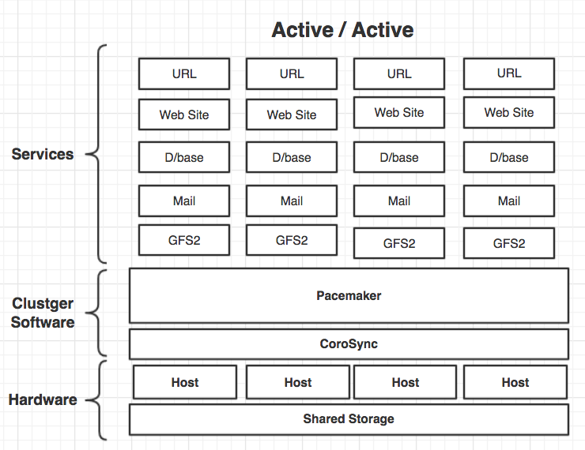

# Pacemaker基础
## 1. 集群介绍
### 1.1 什么是集群    
* 集群（cluster）就是一组计算机，共同作为一个整体向用户提供一组资源服务。每个单独的计算机系统就是这个集群的节点（node）。理想中的集群是，用户不会意识到集群系统底层的节点，在用户看来，集群实际就是一个系统，而不是由多个计算机系统组成。并且集群系统是可以随意增加和删改集群系统的成员节点数量和配置以及工作方式。 　　
* Cluster内各节点服务器通过内部局域网相互通讯。当一台节点服务器发生故障时，这台服务器上所运行的应用程序将在另一节点服务器上被自动接管。当一个应用服务发生故障时，应用服务将被重新启动或被另一台服务器接管。当以上的任一故障发生时，客户都将能很快连接到新的应用服务上。
* 集群的主要几个特点体现在可扩展性、高可用性、高性能、高性价比。
### 1.2 集群系统的分类
* 一般把集群系统分为两类：   
1. 高可用(High Availability)集群,简称HA集群。   
 
        这类集群致力于提供高度可靠的服务。就是利用集群系统的容错性对外提供7*24小时不间断的服务，如高可用的邮件服务器、数据库服务等关键应用。

        负载均衡集群：使任务可以在集群中尽可能平均地分摊计算资源，充分利用集群的的整体处理能力，提高对任务的处理效率和增加容错性。 

        生产中这2种集群模式大多会混合使用，以提供更加高效稳定的业务服务。
        例如，生产中的整套业务系统，会在前端使用负载均衡技术平均分配流量给各个集群中的应用服务器，而后端采用HA的集群模式来保障数据库7*24小时的不间断服务。

2. 性能计算(High Perfermance Computing)集群，简称HPC集群，也称为科学计算集群。    
        
        在这种集群上运行的是专门开发的并行应用程序，可以把需要处理的单一数据分布到集群中多台的计算机上，利用集群中节点的共同资源来完成计算任务。

        这类集群致力于提供单个计算机所不能提供的强大的计算能力。如石油勘探与天气预报分子计算、生物计算等。

### 1.3 现代集群服务的特点：
1. 高可靠性（HA）：利用集群管理软件，当主服务器故障时，备份服务器能够自动接管主服务器的工作，并及时切换过去，以实现对用户的不间断服务。
2. 高性能计算（HP）：即充分利用集群中的每一台计算机的资源，实现复杂运算的并行处理，通常用于科学计算领域，比如基因分析、化学分析等。
3. 负载平衡：即把负载压力根据某种算法合理分配到集群中的每一台计算机上，以减轻主服务器的压力，降低对主服务器的硬件和软件要求。 

### 1.4 HA的容错备援运作过程
1. 自动侦测(Auto-Detect)：由主机上的软件通过冗余侦测线，在由监听程序和定制的逻辑判断，来相互侦测另一端运行的情况。可以涵盖内容包括：主机硬件、网络、操作系统、数据库引擎及应用程序状态、磁盘阵列链接状态等。为防止误判，通常会设定一定的判断条件和时间范围以及时间间隔，次数等指标。

2. 自动切换(Auto-Switch)：某一主机如果确认对方故障，则正常主机除继续进行原来的任务，还将根据设置好的故障处理规则对故障主机进行处理。

3. 自动恢复(Auto-Recovery)：在正常主机代替故障主机工作后，故障主机可离线进行修复工作。待修复后，主机一旦介入集群，自动切换回修复完成的主机上（这个取决于集群的设置策略，也可以不切换）。

## 2. CentOS 7 中的 Cluster
### 2.1 Cluster介绍
* CentOS 6 上支持的RHCS组件包主要有cman（心跳管理）、luci+ricci（配置工具）、rgmanager（资源管理），通过图形化配置相当简单。
* 自CentOS 7开始，系统已经不再集成RHCS套件，并且在rpmfind上找不到支持CentOS 7的RHCS组件包，在CentOS 7中默认采用corosync（心跳管理）、pacemaker（资源管理）、pcs（配置工具）同样可以构建HA集群，配置方法较之前有很大区别，但是集群的原理相似。

### 2.2 Pacemaker介绍
* Pacemaker是一个集群资源管理器，使用资源级别的监测和恢复来保证集群服务的最大可用性。它可以用你所擅长的基础组件(Corosync或者是Heartbeat)来实现通信和关系管理。
* Pacemaker包含的特性
    
    1. 监测并恢复节点和服务级别的故障
    2. 存储无关，并不需要共享存储
    3. 资源无关，任何能用脚本控制的资源都可以作为服务来管理
    4. 支持使用STONITH来保证数据一致性
    5. 支持大型或者小型的集群
    6. 支持quorate(法定人数) 或 resource(资源) 驱动的集群 
    7. 支持几乎所有的冗余配置，包括Active/Active, Active/Passive, N+1, N+M, N-to-1 and N-to-N
    8. 自动同步各个节点的配置文件
    9. 可以设定集群范围内的ordering, colocation , anti-colocation约束
    10. 支持更多高级服务类型: 
        * Clones:为那些要在多个节点运行的服务所准备的
        * Multi-state:为那些有多种模式的服务准备的。(比如.主从, 主备) 统一的，可控制的，cluster shell

## 3. 集群组成部分
### 3.1 集群组成部分

>PCS集群组成图

### 3.2 Pacemaker 层次
* 当与Corosync集成时，Pacemaker也支持常见的开源集群文件系统，根据集群文件系统社区的最新标准，他们用一个通用的分布式锁控制器，它靠Corosync通信并且用Pacemaker管理成员关系(哪些节点是开启或关闭的)和隔离服务。

### 3.3 Pacemaker自身由四个关键组件组成:
1. CIB (集群信息基础)
2. CRMd (集群资源管理守护进程)
3. PEngine (策略引擎)
4. STONITHd

* CIB用XML来展示集群的配置和资源的当前状态。CIB的内容会自动地在集群之间同步，并被PEngine用来来计算集群的理想状态和如何达到这个理想状态。
* Pacemaker会推举一个CRMd实例作为master来集中做出所有决策。如果推举的CRMd繁忙中或者这个节点不够稳定，则会推举新的master。
* DC（Designated Controller）会按顺序处理PEngine的指令，然后把他们发送给LRMd(本地资源管理守护进程) 或者通过集群消息层发送给其他CRMd成员(就是把这些指令依次传给LRMd)。
* 节点会把他们所有操作的日志发给DC，然后根据预期的结果和实际的结果(之间的差异)， 执行下一个等待中的命令，或者取消操作，并让PEngine根据非预期的结果重新计算集群的理想状态。
* 在某些情况下，可能会需要关闭节点的电源来保证共享数据的完整性或是完全地恢复资源。为此Pacemaker引入了STONITHd。STONITH是Shoot-The-Other-Node-In-The-Head(爆其他节点的头)的缩写，并且通常是靠远程电源开关来实现的。在Pacemaker中，STONITH设备被当成资源(并且是在CIB中配置)从而轻松地监控，然而STONITHd会注意理解STONITH拓扑，比如它的客户端请求隔离一个节点，它会重启那个机器。

## 4. Pacemaker集群类型
### 4.1 主备模式

>主备模式是生产环境的经典架构，但是可惜的是会浪费一台主机在那随时待命，白白浪费资源，但是对于关键业务是必须有这样的保障！当主机ACTIVE出现问题，集群资源会切换到Passive主机去运行。

### 4.2 多节点模式 N+1

> 支持多节点集群，可以很多服务共享一个备份节点，大大节省资源，生产系统会将一个项目中需要集群的3个服务跑在4个节点的集群上，如果谁有问题，谁就先迁移到备份节点上运行，等主机恢复了，然后在切换回来或者将该主机作为其他主机的备份资源使用

### 4.3 Actice/Active  N to N

>使用共享存储配合集群文件系统OCFS或者GFS2可以同时运行多个服务，每个节点都可以用于互相切换。也可以同时启动分散一下工作量

## 5. PCS 命令和配置简介

### 5.1 主要配置文件
* PCS 的配置文件为 corosync.conf 和 cib.xml.请勿直接编辑这些文件，尽可能使用pcs 或pcsd界面进行编辑。
* corosync.conf文件提供 corosync使用的集群参数，后者是Pacema ker所在集群管理器。
* cib.xml是一个XML文件，代表集群配置和集群中所有资源的当前状态。这个文件由Pacemaker的集群信息基地（CIB）使用。会自动在整个集群中同步 CIB的内容。

### 5.2 PCS命令行界面
* pcs 命令行界面通过为corosync.conf文件cib.xml 提供界面，从而控制和配置corosync及Pacemaker,pcs 命令一般格式如下.
    
        pcs  [-f file] [-h] [commands]...

### 5.3 PCS命令主要介绍
|选项|解释|
|:----|:---
|Cluster|	-
|Resource|	创建和管理集群资源
|Stonith|	将fence设备配置为与Pacemaker 一同使用
|Constraint|	管理资源限制
|Property|	设定Pacemaker属性
|Status|	查看当前集群和资源状态
|Config|	以用户可读格式显示完整集群配置

## 总结
本章节只是讲解PCS集群的架构和基础，后续以实例的形式讲解生产中常用的集群配置，学的东西能解决问题才叫有用的知识。
集群是生产中较为常用的技术之一。
