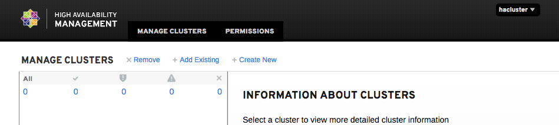
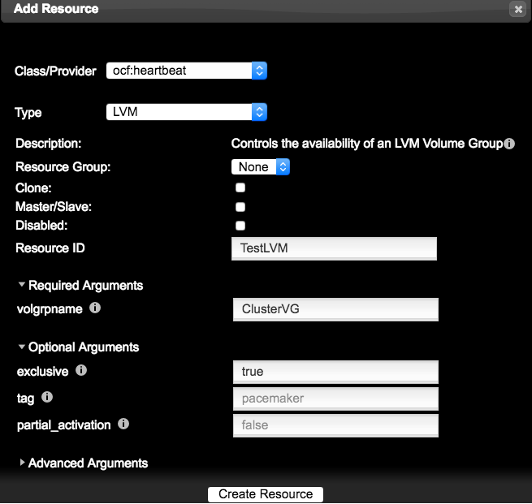
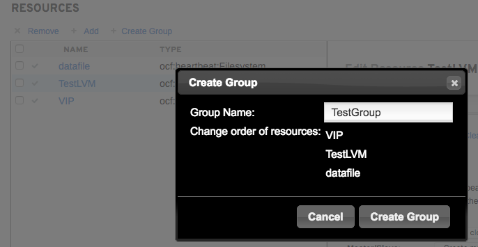

# PCS-2 集群的创建
* 本章节重点是以实例的形式对PCS的集群进行安装配置，以及常见的问题分析和处理。
## 1. Cluster 安装和配置
### 1.1 Cluster 实例图

>集群实例架构图-实例采用生产常用配置进行，涵盖多种故障测试和恢复的技术点。

### 1.1 试验环境
|系统版本|磁盘数量|网卡数量|ip地址|主机名称|虚拟化|备注|
|:---|:---|:---|:---|:---|:---|:---|
|CentOS 7.4|2Vdisk|3|192.168.56.101(VIP网络)  192.168.57.3(心跳1) 192.168.58.3（iscsi存储网络，模拟心跳2）|NODE1|Vbox|集群节点1|
|CentOS 7.4|2Vdisk|3|192.168.56.102(VIP网络)  192.168.57.4(心跳1) 192.168.58.4（iscsi存储网络，模拟心跳2）|NODE2|Vbox|集群节点2|
|CentOS 7.4|2Vdisk|1|192.168.58.5（iscsi网络）|ISCSI|Vbox|模拟iscsi设备|

### 1.2 测试内容和环境说明
1. 完成集群安装并创建集群
2. 完成相关集群测试和故障恢复

### 1.3 前置条件
1. 设置主机名(NODE1和NODE2都执行操作，名称分别为NODE1和NODE2)

       192.168.56.101 执行 #hostnamectl set-hostname NODE1
       192.168.56.102 执行 #hostnamectl set-hostname NODE2

2. 关闭防火墙或添加相应规则（NODE1和NODE2都执行操作）
3. 
        #systemctl  stop firewalld
        #systemctl  disable firewalld
                     或者
        添加规则：（如果防火墙已经关闭则无需配置）
        # firewall-cmd --permanent --add-service=high-availability
        # firewall-cmd --add-service=high-availability
3. 关闭Selinux（NODE1和NODE2都执行操作）

        #vim /etc/selinux/config 
        SELINUX= enforcing
        更改为
        SELINUX=disabled
4. 设置主机对应表（NODE1和NODE2都执行操作）

        #vim /etc/hosts
        添加如下：（写心跳对应的IP地址）
        192.168.57.3   NODE1
        192.168.57.4   NODE2
        192.168.58.5   ISCSI

5. 重启系统生效配置，然后接入系统
        NODE1 和 NODE2 reboot重启

### 1.4 ISCSI配置
>实例的一部分，只简单搭建起来为集群实例使用，生产中很少使用。为新手准备，熟练的可以跳过
1. 前置条件
        
        1. 关闭防火墙并开机不启动
        2. 关闭selinux
        3. 修改对应主机名(注意hosts文件添加的是192.168.58. 网络)
        以上内容不在重复说明，参考上面内容。
2. 安装和配置服务端
        
        安装软件包
        [root@ISCSI ~]# yum -y install targetcli
        启动服务端
        [root@ISCSI ~]# systemctl start target
        [root@ISCSI ~]# systemctl enable target
3. 分区并创建ISCSI共享设备

        分区，无需格式化（得到设备sdb1）
        [root@ISCSI ~]# fdisk /dev/sdb     

        建立存储块
        [root@ISCSI ~]# targetcli
        /> /backstores/block create cluster_vol1 /dev/sdb1

        配置ISCSI Target命名
        /> /iscsi create iqn.2018-02.com.mwdserver:iscsimwd1

        创建LUN
        /> /iscsi/iqn.2018-02.com.mwdserver:iscsimwd1/tpg1/luns create /backstores/block/cluster_vol1

        创建ACLs（iqn.2018-02.com.example:client1和2 是客户端名称标识）
        /> cd /iscsi/iqn.2018-02.com.mwdserver:iscsimwd1/tpg1/acls
        /iscsi/iqn.20...wd1/tpg1/acls> create iqn.2018-02.com.example:client1
        /iscsi/iqn.20...wd1/tpg1/acls> create iqn.2018-02.com.example:client2

        设置账户和密码（账户和密码都是test）
        /iscsi/iqn.20...wd1/tpg1/acls> cd iqn.2018-02.com.example:client1/
        /iscsi/iqn.20...ample:client1> pwd
        /iscsi/iqn.2018-02.com.mwdserver:iscsimwd1/tpg1/acls/iqn.2018-02.com.example:client1
        /iscsi/iqn.20...ample:client1> set auth userid=test
        Parameter userid is now 'test'.
        /iscsi/iqn.20...ample:client1> set auth password=test
        Parameter password is now 'test'.

        ip与端口
        /> cd /iscsi/iqn.2018-02.com.mwdserver:iscsimwd1/tpg1/portals/
        /iscsi/iqn.20.../tpg1/portals> ls
        o- portals ................................................................................................ [Portals: 1]
        o- 0.0.0.0:3260 ................................................................................................. [OK]

        如果没有开放使用一下命令进行创建或者修改端口
        /> /iscsi/iqn.2018-02.com.mwdserver:iscsimwd1/tpg1/portals create 192.168.58.5:3260

        退出保存
        /iscsi/iqn.20.../tpg1/portals> exit
        Global pref auto_save_on_exit=true
        Last 10 configs saved in /etc/target/backup.
        Configuration saved to /etc/target/saveconfig.json

4. 重启服务
        [root@ISCSI ~]# systemctl restart target

### 1.5 ISCSI接入集群

1. 集群成员挂载iscsi 

        NODE1 和 NODE2 节点安装 ISCSI 客户端
        # yum -y install iscsi-initiator-utils

2. 配置ISCSIInitiator名称

        修改iqn名称
        [root@node1 ~]#vi /etc/iscsi/initiatorname.iscsi
        InitiatorName=iqn.2018-02.com.example:client1
        [root@node2 ~]#vi /etc/iscsi/initiatorname.iscsi
        InitiatorName=iqn.2018-02.com.example:client1

3. 设置验证账户和密码

        NODE1 和 NODE2 节点执行
        # vim /etc/iscsi/iscsid.conf
        node.session.auth.authmethod = CHAP
        node.session.auth.username = test
        node.session.auth.password = test
        找到如下3行，去掉注释，并写入正确的账户和密码

4. 启动iscsi服务并设置开机启动

        NODE1 和 NODE2 节点执行
        # systemctl start iscsi
        # systemctl enable iscsi

4. 查找ISCSI设备

        NODE1 和 NODE2 节点执行
        # iscsiadm -m discovery -t sendtargets -p 192.168.58.5:3260
        192.168.58.5:3260,1 iqn.2018-02.com.mwdserver:iscsimwd1

5. 登录iscsi设备

        NODE1 和 NODE2 节点执行
        # iscsiadm -m node --login
        Logging in to [iface: default, target: iqn.2018-02.com.mwdserver:iscsimwd1, portal: 192.168.58.5,3260] (multiple)
        Login to [iface: default, target: iqn.2018-02.com.mwdserver:iscsimwd1, portal: 192.168.58.5,3260] successful.

        开机自动挂载iscsi
        # iscsiadm -m node -T iqn.2018-02.com.mwdserver:iscsimwd1  -p 192.168.58.5:3260 -o update -n node.startup -v automatic
6. NODE1 和 NODE2 确认ISCSI磁盘

        [root@node1 ~]# lsblk
        NAME            MAJ:MIN RM  SIZE RO TYPE MOUNTPOINT
        ......
        sdb               8:16   0    8G  0 disk
        sdc               8:32   0    8G  0 disk
        sr0              11:0    1 57.5M  0 rom
        这里的sdc是iscsi，node节点都是双磁盘，所以sda和sdb不是。

### 1.6 Cluster安装
1.	安装pcs软件

        NODE1 和 NODE2 节点执行
        # yum install pcs fence-agents-all 

2.	确定fence所需软件存在

        NODE1 和 NODE2 节点执行
        # rpm -qa | grep fence 
        fence-agents-rhevm-4.0.2-3.el7.x86_64 
        fence-agents-ilo-mp-4.0.2-3.el7.x86_64 
        fence-agents-ipmilan-4.0.2-3.el7.x86_64
        ...
        
3.	如果需要使用Cluster Lvm 和 GFS 可以安装如下软件包

        NODE1 和 NODE2 节点执行
        # yum install lvm2-cluster gfs2-utils

### 1.7 Cluster WEB UI
1.	NODE1 和 NODE2 节点执行，为hacluster用户设置密码
        
        #passwd hacluster

2.	NODE1 和 NODE2 节点执行，启动pcs，并且随机启动

        # systemctl start pcsd.service  //页面访问
        # systemctl enable pcsd.service

3.	配置节点之间的相互认证

        单节点执行即可
        [root@node1 ~]# pcs cluster auth node1 node2
        Username: hacluster
        Password:
        node1: Authorized
        node2: Authorized

4.	访问WEB UI，双侧主机IP均可

        https://192.168.56.101:2224/login
        认证账户为hacluster
>需要注意的是，有证书问题，我使用的是FireFox可以添加例外，如果使用其它浏览器在Windows下需要将证书安装后才可访问成功。

>登录界面图

5.	登录成功后，可见主面板

### 1.8 创建新集群
1.	创建集群

* 选择Create New，然后设置Cluster Nmae，添加节点主机名（节点主机名需要互相在/etc/hosts中进行相互映射，切记/etc/hosts添加的是私网IP） 集群内部通讯走私有网络，切勿和对外服务IP混杂在一起。
* 创建完成后可以勾选创建的集群名称查看详细信息。

>指令创建：
        
    # pcs cluster setup --name TestCluster  node1 node2
>备注提示：
        
    pcs在执行以上命令时会生产corosync.conf文件，这个配置文件是集群的核心配置，重装系统时建议做好这个配置文件的备份。

2.	开启集群

>启动集群和状态信息预览图
* 点击创建的集群名称（TestCluster），在node1和node2的节点上，可以启动集群.

>指令执行
        
        单点执行即可
        # pcs cluster start --all  开启集群
        # pcs cluster enable --all 设置集群自动启动
        这是一个只有双主机的集群，其实这是个特殊的集群，可以参考集群的投票原理。

>集群投票原理: 在一个集群中当有2分之1以上的节点存活时,这个集群就认为自己拥有绝对的能力工作,是“合法”的,计算的方法如下：

    公式: total_nodes < 2 * active_nodes
    4节点计算：
        每个节点1票，总票数为4，即total_nodes 为 4
        4节点存活即 total_nodes(4) < 2 * active_nodes(4) = 4<2*4
        3个节点存活即 4<2*3 ,依然“合法”继续工作
        2个节点存活即 4<2*2, 不满足条件，集群处于“非法”状态，停止工作

根据上述理论双节点的集群中只有当两者全部在线时才是“合法”的,这个规则会让“双节点集群”毫无意义，所以“双节点的HA”是一个特殊的集群模式，我们必须控制Pacemaker发现集群达不到票数时候的行为。
>在两个节点的情况下设置以下值：（忽略quorum票数）
        
        pcs property set no-quorum-policy=ignore
        同时开启集群故障时候服务迁移
        pcs resource defaults migration-threshold=1
>集群默认检测到创建的是双节点会自动设置参数，但是如果是扩容或者缩容后，需要手动设定确认一下。

3.	确认集群状态

>参考“启动集群和状态信息预览图”
注意所有集群组件的状态全部为Running，这里有个小提示，初始化完成后Pacemaker Connected 可能会有1分钟左右的未连接状态，稍微等待即可。

>指令确认：

        [root@node1 ~]# pcs cluster status
        Cluster Status:
        Stack: corosync
        Current DC: node1 (version 1.1.16-12.el7_4.7-94ff4df) - partition with quorum
        Last updated: Wed Feb  7 15:30:39 2018
        Last change: Wed Feb  7 15:06:08 2018 by hacluster via crmd on node2
        2 nodes configured
        0 resources configured
        PCSD Status:
        node1: Online
        node2: Online

>配置检查

    [root@ywdb2 ~]#  crm_verify -L –V  //没有提示既是正常
>如果出现以下提示：

        [root@node1 ~]# crm_verify -L -V
        error: unpack_resources:	Resource start-up disabled since no STONITH resources have been defined
        error: unpack_resources:	Either configure some or disable STONITH with the stonith-enabled option
        error: unpack_resources:	NOTE: Clusters with shared data need STONITH to ensure data integrity
        Errors found during check: config not valid

        暂时关闭stonish，后面再详细讲讲stonish的配置。
        #pcs property set stonith-enabled=false
        该处也可以点击Cluster Properties，选择取消Stonith Enabled 选项

### 1.9 添加resource
1. 添加resource（VIP）

* 点击面板resources ，点击Add，Class选择ocf:heartbeat，Type选择IPaddr2，resource ID 处输入resource 资源名称，最后写入IP地址（VIP，要与对外提供服务的IP在同一个网段），点击create resource。
* VIP 理解为浮动IP，即集群服务对外提供给客户访问的IP地址。

>指令创建：
    
    #pcs resource create VIP ocf:heartbeat:IPaddr2 ip=192.168.56.120 cidr_netmask=24 op monitor interval=30s

2. 添加resource（LVM）

        在iscsi设备(sdc)上创建lvm（一侧创建，一侧同步）
        [root@node1 ~]# fdisk /dev/sdc  //分区不格式化
        [root@node1 ~]# partx -a /dev/sdc  //刷新分区
        [root@node1 ~]# pvcreate /dev/sdc1
        [root@node1 ~]# vgcreate ClusterVG /dev/sdc1
        [root@node1 ~]# lvcreate -L +4G -n data ClusterVG
        [root@node1 ~]# mkfs.ext4 /dev/ClusterVG/data

        配置LVM，设置locking_type为1，设置use_lvmetad为0，禁用lvmetad服务
        [root@node1 ~]# lvmconf --enable-halvm --services --startstopservices

        [root@node1 ~]# vgs --noheadings -o vg_name
        ClusterVG
        centos
        [root@node1 ~]# vim /etc/lvm/lvm.conf
                查找volume_list关键字，并取消注释，修改为如下：
                volume_list = [ "centos" ]

        重建initramfs中，避免内核启动时集群卷组自动激活，而是将集群逻辑卷交于集群管理（务必执行后在重启！！）
        dracut -H -f /boot/initramfs-$(uname -r).img $(uname -r)
        如果出现错误，记得在recesu模式中进行修复。

        [root@node1 ~]# reboot //NODE1和NODE2主机从起
        NODE1 和 NODE2 上使用lvs指令都能检测到data这个逻辑卷

>添加LVM图
此处的LVM通过web 添加的，一定要将“exclusive”的 false参数改为true。

>指令创建：

    #pcs resource create TestLVM LVM volgrpname=ClusterVG exclusive=true 
    LVM 大写为资源类型。

3. 添加resource（Filssystem） (TestLVM -ext4)

        使用lvscan查看当前lv在哪个主机上是活跃状态，对lv进行分区，单测节点执行。
        [root@node2 ~]# lvscan
        ACTIVE            '/dev/ClusterVG/data' [4.00 GiB] inherit
        [root@node1 ~]# lvscan
        inactive          '/dev/ClusterVG/data' [4.00 GiB] inherit
        [root@node2 ~]# mkfs.ext4 /dev/ClusterVG/data
        创建挂载目录，NODE1 和 NODE2 都要进行创建。
        # mkdir /datadir

>指令创建：
   
    #pcs resource create datafile Filesystem device="/dev/ClusterVG/data" directory="/datadir" fstype="ext4"

>这里有一个误区，你会发现文件系统有时候是无法正常工作的，因为文件系统是在lvm上建立的，所以当lvm工作在node2，而集群把这个文件系统分配到node1上的时候，这个问题就出现了。
所以这里需要使用后续章节的service group来进行顺序绑定。

### 1.10 创建service group

* 点解Create Group 来创建service group，输入“Group Nmae”,注意“Change order of resources”这部分，调整先后顺序，最上面是最先执行，依次类推。
* 这里一定要注意的是资源的顺序，如果顺序错了，还要写别的策略调整，非常费事，所以一开始就设置正确减少不必要的麻烦。

>策略添加的思维如下：

    1. IP 资源为最优先启动
    2. lvm的资源，vg资源激活
    3. filesystem 资源必须在lvm资源激活后才能挂载
    4. 启动脚本的资源需要放到最后
    思路也比较好理解，如果要启动程序，必须要有文件系统找对应的程序文件，而文件系统又基于lvm之上，所以，从最底层向上排序为LVM->filesystem->start shell. 至于IP，应该放到启动脚本之前。

>指令创建：

    #pcs resource group add TestGroup VIP TestLVM datafile

>指令查看,使用pcs status 查看资源资源顺序是否正确

        [root@node2 ~]# pcs status
        Cluster name: TestCluster
        ......
        Resource Group: TestGroup
        VIP	(ocf::heartbeat:IPaddr2):	Started node1
        TestLVM	(ocf::heartbeat:LVM):	Started node1
        datafile	(ocf::heartbeat:Filesystem):	Started node1
        ......

## 总结
   本章主要内容是熟悉HA的配置方法和指令，无论你运用命令也好，还是WEB界面接好，以上所讲的内容都是基本内容，在整个集群章节也是非常重要的，在生产中也是最长用的。个人建议web配置和命令行都要掌握起来。