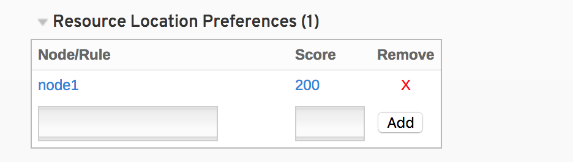
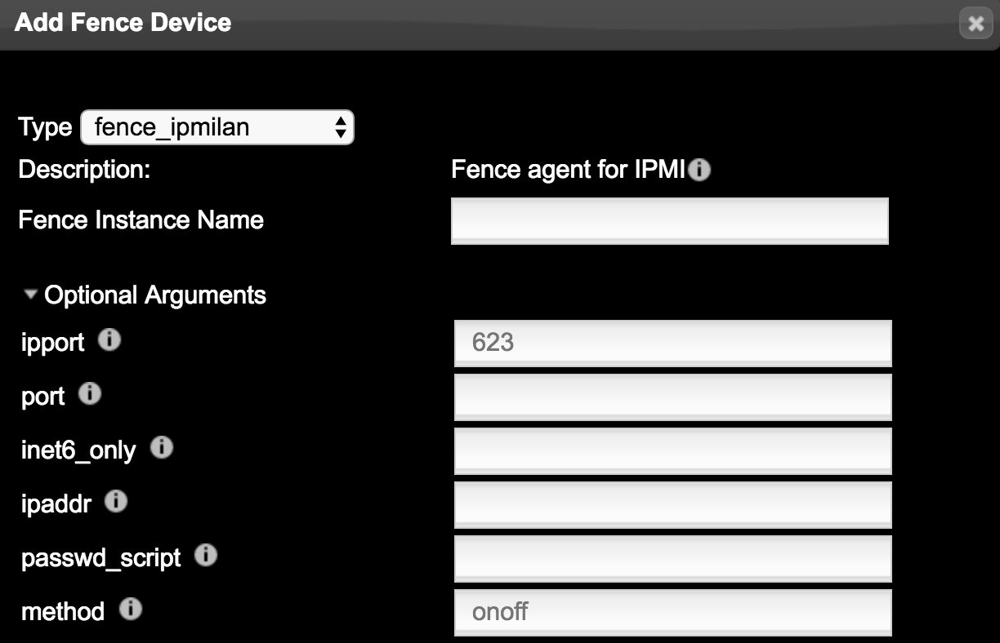

        
# PCS-3 故障模拟和恢复
* 本章节重点是以模拟实际生产环境可能出现的常见故障为实例对PCS的集群进行修复调整和加固，以及常见的问题分析和处理.
* 本章接上个章节的实验环境。
## 1. 断VIP网络切换测试
1.	VIP 离线测试
断开外网IP（即VIP网络）不是心跳网络，一定要搞清楚！！亲~现在没有fence设备，断掉心跳就会脑裂！你问我什么是脑裂,什么是fence？后面我详细告诉你！
正常状态：
    
        [root@node2 ~]# pcs status
        Cluster name: TestCluster
        ......
        Resource Group: TestGroup
        VIP	(ocf::heartbeat:IPaddr2):	Started node1
        TestLVM	(ocf::heartbeat:LVM):	Started node1
        datafile	(ocf::heartbeat:Filesystem):	Started node1
        ......

断开VIP网络后：
        
        //这个环境要模拟断开VIP网络，可以在虚拟机上把对应的网卡down掉。
        //这个环境是node1上运行的，所以在node1的虚拟上down掉对应网卡
        [root@node2 ~]# pcs status
        Resource Group: TestGroup
        VIP	(ocf::heartbeat:IPaddr2):	Started node2
        TestLVM	(ocf::heartbeat:LVM):	Started node2
        datafile	(ocf::heartbeat:Filesystem):	Started node2

        Failed Actions:
        * VIP_start_0 on node1 'unknown error' (1): call=59, status=complete, exitreason='Unable to find nic or netmask.',
        last-rc-change='Wed Feb  7 17:56:14 2018', queued=0ms, exec=38ms

        集群检测到VIP资源down掉后，会报出FAILED状态，然后进行stoping再到stoped，NODE2节点上在开始starting到started状态，正事启用

>全部在node2上运行了，此刻即使你的node1恢复了，这时候node2在断开外部网络，也没有办法切到node1上了，因为在集群的记录中，node1的VIP网络是坏掉的，除非你使用clear指令来清除记录，但是在生产上我们不可能实时关注集群，所以我们还是要有个策略来自己搞定

参数：failure-timeout ，失效多少秒后可以回切资源到失效的主机

    #pcs resource meta VIP failure-timeout=30    //单位秒
    #pcs resource meta TestLVM failure-timeout=30
    #pcs resource meta datafile failure-timeout=30

图形界面选择这里输入即可：

这个时候你在恢复好网络 ，然后断开网互相切换试试看，记得要等待30秒哦。

2.	如何解决回切问题（主机恢复后,VIP回归到原主机）
* 很头疼的问题来了，如上面的实例，我们的node1坏掉，服务切换到node2上进行工作，然是1分钟以后node1恢复正常了？会发生什么情况？？？？？
* 服务很有可能会切换回node1上去运行，生产环境，你这样飘来飘去，你的老板肯定疯掉！同样需要找个参数来处理这个问题。
* 参数：resource-stickiness 资源对主机的黏贴性
* 在node1恢复后，为防止node2资源迁回node1（迁来迁去对还是会对业务有一定影响）

        #pcs resource defaults resource-stickiness=100

这里设置的defaults参数，就是切换到哪就在哪运行，不回切！

3.	启动优先级 

>资源组启动优先级图例

在WEB界面，勾选资源组，进入资源组的参数配置界面，可以进行配置资源组启动优先级。

>指令配置

        pcs constraint location TestGroup prefers node1=200 
        指定node1优先启动TestGroup

crm_simulate -sL 或者 pcd config show 查看资源黏性值，集群业务优先在资源黏性值高的节点上运行。

        [root@node1 ~]# crm_simulate -sL

            Allocation scores:
            group_color: TestGroup allocation score on node1: 200
            group_color: TestGroup allocation score on node2: 0

## 2. 断心跳测试（脑裂的防范）
1.	脑裂（双节点无fence设备）
将心跳网络断开，就会脑力，那么脑裂又是什么？！
* 在心跳失效的时候，就发生了脑裂（split-brain）。

    比如：正常情况下，Node1和Node2使用心跳检测以确认对方存在；在通过心跳检测不到对方时，就接管对应的resource。然而突然间，Node1和Node2之间的心跳不存在了，而Node1和Node2事实上都认为自己是active的，这时Node1要接管Node2的resource么？ 而同时Node2要接管Node1的resource么？这时就是split-brain。
* 那么split-brain会引起数据的不完整性,甚至是灾难性的,又如何理解呢?

    其实不仅仅是数据的不完整性，可能会对服务造成严重影响，倒霉的时候会是毁灭性的打击。
    对于数据的不完整性，主要为集群节点访问同一存储，而此时并没有锁机制来控制数据访问（都脑裂了，心跳全没有了，咋控制啊？），同时访问读写数据，就会出现数据的不完整性的可能。这个也是CentOS 中的HA为何必须要fence设备的主要原因。

2. 模拟脑裂情况发生
    在实例环境中，模拟心跳断掉，即down掉心跳网卡，pcs status查看node1和node2。

node1 主机信息:

    Online: [ node1 ]
    OFFLINE: [ node2 ]
    Resource Group: TestGroup
        VIP	(ocf::heartbeat:IPaddr2):	Started node1
        TestLVM	(ocf::heartbeat:LVM):	Started node1
        datafile	(ocf::heartbeat:Filesystem):	Started node1

node2 主机信息:

    Online: [ node2 ]
    OFFLINE: [ node1 ]
    Resource Group: TestGroup
        VIP        (ocf::heartbeat:IPaddr2):	Started node2
        TestLVM    (ocf::heartbeat:LVM):   Started node2
        datafile   (ocf::heartbeat:Filesystem):    Started node2

经典的脑裂状态，双方都无法感知对方，认为对方死掉了，双侧资源发生争抢！
>重点提示，本实例状态下，如果恢复心跳，LVM为进入blocked状态，无法恢复集群，而且集群也无法重启，可以尝试关闭主机，然后一个一个启动。切勿同时启动。

脑裂条件如下：
	资源运行一方，心跳断掉将会脑裂，争抢资源。
	资源不运行一方，心跳断掉不会争抢资源，但是心跳恢复会出现重新计算情况。

3.	怎样可以预防脑裂呢？

        1. 很多人会想到，将心跳网络设置成为bond的active和backup模式！
        很好，你答对了，可以采用,而且我也在使用，但是不是最终的解决办法。
        b. Fence设备！！
        正确！最终的方法就是fence设备，一旦脑裂，fence会将一端主机强制关机或者重启，这取决于你对fence的设置，从根本上避免了双侧同时使用资源的根本可能。
        c. 双心跳！！
        其实双心跳和active/backup网络有异曲同工的之处，稍后详细讲解如何设置

4.	Bond网络设置（网络ACTIVE/BACKUP）
不在多说了，参考数的其它章节，有专门讲bond的设置

## 3. 双心跳
1. 配置冗余环协议（RRP）

使用 pcs cluster setup 命令创建集群时，可使用冗余环协议，通过为每个节点同时指定两个接口配置集群。使用默认 udpu 传送指定集群节点时，可指定 ring 0 地址，后接 ‘,’，然后是 ring 1 地址。

例如：下面的命令配置有两个节点的双心跳网络，NODE1上有2个网络用于心跳192.168.57.3 和192.168.58.3，NODE2 上也有2个网络用于心跳192.168.57.4 和192.168.58.4，如果需要组成双心跳，请执行以下命令。

    # pcs cluster setup --name rrp_cluster node1,node1-1 node2,node2-1 

2. 添加双心跳

        NODE1和NODE2节点进行添加
        #vim /etc/corosync/corosync.conf
        在totem {}
        定义：
        rrp_mode: passive  #默认为none，修改为passive才可以支持两个网段

        nodelist {
        node{
            ring0_addr:node1
            ring1_addr:node1-1  //node1-1为第二个心跳 
            }
        node{
            ring0_addr: node2
            ring1_addr: node2-1  //node2-1为第二个心跳 
            }

                }

3. 修改host表对应关系(添加补全)

        NODE1和NODE2节点进行添加 
        vim /etc/hosts
        192.168.57.3   NODE1
        192.168.57.4   NODE2
        192.168.58.5     ISCSI
        192.168.58.3    node1-1
        192.168.58.4    node2-1

4. 集群认证

        [root@node1 ~]# pcs cluster auth node1-1 node2-1
        Username: hacluster
        Password:
        node1-1: Authorized
        node2-1: Authorized

>出现以下显示表示认证成功，重启集群

    pcs cluster stop --all
    pcs cluster start --all

## 4. stonith设置，其实就是Fence设置
* 它就是负责群集某节点故障后，果断使其关机，重启，卸载群集资源的一种机制，大多数采用硬件设备提供，例如。ilo卡，ipmi等等..
>前面的章节关闭的fence设备，继续如下操作还请打开fence设备

    [root@node2 ~]# pcs property set stonith-enabled=true
* 查看本系统支持的fence设备
    
    pcs stonith list

* 查看即将要使用的fence设备相关信息

    [root@node2 ~]# pcs stonith describe fence_ipmilan
    实际环境中，fence_ipmilan但是必须要加lanplus="true"参数

* 生产初始配置文件stonith_cfg
    
    pcs cluster cib stonith_cfg

* 2侧主机配置fence

    [root@node2 ~]# pcs -f stonith_cfg stonith create ipmi-fence-node11 fence_ipmilan lanplus="true" pcmk_host_list="node1" pcmk_host_check="static-list" action="reboot" ipaddr="192.168.133.129" login=USERID passwd=password op monitor interval=60s

    [root@node2 ~]# pcs -f stonith_cfg stonith create ipmi-fence-node22 fence_ipmilan lanplus="true" pcmk_host_list="node2" pcmk_host_check="static-list" action="reboot" ipaddr="192.168.133.131" login=USERID passwd=password op monitor interval=60s

>解释：创建一个名为ipmi-fence-node11的fence设备名称用于建node1的fence，pcmk_host_check="static-list"的功能是将node1与192.168.133.129对应，后面login=USERID passwd=password op monitor interval=60s不解释。

* 检查stonith_cfg中stonith配置信息

        pcs -f stonith_cfg stonith 
* 上文关闭了stonish，现在开启stonish

        pcs -f stonith_cfg property set stonith-enabled=true 
* 检查stonith_cfg中stonith是否已经开启

        pcs -f stonith_cfg property
* 将stonith_cfg写入cib.xml
    
        pcs cluster cib-push stonith_cfg 
* 测试fence
    
        node2上测试FENCE是否成功stonith_admin --reboot node1
        node1上测试FENCE是否成功stonith_admin --reboot node2
>当看到主机重启的时候，这部分也就完成了。

* 图形界面配置

## 5. 备份和恢复集群
可使用下面的命令将集群配置备份为 tarball 文件。如果未指定文件名，则会使用标准输出作为文件名。
    
    pcs config backup filename

 使用下面的命令中所有节点中使用备份文件恢复集群配置。如果没有指定文件名，则会使用标准输入。使用 --local 选项则只会恢复当前节点中的文件。

    pcs config restore [--local] [filename]

## 总结： 
本章重点在于讲解集群中出现的常用故障和修复方法，这个只是简单的集群，实际环境中可能会出现各种各样的问题，会用到书中没有讲到的各种参数，所以还请参考附录-PCS参数，熟悉相关参数的功能，有个印象，查问题和修复的时候也有个方向和思路。