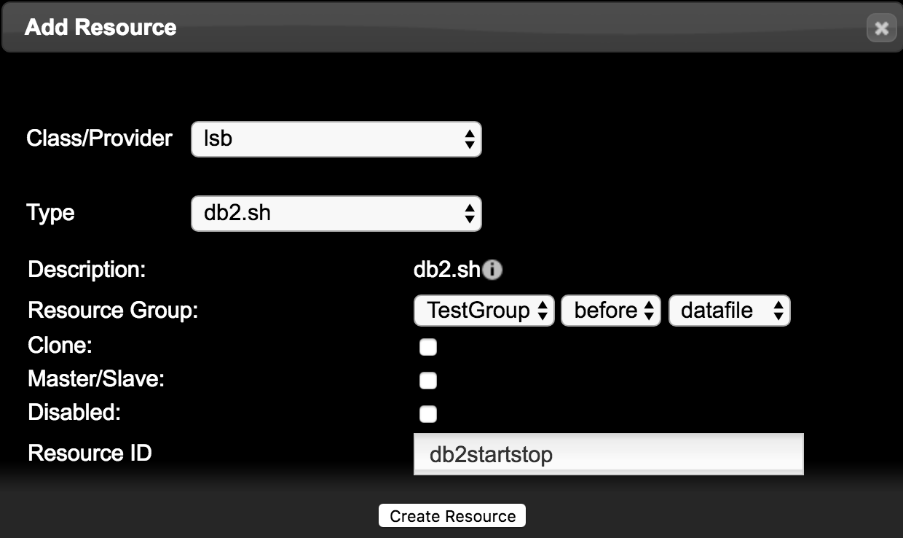
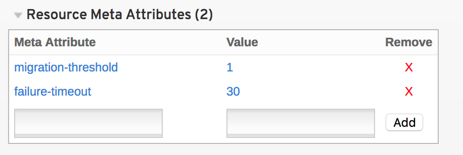

# PCS -- DB2 + web
## 1. 介绍
说句实话很多人问我为什么不写WEB的HA，现在都应用层面大部分都已经使用负载均衡的模式在做了，很少会用HA，但是数据库的HA确实用的非常之多，所以这里举例也是用数据库，当然，无论DB2还是mysql还是其它数据库他们也都有自己的HA方法，具体用哪个看你自己了，我更习惯用系统的HA模式。

## 2. DB2 HA 配置

### 2.1 node节点安装配置
安装DB2软件的时候一定要注意，俩边主机都要安装在相同的目录，并且双侧主机的账户UID和GID都要一样，如果出现偏差可能就不能进行切换了。
>以下所有操作都在集群存活的主机上执行: `node2和node1`上操作，查看cluster基础环境配置

        [root@node2 ~]# pcs status
        Resource Group: TestGroup
        VIP	(ocf::heartbeat:IPaddr2):	Started node2
        TestLVM	(ocf::heartbeat:LVM):	Started node2
        datafile	(ocf::heartbeat:Filesystem):	Started node2

1.	上传DB2安装软件到HA主机并在双侧主机进行解压：

        #tar xvf v9.7fp3_25384_linuxx64_server.tar.gz

2.	创建DB2所需账户

        # groupadd db2grp
        # groupadd db2fgrp 
        # groupadd dasadm 
        # useradd -m -g db2grp -d /home/db2inst -s /bin/bash db2inst
        # useradd -m -g db2fgrp -d /home/db2fenc -s /bin/bash db2fenc
        # useradd -m -g dasadm -d /home/dasusr -s /bin/bash dasusr

3.	为DB2账户设置密码

        # passwd db2inst 
        # passwd db2fenc
        # passwd dasusr

4.	进行安装

        #cd ~/server //server为db2解压出来的目录
        #./db2_install
        #默认安装路径
        #输入ESE

5.	DB2 License

        #cd /opt/ibm/db2/V9.7/adm
        # ./db2licm –a /mnt/db2install/db2/license/db2ese_t.lic  
        //如果没有License 授权可以跳过该步骤

6.	创建DAS和数据库实例

        # cd /opt/ibm/db2/V9.7/instance
        # ./dascrt -u dasusr
        # ./db2icrt -p 50001 -u db2fenc db2inst

7.	更改DB2 库文件默认目录

        #su - db2inst
        $db2 get dbm cfg  //获得当前DB2配置
        ……..
        Default database path                       (DFTDBPATH) = /home/db2inst
        ……….

        $ db2 update dbm cfg using DFTDBPATH /datadir    //更改到共享存储

>下列操作在集群资源存活一侧进行，本实例为NODE2下操作

8.	设置共享存储权限
        
        #chown -R db2inst.db2grp /datadir
9.	创建范例数据库

        # su - db2inst
        $ db2sampl
        ......
        'db2sampl' processing complete.
10.	查看并连接范例数据库

        $ db2 list db directory
        …….
        Database 1 entry:

        Database alias                       = SAMPLE
        Database name                        = SAMPLE
        Local database directory             = /dbdata
        Database release level               = d.00
        Comment                              =
        Directory entry type                 = Indirect
        Catalog database partition number    = 0
        …….

        $db2start

        $db2 connect to sample
        ……
        Database server        = DB2/LINUXX8664 9.7.3
        SQL authorization ID   = DB2INST
        Local database alias   = SAMPLE

11.	迁移集群资源组db2group到node1

        # pcs constraint location TestGroup  prefers node1=INFINITY  
        //迁移资源组 
        

12.	将数据库catalog到node1

        node1 节点上执行
        # su – db2inst
        $ db2 catalog  db sample on /datadir
13.	启动数据库并进行链接测试

        node1节点上执行
        $db2start
        $db2 connect to sample
        ……..
        Database server        = DB2/LINUXX8664 9.7.3
        SQL authorization ID   = DB2INST
        Local database alias   = SAMPLE

14.     迁移完成后一定不要忘记把迁移策略取消，把管理权交还给集群
        
        # pcs constraint show
        # pcs constraint remove location-TestGroup-node1-INFINITY

### 2.2 DB2加入集群
1.	加入集群之前，先关闭node1 和 node2 主机DB2，让集群去控制DB2启动和停止，不要让DB2随系统启动

        #su – db2inst
        $db2stop force
	
2.	编写DB2启动和停止脚本要附带检查状态

        //我的脚本写的比较简单，你可以继续完善
        //脚本一定要放到/etc/init.d/目录，并且权限为755
        #!/bin/sh
        # chkconfig: 2345 99 01
        # processname:IBMDB2
        # description:db2 start
        
        DB2_HOME="/home/db2inst/sqllib" 
        DB2_OWNER="db2inst" 
        
        case "$1" in
        start )
        echo -n "starting IBM db2"
        su - $DB2_OWNER -c $DB2_HOME/adm/db2start
        touch /var/lock/db2
        echo "ok"
        RETVAL=$?
        ;;

        status)
        ps -aux | grep db2sysc | grep -v grep
        RETVAL=$?
        ;;

        stop )
        echo -n "shutdown IBM db2"
        su - $DB2_OWNER -c $DB2_HOME/adm/db2stop force
        rm -f /var/lock/db2
        echo "ok"
        RETVAL=$?
        ;;
        restart|reload)
        $0 stop
        $0 start
        RETVAL=$?
        ;;
        *)
        
        echo "usage:$0 start|stop|restart|reload"
        exit 1
        
        esac
        exit $RETVAL

        # chmod 755 /etc/init.d/db2.sh

3.	添加resource资源，在web页面添加（脚本在/etc/init.d/）

注意选择在datafile之后启动脚本。

>指令添加：包含failure-timeout
        
    #pcs resource create db2startstop lsb:db2.sh
    #pcs resource group add TestGroup db2startstop

>重要：一定要注意资源顺序，如果错误自行调整，db2的启动脚本一定是在文件系统挂载之后,更改之后，点击update group。

4. 为其他资源设置失败计数器
        
        其他资源也都需要添加
        #pcs resource meta dbs2tartstop  failure-timeout=30
        #pcs resource meta db2startstop migration-threshold=1

        failure-timeout=30: 失效多少秒后可以回切资源到失效的主机
        migration-threshold=1:以便规定在失败多少次后，将其移动到一个新节点。达到阈值后，就不再允许该节点运行失败的资源，除非：
                * 管理员使用 pcs resource failcount 命令手动重置资源失败计数。
                * 已达到该资源的 failure-timeout 值。 
        这2个参数配合起来使用，该实例中，即失败1次，就会迁移资源到其他节点，30秒后如果其他节点也资源启动失败，才可以迁回原节点。

>web界面配置

### 2.3 DB2切换测试
1.	检测条件为

        ps -aux | grep db2sysc | grep -v grep    
         //判断db2sysc  进程是否存在
	
2. 在资源启动的主机上kill掉db2sysc进程进行切换测试,未kill之前:

        [root@node2 init.d]# pcs status
        Resource Group: TestGroup
        VIP	(ocf::heartbeat:IPaddr2):	Started node2
        TestLVM	(ocf::heartbeat:LVM):	Started node2
        datafile	(ocf::heartbeat:Filesystem):	Started node2
        db2startstop	(lsb:db2.sh):	Started node2
       
        [root@node2 init.d]# ps -aux | grep db2sysc
        db2inst  12309  0.2  4.8 1206932 49488 ?       Sl   17:59   0:00 db2sysc 0
        [root@node2 init.d]# kill -9 12309

3. 杀掉之后切换到node1执行

        [root@node1 instance]# pcs status
        Resource Group: TestGroup
        VIP	(ocf::heartbeat:IPaddr2):	Started node1
        TestLVM	(ocf::heartbeat:LVM):	Started node1
        datafile	(ocf::heartbeat:Filesystem):	Started node1
        db2startstop	(lsb:db2.sh):	Started node1
3. 测试链接数据库

        [root@node1 instance]# su - db2inst
        上一次登录：四 2月  8 23:57:20 CST 2018
        [db2inst@node1 ~]$ db2 connect to sample

        Database Connection Information

        Database server        = DB2/LINUXX8664 9.7.3
        SQL authorization ID   = DB2INST
        Local database alias   = SAMPLE

## 3. Web集群
DB2这个实例是利用自建脚本来启动服务，相对来讲会复杂一下，但是PCS内会为我们提供一定的可构建集群服务的默认资源，使用起来也非常方便。

### 3.1 Apache
1.	node1和node2安装http服务

        # yum -y install httpd

2.	添加web集群虚拟IP

        [root@node2 init.d]# pcs resource create webvip ocf:heartbeat:IPaddr2 ip="192.168.56.190" cidr_netmask=32 op monitor interval=30s
        [root@node2 init.d]# pcs resource meta webvip failure-timeout=30
        [root@node2 init.d]# pcs resource meta webvip  migration-threshold=1
3.	设置WebServer资源

        [root@node2 init.d]# pcs resource create WebServer ocf:heartbeat:apache httpd="/usr/sbin/httpd" configfile="/etc/httpd/conf/httpd.conf" statusurl="http://localhost/server-status" op monitor interval=1min
        [root@node2 init.d]# pcs resource meta WebServer failure-timeout=30
        [root@node2 init.d]# pcs resource meta WebServer  migration-threshold=1
4.	添加到group组执行
        
       [root@node2 init.d]#  pcs resource group add HttpServer webvip WebServer
5.	配置httpd资源statusurl，node1和node2都要执行

        # cat > /etc/httpd/conf.d/status.conf << EOF
        <Location /server-status>
        SetHandler server-status
        Order deny,allow
        Deny from all
        Allow from localhost
        </Location> 
        EOF
6.	设置web页面，node1和node2都要执行

        #cat <<-END >/var/www/html/index.html
        <html>
        <body>Hello ywdb1</body>
        </html>
        END

* 本例采用的是本地磁盘，主要是让大家看清楚切换效果，实际生产环境都加可以利用上面已有的lvm进行共享磁盘设置，挂载到/var/www/html/，这样的话无论切换到哪个主机都会看到相同页面。
* 结合当前环境而言，只有一个共享存储制作的LVM，如果我要是使用共享存储的其它LV来作为挂载的话，必须要保证我的web资源组和DB2资源组在同一台主机上运行。
* 如果资源自启动失败，可以尝试Cleanup一下。

7.	切换测试

        [root@node2 init.d]# pcs status
        Resource Group: HttpServer
        webvip	(ocf::heartbeat:IPaddr2):	Started node2
        WebServer	(ocf::heartbeat:apache):	Started node2
        
        [root@node2 init.d]# pcs constraint location HttpServer prefers node1=INFINITY

        [root@node2 init.d]# pcs status
        Resource Group: HttpServer
        webvip	(ocf::heartbeat:IPaddr2):	Started node1
        WebServer	(ocf::heartbeat:apache):	Started node1

        将管理权限交还给集群。
        [root@node2 init.d]# pcs constraint remove location-HttpServer-node1-INFINITY
 
* 实际生产环境中，已经很少用HA的技术保障WEB了，基本上都采用lvs来负载web页面了，更多的还是数据库在用HA或者CRM一类的系统用的多。

## 总结
DB2的实例是扩展使用自定义脚本做HA，实际环境中集群软件并不能为我们提供足够的资源，所以有时候也要发明创造一下，扩展自己的思路会让道路更为宽广。
Apache的实例采用的是集群自带的启动和管理模式，也是为了体验一下集群软件的方便易用性。

