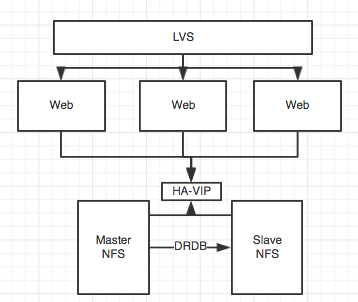
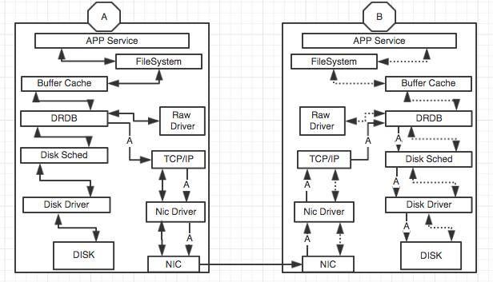
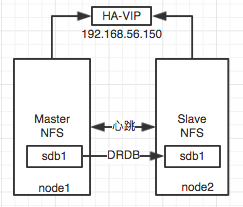

# PCS  HA（NFS+DRBD）
## 1. 背景介绍
* 生产环境中某些前端应用做了负载均衡或者关联了批量任务，那么会涉及到多台主机需要能够读取到同一个文件夹下的某些文件，例如web前端的静态页面文件。
* 其实这个问题可以使用集中的NAS存储来解决，但是使用NAS存储会有如下2个较为突出的问题：
        
        1. 增加额外的高额存储成本；
        2. 如果集中的NAS存储自身承载了太多的系统进行并行读写，往往会出现读写瓶颈；
* 所以分析需求，找到较为折中的解决方案。需求根本无非就是需要所有的主机上的某个磁盘下或者某个目录的内容一致即可。所以这个需求可以使用NFS共享存储来解决，创建NFS共享，所需节点挂载使用，实际上这个NFS也是NAS，完美的解决的前面的成本问题，采用廉价的NFS来解决。但是NFS有个问题，这是一个单点存储，如果出现问题，将会导致业务瘫痪。
* 继续分析，如何解决单点问题？
       
        1. 可以通过对监控，当发现主NFS存储系统宕机后，管理人员手工进行处理，但是需要人工处理，这是非常不理智的做法。
        2. 通过集群HA在2台或多台主机之间自动切换NFS服务，确保对外的7*24服务提供
* 在使用HA解决了NFS单点问题的基础上，继续分析，这么多台主机如果进行了NFS服务切换，如何保障NFS服务所共享出去目录数据的一致性？

        1. 采用集中存储SAN或者NAS，显然，这又让问题会到了原点，不可取之，如果真的愿意支付高额的成本，那么也就不许要费力来想这个解决方案了。
        2. 采用DRBD，将每个HA节点的NFS数据磁盘进行同步，这样即省去了额外存储的成本，也满足了生产的需求。

## 2. 生产常用架构图

    

## 3. DRBD介绍

    

>DRDB实例图，实线代表实际数据流向，A数据代表经过drdb通过网络进行另外一侧的写入流向，虚线数据意义同实线，只是未发生，如主机发生切换即选线流向会变成实线流向。

* 一张图说尽DRBD的工作模式，简单的理解其实就是数据通过DRBR软件通过网络传输在另外一侧的机器也复写了一份，所以2侧的数据是一样的。我们即可使用这个功效在俩侧数据保持一样的情况下来替代共享存储，但是他的致命弱点就是网络中断和网络延迟，如果延迟太高，而写入数据又非常频繁和大量，那么真不建议使用这个技术。
* 文件写入磁盘的步骤是: 写操作 --> 文件系统 --> 内存缓存中 --> 磁盘调度器 --> 磁盘驱动器 --> 写入磁盘。而DRBD的工作机制如上图所示，数据经过buffer cache后有内核中的DRBD模块通过tcp/ip协议栈经过网卡和对方建立数据同步。
>通常做法都是将这种DRBD的网络规划到独立的交换机走内部私有网络来进行通信，尽可能的高速网络。

### 3.1 DRBD基础功能
* DRBD 技术是一种基于软件的，无共享存储的，复制的存储解决方案，在服务器之间的对块设备（硬盘，分区，逻辑卷等）进行镜像。
* 同步镜像和异步镜像：

        同步镜像，当本地发申请进行写操作进行时，同步写到两台服务器上
        异步镜像，当本地写申请已经完成对本地的写操作时，开始对其余服务器进行写操作
### 3.2 DRBD模式
1.	单主模式

        1. 集群中只存在一个主节点。 正是因为这样在集群中只能有一个节点可以随时操作数据，对应的文件系统（EXT3、EXT4、XFS等等）。
        2. 集群当前操作数据的几点会被设置为”主动”，而另一侧则是”被动”，当主动出现问题，则会迁移到被动节点，并将”被动”设置为”主动”
        3. DRBD 单主节点模式可保证集群的高可用性（fail-over 遇故障转移的能力）
	.	双主模式

        1. DRBD 8.0 版本以后才支持双主模式
        2. 集群中资源存在两个主节点
        3. 考虑到双方数据存在同时操作的可能性，需要一个共享的集群文件系统，利用分布式的锁机制进行管理，如 Redhat 的GFS2 和Oracle的OCFS2。
### 3.3 DRBD传输模式
* drbd有三种数据同步模式:同步，异步，半同步

        A：异步复制。本地磁盘写成功后立即返回，数据放在发送buffer中，可能丢失
        B：内存同步（半同步）复制。本地写成功并将数据发送到对方后立即返回，如果双机掉电，数据可能丢失
        C：同步复制。本地和对方写成功确认后返回。如果双机掉电或磁盘同时损坏，则数据可能丢失
>通常选用3模式，但是选用3模式又非常依赖网络，所以将网络单独规划出来并做冗余网络来支撑，同时网络要尽可能的高速。

### 3.4 DRBD脑裂
* 既然是集群系统，有主备之分，那么难免的就会出现脑裂，无法感知对方，同时又将自己提升为”主动”模式，一旦恢复，那么后果不堪设想，到底以谁为主？谁的数据是准确的？通常我们都会配置邮件通知去人为干预，但是你也可以做如下设置：（脑裂参考PCS章节）

        1. 丢弃比较新的主节点的所做的修改
        2. 丢弃老的主节点所做的修改
        3. 丢弃修改比较少的主节点的修改
        4. 一个节点数据没有发生变化的完美的修复裂脑

## 4. DRBD+NFS+PCS配置实例
### 4.1 实例图

>DRBD+NFS+PCS 实例图，可以延续使用PCS章节实验主机。

### 4.2 试验环境
|系统版本|磁盘数量|网卡数量|ip地址|主机名称|虚拟化|备注|
|:---|:---|:---|:---|:---|:---|:---|
|CentOS 7.4|2Vdisk|3|192.168.56.101(VIP网络)  192.168.57.3(心跳1) 192.168.58.3（iscsi存储网络，模拟心跳2）|NODE1|Vbox|集群节点1|
|CentOS 7.4|2Vdisk|3|192.168.56.102(VIP网络)  192.168.57.4(心跳1) 192.168.58.4（iscsi存储网络，模拟心跳2）|NODE2|Vbox|集群节点2|

### 4.3 测试内容和环境说明
1. 完成DRBD安装和配置，是node1和node2主机具备DRDB同步数据能力
2. 完成集群NFS+DRBD+PCS的切换。

### 4.4 DRBD安装和配置
1. 安装yum源和DRBD软件

        node1和node2主机进行DRDB安装
        # rpm --import http://elrepo.org/RPM-GPG-KEY-elrepo.org
        # rpm -Uvh http://www.elrepo.org/elrepo-release-7.0-3.el7.elrepo.noarch.rpm
        # yum -y install drbd84-utils kmod-drbd84
2. DRBD配置（fdisk分区sdb，出现sdb1）

        1.双侧主机编写DRBD配置
        [root@node1 drbd.d] vi /etc/drbd.d/nfsdata.res
        resource data { 
        on node1{ 
            device    /dev/drbd1;      //drbd设备名称
            disk      /dev/sdb1;      //对应物理磁盘，sdb1不需要格式化
            address    192.168.57.3:7789;    //通讯的地址和端口
            meta-disk internal; 
            } 
        on node2{ 
            device    /dev/drbd1; 
            disk      /dev/sdb1; 
            address   192.168.57.4:7789; 
            meta-disk internal; 
            } 
        }
        书写配置文件，注意去掉 “//”和中文注释
       
        2.初始化设备，node1 和 node2主机执行
        # drbdadm create-md  data -c /etc/drbd.conf #中途提示输入”yes”
    
        3.启动DRBD和开机启动
        [root@node2 ~]# systemctl restart drbd.service
        [root@node2 ~]# systemctl enable drbd.service
    
        4.查看启动后状态，双侧状态都为secondary，因为没有设置主设备，所以这个状态还不能使用
        [root@node2 ~]# cat /proc/drbd
        version: 8.4.10-1 (api:1/proto:86-101)
        GIT-hash: a4d5de01fffd7e4cde48a080e2c686f9e8cebf4c build by mockbuild@, 2017-09-15 14:23:22
        1: cs:SyncTarget ro:Secondary/Primary ds:Inconsistent/UpToDate C r-----
            ns:0 nr:211980 dw:211980 dr:0 al:8 bm:0 lo:0 pe:0 ua:0 ap:0 ep:1 wo:f oos:8175312
            [>....................] sync'ed:  2.6% (7980/8188)M
            finish: 0:12:29 speed: 10,908 (8,832) want: 16,440 K/sec
        注意此处，双侧主机都是Secondary/Secondary，需要设置一个主节点。
    
        5.设置主设备（node1 为主）
        [root@node1 ~]# drbdadm primary --force  data -c /etc/drbd.conf
    
        6.查看DRBD同步
        [root@node2 ~]# cat /proc/drbd
        version: 8.4.10-1 (api:1/proto:86-101)
        GIT-hash: a4d5de01fffd7e4cde48a080e2c686f9e8cebf4c build by mockbuild@, 2017-09-15 14:23:22
        1: cs:SyncTarget ro:Secondary/Primary ds:Inconsistent/UpToDate C r-----
            ns:0 nr:267616 dw:267616 dr:0 al:8 bm:0 lo:0 pe:0 ua:0 ap:0 ep:1 wo:f oos:8119676
            [>....................] sync'ed:  3.3% (7928/8188)M
            finish: 0:10:24 speed: 12,984 (9,908) want: 18,400 K/sec
        多次查看，直到同步完成。
    
        7.DRBD重用操作指令
            1. 状态查看
            [root@node1 ~]# drbdadm status
            [root@node2 ~]# drbd-overview
    
            2. 查看配置文件dump
            [root@node1 ~]# drbdadm dump
    
            3. 主节点执行，全部置为secondary 
            [root@node1 ~]# drbdadm secondary all
    
            4. 设置主节点
            [root@node1 ~]# drbdadm primary --force  data -c /etc/drbd.conf
    
            5. 切换步骤，先卸载挂载，主降级secondary，备升级primary，挂载使用
            [root@node1 ~]# drbdadm secondary data
            [root@node2 ~]# drbdadm primary data
    
        8.DRBD脑裂处理流程（仅供参考，数据无价，还请及时备份）
            1. 查看/proc/drbd文件，确认drbd双侧主机状态
                主节点的连接状态始终为 StandAlone ，主节点显示备节点为 Unknown
                备节点的连接状态始终为 WFConnection
            2. 处理办法（备节点操作）
                [root@node2 ~]# drbdadm disconnect data  ##断开连接
                [root@node2 ~]# drbdadm secondary data  ##设置为secondary状态
                [root@node2 ~]# drbdadm --discard-my-data connect data
                ##告诉slave，secondary 上的数据不正确，以primary 上的数据为准
            3. 等待同步结束，在进行修复之前，一定要先确认是什么问题引起的脑裂，不然问题会更加严重。
   

### 4.5 PCS集群配置

1. 创建DRBD资源
  
        创建集群配置
        [root@node2 ~]# pcs cluster cib drbd_cfg
        创建资源drbd，引用drbd的data数据源，60秒监控
        [root@node2 ~]# pcs -f drbd_cfg resource create Data ocf:linbit:drbd   drbd_resource=data op monitor interval=60s
    
        创建clone资源，master-max=1，可将多少资源副本提升至 master 状态。master-node-max=1 在单一节点中可将多少资源副本推广至 master 状态。
        clone-max=2 需要多少资源副本方可启动。默认为该集群中的节点数。
        clone-node-max=1 需要多少资源副本方可在单一节点中启动。
        [root@node2 ~]# pcs -f drbd_cfg resource master DataClone Data  master-max=1 master-node-max=1 clone-max=2 clone-node-max=1 notify=true
    
        更新集群信息
        [root@node2 ~]# pcs cluster cib-push drbd_cfg
        [root@node2 ~]# pcs status （采用PCS集群实例环境，所以你会看到多资源组。）
        Cluster name: TestCluster
        2 nodes configured
        8 resources configured
        Resource Group: TestGroup
            VIP	(ocf::heartbeat:IPaddr2):	Started node1
            TestLVM	(ocf::heartbeat:LVM):	Started node1
            datafile	(ocf::heartbeat:Filesystem):	Started node1
            db2startstop	(lsb:db2.sh):	Started node1
        Resource Group: HttpServer
            webvip	(ocf::heartbeat:IPaddr2):	Started node2
            WebServer	(ocf::heartbeat:apache):	Started node2
        Master/Slave Set: DataClone [Data]
            Masters: [ node2 ]
            Slaves: [ node1 ]

2. 配置DRBD文件系统

        [root@node2 ~]# pcs cluster cib fs1_cfg
        [root@node2 ~]# pcs -f fs1_cfg resource create NFS Filesystem device="/dev/drbd1" directory="/nfsdata"  fstype="ext4"
        [root@node2 ~]# pcs -f fs1_cfg constraint colocation add NFS DataClone INFINITY with-rsc-role=Master
        [root@node2 ~]# pcs -f fs1_cfg constraint order promote DataClone then start NFS
        [root@node2 ~]# pcs -f fs1_cfg constraint
        [root@node2 ~]# pcs cluster cib-push fs1_cfg
        此处注意，需要在drbd的主节点上格式化文件系统
        [root@node2 ~]# mkfs.ext4 /dev/drbd1
        [root@node2 ~]# pcs status
        Master/Slave Set: DataClone [Data]
            Masters: [ node2 ]
            Slaves: [ node1 ]
        NFS	(ocf::heartbeat:Filesystem):	Started node2

3. DRBD切换验证

        将当前正在运行的node2置为standby模式，进行查看切换到node1为正常
        [root@node2 ~]# pcs cluster standby node2
        [root@node2 ~]# pcs status
        Resource Group: HttpServer
            webvip	(ocf::heartbeat:IPaddr2):	Started node1
            WebServer	(ocf::heartbeat:apache):	Started node1
        Master/Slave Set: DataClone [Data]
            Masters: [ node1 ]
            Stopped: [ node2 ]
        NFS	(ocf::heartbeat:Filesystem):	Started node1

>别忘记将主机在unstandby回来

    Pcs cluster unstandby node2

### 4.6 PCS NFS共享配置	
1.	创建NFS服务所需要的VIP

        [root@node2 ~]# pcs resource create nfs_ip IPaddr2 ip=192.168.56.150 cidr_netmask=24
	.	将VIP 和 DRBD 的MASTER 捆绑运行，必须这么做，要不然各自跑在不同机器上就会有问题，你晓得的，文件系统无法挂起，IP无法工作在正确的机器上。

        [root@node2 ~]# pcs constraint colocation add nfs_ip DataClone INFINITY with-rsc-role=Master
	.	将文件系统和VIP添加到同一个group中，在同一主机运行

        [root@node2 ~]# pcs resource group add nfsshare nfs_ip NFS
        这样的做法很简单，VIP 和 NFS 在同一组，即可工作在同一主机，而DRBD的MASTER不能加入group中，所以我们要捆绑他和VIP在一个主机工作，也就是VIP 和NFS 文件系统在一起工作，而VIP又和DRBD在一起工作，这样即可完美解决DRBD不协调导致NFS文件系统无法挂起问题。
	.	创建NFS daemon 资源共享NFS文件夹，并添加到NFS 其他资源所在的group

        [root@node2 ~]# pcs resource create nfs-daemon nfsserver nfs_shared_infodir=/nfsdata nfs_no_notify=true  --group nfsshare
        [root@node2 ~]# pcs status
        Master/Slave Set: DataClone [Data]
            Masters: [ node1 ]
            Slaves: [ node2 ]
        Resource Group: nfsshare
            nfs_ip	(ocf::heartbeat:IPaddr2):	Started node1
            NFS	(ocf::heartbeat:Filesystem):	Started node1
            nfs-daemon	(ocf::heartbeat:nfsserver):	Started node1

	.	将共享的目录输出访问，并定义哪些地址可以访问，以及设置相关权限

        [root@node2 ~]# pcs resource create nfs-root exportfs clientspec=* options=rw,sync,no_root_squash directory=/nfsdata fsid=0  --group nfsshare
        [root@node2 ~]# pcs status
        Master/Slave Set: DataClone [Data]
            Masters: [ node1 ]
            Slaves: [ node2 ]
        Resource Group: nfsshare
            nfs_ip	(ocf::heartbeat:IPaddr2):	Started node1
            NFS	(ocf::heartbeat:Filesystem):	Started node1
            nfs-daemon	(ocf::heartbeat:nfsserver):	Started node1
            nfs-root	(ocf::heartbeat:exportfs):	Started node1
	.	添加NFS集群消息通知资源，有了它才能正常工作，source地址写VIP即可

        [root@node2 ~]# pcs status
        Master/Slave Set: DataClone [Data]
            Masters: [ node1 ]
            Slaves: [ node2 ]
        Resource Group: nfsshare
            nfs_ip	(ocf::heartbeat:IPaddr2):	Started node1
            NFS	(ocf::heartbeat:Filesystem):	Started node1
            nfs-daemon	(ocf::heartbeat:nfsserver):	Started node1
            nfs-root	(ocf::heartbeat:exportfs):	Started node1
            nfs-notify	(ocf::heartbeat:nfsnotify):	Started node1
### 4.7 客户端挂载测试
1.	创建目录并挂载，查看文件夹内容（任意测试主机，能访问VIP即可）

        [root@node1 ~]# mkdir /testnfs
        [root@node1 ~]# mount -t nfs 192.168.56.150:/nfsdata /testnfs/
        [root@node1 ~]# showmount -e 192.168.56.150
        Export list for 192.168.56.150:
        /nfsdata *
        [root@node1 ~]# cd /nfsdata/
        [root@node1 nfsdata]# ls
        etab  export-lock  lost+found  nfsdcltrack  rmtab  rpc_pipefs  statd  v4recovery  xtab
        [root@node1 nfsdata]# mount | grep 192.168
        192.168.56.150:/nfsdata on /testnfs type nfs (rw,relatime,vers=3,rsize=131072,wsize=131072,namlen=255,hard,proto=tcp,timeo=600,retrans=2,sec=sys,mountaddr=192.168.56.150,mountvers=3,mountport=20048,mountproto=udp,local_lock=none,addr=192.168.56.150)
### 4.8 NFS切换测试
1. 将正在运行的node1置于standby状态
  
        [root@node2 ~]# pcs cluster standby node1
3. 再次查看是否在ywdb2上启动成功

        [root@node1 ~]# pcs status
        Master/Slave Set: DataClone [Data]
            Masters: [ node2 ]
            Stopped: [ node1 ]   //node1 处于standby模式
        Resource Group: nfsshare
            nfs_ip	(ocf::heartbeat:IPaddr2):	Started node2
            NFS	(ocf::heartbeat:Filesystem):	Started node2
            nfs-daemon	(ocf::heartbeat:nfsserver):	Started node2
            nfs-root	(ocf::heartbeat:exportfs):	Started node2
>别忘记将主机unstandby回来
>同时切换以后，可以在客户端进行测试，浏览NFS所挂载的文件

## 总结
* 这里只是说了DRBD是用磁盘镜像技术构建NFS集群，替代共享存储，实际DRBD的应用还有很多，比如构建无共享存储的mysql数据库，基于块级别的文件同步。
* 克隆某个资源，以便其在多个节点中处于活跃状态。例如：可以使用克隆的资源配置一个 IP 资源的多个实例，以便在整个集群中分布，保持节点平衡。可以克隆提供资源代理支持的任意资源。一个克隆包括一个资源或一个资源组。
* 到此为止DRBD+NFS+PCS就完成了，无论是复杂的NFS，没有共享存储的DRBD，自定义脚本的DB2，调用PCS提供的APACHE，都是比较经典的集群实例，仅供参考，文中很多地方没有使用较为复杂的构建方式是为了方便大家快速建立集群，而刻意的规避了复杂的做法，比如，我们不按照资源顺序添加资源到group，将会导致资源在切换的时候出现问题，其实可以使用规则来限制，先启动那个资源，然后启动那个资源，卸载的时候一样可以规定先卸载的资源和后卸载的资源。但是这样做可能会增加读者的学习难度，还没有搞清楚集群基础，就已经被复杂的逻辑架构和众多命令掩埋了。

>建议：
阅读附录-PCS参数，并熟悉参数内容，来扩展集群知识，运用各种参数调节集群，使得HA更稳定更能满足生产需求，比如使用CLONE模式多资源共享，使用微调的参数控制迁移时间和迁移次数，设置主机离线后，延迟多少时间加入等等。

### DRBD脑裂问题 (待补全)

