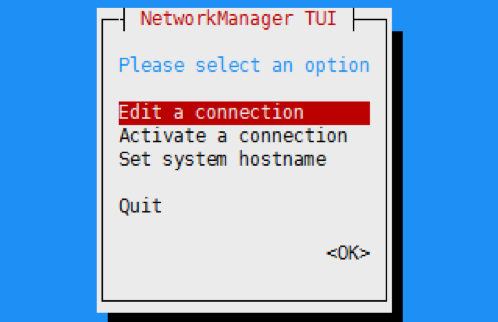
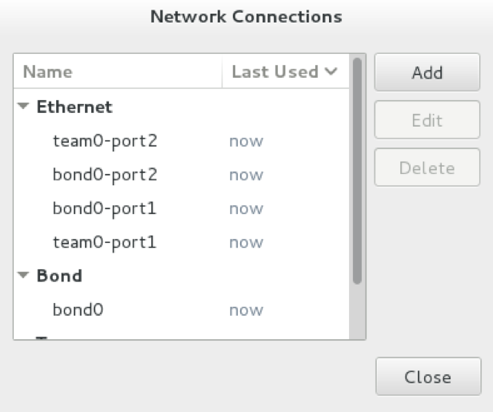

## Hostname & NetWork
### 基础知识
* NetworkManager
    - 现时，几乎所有主机都要进行联网和外界通讯，所以在使用Linux的过程中，配置网络是使用人员基本的技能。但是CentOS6和CentOS7的网络配置差距还是有点大，在CentOS7 中采用了NetworkManager 管理网络，这是动态控制及配置网络的守护进程，它用于保持当前网络设备及连接处于工作状态，同时也支持传统的 ifcfg 类型的配置文件。
    - NetworkManager 可以用于以下类型的连接：Ethernet，VLANS，Bridges，Bonds，Teams等等。
    - Hostname是每个主机的独立标识，尤其是在同一个局域网内，主机名切记不要发生重复，尽可能的使用唯一的标识没标志每一个独立的系统。
    - 大规模的生产环境中也会使用主机名明规范，区分不同区域和不同业务。
### Network指令
* 通常使用令行工具 nmcli 来控制 NetworkManager。

        nmcli用法，可以使用TAB键补全
        nmcli [ OPTIONS ] OBJECT { COMMAND | help }
* 显示所有设备和连接状态

        [root@localhost ~]# nmcli device 
        DEVICE   TYPE      STATE      CONNECTION 
        enp0s10  ethernet  connected  enp0s10    
        ……
        lo       loopback  unmanaged  --   
* 显示当前活动连接

        [root@localhost ~]# nmcli connection show -a
        NAME     UUID                                  TYPE            DEVICE  
        enp0s3   c3c88292-09eb-4f02-ae4c-40f217770583  802-3-ethernet  enp0s3  
        …….
        enp0s8   4edd126f-cc55-4edb-a82d-dbfe45d3adcc  802-3-ethernet  enp0s8  

* 列出NM识别出的设备和状态

        [root@localhost ~]# nmcli device status
        DEVICE   TYPE      STATE      CONNECTION 
        enp0s10  ethernet  connected  enp0s10    
        ……
        lo       loopback  unmanaged  --      

### 启动/停止 网络

* 连接网络

        #nmcli device connect enp0s10

* 断开网络

        # nmcli device disconnect enp0s10

### 配置以太网静态IP
* 配置静态IP

        [root@localhost ~]# nmcli connection add type ethernet con-name TEST ifname enp0s10 ip4 192.168.56.170 gw4 192.168.56.1 
        Connection 'TEST' (23e5e914-f9c7-4fb8-9714-a41482643f13) successfully added.
        Con-name 自定义名称，ifname为网卡名称。

* 修改DNS
        
        #nmcli connection modify TEST ipv4.dns "192.168.56.2"

* 启动新网络配置
        
        #nmcli connection up TEST ifname enp0s10

* 查看配置信息
        
        #nmcli -p connection show TEST
        Activate connection details (23e5e914-f9c7-4fb8-9714-a41482643f13)
        ===============================================================================
        GENERAL.NAME:                           TEST
        GENERAL.UUID:                           23e5e914-f9c7-4fb8-9714-a41482643f13
        GENERAL.DEVICES:                        enp0s10
        GENERAL.STATE:                          activated
        GENERAL.DEFAULT:                        yes
        GENERAL.DEFAULT6:                       no
        GENERAL.VPN:                            no
        GENERAL.ZONE:                           --
        GENERAL.DBUS-PATH:                      /org/freedesktop/NetworkManager/ActiveConnection/4
        GENERAL.CON-PATH:                       /org/freedesktop/NetworkManager/Settings/4
        GENERAL.SPEC-OBJECT:                    /
        GENERAL.MASTER-PATH:                    --
        -------------------------------------------------------------------------------
        IP4.ADDRESS[1]:                         192.168.56.170/32
        IP4.GATEWAY:                            192.168.56.1
        IP4.ROUTE[1]:                           dst = 192.168.56.1/32, nh = 0.0.0.0, mt = 100
        IP4.DNS[1]:                             192.168.56.2
        -------------------------------------------------------------------------------

### 配置DHCP启动

        #nmcli connection add type ethernet con-name TEST ifname enp0s10
## 实用网络指令
* 查看IP配置信息

        [root@localhost ~]# ip addr show
        ………
        2: enp0s3: <BROADCAST,MULTICAST,UP,LOWER_UP> mtu 1500 qdisc pfifo_fast state UP qlen 1000
            link/ether 08:00:27:3e:e3:42 brd ff:ff:ff:ff:ff:ff
        inet 192.168.56.104/24 brd 192.168.56.255 scope global dynamic enp0s3
            valid_lft 969sec preferred_lft 969sec
            inet6 fe80::a00:27ff:fe3e:e342/64 scope link 
            valid_lft forever preferred_lft forever
        …….
* 显示网络统计信息

        [root@localhost ~]# ip -s link show enp0s10
        5: enp0s10: <BROADCAST,MULTICAST,UP,LOWER_UP> mtu 1500 qdisc pfifo_fast state UP mode DEFAULT qlen 1000
            link/ether 08:00:27:25:6f:93 brd ff:ff:ff:ff:ff:ff
            RX: bytes  packets  errors  dropped overrun mcast   
            283786     2597     0       0       0       30     
            TX: bytes  packets  errors  dropped carrier collsns 
            83197      719      0       0       0       0      

* 显示路由信息

        [root@localhost ~]# ip route
        default via 192.168.56.1 dev enp0s10  proto static  metric 100 
        192.168.56.0/24 dev enp0s3  proto kernel  scope link  src 192.168.56.104 
        ……
        192.168.56.0/24 dev enp0s9  proto kernel  scope link  src 192.168.56.102  metric 100 
        192.168.56.1 dev enp0s10  proto static  scope link  metric 100

* 验证路由可访问

        [root@localhost ~]# ping -c3 192.168.56.102
        PING 192.168.56.102 (192.168.56.102) 56(84) bytes of data.
        64 bytes from 192.168.56.102: icmp_seq=1 ttl=64 time=0.051 ms

* 显示www.baidu.com之间的所有跃点数

        [root@localhost ~]# tracepath www.baidu.com
        1?: [LOCALHOST]                                         pmtu 1500
        1:  localhost                                             0.514ms
        ……

* 显示本地监听

        [root@localhost ~]# ss -lt
        State       Recv-Q Send-Q      Local Address:Port    Peer Address:Port   
        LISTEN      0         128            *:ssh                *:*       
        ……    
        参数：l 标识监听，t标识TCP，u标识udp
        也可以实用netstat –an 来进行查看

### Nmcli命令表

|命令|用途|
|:---|:----|
|Nmcli dev status|列出所有设备|
|Nmcli con show|列出所有连接|
|Nmcli con up |激活连接|
|Nmcli con down |取消激活连接|
|Nmcli dev dis |中断接口，禁用自动连接|
|Nmcli net off|禁用所有管理的接口|
|Nmcli con add |添加新连接|
|Nmcli con mod |修改连接|
|Nmcli con del |删除连接|
>更多详细参数，请参考nmcli帮助手册

## 修改网络配置文件
* 很多时候我们记不住复杂的命令，不过没关系，你记住配置文件位置也可以达到一样的效果，网络配置文件在”/etc/sysconfig/network-scripts/ifcfg-<name>”,启动<name>为网络设备名称，例如enp0s10,配置文件为 ifcfg-enp0s10

|静态配置|动态配置|任意|
|:---|:----|:---|
|BOOTPROTO=none IPADDR=192.168.56.102 PREFIX=24 GATEWAY0=192.168.56.2 DEFROUTE=yes DNS1=192.168.56.1|BOOTPROTO=dhcp|DEVICE=enp0s10 NAME=”System enp0s10” ONBOOT=yes UUID=g7834dee34…… USERCTL=yes|

* 编辑好配置文件以后，使用来进行重读配置和关闭开启网络：

        #nmcli con reload
        #nmcli con down “System enp0s10”
        #nmcli con up “System enp0s10”

* DNS配置可以写道网卡配置文件中，可以写道/etc/resolv.conf中

        [root@localhost ~]# vim /etc/resolv.conf
        # Generated by NetworkManager
        nameserver 200.198.0.1
        nameserver 202.106.196.115

## 添加、删除路由条目
* 添加、删除临时路由

> 所谓临时路由，就是意味着我们下次启动，这条路由就是失效，可以暂时设置作为权宜之计，但是并不推荐上生产。

        1.	显示路由信息
        [root@localhost ~]# ip route show
        default via 10.0.5.2 dev enp0s10  proto static  metric 100 
        10.0.5.0/24 dev enp0s10  proto kernel  scope link  src 10.0.5.15  metric 100 
        192.168.56.0/24 dev enp0s8  proto kernel  scope link  src 192.168.56.103

        2.	添加静态路由
        [root@localhost ~]# ip route add 194.1.67.0/24 via 10.0.5.15 dev enp0s10
        [root@localhost ~]# ip route show
        default via 10.0.5.2 dev enp0s10  proto static  metric 100 
        10.0.5.0/24 dev enp0s10  proto kernel  scope link  src 10.0.5.15  metric 100 
        …….
        194.1.67.0/24 via 10.0.5.15 dev enp0s10
        3.	删除静态路由
        [root@localhost ~]# ip route del 194.1.67.0/24

* 添加、删除永久路由
> 万物归根，所有的配置还是要落实到配置文件上才行。
        
        1.	添加路由
        #vim /etc/sysconfig/network-scripts/route-enp0s10
        192.1.167.0/24  via   10.0.5.15    dev    enp0s10
        //路由网段          本机网卡IP         对应接口
        2.	生效路由，已经生效但是ip route 无法显示，重启之后会看到
        #nmcli dev disconnect enp0s10 && nmcli dev connect enp0s10
        3.	删除静态路由
        [root@localhost ~]# ip route del 194.1.167.0/24
            最好是删除配置文件，来清除网络路由。

## 主机名
* 修改主机名
        
        1. Hostname命令显示或者临时修改主机名
        [root@localhost ~]# hostname
        Localhost
        2. 修改配置文件更改主机名,重启系统生效
        [root@localhost ~]# cat /etc/hostname 
        localhost.localdomain
        3. 也可以实用hostnamectl 来修改主机名
        [root@localhost ~]# hostnamectl set-hostname Centos7.book
        [root@localhost ~]# hostnamectl status
        Static hostname: centos7.book
        Pretty hostname: Centos7.book
        ……
        Operating System: CentOS Linux 7 (Core)
            CPE OS Name: cpe:/o:centos:centos:7
                    Kernel: Linux 3.10.0-229.el7.x86_64
            Architecture: x86_64

* 添加主机名和IP对应关系
> 在生产中，通常会将和本机常联系的主机IP和主机名对应关系写道配置文件中，这样在其他应用调用系统IP和域名信息的时候可以快速响应，如果你走DNS的去解析的话也可以，但是你不觉得费时么？还有可能是DNS故障导致很多问题。

        [root@localhost ~]# cat /etc/hosts
        127.0.0.1   localhost localhost.localdomain localhost4 localhost4.localdomain4
        ::1         localhost localhost.localdomain localhost6 localhost6.localdomain6
        192.168.56.11   dbdata
        192.168.56.12   APPserver

## 网络配置实例
* 合作模式
    * 网络合作是一种以逻辑方式将NIC链接到一起，实现故障转移或者提高吞吐量的方法，这是新的模式，不影响早期内核中更早的绑定程序；只是作为备选实施。网络模式是模块化设计，可以用更强的扩展性。
    * CentOS 7 使用一个小内核驱动程序和一个用户控件守护进程teamd来进行实施网络合作。内核可以高效的处理网络包，而teamd负责裸机和接口处理。
* Teamd提供如下方式：
    * Broadcast  传输来自搜有端口的每个包
    * Roundrobin  以轮循方式传输每个数据包
    * Activebackup  故障转移
    * Loadbalance   运用哈希函数尝试在为包传输选择端口时达到完美均衡

### team配置方法
* 首先删除网卡原有配置，才可以继续配置

        #nmcli connection delete enp0s8 
        #nmcli connection delete enp0s9

* 创建team0
 
        [root@centos7 ~]# nmcli con add type team con-name team0 ifname team0 config '{"runner":{"name":"activebackup"}}'
        Connection 'team0' (f51c93a9-7c10-4439-991e-1952dcbf2455) successfully added.
* 定义team0的ip设置，静态ip 192.168.56.170/24

        [root@centos7 ~]# nmcli connection mod team0 ipv4.address '192.168.56.170/24'
        [root@centos7 ~]# nmcli con mod team0 ipv4.method manual

* Team0分配网卡，分别对应port1和port2

        [root@centos7 ~]# nmcli connection add type team-slave con-name team0-port1 ifname enp0s8 master team0 
        Connection 'team0-port1' (bb6fb253-c286-4404-a0bc-8565df878001) successfully added.

        [root@centos7 ~]# nmcli connection add type team-slave con-name team0-port2 ifname enp0s9 master team0  
        Connection 'team0-port2' (3ed2be7c-176e-48f7-b1da-8df19b57406f) successfully added.

* 检查系统合作端口状态

        [root@centos7 ~]# teamdctl team0 state
        setup:
        runner: activebackup
        ports:
        enp0s8
            link watches:
            link summary: up
            instance[link_watch_0]:
                name: ethtool
                link: up
        enp0s9
            link watches:
            link summary: up
            instance[link_watch_0]:
                name: ethtool
                link: up
        runner:
        active port: enp0s8

* ping测试

        [root@centos7 ~]# ping 192.168.56.101
        PING 192.168.56.101 (192.168.56.101) 56(84) bytes of data.
        64 bytes from 192.168.56.101: icmp_seq=1 ttl=64 time=0.027 ms
        64 bytes from 192.168.56.101: icmp_seq=2 ttl=64 time=0.047 ms
        64 bytes from 192.168.56.101: icmp_seq=3 ttl=64 time=0.039 ms
* 关闭网卡enp0s8，查看对合作模式影响

        [root@centos7 ~]# nmcli dev disconnect  enp0s8
        Device 'enp0s8' successfully disconnected.
        [root@centos7 ~]# teamdctl team0 state
        setup:
        runner: activebackup
        ports:
        enp0s9
            link watches:
            link summary: up
            instance[link_watch_0]:
                name: ethtool
                link: up
        runner:
        active port: enp0s9   //运行在9网卡上了
* 再次启动接口

        [root@centos7 ~]# nmcli device connect enp0s8 
        Device 'enp0s8' successfully activated with 'a2f28e6f-44f5-442e-81a2-5e53f47b9749'.
        [root@centos7 ~]# teamdctl team0 state
        setup:
        runner: activebackup
        ports:
        enp0s8
            link watches:
            link summary: up
            instance[link_watch_0]:
                name: ethtool
                link: up
        enp0s9
            link watches:
            link summary: up
            instance[link_watch_0]:
                name: ethtool
                link: up
        runner:
        active port: enp0s9  //8网卡起来了，但是没有切换到8运行，防止网络抖动频繁奇幻

* 配置文件修改范本

        [root@centos7 ~]# cat /etc/sysconfig/network-scripts/ifcfg-team0
        DEVICE=team0
        TEAM_CONFIG="{\"runner\":{\"name\":\"activebackup\"}}"
        DEVICETYPE=Team
        BOOTPROTO=none
        DEFROUTE=yes
        IPV4_FAILURE_FATAL=no
        IPV6INIT=yes
        IPV6_AUTOCONF=yes
        IPV6_DEFROUTE=yes
        IPV6_FAILURE_FATAL=no
        NAME=team0
        UUID=ad1d8d33-81cd-4fb6-9adf-9a9e3d01359e
        ONBOOT=yes
        IPADDR=192.168.56.170
        PREFIX=24
        IPV6_PEERDNS=yes
        IPV6_PEERROUTES=yes

* 配置文件修改范本-网卡

        [root@centos7 ~]# cat /etc/sysconfig/network-scripts/ifcfg-team0-port1 
        NAME=team0-port1
        UUID=a2f28e6f-44f5-442e-81a2-5e53f47b9749
        DEVICE=enp0s8
        ONBOOT=yes
        TEAM_MASTER=team0
        DEVICETYPE=TeamPort
        [root@centos7 ~]# cat /etc/sysconfig/network-scripts/ifcfg-team0-port2
        NAME=team0-port2
        UUID=8543f9a3-2c6b-44fa-8748-dde2a3f4283d
        DEVICE=enp0s9
        ONBOOT=yes
        TEAM_MASTER=team0
        DEVICETYPE=TeamPort

* Teamd 常用指令

|命令|用途|
|:---|:----|
|teamnl team0 ports|显示team0接口组状态|
|teamnl team0 getoption activeport|显示team0当前活动接口|
|teamdctl team0 state|显示team0接口当前状态|
|teamdctl team0 config dump|显示team0的当前JSON配置|

### 网桥

* 网桥是一个链路层设备，基于MAC地址在网络之间转发流量。通过构建MAC地址表，然后根据该表做出包转发决策。我们可以在Linux环境中使用软网桥模拟仿真硬件网桥设备。最常见的是用在虚拟化中，多个虚拟网卡共享一个硬件网卡。

* 删除已有网卡配置

        [root@centos7 ~]# nmcli connection delete enp0s3 
        [root@centos7 ~]# nmcli connection delete enp0s10

* 配置网桥（持久）

        [root@centos7 ~]# nmcli connection add type bridge con-name br0 ifname br0 ip4 192.168.56.110 gw4 192.168.56.1 
        Connection 'br0' (19548cb9-84bf-43e3-8524-d1f38010c12b) successfully added.
        [root@centos7 ~]# nmcli connection add type bridge-slave con-name br0-port1 ifname enp0s3 master br0
        Connection 'br0-port1' (7c28a220-c81b-4832-95f4-cc5f4a3c2f36) successfully added.

        [root@centos7 ~]# nmcli connection add type bridge-slave con-name br0-port2 ifname enp0s10 master br0
        Connection 'br0-port2' (66171261-706a-477c-925b-1e308c5a5255) successfully added.

* 查看网桥

        [root@centos7 ~]# brctl show
        bridge name	bridge id		STP enabled	interfaces
        br0		8000.080027256f93	yes		enp0s10
                                            enp0s3
        [root@centos7 ~]# nmcli device show br0
        GENERAL.DEVICE:                         br0
        GENERAL.TYPE:                           bridge
        GENERAL.HWADDR:                         08:00:27:25:6F:93
        GENERAL.MTU:                            1500
        GENERAL.STATE:                          100 (connected)
        GENERAL.CONNECTION:                     br0
        GENERAL.CON-PATH:                       /org/freedesktop/NetworkManager/ActiveConnection/31
        IP4.ADDRESS[1]:                         192.168.56.111/24
        以及其他nmcli指令均可查看更详细信息
> 所有配置文件依然在/etc/sysconfig/network-scripts下，有兴趣的可以去看一下，记一下配置文件的写法，也可以通过修改配置文件来生效所需要修改的配置。

### bond
* 网卡绑定实际和上面的合作模式差不多，都有负载模式和主备模式等等，生产中用的也比较多，大多是在做主备模式，所以这里就简单的说说CentOS7下创建bond0的主备模式。

* 创建bond

        [root@centos7 ~]# nmcli connection add type bond con-name bond0 ifname bond0 mode active-backup miimon 100 ip4 192.168.56.66/24
        Connection 'bond0' (798c18a6-3a7b-430a-af06-5a83b7777119) successfully added.
        [root@centos7 ~]# nmcli connection add type bond-slave con-name bond0-port1 ifname enp0s3 master bond0
        [root@centos7 ~]# nmcli connection add type bond-slave con-name bond0-port2 ifname enp0s10 master bond0

* 查看bond
        
        [root@centos7 ~]# cat /proc/net/bonding/bond0 
        Ethernet Channel Bonding Driver: v3.7.1 (April 27, 2011)

        Bonding Mode: fault-tolerance (active-backup)
        Primary Slave: None
        Currently Active Slave: enp0s3
        MII Status: up
        MII Polling Interval (ms): 100
        Up Delay (ms): 0
        Down Delay (ms): 0

        Slave Interface: enp0s3
        MII Status: up
        Speed: 1000 Mbps
        Duplex: full
        Link Failure Count: 0
        Permanent HW addr: 08:00:27:3e:e3:42
        Slave queue ID: 0

        Slave Interface: enp0s10
        MII Status: up
        Speed: 1000 Mbps
        Duplex: full
        Link Failure Count: 0
        Permanent HW addr: 08:00:27:25:6f:93
        Slave queue ID: 0
        Nmcli指令同样可以查看更多配置信息，上面我是在proc下查看当前生效的bond配置。

### 图形化配置
* 如果你觉得这些命令和配置文件让你很烦，不能完成任务，那么你可以选择以下简便方式完成配置。

* nmtui

* nmtui-connection-editor

## 总结
* 配置文件中，GATEWAY可以有多个，第一个是GATEWAY0，其次GATEWAY1，….尾号最大有效。
* 所有网络配置的文件在/etc/sysconfig/network-scripts 目录里，一定要熟记配置文件写法。 
* 网络配置技能是基础技能，CentOS7 采用了全新配置模式，但是你依然可以使用配置文件的编辑来完成配置。

