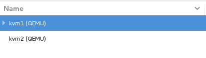

# 虚拟化（KVM）
虚拟化概念很早就已出现。简单来说，虚拟化就是使用某些程序，并使其看起来类似于其他程序的过程。将这个概念应用到计算机系统中可以让不同用户看到不同的单个系统（例如，一台计算机可以同时运行多个Linux和Windows）。
## KVM服务介绍
KVM是Kernel-based Virtual Machine的简写，是一个开源的系统虚拟化软件，基于硬件虚拟化扩展（Intel VT-X 和 AMD-V）和 QEMU 的修改版，是基于硬件的完全虚拟化。其设计目标是在需要引导多个未改动的 PC 操作系统时支持完整的硬件模拟。相比xen虚拟化，KVM的优点是高性能, 稳定, 无需修改客户机系统和大量的其它功能(比如. 可使用linux调度器).
## KVM原理
* KVM 所使用的方法是通过简单地加载内核模块而将 Linux 内核转换为一个系统管理程序。这个内核模块导出了一个名为 /dev/kvm 的设备，它可以启用内核的客户模式（除了传统的内核模式和用户模式）。有了 /dev/kvm 设备，VM 使自己的地址空间独立于内核或运行着的任何其他 VM 的地址空间。设备树（/dev）中的设备对于所有用户空间进程来说都是通用的。但是每个打开 /dev/kvm 的进程看到的是不同的映射（为了支持 VM 间的隔离）。
* KVM 然后会简单地将 Linux 内核转换成一个系统管理程序（在安装 kvm 内核模块时）。由于标准 Linux 内核就是一个系统管理程序，因此它会从对标准内核的修改中获益良多（内存支持、调度程序等）。对这些 Linux 组件进行优化（例如 2.6 版本内核中的新 O(1) 调度程序）都可以让系统管理程序（主机操作系统）和 Linux 客户操作系统同时受益。但是 KVM 并不是第一个这样做的程序。UML 很久以前就将 Linux 内核转换成一个系统管理程序了。使用内核作为一个系统管理程序，您就可以启动其他操作系统，例如另一个 Linux 内核或 Windows 系统。
* 安装 KVM 之后，您可以在用户空间启动客户操作系统。每个客户操作系统都是主机操作系统（或系统管理程序）的一个单个进程。 下图提供了一个使用 KVM 进行虚拟化的视图。底部是能够进行虚拟化的硬件平台（目前指的是 Intel VT 或 AMD-SVM 处理器）。在裸硬件上运行的是系统管理程序（带有 KVM 模块的 Linux 内核）。这个系统管理程序与可以运行其他应用程序的普通 Linux 内核类似。但是这个内核也可以支持通过 kvm 工具加载的客户操作系统。最后，客户操作系统可以支持主机操作系统所支持的相同应用程序。

    

* 系统管理程序之上是客户机操作系统，也称为虚拟机（VM）。这些 VM 都是一些相互隔离的操作系统，将底层硬件平台视为自己所有。但是实际上，是系统管理程序为它们制造了这种假象。
* 记住 KVM 只是虚拟化解决方案的一部分。处理器直接提供了虚拟化支持（可以为多个操作系统虚拟化处理器）。内存可以通过 kvm 进行虚拟化（这在下一节中将会讨论）。最后，I/O 通过一个稍加修改的 QEMU 进程（执行每个客户操作系统进程的一个拷贝）进行虚拟化。
* KVM 向 Linux 中引入了一种除现有的内核和用户模式之外的新进程模式。这种新模式就称为客户 模式，顾名思义，它用来执行客户操作系统代码（至少是一部分代码）。回想一下内核模式表示代码执行的特权模式，而用户模式则表示非特权模式（用于那些运行 在内核之外的程序）。根据运行内容和目的，执行模式可以针对不同的目的进行定义。客户模式的存在就是为了执行客户操作系统代码，但是只针对那些非 I/O 的代码。在客户模式中有两种标准模式，因此客户操作系统在客户模式中运行可以支持标准的内核，而在用户模式下运行则支持自己的内核和用户 空间应用程序。客户操作系统的用户模式可以用来执行 I/O 操作，这是单独进行管理的。
* 在客户操作系统上执行 I/O 的功能是由 QEMU 提供的。QEMU 是一个平台虚拟化解决方案，允许对一个完整的 PC 环境进行虚拟化（包括磁盘、图形适配器和网络设备）。客户操作系统所生成的任何 I/O 请求都会被中途截获，并重新发送到 QEMU 进程模拟的用户模式中。
* KVM 通过 /dev/kvm 设备提供了内存虚拟化。每个客户操作系统都有自己的地址空间，并且是在实例化客户操作系统时映射的。映射给客户操作系统的物理内存实际上是映射给这个进程 的虚拟内存。为了支持客户物理地址到主机物理地址的转换，系统维护了一组影子页表（shadow page table）。处理器也可以通过在访问未经映射的内存位置时使用系统管理程序（主机内核）来支持内存转换进程。

## QEMU和KVM的关系
* 现在所说的虚拟化，一般都是指在CPU硬件支持基础之上的虚拟化技术。KVM也同hyper-V、Xen一样依赖此项技术。没有CPU硬件虚拟化的支持，KVM是无法工作的。
* 准 确来说，KVM是Linux的一个模块。可以用modprobe去加载KVM模块。加载了模块后，才能进一步通过其他工具创建虚拟机。但仅有KVM模块是 远远不够的，因为用户无法直接控制内核模块去作事情：还必须有一个用户空间的工具才行。这个用户空间的工具，开发者选择了已经成型的开源虚拟化软件 QEMU。说起来QEMU也是一个虚拟化软件。它的特点是可虚拟不同的CPU。比如说在x86的CPU上可虚拟一个Power的CPU，并可利用它编译出 可运行在Power上的程序。KVM使用了QEMU的一部分，并稍加改造，就成了可控制KVM的用户空间工具了。所以你会看到，官方提供的KVM下载有两 大部分三个文件，分别是KVM模块、QEMU工具以及二者的合集。也就是说，你可以只升级KVM模块，也可以只升级QEMU工具。这就是KVM和QEMU 的关系

## Kvm使用
### KVM安装
* KVM 需要有 CPU 的支持（Intel VT 或 AMD SVM）

        [root@CentOS7 ~]# egrep '(vmx|svm)' /proc/cpuinfo
        flags : fpu vme de pse tsc msr pae mce cx8 apic sep mtrr pge mca cmov pat pse36 clflush dts acpi mmx fxsr sse sse2 ss ht tm pbe syscall nx lm constant_tsc arch_perfmon pebs bts rep_good nopl aperfmperf pni dtes64 monitor ds_cpl vmx smx est tm2 ssse3 cx16 xtpr pdcm sse4_1 lahf_lm dts tpr_shadow vnmi flexpriority
* 关闭selinux

        [root@kvm network-scripts]# setenforce 0
        [root@kvm network-scripts]# getenforce
        Permissive
        [root@kvm network-scripts]#vi /etc/selinux/config
        ******************************************
        SELINUX=permissive                                           #修改配置文件使其永久生效
        ******************************************
* 所需要安装软件包

        qemu-kvm 主要的KVM程序包
        python-virtinst 创建虚拟机所需要的命令行工具和程序库
        virt-manager GUI虚拟机管理工具
        virt-top 虚拟机统计命令
        virt-viewer GUI连接程序，连接到已配置好的虚拟机
        libvirt C语言工具包，提供libvirt服务
        libvirt-client 为虚拟客户机提供的C语言工具包
        virt-install 基于libvirt服务的虚拟机创建命令
        bridge-utils 创建和管理桥接设备的工具

        # yum install qemu-kvm libvirt virt-install bridge-utils virt-manager virt-top virt-viewer libvirt-client 
* 启动和查看

        [root@localhost ~]# systemctl start libvirtd;systemctl enable libvirtd
        [root@localhost ~]# systemctl list-unit-files|grep libvirtd
        libvirtd.service                            enabled 
        libvirtd.socket                             static  

### KVM网络设置
* Kvm虚拟机需要和外部网络通讯，那么需要借助于本地的物理网卡来进行桥接，然后才可以和外部网络通讯，让其他主机正常的访问该虚拟机。
* 修改网卡文件，制作网络桥接

        #cd /etc/sysconfig/network-scripts/
        #echo "BRIDGE=br0" >> ifcfg-enp0s3  //修改为当前主机网卡
        ￥vim ifcfg-br0
            DEVICE=br0 
            TYPE="Bridge" 
            BOOTPROTO="dhcp"   //实例为自动获取IP，可以设置为固定ip
            ONBOOT="yes"
            DELAY="0"
        #systemctl restart NetworkManager
        #systemctl restart network
        #ip a
        br0: <BROADCAST,MULTICAST,UP,LOWER_UP> mtu 1500 qdisc noqueue state UP 
            link/ether 08:00:27:45:0b:ad brd ff:ff:ff:ff:ff:ff
        inet 10.0.2.15/24 brd 10.0.2.255 scope global dynamic br0
        …………………
        #brctl show
        bridge name	bridge id		STP enabled	interfaces
        br0		8000.080027450bad	no		enp0s3

### 创建KVM虚拟机
    #mkdir -p /var/kvm/images
    #qemu-img create -f qcow2 /var/kvm/images/centos7.img 120G
    #virt-install  --name centos7.0 --ram 1024 --cdrom=/root/CentOS-7-x86_64-DVD-1503-01.iso --disk path=/var/kvm/images/centos7.img,size=120,format=qcow2 --network bridge=br0 --graphics vnc,listen=0.0.0.0 --noautoconsole --os-type=linux --os-variant=rhel7
>参数表

|参数|解释|
|:---|:---|
|-n|--name= 客户端虚拟机名称
|-r |--ram= 客户端虚拟机分配的内存
|-u |--uuid= 客户端UUID 默认不写时，系统会自动生成
|--vcpus= |客户端的vcpu个数
|-v --hvm |全虚拟化
|-p --paravirt |半虚拟化
|-l --location=localdir |安装源，有本地、nfs、http、ftp几种，多用于ks网络安装
|--vnc |使用vnc ，另有--vnclient＝监听的IP  --vncport ＝VNC监听的端口
|-c --cdrom= |光驱 安装途径
|--disk= |使用不同选项作为磁盘使用安装介质
|-w NETWORK, --network=NETWORK |连接客户机到主机网络 
|-s --file-size= |使用磁盘映像的大小 单位为GB
|-f --file= |作为磁盘映像使用的文件
|--cpuset= |设置哪个物理CPU能够被虚拟机使用
|--os-type=OS_TYPE |针对一类操作系统优化虚拟机配置（例如：‘linux’，‘windows’）
|--os-variant=OS_VARIANT |针对特定操作系统变体（例如’rhel6’, ’winxp’,'win2k3'）进一步优化虚拟机配置
|--host-device=HOSTDEV |附加一个物理主机设备到客户机。HOSTDEV是随着libvirt使用的一个节点设备名（具体设备如’virsh nodedev-list’的显示的结果）
|--accelerate |KVM或KQEMU内核加速,这个选项是推荐最好加上。如果KVM和KQEMU都支持，KVM加速器优先使用。
|-x EXTRA, --extra-args=EXTRA |当执行从"--location"选项指定位置的客户机安装时，附加内核命令行参数到安装程序
|--nographics "virt-install" |将默认使用--vnc选项，使用nographics指定没有控制台被分配给客户机

>可以使用virt-manager或者在Applications > system tools > virtual machine manager 来启动图形界面进行安装
>至于使用图形界面安装就不多说了，简单的很，点来点去的就行了。

## KVM热迁移

* KVM 虚拟化的热迁移需要有NFS或者是glusterfs等共享文件系统的支持，将vm虚拟化磁盘文件放到共享文件上，然后主机节点只负责计算，存储在文件系统上，迁移的时候另外一台kvm host主机直接读取共享文件系统的文件即可。
* 双侧主机互相添加kvm节点链接，Kvm管理器中点击：File > Add Connection 

    

 

>如果未安装软件还请确认并安装必备的kvm软件包

* 添加成功后

    

 

### Nfs share 设置
* 修改配置并挂载

        #vim /etc/exports
        /kvm1 *(rw,sync,no_root_squash)
        # systemctl restart nfs-server.service
        然后2个节点 kvm1 和kvm2 主机分别挂载到/kvm文件夹下
        mount -t nfs 192.168.56.101:/kvm1 /kvm
        一定要关闭selinux
* 系统安装

        virt-install  --name centos7.0 --ram 1024 --cdrom=/root/CentOS-7-x86_64-DVD-1503-01.iso --disk path=/var/kvm/images/centos7.img,size=120,format=qcow2 --network bridge=br0 --graphics vnc,listen=0.0.0.0 --noautoconsole --os-type=linux --os-variant=rhel7
* KVM1主机查看

        virsh # list
        Id    Name                           State
        ----------------------------------------------------
        11    centos7.0                      running

* 迁移
        
        # migrate --live centos7.0 qemu+ssh://kvm2/system  --unsafe
        root@kvm2's password: 
* KVM2主机查看
        virsh # list
        Id    Name                           State
        ----------------------------------------------------
        12    centos7.0                      running

## 常用指令
* kvm克隆一个虚拟机 
        
        [root@nfs data]# virt-clone -o win2003 -n xp1 -f /home/data/xp1.img 
        如果要想克隆虚拟机，原虚拟机必须处于关闭状态
* 显示所有的虚拟机 

        [root@nfs data]# virsh list       ##只显示运行状态下的虚拟机
        [root@nfs data]# virsh list --all##所有的虚拟机，无论是否在工作
* 启动虚拟机
        
        [root@nfs ~]# virsh start vm01          
* 强制关掉宿主机导致宿主机开机后不能启动vm 

        解决方法： 
        [root@nfs ~]# virsh undefine vm01 
        [root@nfs ~]# virsh managedsave-remove  vm01 
        [root@nfs ~]# virsh start vm01
* 删除一个虚拟机vm01 

        [root@nfs qemu]# virsh undefine  vm01 
        [root@nfs qemu]# rm -f /home/data/vm01.img 
* 暂停一个虚拟机，挂起的虚拟机无法正常工作 

        Virsh suspend vm01
        Virsh resume vm01  //恢复一个主机
* 执行一个guest的快照 

        Virsh snapshot-create-as vm01 vm01.snap
        注意vm01的文件格式不能是raw，否则是不支持快照的！ 
* 显示快照 
        
        [root@nfs web01]# virsh snapshot-list web01 
* 删除一个快照： 
        
        [root@nfs web01]# virsh snapshot-delete web01  web01.snap4 
* 启动虚拟机的两种方式： 

        # virsh start MyNewVM
        # virsh create /path/to/MyNewVM.xml
* 关闭和重启

        # virsh shutdown 
        # virsh reboot 
* 查看某个guest的信息： 
        
        [root@nfs init.d]# virsh dominfo nodeA  
* 查看物理机的相关信息： 
        
        [root@nfs init.d]# virsh nodeinfo 
* 生成一个domain的xml文件(配置文件) 
        
        [root@nfs data]# virsh dumpxml nodeA >nodeAback.xml  
* 当前状态保存
        
        Virsh save vm01 vm01_bak.img 
* restore a guest 
        
        Virsh restore vm01_bak.img
* 查看网络配置

        virsh # domiflist centos7.0
        Interface  Type       Source     Model       MAC
        -------------------------------------------------------
        vnet0      bridge     br0        virtio      52:54:00:6c:4d:d8
* 查看磁盘配置

        virsh # domblklist centos7.0
        Target     Source
        ------------------------------------------------
        vda        /kvm/centos7.img
        hda       

## KVM调优
针对于不同的应用，需要对KVM虚拟机进行调优，达到最大化的性能使用。
### CPU Tuning
* 对于物理 CPU，同一个 core 的 threads 共享 L2 Cache，同一个 socket 的 cores 共享 L3 cache，所以虚拟机的 vcpu 应当尽可能在同一个 core 和 同一个 socket 中，增加 cache 的命中率，从而提高性能。
* 实现策略：虚拟机 vcpu 尽可能限定在一个 core 或者一个 socket 中。例如：当 vcpu 为 2 时，2 个 vcpu 应限定在同一个 core 中，当 vcpu 大于 2 小于 12 时，应限定在同一个 socket 中。
        
        <vcpu placement='static' cpuset='0-5'>4</vcpu>       # cpuset 限定 vcpu
### Disk IO Tuning
* kvm 支持多种虚拟机多种 IO Cache 方式：writeback, none, writethrough 等。性能上：writeback > none > writethrough，安全上 writeback < none < writethrough

        <disk type='file' device='disk'>

        <driver name='qemu' type='qcow2' cache='none'/>  # cache 可为 writeback, none, writethrough，directsync，unsafe 等
        ...
        </disk>
### Memory Tuning
* 打开KSM(Kernel Samepage Merging) 
* 页共享早已有之,linux中称之为COW(copy on write)。内核2.6.32之后又引入了KSM。KSM特性可以让内核查找内存中完全相同的内存页然后将他们合并,并将合并后的内存页打上COW标 记。KSM对KVM环境有很重要的意义,当KVM上运行许多相同系统的客户机时,客户机之间将有许多内存页是完全相同的,特别是只读的内核代码页完全可以 在客户机之间共享,从而减少客户机占用的内存资源,从而可以同时运行更多的客户机。 

        Debian系统中KSM默认是关闭的,通过以下命令来开启KSM 
        # echo 1 > /sys/kernel/mm/ksm/run 
        关闭KSM 
        # echo 0 > /sys/kernel/mm/ksm/run 
* 这样设置后,重新启动系统KSM会恢复到默认状态,尚未找个哪个内核参数可以设置在/etc/sysctl.conf中让KSM持久运行。 

        可以在/etc/rc.local中添加 
        echo 1 > /sys/kernel/mm/ksm/run 

* 让KSM开机自动运行 
        
        通过/sys/kernel/mm/ksm目录下的文件来查看内存页共享的情况,pages_shared文件中记录了KSM已经共享的页面数。
### KVM Huge Page Backed Memory 
* 通过为客户机提供巨页后端内存,减少客户机消耗的内存并提高TLB命中率,从而提升KVM性能。x86 CPU通常使用4K内存页,但也有能力使用更大的内存页,x86_32可以使用4MB内存页，x86_64和x86_32 PAE可以使用2MB内存页。x86使用多级页表结构,一般有三级,页目录表->页表->页,所以通过使用巨页,可以减少页目录表和也表对内 存的消耗。当然x86有缺页机制,并不是所有代码、数据页面都会驻留在内存中。
* 允许某个 Guest 开启透明大页

        Guest XML Format
        <memoryBacking>
        <hugepages/>
        </memoryBacking>
        
        echo 25000 > /pro c/sys/vm/nr_hugepages
        mount -t hugetlbfs hugetlbfs /dev/hugepages
        service libvirtd restart
* 允许 Host 中所有 Guest 开启透明大页和内存碎片整理

        透明大页的开启：
        echo always > /sys/kernel/mm/transparent_hugepage/enabled

        内存碎片整理的开启：
        echo always> /sys/kernel/mm/transparent_hugepage/defrag

### Network IO Tuning
* 半虚拟化io设备，针对cpu和内存，kvm全是全虚拟化设备，而针对磁盘和网络，则出现了半虚拟化io设备，目的是标准化guest和host之间数据交换接口，减少交互流程和内存拷贝，提升vm io效率。
* 更改虚拟网卡的类型，由全虚拟化网卡e1000、rtl8139，转变成半虚拟化网卡virtio，virtio需要qemu和vm内核virtio驱动的支持

## 总结：
    1. 以上虚拟机创建和迁移步骤都可以通过图形界面去完成，自行尝试一下，不浪费篇幅截图了。
    2. KVM的虚拟机是企业里较为常用的虚拟化技术，配合openstack使用。
    3. 调优部分深入掌握，有助于在将来生产环境中进行有针对行的系统调节。
    4. 配文文件详解参考附录-KVM配置文件详解
 

