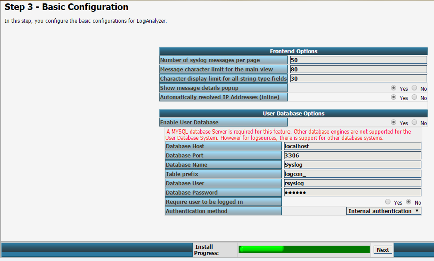
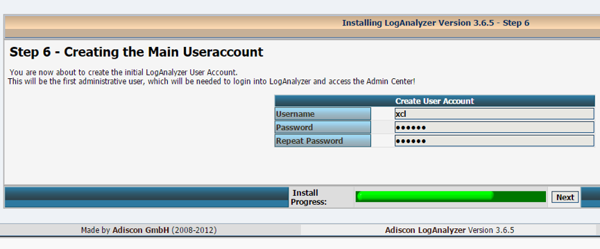
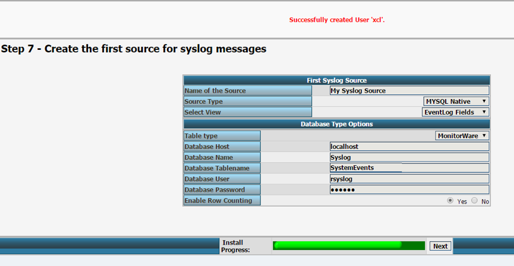

# 集中日志服务器
* 如果生产环境中你所管理的服务器有N，N，N多台主机，不可能要看日志的时候去登录每个主机单独查看，这样不科学，也不环保。如果将相关的日志收集到一台服务器上进行查看，是不是很科学？很环保？
* 这种做法在rsyslog中是天生就支持的，名曰“集中日志模式”，所以好好利用一下，将大大简化你的工作强度。

## 集中服务器架构图


## Server端
打开tcp传输和udp传输接收，编辑如下文件，去掉下面4行的注释.

1. Tcp传输使用 @@
2. Udp传输使用 @
3. 可以只选择一种

```
#vim /etc/rsyslog.conf  

$ModLoad imudp
$UDPServerRun 514

$ModLoad imtcp
$InputTCPServerRun 514
```
* 配置文件中找到如下区域，添加如下：

```
#### GLOBAL DIRECTIVES ####   //区域
$template RemoteLogs,"/var/log/%HOSTNAME%/%PROGRAMNAME%.log" *
*.* ?RemoteLogs
& ~

//$template RemoteLogs，“RemoteLogs” 描述性名称后续可以直接调用该模板（可以更改），模板是在/var/log/下以主机名为单位命名文件夹(%HOSTNAME% 标识主机名)（%PROGRAMNAME% 标识发送日志的服务）。

//符号"& ~"表示了一个重定向规则，rsyslog守护进程停止对日志消息的进一步处理，同时不要在本地写入。如果没有这个重定向规则，那么所有的远程日志都会在写入上述描述的日志文件之外同时又被写入到本地日志文件，这就意味着日志消息实际上被写了两次。
```

* 配置文件中找到如下区域，添加如下:  
>可以注释掉原有的本地信息，定制需要记录并且收集的日志。
```
#### RULES #### //区域

# Log all kernel messages to the console.
# Logging much else clutters up the screen.
#kern.*                                                 /dev/console
# Log anything (except mail) of level info or higher.
# Don't log private authentication messages!
*.info,mail.none,authpriv.none,cron.none 		?RemoteLogs
#*.info;mail.none;authpriv.none;cron.none                /var/log/messages
# The authpriv file has restricted access.
#authpriv.*                                              /var/log/secure
authpriv.*                                              ?RemoteLogs
# Log all the mail messages in one place.
mail.*                                                  -/var/log/maillog
# Log cron stuff
#cron.*                                                  /var/log/cron
cron.*                                                  ?RemoteLogs
```
* 重启rsyslog
```
systemctl restart rsyslog.service
```
* 验证端口启动
```
[root@localhost ~]# netstat -an | grep :514
tcp        0      0 0.0.0.0:514             0.0.0.0:*               LISTEN     
tcp        0      0 192.168.56.101:514      192.168.56.66:57748     ESTABLISHED   
udp        0      0 0.0.0.0:514             0.0.0.0:*                          
```

### 客户端
```
#vim /etc/rsyslog.conf   修改如下格式
# ### begin forwarding rule ###   //转发区域
……
*.* @@192.168.56.101:514
```
* 重启rsyslog
```
systemctl restart rsyslog.service
```

### 验证传输
在客户端随意重新启动一个服务或者ssh连接都可以在服务器上”/var/log/主机名/服务.log”
```
[root@localhost centos7]# pwd
/var/log/centos7
[root@localhost centos7]# ls
CROND.log  rsyslogd.log  sshd.log  systemd.log  systemd-logind.log
```

### 小结

是不是觉得轻快不少了啊，但是这里有一个弊端，就是如果生产机器非常多，要么你在服务端使用SSD或者内存盘来加速读写同时使用双万兆网卡避开网络瓶颈，要不然~~~~！！所有服务器一起写日志的时候就是你的死期！
我的生产环境机器非常多，所以不可能使用全部集中的格式，只能按照区域或者项目多组建几个服务器，每天让各个系统的管理员去查看自己的日志。
但是这个是最后的解放方案么？这些管理员要是能把所管机器日志都看一遍，那也是神了。所以还要继续深入，然后进行使用日志分析工具来进行分析。

## 日志入库
让mysql数据库和rsyslog进行连接，日志直接写入数据库，然后使用日志分析工具进行分析，简化管理员工作量。

## 基础环境配置
>继续在原有的rsyslog的服务器配置mysql和日志分析工具。

1.	安装基础环境
```
安装 LAMP 环境和rsyslog的数据库插件
# yum -y install httpd php*
# yum groupinstall mariadb mariadb-client –y
# yum –y install rsyslog-mysql
```
2.	启动mariadb
```
#systemctl start mariadb
#systemctl enable mariadb
```
3.	确定mariadb启动成功
```
#netstat –an |grep 3306
```
4.	配置数据库
```
#mysqladmin -u root password 123456  //设置密码
[root@centos7 ~]# mysql -u root –p    //登录并查看当前数据库，q退出
Enter password: 
…….
MariaDB [(none)]> show databases;
+--------------------+
| Database           |
+--------------------+
| information_schema |
| mysql              |
| performance_schema |
| test               |
+--------------------+
4 rows in set (0.00 sec)
```
5.	初始化日志数据库
```
[root@centos7 doc]# cd /usr/share/doc/rsyslog-mysql-7.4.7/
[root@centos7 rsyslog-mysql-7.4.7]# mysql -u root -p < createDB.sql 
Enter password: 
```
6.	验证导入sql
```
[root@centos7 rsyslog-mysql-7.4.7]# mysql -u root -p
Enter password: 
…….
MariaDB [(none)]> show databases;
……

MariaDB [(none)]> use Syslog;
……
Database changed

MariaDB [Syslog]> show tables ;
+------------------------+
| Tables_in_Syslog       |
+------------------------+
| SystemEvents           |
| SystemEventsProperties |
+------------------------+
```
7.	数据库授权
```
MariaDB [(none)]> grant all on Syslog.* to rsyslog@localhost identified by '123456';
MariaDB [(none)]>flush privileges;  //重读授权表，即时生效
```
8.	验证LAMP环境
```
[root@centos7 ~]# systemctl restart httpd.service;systemctl enable httpd.service

编写PHP探针页面

[root@localhost contrib]# cd /var/www/html/
[root@localhost html]# cat index.php 
<?php
phpinfo();
?>
```
9. 访问http://IP/index.php,出现如下界面即可，并查找Mysql支持


## 日志服务器配置
```
编辑配置文件/etc/rsyslog.conf修改如下
#### MODULES ####
# The imjournal module bellow is now used as a message source instead of imuxsock.
$ModLoad imuxsock # provides support for local system logging (e.g. via logger command)
$ModLoad imjournal # provides access to the systemd journal
$ModLoad imklog # reads kernel messages (the same are read from journald)
$ModLoad immark  # provides --MARK-- message capability
$ModLoad ommysql    //支持mysql数据库写入
*.* :ommysql:localhost,Syslog,rsyslog,123456   
//数据路地址，库名，用户，密码
# Provides UDP syslog reception
$ModLoad imudp
$UDPServerRun 514

# Provides TCP syslog reception
$ModLoad imtcp
$InputTCPServerRun 514
```
```
#systemctl restart rsyslog.service
```
### 客户端配置
```
# ### begin forwarding rule ###
…………….
*.* @@192.168.56.170:514  //日志服务器IP
# ### end of the forwarding rule ###
```

### 验证日志服务器接收
客户端操作：

    # logger “Client test”

日志服务器：
```
#mysql –u root –p
>use Syslog
>select * from SystemEvents\G;
*************************** 587. row ***************************
                ID: 587
        CustomerID: NULL
        ReceivedAt: 2015-10-28 15:22:45
DeviceReportedTime: 2015-10-28 15:22:41
          Facility: 1
          Priority: 5
          FromHost: Client
           Message:  Client test
```
查看到以上信息说明日志信息可以正常入库

## LogAnalyzer
#### 安装
```
# wget http://download.adiscon.com/loganalyzer/loganalyzer-3.6.5.tar.gz
# tar zxf loganalyzer-3.6.5.tar.gz
# cd loganalyzer-3.6.5
# mkdir -p /var/www/html/loganalyzer
# rsync -a src/* /var/www/html/loganalyzer/
```
#### 配置
1.	打开浏览器访问：http://192.168.56.170/loganalyzer/

>提示没有配置文件，点击 here 利用向导生成。
2.	第一步，测试系统环境

>点击 Next 进入下一步
3.	第二步，生成配置文件

>提示错误：缺少config.php 文件，并且权限要设置为666
```
需要在/var/www/html/loganalyzer/ 下创建config.php 文件，并设置其权限为666。
# touch /var/www/html/loganalyzer/config.php
# chmod 666 /var/www/html/loganalyzer/config.php
```
>操作之后点击“ReCheck”，进入下一步

4.	第三步，基础配置

>在User Database Options 中，填入上面设置的参数，然后点击 Next.
5.	第四步，创建表

6.	第五步，检查SQL结果

7.	第六步，创建管理账户

8.	第七步，创建系统日志

9.	第八步，完成


#### 测试
访问http://192.168.56.170/loganalyzer/index.php页面进行验证

>这就是最后的结果，我们可以看到所有机器发来的日志

## 非syslog日志转发
有时候我们自己开发的应用程序，这样的日志不会通过rsyslog转发到服务器。但是现在我们想通过rsyslog统一的收集这些日志到服务器去分析，所以需要一些手段和自定义配置，主要是靠加载imfile模块来实现。
```
$ModLoad imfile # needs to be done just once 引入模板
# logstash - test - remote send file.
$InputFileName /tmp/test.log #指定监控日志文件
$InputFilePollInterval 10 #指定每10秒轮询一次文件
$InputFileTag logstash-test #指定文件的tag
$InputFileStateFile /var/lib/rsyslog/logstash-test.log #指定状态文件存放位置，如不指定会报错。
$InputFileSeverity info #设置监听日志级别
$InputFileFacility local0 #指定设备
$InputRunFileMonitor #启动此监控，没有此项，上述配置不生效。

*.*                    @@目标ip:端口  #远程发送源tcp协议远程发送
local0.*                    /var/log/test.log
```
```
#systemctl restart rsyslog.service
```
```
[root@localhost rsyslog.d]# cat /root/test.sh 
#!/bin/bash 
for i in {1..100000};
do
echo $i >> /tmp/test.log
sleep 2
done
#bash /root/test.sh
```


利用以上模板对客户端内应用日志进行监控，并将日志文件每十秒扫描一次，发送至远程服务器，可以在远程服务器配置过滤条件，将日志文件进行分级别保存。

在服务器端的/etc/rsyslog.conf里面配置如下信息：
```
#指定使用设备名称和日志级别对系统日志进行过滤，日志文件名是年月日时.log
$template RemoteSyslogfacility-textSys,"/data/log/%syslogfacility-text%/%syslogseverity-text%/%$year%_%$month%_%$day%_%$hour%.log"
:syslogfacility-text, !isequal, "local0" ?RemoteSyslogfacility-textSys

#指定使用设备名称、日志tag信息和日志级别对系统日志进行过滤，日志文件名是年月日时.log
$template RemoteSyslogfacility-textApp,"/data/log/%syslogfacility-text%/%syslogtag%/%syslogseverity-text%/%$year%_%$month%_%$day%_%$hour%.log"
:syslogfacility-text, isequal, "local0" ?RemoteSyslogfacility-textApp
```
>通常不重要的应用日志，如果为了加速写入和响应，可以选择放到RAMDISK中，绝对快，但是内存压力会比较大。同时也要注意清理。
>在分布式的环境中，也可以选择将日志在本地落地，在同步在远程一份，参考如上配置，进行相关改进。
### 小结
以上我们完成了日志信息入库并在页面展示，其实这个页面很强大，可以过滤安全级别，过滤主机日志，查看统计信息等等….自己慢慢发掘吧。