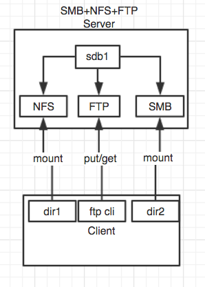
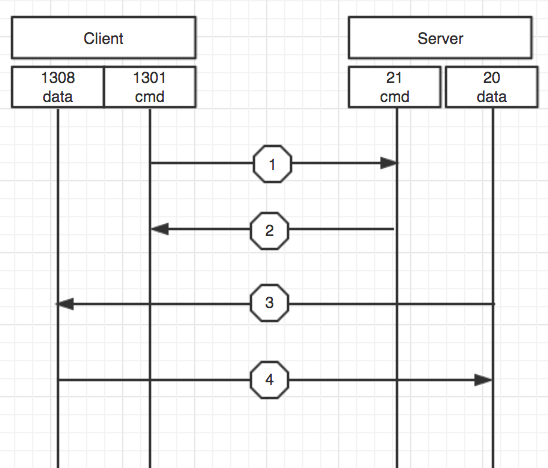
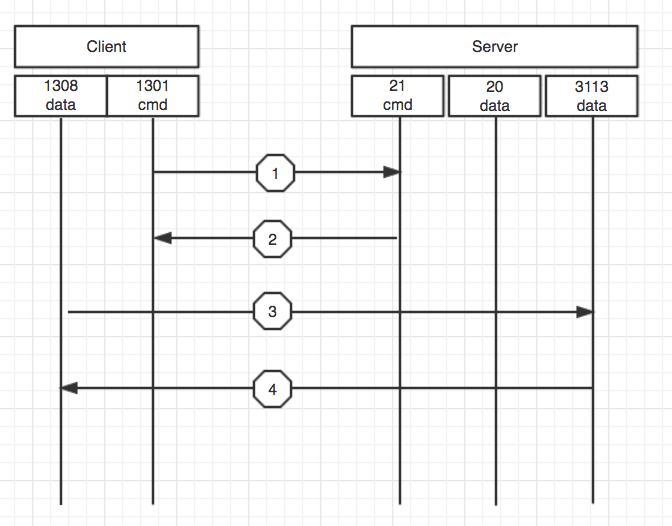

# 网络文件服务

## 1. 基础知识
* 对于一个生产环境而言，配置和启用文件服务器是很有必要的，把重要的数据都集中存储和管理，这样的做法显然要比分别存储在不同的地方要可靠的多。
* 在Linux下常用的方式有3种，分别是：NFS服务器，Samba服务器，ftp服务器。
* ftp的客户可以来自于任何平台，只要你拥有ftp的shell或相对应的ftp客户端即可。
* Samba专门针对windows用户，但是Linux用户也可以使用。
* NFS则是针对Linux/Unix用户的。
### 1.1 一个简单的表格对比如下：
|名称|客户端|常用范围|服务端口|
|---|:----:|:------:|-------|
|FTP|Windows/Linux/Unix/MacOS….|发布网站，文件共享|TCP/21、22、随机|
|Samba|Windows/Linux/Unix|文件共享（网上邻居）|TCP/445,TCP/139|
|NFS|Linux/Unix|发布网站，文件共享|TCP/2049|

### 1.2 本章实例图

### 1.3 试验环境
|系统版本|磁盘数量|网卡数量|ip地址|主机名称|虚拟化|备注|
|:---|:---|:---|:---|:---|:---|:---|
|CentOS 7.4|2Vdisk|1|192.168.56.103|FSN|Vbox|Server|
|CentOS 7.4|2Vdisk|1|192.168.56.104|client|Vbox|client|

### 1.4 测试内容和环境说明
1. 完成NFS配置，实现挂载存取数据
2. 完成SMB配置，实现挂载存取数据
3. 完成FTP配置，实现上传下载数据

## 2. NFS介绍
* NFS是SUN Microsystem公司开发的网络文件系统，它是一种基于远程过程调用（RPC）的分布式文件系统架构。是Linux/Unix之间共享文件的主力军，其吞吐能力要好于samba。

* NFS全称是network file system，NFS允许一个系统在网络上与他人共享目录和文件。通过使用NFS，用户和程序可以像访问本地文件一样访问远端系统上的文件。

* 假如有三台机器A, B, C，它们需要访问同一个目录，目录中都是图片，传统的做法是把这些图片分别放到A, B, C. 但是使用NFS只需要放到A上，然后A共享给B和C即可。访问的时候，B和C是通过网络的方式去访问A上的那个目录的。

### 2.1 NFS的基础概念
* RPC（Remote Procedure Call Protocol远程过程调用协议）：
简单的说是函数调用（远程主机上的函数），一部分功能由本地程序完成，另一部分功能由远程主机上的函数完成。例如，客户端挂载了nfs服务器的文件系统时，进行一些操作，但是这些操作服务端如何知道呢？这可是在内核级别上实现协议。RPC会将客户端的操作的函数调用发送到服务器端，由服务器端执行这些函数调用。

* idmapd：
nfs客户端在挂载文件系统后，在本地以某用户的身份创建了一个文件，在服务器端这个文件的属主和属组将会是哪个用户呢？NFS使用的是idmapd这个服务，由rpc提供，将所有的用户映射为nfsnobody，但是在访问的时候，还是以本地UID对应的本地用户来使用的。

* mounted:
NFS只支持通过IP来控制客户端，而这个功能是由守护进程mounted来实现的，它监听的端口是半随机的。所谓的半随机指的是，这个随机端口是由rpc服务来决定的，而rpc是通过随机的方式。

### 2.2 NFS请求过程
* 在CentOS 7中，NFS服务端监听在tcp和udp的2049端口，服务名是nfs、pc监听于tcp和udp的111号端口，服务名是portmapper。

* 请求过程：
        1. 客户端如果要挂载NFS文件系统，端首先会去与postmapper(tcp/111)端口去注册使用
        2. postmapper会随机分配一个端口给mounted,然后mounted这个守护进程会来验证客户端的合法性
        3. 验证通过后，把请求交给nfs服务，客户端可以挂载使用了
        4. 用户在创建文件时，使用idmapd的守护进程来映射属主
        5. 其实idmapd也是由rpc服务提供的，nfs服务使用到用户映射的功能时，会自动的去调用此守护进程。

### 2.3 NFS配置
* CentOS 7在默认情况下支持NFSV4，并在该版本不可用的情况下自动回退到VFSv3和NFSv2。NFSv4使用TCP协议与服务器进行通信，较早的版本使用TCP或者UDP。
* NFS服务器安装要求安装nfs-utils软件包。此软件包提供了使用NFS将目录共享到客户端必须的所有使用程序。用于NFS服务器配置共享目录的文件为/etc/exports。
* 文件的书写格式如下：
        
        共享目录    客户端  （选项1，选项2） 客户端（选项1，选项2） …  
        示例：
        /mydata   172.16.0.0/16（ro,async,no_root_squash)   www.example.com（ro）

        主机IP地址：例如 192.168.1.10
        网络地址：例如 172.16.0.0/24
        域名表示：例如 www.example.com（指定主机），*.example.com（对应域名下的所有主机）
        *:表示所有的主机

* 常见的选项

|选项|解释|
|:---|:---|
|rw|这个选项允许 NFS 客户机进行读/写访问。缺省选项是只读的。|
|secure|这个选项是缺省选项，它使用了 1024 以下的 TCP/IP 端口实现 NFS 的连接。指定 insecure 可以禁用这个选项。|
|async|异步存储（所有的客户端操作先在内存中缓存，等待cpu空闲的时候写入磁盘）。这个选项可以改进性能，但是如果没有完全关闭 NFS 守护进程就重新启动了 NFS 服务器，这也可能会造成数据丢失。与之相反的是syns，是同步写入磁盘。|
|no_wdelay|这个选项关闭写延时。如果设置了 async，那么 NFS 就会忽略这个选项。|
|nohide|如果将一个目录挂载到另外一个目录之上，那么原来的目录通常就被隐藏起来或看起来像空的一样。要禁用这种行为，需启用 hide 选项。|
|no_subtree_check|这个选项关闭子树检查，子树检查会执行一些不想忽略的安全性检查。缺省选项是启用子树检查。|
|no_auth_nlm|这个选项也可以作为 insecure_locks 指定，它告诉 NFS 守护进程不要对加锁请求进行认证。如果关心安全性问题，就要避免使用这个选项。缺省选项是 auth_nlm 或 secure_locks。|
|mp (mountpoint=path)|通过显式地声明这个选项，NFS 要求挂载所导出的目录。|
|fsid=num|这个选项通常都在 NFS 故障恢复的情况中使用。如果希望实现 NFS 的故障恢复，请参考 NFS 文档|

* 用户映射的选项

|选项|解释|
|:---|:---|
|root_squash|这个选项不允许 root 用户访问挂载上来的 NFS 卷。|
|no_root_squash|这个选项允许 root 用户访问挂载上来的 NFS 卷。|
|all_squash|这个选项对于公共访问的 NFS 卷来说非常有用，它会限制所有的 UID 和 GID，只使用匿名用户。缺省设置是 no_all_squash。|
|anonuid 和 anongid|这两个选项将匿名 UID 和 GID 修改成特定用户和组帐号。|

### 2.4 NFS配置实例
1. 防火墙设置

        关闭防火墙(Server)
        systemctl stop firewalld.service
        禁止防火墙开机自启动
        systemctl disable firewalld.service

        或者添加规则
        # firewall-cmd --add-service=nfs --zone=internal --permanent
        # firewall-cmd --add-service=mountd --zone=internal --permanent
        # firewall-cmd --add-service=rpc-bind --zone=internal --permanent
2. 设置nfsdata目录共享输出

        nfsdata目录挂载的磁盘分区对应/dev/sdb1，别忘记分区后格式化sdb1为ext4文件系统
        [root@FSN ~]# vim /etc/exports
        /nfsdata	*(rw,sync)  //所有人可以读写并同步数据
        如果需要限制用户和添加其他所需参数，参上上述参数列表。

3. 启动和停止NFS服务
        [root@FSN ~]# systemctl start  nfs.service
        [root@FSN ~]# systemctl enable  nfs.service
        [root@FSN ~]# systemctl stop  nfs.service
        [root@FSN ~]# systemctl disable  nfs.service

4. 确认111和2049端口正常开启
        [root@FSN ~]# netstat -anp | grep -E '2049|111'

5. NFS挂载使用

        先使用 showmont -e SER_NAME 来发现服务端的共享的目录
        然后使用mount挂载使用，命令格式：
        mount -t nfs SER_NAME:/data /parth/to/someponit [-o 选项]

        [root@client ~]# mount -t nfs 192.168.56.103:/nfsdata /dir1 -o rsize=4096 -o wsize=4096
        rsize 的值是从服务器读取的字节数。wsize 是写入到服务器的字节数。默认都是1024， 如果使用比较高的值，如8192,可以提高传输速度。

        [root@client ~]# mount | grep nfsdata
        192.168.56.103:/nfsdata on /dir1 type nfs4 (rw,relatime,vers=4.1,rsize=4096,wsize=4096,namlen=255,hard,proto=tcp,port=0,timeo=600,retrans=2,sec=sys,clientaddr=192.168.56.104,local_lock=none,addr=192.168.56.103)

        如果需要开机挂载使用，需要写入/etc/fstab
        192.168.56.103:/nfsdata    /dir1  nfs  defaults   0 0

6. NFS常用指令
        
        showmount是用来查看nfs服务的情况
        用法：
        showmount [ -adehv ] [ --all ] [ --directories ] [ --exports ] [ --help ] [ --version ] [ host ]
        可以使用短选型，也可以使用长选项。
        -a ：这个参数是一般在NFS SERVER上使用，是用来显示已经mount上本机nfs目录的cline机器。   
        -e ：显示指定的NFS SERVER上export出来的目录。

        exportfs:一般用在当NFS服务启动后，使用此命令来控制共享目录的导出
        用法：exportfs [-aruv] 
        -a ：全部mount或者unmount /etc/exports中的内容 
        -r ：重新mount /etc/exports中分享出来的目录 
        -u ：umount目录 
        -v ：在export的时候，将详细的信息输出到屏幕上。
        范例： 
        # exportfs -au 卸载所有共享目录 
        # exportfs -rv 重新共享所有目录并输出详细信息

## nfs小结
nfs没必要搞那么复杂，会设置和使用以及简单的调优在生产中就够用了，如果非要启动特性进行账户和密码验证，那就需要nfsv4的独特支持了，此时再去翻翻资料吧。
换句话说，现在生产中，哪还可能弄个单独节点的NFS在存储数据，就算是平常办公存储数据也很少用到自建的NFS单独节点，但是还是要学习学习，因为很多NAS存储，对外提供的也是NFS，基础的东西还是要知道的。

## 3. Samba介绍
* 复杂的生产环境下并不是只有linux/unix,当然也不是由win server全部占领。往往都是大杂烩，既有Linux/Uinx，也有Windows。而高效的NFS存在一个致命的缺陷，Windows无法访问，所以，linux server提供了其他的文件共享工具Samba！ 
* SMB: Service Message Block
* CIFS: Common Internet File System通用网络文件系统，是windows主机之间共享的协议，samba实现了这个协议，所以可以实现wondows与linux之间的文件共享服务。

### 3.1 Samba服务器配置
1. 安装samba服务器
        
        [root@fsn ~]# yum -y install samba
2. 主要进程：
      
        nmb：实现 NetBIOS协议
        smb：实现cifs协议
3. 主配置文件：
  
       /etc/samba/smb.conf
4. samba用户：
        
        账号：都是系统用户, /etc/passwd
        密码：samba服务自有密码文件
        将系统用户添加为samba的命令：smbpasswd
5. smbpasswd:
  
        -a Sys_User: 添加系统用户为samba用户
        -d ：禁用用户
        -e: 启用用户
        -x: 删除用户
6. 配置文件：
        
        /etc/samba/smb.conf   
        配置文件包括全局设定，特定共享的设定，私有家目录，打印机共享，自定义共享
7. 配置范例
 
        1. 全局配置： 	
        workgroup = MYGROUP  # 工作组
        hosts allow = 127. 192.168.12. 192.168.13. # 访问控制，IP控制
        interfaces = lo eth0 192.168.12.2/24 192.168.13.2/24 # 接口+ip控制

        2. 自定义共享：
        [shared_name] #共享名称
        path = /path/to/share_directory #共享路径
        comment = Comment String # 注释信息
        guest ok = {yes|no} | public = {yes|no} # 是否启用来宾账号
        writable = {yes|no} |  read only = {yes|no} # 共享目录是否可写
        write list = +GROUP_NAME  #
8. 测试配置文件是否有语法错误，以及显示最终生效的配置：  	
        
        testparm
9. 启动samba服务

        [root@fsn ~]# systemctl start smb
        [root@fsn ~]# systemctl enable smb
10. 防火墙配置

        关闭防火墙(Server)
        systemctl stop firewalld.service
        禁止防火墙开机自启动
        systemctl disable firewalld.service

11. 配置范例

        共享一个目录，使用用户名和密码登录后才可以访问，要求可以读写 
        [global] 部分内容如下:  

        [global] 
        workgroup = WORKGROUP 
        server string = Samba Server Version %v 
        security = user 
        passdb backend = tdbsam 
        load printers = yes 
        cups options = raw 

        自定义目录如下：
        [myshare] 
        comment = share for users 
        path = /samba 
        browseable = yes 
        writable = yes 
        public = no 

        创建目录：mkdir /samba
        修改权限：chmod 777 /samba
        创建系统账号：
        useradd user1
        useradd user2
        添加user1/user2为samba账户：
        pdbedit -a user1
        pdbedit -a user2 
        列出samba所有账号: pdbedit –L
        重启服务 systemctl restart smb
12. Windows中samba使用

        在windows中访问Linux的samba服务器，可以直接使用网上邻居或者是使用url来访问，例如192.168.56.103是共享服务器，客户端使用“\\192.168.56.103”来访问

13. Linux中samba使用
 
        交互式数据访问：
        smbclient -L 192.168.56.103 -U user1
        基于挂载的方式访问：
        [root@client ~]# mount -t cifs //192.168.56.103/myshare  /dir2 -o username=user1,password=PASSWORD
        [root@client ~]# mount | grep cifs
        //192.168.56.103/myshare on /dir2 type cifs (rw,relatime,vers=1.0,cache=strict,username=user1,domain=FSN,uid=0,noforceuid,gid=0,noforcegid,addr=192.168.56.103,unix,posixpaths,serverino,mapposix,acl,rsize=1048576,wsize=65536,echo_interval=60,actimeo=1)

## Samba 小结
samba作为简单的理解，会创建共享和挂载即可，生产中也很少使用了，除非是linux对windows，但是samba却有另外一个功能，就是和微软的AD进行结合，如果你生产中，是处于AD的环境，而这个linux需要和AD结合，可以尝试使用samba和winbind。

## 4. FTP介绍
* FTP 是File Transfer Protocol（文件传输协议）的英文简称，而中文简称为 “文传协议” 用于Internet上的控制文件的双向传输。
* FTP的主要作用，就是让用户连接上一个远程计算机（这些计算机上运行着FTP服务器程序）查看远程计算机有哪些文件，然后把文件从远程计算机上拷到本地计算机，或把本地计算机的文件送到远程计算机去。
* 是一种C/S架构，基于套接字通信，用来在两台机器之间相互传输文件。FTP协议用到2种tcp连接：一是命令连接，用于客户端和服务端之间传递命令，监听在tcp/21端口；另一个是数据传输连接，用来传输数据，监听的端口是随机的。
* 在CentOS或者RedHat Linux上有自带的ftp软件叫做vsftpd  

### 4.1 FTP主动
* 在主动模式中，FTP客户端使用一个非分配端口（N>1023）与FTP服务端的21命令端口建立连接，并开始倾听N+1端口，同时通过21端口将N+1端口告诉FTP服务端。FTP服务端获取到客户端告诉它的N+1端口后，使用数据传输的20端口与FTP客户端N+1端口建立连接，从而进行数据传输。

1. FTP客户端通过1031端口（N>1023）与FTP服务端的21端口建立通讯，并告诉FTP服务端它监听的数据传输端口是1038。
2. FTP服务端发送ACK给FTP客户端的1031端口。
3. FTP服务端通过数据端口20端口与FTP客户端1038端口建立连接。
4. FTP客户端传送ACK给FTP服务端以确认建立连接。
 
>所以根据上述描述，站在FTP服务端防火墙的角度，需要开通以下网络关系：

    1. FTP客户端任意端口到FTP服务端21端口。
    2. FTP服务端21端口到FTP客户端的大于1023端口。
    3. FTP服务端20端口到FTP客户端的大于1023端口。
    4. FTP客户端大于1023端口到FTP服务端20端口。

主动模式存在的问题是，在客户端一般都会有防火墙的设置，当服务端与客户端数据进行数据通信时，客户端的防火墙会将服务端的端口挡在外面。此时，通信就会受阻。因此，被动模式就产生了。
### 4.2 FTP被动
* 为了解决主动模式中由于FTP服务端建立连接造成的问题，FTP有另一种模式"被动模式"。
* 在FTP被动模式中，FTP客户端负责创建命令传输和数据传输两条连接，从而解决防火墙拦截FTP服务端建立连接到FTP客户端的问题。当FTP客户端创建FTP连接的时候，FTP客户端会开通随机的两个端口N和N+1（N>1023）。其中，N端口与FTP服务端21端口建立通讯，并发送PASV命令到FTP服务端。FTP服务端接收到PASV命令之后，会随机创建一个端口P（P>1023），并将端口P返回给FTP客户端。FTP客户端拿到P端口后，就会通过N+1端口与P端口建立数据传输连接。

1. FTP客户端与FTP服务端命令传输端口21建立通讯，并传输PASV命令。
2. FTP服务端通过21端口响应FTP客户端1026端口，并告诉FTP客户端它将监听2024端口作为数据传输端口。
3. FTP客户端1027端口与FTP服务端2024端口建立连接。
4. FTP服务端通过2024端口返回ACK确认给FTP客户端1027端口。

>所以根据上述描述，站在FTP服务端防火墙的角度，需要开通以下网络关系：

        1.FTP客户端任意端口到FTP服务端21端口。
        2.FTP服务端21端口到FTP客户端的大于1023端口。
        3.FTP客户端任意端口到FTP服务端的大于1023端口。
        4.FTP服务端大于1023端口到FTP客户端大雨1023端口。

被动模式也会存在防火墙的问题，客户端与服务端传输数据时，在服务端也会有防火墙，但在服务端的防火墙有连接追踪的功能，解决了防火墙的问题。因此，一般使用被动模式比较多。

### 4.3 FTP的用户认证

      FTP支持系统用户，匿名用户，和虚拟用户三种用户认证。
      匿名用户：登陆用户名是anonymous，没有密码
      系统用户：是FTP服务器端的本地用户和对应的密码，默认访问的是用户家目录
      虚拟用户：仅用于访问服务器中特定的资源，常见的虚拟用户认证的方式有使用文件认证或使用数据库进行认证。最终也会将这些虚拟用户同一映射为一个系统用户，访问的默认目录就是这个系统用户的家目录。

### 4.4 FTP配置
1. vsftp主要文件和程序介绍
 
        在CentOS上默认提供的是vsftpd（Very Secure FTP），以安全著称。
        用户认证配置文件：/etc/pam.d/vsftpd      
        服务脚本：/etc/rc.d/init.d/vsftpd      
        配置文件目录：/etc/vsftpd       
        主配置文件：vsftpd.conf       
        匿名用户（映射为ftp用户）共享资源位置：/var/ftp       
        系统用户通过ftp访问的资源的位置：用户自己的家目录       
        虚拟用户通过ftp访问的资源的位置：给虚拟用户指定的映射成为的系统用户的家目录

2. 常见的vsftpd的参数设置

        匿名用户的配置：
        anonymous_enable=YES    ##允许匿名用户登录
        anon_upload_enable=YES     ##允许匿名用户上传文件
        anon_mkdir_write_enable=YES    ##允许匿名用户创建目录
        anon_ohter_write_enable=YES    ##允许其他的写权限（删除目录，文件）

        系统用户的配置：
        local_enable=YES    ##允许本地用户的登录
        write_enable=YES    ##本地用户可写
        local_umask=022    ##本地用户的umask

        禁锢所有的ftp本地用户于其家目录中：
        chroot_local_user=YES      
        #允许本地用户只能访问自己的家目录，不允许访问其他目录，适用于所有的用户

        禁锢指定的ftp本地用户于其家目录中：
        chroot_list_enable=YES
        chroot_list_file=/etc/vsftpd/chroot_list

        目录消息：
        dirmessage_enable=YES 
        ##开启目录提示信息在对应的目录下创建一个.message的文件，里面的内容当我们在访问时此目录时，会看到提示的信息。

        日志：
        xferlog_enable=YES      ##打开传输日志
        xferlog_std_format=YES   ##是否使用标准格式
        xferlog_file=/var/log/xferlog  ##日志文件路径

        改变上传文件的属主：
        chown_uploads=YES
        chown_username=ftpuser ##上传文件后立即改变文件的属主名

        vsftpd使用pam完成用户认证，其用到的pam配置文件：
        pam_service_name=vsftpd   ##用户认证文件，在/etc/pam.d/目录下

        是否启用控制用户登录的列表文件
        userlist_enable=YES
        userlist_deny=YES|NO   ## 为yes的意思是，userlist_file是黑名单文件；是no的意思是userlist_file是白名单文件
        userlist_file=/etc/vsftpd/user_list ##默认文件为/etc/vsftpd/user_list

        连接限制：
        max_clients: 最大并发连接数；
        max_per_ip: 每个IP可同时发起的并发请求数；

        传输速率：
        anon_max_rate: 匿名用户的最大传输速率, 单位是“字节/秒”;
        local_max_rate: 本地用户的最大传输速率, 单位是“字节/秒”;

3. 防火墙配置

        关闭防火墙(Server)
        systemctl stop firewalld.service
        禁止防火墙开机自启动
        systemctl disable firewalld.service

4. FTP配置范例
 
        建立维护网站的ftp服务器
        [root@fsn ~]# yum -y install vsftpd

        账户仅需访问FTP，无需登录系统
        [root@fsn ~]# useradd -s /sbin/nologin webadmin
        [root@fsn ~]# passwd webadmin

        FTP配置文件进行设定
        [root@fsn ~]# vim /etc/vsftpd/vsftpd.conf
        添加如下内容：
        anonymous_enable=NO
        local_enable=YES
        local_root=/var/www/html/
        chroot_list_enable=YES
        chroot_list_file=/etc/vsftpd/chroot_list
        local_enable=YES
        allow_writeable_chroot=YES

        创建chroot_list文件
        [root@fsn ~]# touch /etc/vsftpd/chroot_list
        [root@fsn ~]# vim /etc/vsftpd/chroot_list
        加入账户：
        webadmin

        模拟创建站点目录
        [root@fsn ~]# mkdir -p  /var/www/html
        [root@fsn ~]# chown webadmin.webadmin /var/www/html
        [root@fsn ~]# chmod -R o+w /var/www/html
        [root@fsn ~]# setenforce 0   ##设置selinux为passsive模式

 5. 启动vsftpd服务

        [root@fsn ~]# systemctl restart vsftpd.service

 6. 账户登录验证

        [root@client ~]# ftp 192.168.56.103    ##如果没有ftp指令，安装ftp软件包
        Connected to 192.168.56.103 (192.168.56.103).
        220 (vsFTPd 3.0.2)
        Name (192.168.56.103:root): webadmin
        331 Please specify the password.
        Password:
        230 Login successful.
        Remote system type is UNIX.
        Using binary mode to transfer files.
        ftp> lcd /etc
        Local directory now /etc
        ftp> put hosts
        local: hosts remote: hosts
        227 Entering Passive Mode (192,168,56,103,194,53).
        150 Ok to send data.
        226 Transfer complete.
        158 bytes sent in 8.5e-05 secs (1858.82 Kbytes/sec)
        ftp> ls
        227 Entering Passive Mode (192,168,56,103,180,93).
        150 Here comes the directory listing.
        -rw-r--r--    1 1004     1004          158 Feb 12 02:55 hosts
        -rw-r--r--    1 1004     1004       494662 Feb 12 02:51 messages
        226 Directory send OK.

7. 常见的实现FTP协议的工具
* 服务端：
Linux端：wu-ftpd，pureftp，vsftpd（Centos 6上默认提供的）
windows端：ServU，FileZilla-Server
* 客户端工具：
Linux操作系统：ftp，lftp，lftpget，wget，cul，gftp等
windows操作系统：FileZilla

## FTP小结
FTP环境生产中用的很是很普遍的，需要掌握一下，至于ftp客户端指令，就不再多费篇章去书写了，自行掌握一下.FTP环境在生产多用于系统之间的文件交互和传输备份文件，例如，数据库备份在本地完成后，为了防止主机故障，需要在远程在存放一份备份数据，这个实例就可以使用ftp，当然你可以使用rsync。
这里ftp为什么不多讲，是因为现在很多生产环境都制定一定的合规性，这些合规性其中包括密码的传输规则，而FTP天生的密码明文传输，所以在很多生产环境中使用，也是受到一定限制的。
