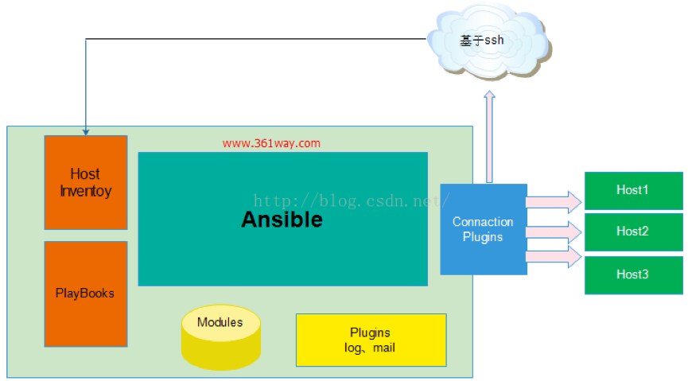
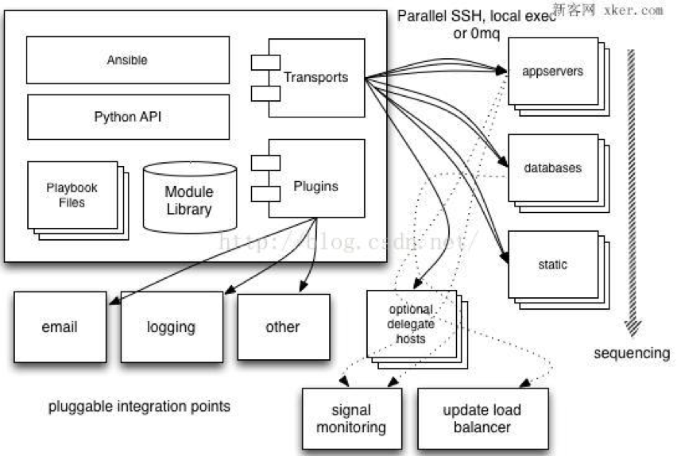

# ansible
## 常用的自动化运维工具
* Puppet
—基于 Ruby 开发，采用 C/S 架构，扩展性强，基于 SSL，远程命令执行相对较弱
* SaltStack
—基于 Python 开发，采用 C/S 架构，相对 puppet 更轻量级，配置语法使用 YMAL，使得配置
脚本更简单
* Ansible
—基于 Python paramiko 开发，分布式，无需客户端，轻量级，配置语法使用 YMAL 及 Jinja2模板语言，更强的远程命令执行操作，Ansible 是一个简单的自动化运维管理工具，可以用来自动化部署应用、配置、编排 task(持续交付、无宕机更新等)，采用 paramiko 协议库（fabric 也使用这个），通过 SSH 或者 ZeroMQ 等连接主机，大概每 2 个月发布一个主版本

## Ansible介绍
ansible 是个什么东西呢？官方的title是“Ansible is Simple IT Automation”——简单的自动化IT工具。这个工具的目标有这么几项：自动化部署APP；自动化管理配置项；自动化的持续交互；自动化的（AWS）云服务管理。所有的这几个目标从本质上来说都是在一个台或者几台服务器上，执行一系列的命令而已。通俗的说就是批量的在远程服务器上执行命令 。当然，最主要的是它是基于 paramiko 开发的。这个paramiko是什么呢？它是一个纯Python实现的ssh协议库。因此fabric和ansible还有一个共同点就是不需要在远程主机上安装client/agents，因为它们是基于ssh来和远程主机通讯的。

* nsible 是一个配置管理和应用部署工具，功能类似于目前业界的配置管理工具 Chef,Puppet,Saltstack。Ansible 是通过 Python 语言开发。Ansible 平台由 Michael DeHaan 创建，他同时也是知名软件 Cobbler 与 Func 的作者。Ansible 的第一个版本发布于 2012 年 2 月。Ansible 默认通过 SSH 协议管理机器，所以 Ansible 不需要安装客户端程序在服务器上。您只需要将 Ansible 安装在一台服务器，在 Ansible 安装完后，您就可以去管理控制其它服务器。不需要为它配置数据库，Ansible 不会以 daemons 方式来启动或保持运行状态。Ansible 可以实现以下目标：
1. 自动化部署应用
2. 自动化管理配置
3. 自动化的持续交付
4. 自动化的（AWS）云服务管理。
>根据 Ansible 官方提供的信息，当前使用 Ansible 的用户有：evernote、rackspace、NASA、Atlassian、twitter 等。

* nsible 是一个配置管理和应用部署工具，功能类似于目前业界的配置管理工具 Chef,Puppet,Saltstack。Ansible 是通过 Python 语言开发。Ansible 平台由 Michael DeHaan 创建，他同时也是知名软件 Cobbler 与 Func 的作者。Ansible 的第一个版本发布于 2012 年 2 月。Ansible 默认通过 SSH 协议管理机器，所以 Ansible 不需要安装客户端程序在服务器上。您只需要将 Ansible 安装在一台服务器，在 Ansible 安装完后，您就可以去管理控制其它服务器。不需要为它配置数据库，Ansible 不会以 daemons 方式来启动或保持运行状态。Ansible 可以实现以下目标：
•	自动化部署应用
•	自动化管理配置
•	自动化的持续交付
•	自动化的（AWS）云服务管理。
>根据 Ansible 官方提供的信息，当前使用 Ansible 的用户有：evernote、rackspace、NASA、Atlassian、twitter 等。
## Ansible 总体架构
Ansible 是一个模型驱动的配置管理器，支持多节点发布、远程任务执行。默认使用 SSH 进行远程连接。无需在被管理节点上安装附加软件，可使用各种编程语言进行扩展。

>上图为ansible的基本架构，从上图可以了解到其由以下部分组成：
•	核心：ansible
•	核心模块（Core Modules）：这些都是ansible自带的模块 
•	扩展模块（Custom Modules）：如果核心模块不足以完成某种功能，可以添加扩展模块
•	插件（Plugins）：完成模块功能的补充
•	剧本（Playbooks）：ansible的任务配置文件，将多个任务定义在剧本中，由ansible自动执行
•	连接插件（Connectior Plugins）：ansible基于连接插件连接到各个主机上，虽然ansible是使用ssh连接到各个主机的，但是它还支持其他的连接方法，所以需要有连接插件
•	主机群（Host Inventory）：定义ansible管理的主机
## Ansible特性
(1)、no agents：不需要在被管控主机上安装任何客户端；
(2)、no server：无服务器端，使用时直接运行命令即可；
(3)、modules in any languages：基于模块工作，可使用任意语言开发模块；
(4)、yaml，not code：使用yaml语言定制剧本playbook；
(5)、ssh by default：基于SSH工作；
(6)、strong multi-tier solution：可实现多级指挥。

## Anslble 优点
(1)、轻量级，无需在客户端安装agent，更新时，只需在操作机上进行一次更新即可；
(2)、批量任务执行可以写成脚本，而且不用分发到远程就可以执行；
(3)、使用python编写，维护更简单，ruby语法过于复杂；
(4)、支持sudo。

## Ansible工作原理

1、管理端支持local 、ssh、zeromq 三种方式连接被管理端，默认使用基于ssh的连接－－－这部分对应基本架构图中的连接模块；
2、可以按应用类型等方式进行Host Inventory（主机群）分类，管理节点通过各类模块实现相应的操作－－－单个模块，单条命令的批量执行，我们可以称之为ad-hoc；
3、管理节点可以通过playbooks 实现多个task的集合实现一类功能，如web服务的安装部署、数据库服务器的批量备份等。playbooks我们可以简单的理解为，系统通过组合多条ad-hoc操作的配置文件 。

## ansible的任务执行流程

（1）读取配置
（2）抓取全量机器&分组列表
       可从多个静态文件、文件夹、脚本中读取机器，分组及其变关联量信息。
（3）使用host-pattern过滤机器列表
（4）根据参数确定执行模块和配置
       从modules目录动态读取，用户可以自行开发模块。
（5）Runner执行返回
       Connection环节定义连接方式 => Action阶段机器列表（Lookup plugin Action变量/文件等资源的获取）
       Callback plugin各阶段的钩子调用
（6）输出结束
       Filter plugin过滤算子
       Callback plugin各阶段的钩子调用

## Ansible 安装
* 环境介绍：
        
        Ansible-MC : 192.168.56.101  (Manager)
        Absible-C1: 192.168.56.102   (Client)

### 前置环境设置：（101 & 102）
1. 设置对应主机名

        101： [root@bogon ~]# hostnamectl set-hostname Ansible-MC
        102： [root@bogon ~]# hostnamectl set-hostname Ansible-C1
2. 关闭防火墙

        101&102： 
        [root@bogon ~]# systemctl stop firewalld.service
        [root@bogon ~]# systemctl disable firewalld.service
3. 关闭Selinux

        101&102：
        [root@bogon ~]# sudo sed -i '/SELINUX/s/enforcing/disabled/' /etc/selinux/config
4. 重启

        101&102：
        [root@bogon ~]#reboot

### 正式安装：（101）
1. 加入yum源

        [root@ansible-mc / ]# rpm -iUvh http://dl.Fedoraproject.org/pub/epel/7/x86_64/e/epel-release-7-8.noarch.rpm

2. Manager安装ansible
        
        [root@ansible-mc /]# yum -y install ansible
3. 检查安装版本

        [root@ansible-mc /]# ansible --version
        ansible 2.1.1.0
        config file = /etc/ansible/ansible.cfg
        configured module search path = Default w/o overrides

### 配置和使用：（101）
1. 设置用于节点鉴权的SSH密钥，在Ansible服务端生成密钥，并且复制公钥到节点中

        [root@ansible-mc /]# ssh-keygen 
        Generating public/private rsa key pair.
        Enter file in which to save the key (/root/.ssh/id_rsa): 
        Created directory '/root/.ssh'.
        Enter passphrase (empty for no passphrase): 
        Enter same passphrase again: 
        Your identification has been saved in /root/.ssh/id_rsa.
        Your public key has been saved in /root/.ssh/id_rsa.pub.
        The key fingerprint is:
        8c:ea:2e:3f:a3:d7:37:3e:f1:5b:c8:d1:4c:5b:a7:b2 root@ansible-mc
        The key's randomart image is:
        +--[ RSA 2048]----+

2. 使用ssh-copy-id命令来复制Ansible公钥到节点中

        [root@ansible-mc /]# ssh-copy-id -i root@192.168.56.102
        The authenticity of host '192.168.56.102 (192.168.56.102)' can't be established.
        ECDSA key fingerprint is 09:79:2c:35:c4:aa:8d:93:5d:f6:46:3a:57:88:70:be.
        Are you sure you want to continue connecting (yes/no)? yes
        /usr/bin/ssh-copy-id: INFO: attempting to log in with the new key(s), to filter out any that are already installed
        /usr/bin/ssh-copy-id: INFO: 1 key(s) remain to be installed -- if you are prompted now it is to install the new keys
        root@192.168.56.102's password: 

        Number of key(s) added: 1

        Now try logging into the machine, with:   "ssh 'root@192.168.56.102'"
        and check to make sure that only the key(s) you wanted were added.
3. 如果不适用SSHkey 可以用如下方法：

        在inventory文件中制定用户名和密码认账
        方法：vim /etc/ansible/hosts添加
        client_host ansibly_ssh_user=root ansible_ssh_pass=password
4. 为Ansible定义节点的清单

        [root@ansible-mc /]# vim /etc/ansible/hosts  (尾部新加如下)
        [Server-test]    
        192.168.56.102

5. 尝试在ansible服务端运行命令

        [root@ansible-mc /]# ansible -m ping "Server-test"
        192.168.56.102 | SUCCESS => {
            "changed": false, 
            "ping": "pong"
        }
或者（配置文件内所有主机）

        [root@ansible-mc /]# ansible all -m ping
        首次执行会检查key，输入yes即可
        [root@ansible-mc /]# ansible all -a '/bin/echo hello'
        The authenticity of host '192.168.56.102 (192.168.56.102)' can't be established.
        ECDSA key fingerprint is 09:79:2c:35:c4:aa:8d:93:5d:f6:46:3a:57:88:70:be.
        Are you sure you want to continue connecting (yes/no)?
又或者禁用检查

        [root@ansible-mc /]# vim /etc/ansible/ansible.cfg   （添加如下配置）
        [defaults]
        host_key_checking = False
        # some basic default values...

6. 尝试在所有节点上执行命令

        [root@ansible-mc /]# ansible all -a '/bin/echo hello'
        192.168.56.102 | SUCCESS | rc=0 >>
        hello

## Ansible命令介绍
Usage: ansible <host-pattern> [options]

|Options|释义|
|:--|:--|
|-m MODULE_NAME, --module-name=MODULE_NAME|要执行的模块，默认为 command
|-a MODULE_ARGS, --args=MODULE_ARGS |模块的参数
|-u REMOTE_USER, --user=REMOTE_USER  |ssh连接的用户名，默认用 root，ansible.cfg 中可以配置
|-k, --ask-pass |提示输入 ssh 登录密码，当使用密码验证登录的时候用
|-s, --sudo |sudo 运行
|-U SUDO_USER, --sudo-user=SUDO_USER|sudo 到哪个用户，默认为 root
|-K, --ask-sudo-pass|提示输入 sudo 密码，当不是 NOPASSWD 模式时使用
|-B SECONDS, --background=SECONDS |run asynchronously, failing after X seconds(default=N/A)
|-P POLL_INTERVAL, --poll=POLL_INTERVAL|set the poll interval if using
|-C, --check |只是测试一下会改变什么内容，不会真正去执行
|-c CONNECTION|连接类型(default=smart)
|-f FORKS, --forks=FORKS |fork 多少个进程并发处理，默认 5
|-i INVENTORY, --inventory-file=INVENTORY |指定 hosts 文件路径，默认 default=/etc/ansible/hosts
|-l SUBSET, --limit=SUBSET |指定一个 pattern，对<host_pattern>已经匹配的主机中再过滤一次
|--list-hosts |只打印有哪些主机会执行这个 playbook 文件，不是实际执行该 playboo
|-M MODULE_PATH, --module-path=MODULE_PATH|要执行的模块的路径，默认为/usr/share/ansible/
|-o, --one-line |压缩输出，摘要输出
|--private-key=PRIVATE_KEY_FILE|私钥路径
|-T TIMEOUT, --timeout=TIMEOUT |ssh 连接超时时间，默认 10 秒
|-t TREE, --tree=TREE |日志输出到该目录，日志文件名会以主机名命名
|-v, --verbose |verbose mode (-vvv for more, -vvvv to enable connection debugging)

## Ansible的7个命令
安装完ansible后，发现ansible一共为我们提供了七个指令：ansible、ansible-doc、ansible-galaxy、ansible-lint、ansible-playbook、ansible-pull、ansible-vault 。这里我们只查看usage部分，详细部分可以通过 "指令 -h"  的方式获取。

1、ansible 

    [root@localhost ~]# ansible -h
    Usage: ansible <host-pattern> [options]
    ansible是指令核心部分，其主要用于执行ad-hoc命令，即单条命令。默认后面需要跟主机和选项部分，默认不指定模块时，使用的是command模块。

2、ansible-doc

    # ansible-doc -h
    Usage: ansible-doc [options] [module...]
    该指令用于查看模块信息，常用参数有两个-l 和 -s ，具体如下：
    //列出所有已安装的模块
    # ansible-doc  -l
    //查看具体某模块的用法，这里如查看command模块
    # ansible-doc  -s command

3、ansible-galaxy

    # ansible-galaxy -h
    Usage: ansible-galaxy [init|info|install|list|remove] [--help] [options] ...
    ansible-galaxy 指令用于方便的从https://galaxy.ansible.com/ 站点下载第三方扩展模块，我们可以形象的理解其类似于centos下的yum、python下的pip或easy_install 。如下示例：
    [root@localhost ~]# ansible-galaxy install aeriscloud.docker
    - downloading role 'docker', owned by aeriscloud
    - downloading role from https://github.com/AerisCloud/ansible-docker/archive/v1.0.0.tar.gz
    - extracting aeriscloud.docker to /etc/ansible/roles/aeriscloud.docker
    - aeriscloud.docker was installed successfully
    这个安装了一个aeriscloud.docker组件，前面aeriscloud是galaxy上创建该模块的用户名，后面对应的是其模块。在实际应用中也可以指定txt或yml 文件进行多个组件的下载安装。
4、ansible-lint
    
    ansible-lint是对playbook的语法进行检查的一个工具。用法是ansible-lint playbook.yml 。
5、ansible-playbook
    
    该指令是使用最多的指令，其通过读取playbook 文件后，执行相应的动作，这个后面会做为一个重点来讲。
6、ansible-pull

    该指令使用需要谈到ansible的另一种模式－－－pull 模式，这和我们平常经常用的push模式刚好相反，其适用于以下场景：你有数量巨大的机器需要配置，即使使用非常高的线程还是要花费很多时间；你要在一个没有网络连接的机器上运行Anisble，比如在启动之后安装。这部分也会单独做一节来讲。
7、ansible-vault

    ansible-vault主要应用于配置文件中含有敏感信息，又不希望他能被人看到，vault可以帮你加密/解密这个配置文件，属高级用法。主要对于playbooks里比如涉及到配置密码或其他变量时，可以通过该指令加密，这样我们通过cat看到的会是一个密码串类的文件，编辑的时候需要输入事先设定的密码才能打开。这种playbook文件在执行时，需要加上 --ask-vault-pass参数，同样需要输入密码后才能正常执行。

## 主机清单
Ansible 通过读取默认的主机清单配置/etc/ansible/hosts,可以同时连接到多个远程主机上执行任务,默认路径可以通过修改 ansible.cfg 的 hostfile 参数指定路径
* /etc/ansible/hosts 主机清单配置格式如下

        [httpservers]
        Web.server.com
        db.server.com:3309 指定 SSH 端口 3309
        test  ansible_ssh_port=1818 ansible_ssh_host=192.168.222.150 设置主机别名为 test
        www[01:50].server.com 支持通配符匹配 www01 www02 ...www50
        db-[a:f].server.com 支持字母匹配 a b c...f
* 为每个主机指定连接类型和连接用户：

        [Server]
        other1.server.com ansible_connection=ssh ansible_ssh_user=alex
        other2.server.com ansible_connection=ssh ansible_ssh_user=bob
* 可以为每个主机单独指定一些变量，这些变量随后可以在 playbooks 中使用：

        [atlanta]
        host1 http_port=80 maxRequestsPerChild=808
        host2 http_port=303 maxRequestsPerChild=909
* 也可以为一个组指定变量，组内每个主机都可以使用该变量：

        [server]
        host1
        host2
        [server:vars]
        ntp_server=ntp.server.com
        proxy=proxy.servercom
* 组可以包含其他组：

        [server]
        host1
        host2
        [httpsserver]
        host2
        host3
        [server:httpserver]
        server
        httpserver
        [server:vars]
        some_server=web.server.com
        halon_system_timeout=30
        self_destruct_countdown=60
        escape_pods=2
    []表示主机的分组名,可以按照功能、系统等进行分类，便于对某些主机或者某一组功能相同的主机进行操作为 host 和 group 定义一些比较复杂的变量时（如 array、hash），可以用单独文件保存 host和 group 变量，以 YAML 格式书写变量，避免都写在 hosts 文件显得混乱。
* 如 hosts 文件路径为/etc/ansible/hosts,则 host 和 group 变量目录结构：

        /etc/ansible/host_vars/all 
        #host_vars 目录用于存放 host 变量，all 文件对所有主机有效
        /etc/ansible/group_vars/all 
        #group_vars 目录用于存放 group 变量，all 文件对所有组有效
        /etc/ansible/host_vars/foosball 
        #文件 foosball 要和 hosts 里面定义的主机名一样，表示只对 foosball 主机有效
        /etc/ansible/group_vars/raleigh 
        #文件 raleigh 要和 hosts 里面定义的组名一样，表示对raleigh 组下的所有主机有效

* 这里/etc/ansible/group_vars/raleigh 格式如下：

        --- #YAML 格式要求
        ntp_server: ntp.server.org #变量名:变量值
        database_server: db.server.org
        注意：官方建议将/etc/ansible 目录使用 git/svn 来进行版本控制便于跟踪和修改

* hosts 文件支持一些特定指令，上面已经使用了其中几个，所有支持的指令如下：

        ansible_ssh_host：指定主机别名对应的真实 IP，如：251 ansible_ssh_host=183.60.41.251，
        随后连接该主机无须指定完整 IP，只需指定 251 就行
        ansible_ssh_port：指定连接到这个主机的 ssh 端口，默认 22
        ansible_ssh_user：连接到该主机的 ssh 用户
        ansible_ssh_pass：连接到该主机的 ssh 密码（连-k 选项都省了），安全考虑还是建议使用私钥或在命令行指定-k 选项输入
        ansible_sudo_pass：sudo 密码
        ansible_sudo_exe(v1.8+的新特性):sudo 命令路径
        ansible_connection：连接类型，可以是 local、ssh 或 paramiko，ansible1.2 之前默认为 paramiko
        ansible_ssh_private_key_file：私钥文件路径
        ansible_shell_type：目标系统的 shell 类型，默认为 sh,如果设置 csh/fish，那么命令需要遵循它们语法
        ansible_python_interpreter：python 解释器路径，默认是/usr/bin/python，但是如要要连*BSD系统的话，就需要该指令修改 python 路径
        ansible_*_interpreter：这里的"*"可以是 ruby 或 perl 或其他语言的解释器，作用和 ansible_python_interpreter 类似
* 例子：

        some_host ansible_ssh_port=2222 ansible_ssh_user=manager
        aws_host ansible_ssh_private_key_file=/home/example/.ssh/aws.pem
        freebsd_host ansible_python_interpreter=/usr/local/bin/python
        ruby_module_host ansible_ruby_interpreter=/usr/bin/ruby.1.9.3
Ansible Inventory实际上是包含静态Inventory和动态Inventory两部分，静态Inventory指的是在文件/etc/ansible/hosts中指定的主机和组，Dynamic Inventory指通过外部脚本获取主机列表，并按照ansible 所要求的格式返回给ansilbe命令的。这部分一般会结合CMDB资管系统、zabbix 监控系统、crobble安装系统、云计算平台等获取主机信息。由于主机资源一般会动态的进行增减，而这些系统一般会智能更新。我们可以通过这些工具提供的API 或者接入库查询等方式返回主机列表。
* 最简单示例

        由于Ansible在接受脚本动态获取主机信息时支持的是json格式，这里我也不从其他系统中取了，向通过一段代码打印一个段json格式的主机信息：
        1.	#!/usr/bin/env python
        2.	# coding=utf-8
        3.	import json
        4.	host1ip = ['192.168.222.101','192.168.222.102']
        5.	host2ip = ['192.168.222.103']
        6.	group = 'test1'
        7.	group2 = 'test2'
        8.	hostdata = {group:{"hosts":host1ip},group2:{"hosts":host2ip}}
        9.	print json.dumps(hostdata,indent=4)
* 注：

        1、主机部分必须是列表格式的；
        2、hostdata行，其中的"hosts" 部分可以省略，但如果使用时，必须是"hosts" ，不能是其他如‘‘hostlist’’ 等字符串。
        上面定义了两个主机组，test1组内包含主机10.212.52.252、10.212.52.14，test2组内包含主机10.212.52.16 。
>ansible可以通过如下方法调用：

        [root@ansible-mc ~]# chmod o+x test.py 
        [root@ansible-mc ~]# ansible -i test.py test1 -m command -a 'uptime' -k
        SSH password: 
        192.168.222.102 | SUCCESS | rc=0 >>
        15:20:37 up  4:58,  3 users,  load average: 0.01, 0.05, 0.05
        192.168.222.101 | SUCCESS | rc=0 >>
        15:20:38 up  4:58,  3 users,  load average: 0.00, 0.01, 0.05
        可以拼接更复杂的动态获取

## 通配模式 Patterns
* 在 Ansible 中，Patterns 意味着要管理哪些机器，在 playbooks 中，意味着哪些主机需要应用特定的配置或者过程：
* 命令格式：

        ansible <pattern_goes_here> -m <module_name> -a <arguments>
        比如我们的主机列表配置为：
        192.168.0.6
        [webservers]
        192.168.0.4
        [db]
        192.168.0.5
        ansible webservers -m service -a "name=httpd state=restarted"
        模式通常用主机组来表示，上面的命令就代表 webservers 组的所有主机

>其他的匹配方式：
* 表示通配 inventory 中的所有主机

        all 或者 *
        也可以指定具有规则特征的主机或者主机名
        one.server.com
        one.server.com:two.server.com
        192.168.1.50
        192.168.1.*
        下面的模式，用来知道一个地址或多个组。组名之间通过冒号隔开，表示“OR”的意思，意思是这两个组中的所有主机
        webservers
        webservers:dbservers
* 非模式匹配：表示在 webservers 组不在 phoenix 组的主机
        
        webservers:!phoenix
* 交集匹配：表示同时都在 webservers 和 staging 组的主机
        
        webservers:&staging
* 组合匹配：在 webservers 或者 dbservers 组中，必须还存在于 staging 组中，但是不在 phoenix 组中:
        
        webservers:dbservers:&staging:!phoenix
* 在 ansible-palybook 命令中，你也可以使用变量来组成这样的表达式，但是你必须使用“-e”的选项来指定这个表达式
        
        webservers:!{{excluded}}:&{{required}}
* 你完全不需要使用这些严格的模式去定义组来管理你的机器，主机名，IP，组都可以使用通配符去匹配

        *.server.com
        *.com
        one*.com:dbservers
* 可以匹配一个组的特定编号的主机（先后顺序 0 到...）

        webservers1[0] 表示匹配 webservers1 组的第 1 个主机
        webservers1[0:25] 表示匹配 webservers1 组的第 1 个到第 25 个主机（官网文档是”:”表示范围，测试发现应该使用”-”,注意不要和匹配多个主机组混淆）
* 在开头的地方使用“~”，表示这是一个正则表达式

        ~(web|db).*\.example\.com
        在 /usr/bin/ansible 和 /usr/bin/ansible-playbook 中 ，还可以通过一个参数”–limit”来明确指定排除某些主机或组
        ansible -playbook site.yml --limit datacenter2

## ansible.cfg与默认配置
ansible默认安装好后有一个配置文件/etc/ansible/ansible.cfg，该配置文件中定义了ansible的主机的默认配置部分，如默认是否需要输入密码、是否开启sudo认证、action_plugins插件的位置、hosts主机组的位置、是否开启log功能、默认端口、key文件位置等等。

    [defaults]
    # some basic default values...
    hostfile       = /etc/ansible/hosts   \\指定默认hosts配置的位置
    # library_path = /usr/share/my_modules/
    remote_tmp     = $HOME/.ansible/tmp
    pattern        = *
    forks          = 5
    poll_interval  = 15
    sudo_user      = root  \\远程sudo用户
    #ask_sudo_pass = True  \\每次执行ansible命令是否询问ssh密码
    #ask_pass      = True  \\每次执行ansible命令时是否询问sudo密码
    transport      = smart
    remote_port    = 22
    module_lang    = C
    gathering = implicit
    host_key_checking = False    \\关闭第一次使用ansible连接客户端是输入命令提示
    log_path    = /var/log/ansible.log \\需要时可以自行添加。chown -R root:root ansible.log
    system_warnings = False    \\关闭运行ansible时系统的提示信息，一般为提示升级
    # set plugin path directories here, separate with colons
    action_plugins     = /usr/share/ansible_plugins/action_plugins
    callback_plugins   = /usr/share/ansible_plugins/callback_plugins
    connection_plugins = /usr/share/ansible_plugins/connection_plugins
    lookup_plugins     = /usr/share/ansible_plugins/lookup_plugins
    vars_plugins       = /usr/share/ansible_plugins/vars_plugins
    filter_plugins     = /usr/share/ansible_plugins/filter_plugins
    fact_caching = memory
    [accelerate]
    accelerate_port = 5099
    accelerate_timeout = 30
    accelerate_connect_timeout = 5.0
    # The daemon timeout is measured in minutes. This time is measured
    # from the last activity to the accelerate daemon.
    accelerate_daemon_timeout = 30
* 如下问题都可以在配置文件中校正和解决：

        [root@361way.com ~]# ansible test -a 'uptime'
        10.212.52.14 | FAILED => Using a SSH password instead of a key is not possible because Host Key checking is enabled and sshpass does not support this.  Please add this host's fingerprint to your known_hosts file to manage this host.
        10.212.52.16 | FAILED => Using a SSH password instead of a key is not possible because Host Key checking is enabled and sshpass does not support this.  Please add this host's fingerprint to your known_hosts file to manage this host.
        从上面的输出提示上基本可以了解到由于在本机的~/.ssh/known_hosts文件中并有fingerprint key串，ssh第一次连接的时候一般会提示输入yes 进行确认为将key字符串加入到  ~/.ssh/known_hosts 文件中。
* 方法1：

        了解到问题原因为，我们了解到进行ssh连接时，可以使用-o参数将StrictHostKeyChecking设置为no，使用ssh连接时避免首次连接时让输入yes/no部分的提示。通过查看ansible.cfg配置文件，发现如下行：
        [ssh_connection]
        # ssh arguments to use
        # Leaving off ControlPersist will result in poor performance, so use
        # paramiko on older platforms rather than removing it
        #ssh_args = -o ControlMaster=auto -o ControlPersist=60s
        所以这里我们可以启用ssh_args 部分，使用下面的配置，避免上面出现的错误：
        ssh_args = -o ControlMaster=auto -o ControlPersist=60s -o StrictHostKeyChecking＝no
* 方法2：

        在ansible.cfg配置文件中，也会找到如下部分：
        # uncomment this to disable SSH key host checking
        host_key_checking = False  
        默认host_key_checking部分是注释的，通过找开该行的注释，同样也可以实现跳过 ssh 首次连接提示验证部分。由于配置文件中直接有该选项，所以推荐用方法2 。
        开启执行日志功能
        由于官方给的说明比较详细，同时ansible.cfg 文件本身默认也有注释提示部分，所以不做过多说明，这里再举个例子，默认ansible 执行的时候，并不会输出日志到文件，不过在ansible.cfg 配置文件中有如下行：
        # logging is off by default unless this path is defined
        # if so defined, consider logrotate
        log_path = /var/log/ansible.log
        同样，默认log_path这行是注释的，打开该行的注释，所有的命令执行后，都会将日志输出到/var/log/ansible.log 文件，便于了解在何时执行了何操作及其结果

## Ansible 常用模块的操作
以下是如何使用/usr/bin/ansible 运行一些临时任务的例子，比如关机、重启服务等并不需要写剧本playbooks，这时使用 ansible 的一行命令或者程序就能方便解决，对于配置管理及应用部署使用 playbooks将是很好的选择：
并行性和 shell  命令
1. 重启 Server-test 主机组的所有机器，每次重启 10 台
        
        ansible Server-test -a "/sbin/reboot" -f 10
2. 以 testuser 用户身份在 Server-test 组的所有主机运行 echo hello 命令,-k 连接密码
        
        ansible Server-test -a "/usr/bin/echo hello" -u testuser -k
3. 以 testuser 用户身份 sudo 执行命令 echo hello（--ask-sudo-pass (-K) 如果有 sudo 密码请使用此参数）
        
        ansible Server-test  -a "/usr/bin/echo hello" -u testuser -k --sudo --ask-sudo-pass

默认情况下，ansible 使用的 module 是 command，这个模块并不支持 shell 变量和管道等，若想使用shell 来执行模块，请使用-m 参数指定 shell 模块
1. 使用 shell 模块在远程主机执行命令
        
        ansible Server-test -m shell -a 'echo $TERM'
2. 传输文件拷贝本地的/etc/hosts 文件到 Server-test 主机组所有主机的/tmp/hosts（空目录除外）,如果使用playbooks 则可以充分利用 template 模块

        ansible Server-test -m copy -a "src=/etc/hosts dest=/tmp/hosts"
3. file 模块允许更改文件的用户及权限

        ansible Server-test -m file -a "dest=/tmp/hosts mode=600"
        ansible Server-test -m file -a "dest=/tmp/hosts owner=testuser group=testuser"
4. 使用 file 模块创建目录，类似 mkdir -p

        ansible Server-test -m file -a "dest=/tmp/testdir mode=755 owner=testuser group=testuser state=directory"
5. 使用 file 模块删除文件或者目录
        
        ansible Server-test -m file -a "dest=/tmp/hosts state=absent"
管理软件包apt、yum 模块分表用于管理 Ubuntu 系列和 RedHat 系列系统软件包
1. 确保 syslinux 包已经安装，但不更新
        
        ansible Server-test -m yum -a "name=syslinux state=present"
2. 确保安装包到一个特定的版本
        
        ansible Server-test -m yum -a "name=syslinux-4.05 state=present"
3. 确保一个软件包是最新版本
        
        ansible Server-test -m yum -a "name=syslinux state=latest"
4. 确保一个软件包没有被安装.如安装则删除
        
        ansible Server-test -m yum -a "name=syslinux-4.05 state=absent"
>注释：Ansible 支持很多操作系统的软件包管理，使用时 -m 指定相应的软件包管理工具模块，如果没有这样的模块，可以自己定义类似的模块或者使用 command 模块来安装软件包
用户和用户组
1. 使用 user 模块对于创建新用户和更改、删除已存在用户非常方便

        ansible Server-test -m user -a "name=testuser2 password=`openssl passwd -1 "centos7"`"
        ansible Server-test -m user -a "name=testuser2 state=absent" 
        备注：登录中无法删除
2. 搜集主机的所有系统信息
        
        ansible all -m setup
3. 搜集系统信息并以主机名为文件名分别保存在/tmp/facts 目录
        
        ansible all -m setup --tree /tmp/facts
4. 搜集和内存相关的信息
        
        ansible all -m setup -a 'filter=ansible_*_mb'
5. 搜集网卡信息
        
        ansible all -m setup -a 'filter=ansible_eth[0-2]'
>这些都是较为常用的ansible基础模块，可以大大减缓重复操作。

## 常用模块
根据官方的分类，将模块按功能分类为：云模块、命令模块、数据库模块、文件模块、资产模块、消息模块、监控模块、网络模块、通知模块、包管理模块、源码控制模块、系统模块、单元模块、web设施模块、windows模块
* ping模块

        测试主机是否是通的，用法很简单，不涉及参数：
        1.	[root@361way ~]# ansible 10.212.52.252 -m ping
        2.	10.212.52.252 | success >> {
        3.	    "changed": false,
        4.	    "ping": "pong"5.	}
* setup模块

        setup模块，主要用于获取主机信息，在playbooks里经常会用到的一个参数gather_facts就与该模块相关。setup模块下经常使用的一个参数是filter参数，具体使用示例如下（由于输出结果较多，这里只列命令不写结果）：
        1.	[root@361way ~]# ansible 10.212.52.252 -m setup -a 'filter=ansible_*_mb'   //查看主机内存信息
        2.	[root@361way ~]# ansible 10.212.52.252 -m setup -a 'filter=ansible_eth[0-2]'   //查看地接口为eth0-2的网卡信息
        3.	[root@361way ~]# ansible all -m setup --tree /tmp/facts   //将所有主机的信息输入到/tmp/facts目录下，每台主机的信息输入到主机名文件中（/etc/ansible/hosts里的主机名）
* file模块

        file模块主要用于远程主机上的文件操作，file模块包含如下选项： 
        •	force：需要在两种情况下强制创建软链接，一种是源文件不存在但之后会建立的情况下；另一种是目标软链接已存在,需要先取消之前的软链，然后创建新的软链，有两个选项：yes|no 
        •	group：定义文件/目录的属组 
        •	mode：定义文件/目录的权限
        •	owner：定义文件/目录的属主
        •	path：必选项，定义文件/目录的路径
        •	recurse：递归的设置文件的属性，只对目录有效
        •	src：要被链接的源文件的路径，只应用于state=link的情况
        •	dest：被链接到的路径，只应用于state=link的情况 
        •	state：  directory：如果目录不存在，创建目录
        file：即使文件不存在，也不会被创建
        link：创建软链接
        hard：创建硬链接
        touch：如果文件不存在，则会创建一个新的文件，如果文件或目录已存在，则更新其最后修改时间
        absent：删除目录、文件或者取消链接文件
        使用示例：
        1.	ansible test -m file -a "src=/etc/fstab dest=/tmp/fstab state=link"
        2.	ansible test -m file -a "path=/tmp/fstab state=absent"
        3.	ansible test -m file -a "path=/tmp/test state=touch"
* copy模块

        复制文件到远程主机，copy模块包含如下选项：
        •	backup：在覆盖之前将原文件备份，备份文件包含时间信息。有两个选项：yes|no 
        •	content：用于替代"src",可以直接设定指定文件的值 
        •	dest：必选项。要将源文件复制到的远程主机的绝对路径，如果源文件是一个目录，那么该路径也必须是个目录 
        •	directory_mode：递归的设定目录的权限，默认为系统默认权限
        •	force：如果目标主机包含该文件，但内容不同，如果设置为yes，则强制覆盖，如果为no，则只有当目标主机的目标位置不存在该文件时，才复制。默认为yes
        •	others：所有的file模块里的选项都可以在这里使用
        •	src：要复制到远程主机的文件在本地的地址，可以是绝对路径，也可以是相对路径。如果路径是一个目录，它将递归复制。在这种情况下，如果路径使用"/"来结尾，则只复制目录里的内容，如果没有使用"/"来结尾，则包含目录在内的整个内容全部复制，类似于rsync。 
        •	validate ：The validation command to run before copying into place. The path to the file to validate is passed in via '%s' which must be present as in the visudo example below.
        示例如下：
        1.	ansible test -m copy -a "src=/srv/myfiles/foo.conf dest=/etc/foo.conf owner=foo group=foo mode=0644"
        2.	ansible test -m copy -a "src=/mine/ntp.conf dest=/etc/ntp.conf owner=root group=root mode=644 backup=yes"
        3.	ansible test -m copy -a "src=/mine/sudoers dest=/etc/sudoers validate='visudo -cf %s'"

* service模块

        用于管理服务
        该模块包含如下选项： 
        arguments：给命令行提供一些选项 
        enabled：是否开机启动 yes|no
        name：必选项，服务名称 
        pattern：定义一个模式，如果通过status指令来查看服务的状态时，没有响应，就会通过ps指令在进程中根据该模式进行查找，如果匹配到，则认为该服务依然在运行
        runlevel：运行级别
        sleep：如果执行了restarted，在则stop和start之间沉睡几秒钟
        state：对当前服务执行启动，停止、重启、重新加载等操作（started,stopped,restarted,reloaded）
        使用示例：
        1.	# Example action to reload service httpd, in all cases
        2.	- service: name=httpd state=reloaded
        3.	# Example action to enable service httpd, and not touch the running state
        4.	- service: name=httpd enabled=yes
        5.	# Example action to start service foo, based on running process /usr/bin/foo
        6.	- service: name=foo pattern=/usr/bin/foo state=started
        7.	# Example action to restart network service for interface eth0
        8.	- service: name=network state=restarted args=eth0
* cron模块

        •	用于管理计划任务
        包含如下选项： 
        •	backup：对远程主机上的原任务计划内容修改之前做备份 
        •	cron_file：如果指定该选项，则用该文件替换远程主机上的cron.d目录下的用户的任务计划 
        •	day：日（1-31，*，*/2,……） 
        •	hour：小时（0-23，*，*/2，……）  
        •	minute：分钟（0-59，*，*/2，……） 
        •	month：月（1-12，*，*/2，……） 
        •	weekday：周（0-7，*，……）
        •	job：要执行的任务，依赖于state=present 
        •	name：该任务的描述 
        •	special_time：指定什么时候执行，参数：reboot,yearly,annually,monthly,weekly,daily,hourly 
        •	state：确认该任务计划是创建还是删除 
        •	user：以哪个用户的身份执行
        示例：
        1.	ansible test -m cron -a 'name="a job for reboot" special_time=reboot job="/some/job.sh"'
        2.	ansible test -m cron -a 'name="yum autoupdate" weekday="2" minute=0 hour=12 user="root
        3.	ansible 10.212.52.252 -m cron  -a 'backup="True" name="test" minute="0" hour="2" job="ls -alh > /dev/null"'
        4.	ansilbe test -m cron -a 'cron_file=ansible_yum-autoupdate state=absent'
* yum模块

        使用yum包管理器来管理软件包，其选项有： 
        •	config_file：yum的配置文件 
        •	disable_gpg_check：关闭gpg_check 
        •	disablerepo：不启用某个源 
        •	enablerepo：启用某个源
        •	name：要进行操作的软件包的名字，也可以传递一个url或者一个本地的rpm包的路径 
        •	state：状态（present，absent，latest）
        示例如下：
        1.	ansible test -m yum -a 'name=httpd state=latest'
        2.	ansible test -m yum -a 'name="@Development tools" state=present'
        3.	ansible test -m yum -a 'name=http://nginx.org/packages/centos/6/noarch/RPMS/nginx-release-centos-6-0.el6.ngx.noarch.rpm state=present'

* user模块与group模块

        user模块是请求的是useradd, userdel, usermod三个指令，goup模块请求的是groupadd, groupdel, groupmod 三个指令，具体参数这里不再细讲，直接上示例。
        1、user模块示例：
        1.	- user: name=johnd comment="John Doe" uid=1040 group=admin
        2.	- user: name=james shell=/bin/bash groups=admins,developers append=yes
        3.	- user: name=johnd state=absent remove=yes
        4.	- user: name=james18 shell=/bin/zsh groups=developers expires=1422403387
        5.	#生成密钥时，只会生成公钥文件和私钥文件，和直接使用ssh-keygen指令效果相同，不会生成authorized_keys文件。
        6.	- user: name=test generate_ssh_key=yes ssh_key_bits=2048 ssh_key_file=.ssh/id_rsa
        注：指定password参数时，不能使用后面这一串密码会被直接传送到被管理主机的/etc/shadow文件中，所以需要先将密码字符串进行加密处理。然后将得到的字符串放到password中即可。
        1.	[root@361way ~]#  openssl passwd -1 -salt $(< /dev/urandom tr -dc '[:alnum:]' | head -c 32)
        2.	Password:
        3.	$1$YngB4z8s$atSVltYKnDxJmWZ3s.4/80
        4.	或者
        5.	[root@361way ~]# echo "123456" | openssl passwd -1 -salt $(< /dev/urandom tr -dc '[:alnum:]' | head -c 32) -stdin
        6.	$1$4P4PlFuE$ur9ObJiT5iHNrb9QnjaIB0
        7.	#经验证下面生成的密码串也可以正常使用，不过与/etc/shadow的格式不统一，不建议使用
        8.	[root@361way ~]# openssl passwd -salt -1 "123456"
        9.	-1yEWqqJQLC66
        10.	#使用上面的密码创建用户
        11.	[root@361way ~]#ansible all -m user -a 'name=foo password="$1$4P4PlFuE$ur9ObJiT5iHNrb9QnjaIB0"'
        不同的发行版默认使用的加密方式可能会有区别，具体可以查看/etc/login.defs文件确认，centos 6.5版本使用的是SHA512加密算法，生成密码可以通过ansible官方给出的示例：
        1.	python -c "from passlib.hash import sha512_crypt; import getpass; print sha512_crypt.encrypt(getpass.getpass())"
        2、group示例
        1.	- group: name=somegroup state=present
* synchronize模块

        使用rsync同步文件，其参数如下：
        •	archive: 归档，相当于同时开启recursive(递归)、links、perms、times、owner、group、-D选项都为yes ，默认该项为开启
        •	checksum: 跳过检测sum值，默认关闭
        •	compress:是否开启压缩
        •	copy_links：复制链接文件，默认为no ，注意后面还有一个links参数
        •	delete: 删除不存在的文件，默认no
        •	dest：目录路径
        •	dest_port：默认目录主机上的端口 ，默认是22，走的ssh协议
        •	dirs：传速目录不进行递归，默认为no，即进行目录递归
        •	rsync_opts：rsync参数部分
        •	set_remote_user：主要用于/etc/ansible/hosts中定义或默认使用的用户与rsync使用的用户不同的情况
        •	mode: push或pull 模块，push模的话，一般用于从本机向远程主机上传文件，pull 模式用于从远程主机上取文件
        另外还有其他参数，这里不再一一说明。上几个用法：
        1.	src=some/relative/path dest=/some/absolute/path rsync_path="sudo rsync"
        2.	src=some/relative/path dest=/some/absolute/path archive=no links=yes
        3.	src=some/relative/path dest=/some/absolute/path checksum=yes times=no
        4.	src=/tmp/helloworld dest=/var/www/helloword rsync_opts=--no-motd,--exclude=.git mode=pull

* mount模块

        配置挂载点
        选项： 
        dump
        fstype：必选项，挂载文件的类型 
        name：必选项，挂载点 
        opts：传递给mount命令的参数
        src：必选项，要挂载的文件 
        state：必选项 
        present：只处理fstab中的配置 
        absent：删除挂载点 
        mounted：自动创建挂载点并挂载之 
        umounted：卸载
        示例：
        name=/mnt/dvd src=/dev/sr0 fstype=iso9660 opts=ro state=present
        name=/srv/disk src='LABEL=SOME_LABEL' state=present
        name=/home src='UUID=b3e48f45-f933-4c8e-a700-22a159ec9077' opts=noatime state=present
        ansible test -a 'dd if=/dev/zero of=/disk.img bs=4k count=1024'
        ansible test -a 'losetup /dev/loop0 /disk.img'
        ansible test -m filesystem 'fstype=ext4 force=yes opts=-F dev=/dev/loop0'
        ansible test -m mount 'name=/mnt src=/dev/loop0 fstype=ext4 state=mounted opts=rw'
* get_url 模块

        该模块主要用于从http、ftp、https服务器上下载文件（类似于wget），主要有如下选项：
        sha256sum：下载完成后进行sha256 check；
        timeout：下载超时时间，默认10s
        url：下载的URL
        url_password、url_username：主要用于需要用户名密码进行验证的情况
        use_proxy：是事使用代理，代理需事先在环境变更中定义
        示例：
        - name: download foo.conf
        get_url: url=http://example.com/path/file.conf dest=/etc/foo.conf mode=0440
        - name: download file with sha256 check
        get_url: url=http://example.com/path/file.conf dest=/etc/foo.conf sha256sum=b5bb9d8014a0f9b1d61e21e796d78dccdf1352f23cd32812f4850b878ae4944c
>模块部分就先介绍到这里吧，官方提供的可能用到模块有git、svn版本控制模块，sysctl 、authorized_key_module系统模块，apt、zypper、pip、gem包管理模块，find、template文件模块，mysql_db、redis数据库模块，url 网络模块等。

## Playbooks 构成
* nsbile-playbook是一系统ansible命令的集合，其利用yaml 语言编写，运行过程，ansbile-playbook命令根据自上而下的顺序依次执行。同时，playbook开创了很多特性,它可以允许你传输某个命令的状态到后面的指令,如你可以从一台机器的文件中抓取内容并附为变量,然后在另一台机器中使用,这使得你可以实现一些复杂的部署机制,这是ansible命令无法实现的。
* playbook通过ansible-playbook命令使用,它的参数和ansible命令类似,如参数-k(–ask-pass) 和 -K (–ask-sudo) 来询问ssh密码和sudo密码,-u指定用户,这些指令也可以通过规定的单元写在playbook 。ansible-playbook的简单使用方法: ansible-playbook example-play.yml 。
* Playbooks 是 Ansible 管理配置、部署应用和编排的语言，可以使用 Playbooks 来描述你想在远程主机执行的策略或者执行的一组步骤过程等
* 如果说 Ansible 模块是工作中的工具的话，那么 playbooks 就是方案，采用 YMAL 语法结构。
* playbook是由一个或多个“play”组成的列表。play的主要功能在于将事先归并为一组的主机装扮成事先通过ansible中的task定义好的角色。从根本上来讲所谓task无非是调用ansible的一个module。将多个play组织在一个playbook中即可以让它们联同起来按事先编排的机制同唱一台大戏。其主要有以下四部分构成
* playbooks组成：

        2.	  Target section：   定义将要执行 playbook 的远程主机组
        3.	  Variable section： 定义 playbook 运行时需要使用的变量
        4.	  Task section：     定义将要在远程主机上执行的任务列表
        5.	  Handler section：  定义 task 执行完成以后需要调用的任务
* 而其对应的目录层为五个，如下：一般所需的目录层有：(视情况可变化)

        2.	  vars     变量层
        3.	  tasks    任务层
        4.	  handlers 触发条件
        5.	  files    文件
        6.	  template 模板

### 下面介绍下构成playbook 的四层结构。
1. Hosts和Users
playbook中的每一个play的目的都是为了让某个或某些主机以某个指定的用户身份执行任务。
hosts 用于指定要执行指定任务的主机其可以是一个或多个由冒号分隔主机组。
remote_user 则用于指定远程主机上的执行任务的用户。
不过remote_user也可用于各task中。也可以通过指定其通过sudo的方式在远程主机上执行任务其可用于play全局或某任务。
此外甚至可以在sudo时使用sudo_user指定sudo时切换的用户。
    示例：
    1.	- hosts: webnodes
    2.	  tasks:
    3.	    - name: test ping connection:
    4.	    remote_user: test
    5.	    sudo: yes
2. 任务列表和action

        play的主体部分是task list。
        task list中的各任务按次序逐个在hosts中指定的所有主机上执行即在所有主机上完成第一个任务后再开始第二个。在运行自下而下某playbook时如果中途发生错误所有已执行任务都将回滚因此在更正playbook后重新执行一次即可。 
        task的目的是使用指定的参数执行模块而在模块参数中可以使用变量。模块执行是幂等的这意味着多次执行是安全的因为其结果均一致。每个task都应该有其name用于playbook的执行结果输出建议其内容尽可能清晰地描述任务执行步骤。如果未提供name则action的结果将用于输出。 
        定义task的可以使用“action: module options”或“module: options”的格式推荐使用后者以实现向后兼容。如果action一行的内容过多也中使用在行首使用几个空白字符进行换行。
        1.	tasks:
        2.	  - name: make sure apache is running
        3.	    service: name=httpd state=running
        4.	在众多模块中只有command和shell模块仅需要给定一个列表而无需使用“key=value”格式例如
        5.	tasks:
        6.	  - name: disable selinux
        7.	    command: /sbin/setenforce 0  如果命令或脚本的退出码不为零可以使用如下方式替代
        8.	tasks:
        9.	  - name: run this command and ignore the result
        10.	    shell: /usr/bin/somecommand || /bin/true
        11.	或者使用ignore_errors来忽略错误信息
        12.	tasks:
        13.	  - name: run this command and ignore the result
        14.	    shell: /usr/bin/somecommand
        15.	    ignore_errors: True   
3. Roles

        roles类似于salt-stack里面的state，state有一定的组织结构。
        而roles则是ansible中，playbooks的目录组织结构。
        这么划分有啥好处呢？好处多了去了，如果把所有的东西都写到playbooks里面的话，可能会导致我们这个playbooks很臃肿，不宜读。而模块化之后，成为roles的组织结构，易读，代码可重用，层次清晰方面贡献等等好处。
        ansilbe自1.2版本引入的新特性，用于层次性、结构化地组织playbook。roles能够根据层次型结构自动装载变量文件、tasks以及handlers等。要使用roles只需要在playbook中使用include指令即可。简单来讲，roles就是通过分别将变量、文件、任务、模块及处理器放置于单独的目录中，并可以便捷地include它们的一种机制。角色一般用于基于主机构建服务的场景中，但也可以是用于构建守护进程等场景中。
        #创建role的步骤
        (1) 创建以roles命名的目录；
        (2) 在roles目录中分别创建以各角色名称命名的目录，如webservers等；
        (3) 在每个角色命名的目录中分别创建files、handlers、meta、tasks、templates和vars目录；用不
        到的目录可以创建为空目录，也可以不创建；
        (4) 在playbook文件中，调用各角色；
        #role内各目录中可用的文件
        tasks目录：至少应该包含一个名为main.yml的文件，其定义了此角色的任务列表；此文件可以使用in
        clude包含其它的位于此目录中的task文件；
        files目录：存放由copy或script等模块调用的文件；
        templates目录：template模块会自动在此目录中寻找Jinja2模板文件；
        handlers目录：此目录中应当包含一个main.yml文件，用于定义此角色用到的各handler；在handler
        中使用include包含的其它的handler文件也应该位于此目录中；
        vars目录：应当包含一个main.yml文件，用于定义此角色用到的变量；
        meta目录：应当包含一个main.yml文件，用于定义此角色的特殊设定及其依赖关系；
        default目录：为当前角色设定默认变量时使用此目录；应当包含一个main.yml文件；
        
        roles目录下的mysql，和webservers显然就是两个role了。
        像mysql，webservers这些目录下面可以有这些目录。
        files:存文件的，把文件丢进这个目录，ansible默认就会到这里目录去找文件，对应task里面的copy模块
        tasks：显然是存放tasks的
        handlers：存放handlers
        templates：存放模板，对应task里面的模块template
        vars：这里面定义的变量，只对当前role有作用
        meta：定义role和role直接的依赖关系。
        使用roles是为了让复杂的playbook更为清晰。

4. handlers 

        用于当关注的资源发生变化时采取一定的操作。
        “notify”这个action可用于在每个play的最后被触发这样可以避免多次有改变发生时每次都执行指定的操作取而代之仅在所有的变化发生完成后一次性地执行指定操作。
        在notify中列出的操作称为handler也即notify中调用 handler中定义的操作。 
        注意：在 notify 中定义内容一定要和tasks中定义的 - name 内容一样，这样才能达到触发的效果，否则会不生效。
        1.	- name: template configuration file
        2.	  template: src=template.j2 dest=/etc/foo.conf
        3.	  notify:
        4.	  - restart memcached
        5.	  - restart apache
        6.	handler是task列表这些task与前述的task并没有本质上的不同。
        7.	handlers:
        8.	  - name: restart memcached
        9.	    service: name=memcached state=restarted
        10.	  - name: restart apache
        11.	    service: name=apache state=restarted 
5. tags

        tags用于让用户选择运行或略过playbook中的部分代码。ansible具有幂等性因此会自动跳过没有变化的部分即便如此有些代码为测试其确实没有发生变化的时间依然会非常地长。
        此时如果确信其没有变化就可以通过tags跳过此些代码片断。

        ---
        - hosts: Server-test
        vars:
            http_port: 80
            max_clients: 200
        remote_user: root
        tasks:
        - name: ensure apache is at the latest version
            yum: pkg=httpd state=latest
        - name: write the apache config file
            template: src=/tmp/httpd.tmp dest=/etc/httpd/conf/httpd.conf
            notify:
            - restart apache
        - name: ensure apache is running
            service: name=httpd state=started
        handlers:
        - name: restart apache
            service: name=httpd state=restarted
        运行 Playbook
        ansible-playbook playbook.yml
        查看模块执行成功与否的详细信息
        ansible-playbook playbook.yml --verbose
        查看一个 playbook 中都会对哪些主机产生影响
        ansible-playbook playbook.yml --list-hosts
        查看都有哪些任务要执行
        ansible-playbook playbook.yml --list-tasks

## Playbook实例
* async&poll

        - hosts: all
            tasks:
            - name: Install mlocate
                yum: name=mlocate state=installed
            - name: Run updatedb
                command: /usr/bin/updatedb
                async: 300
                poll: 10
async的值是ansible等待运行这个任务的最大超时值,而poll就是ansible检查这个任务是否完成的频率时间.
* Looping

        - hosts: all
        tasks:
        - name: mkdir /test
            file: path=/test state=directory mode=0755 owner=testuser group=testuser
        - name: touch file
            file: path=/test/{{item}} state=touch mode=0600 owner=testuser group=testuser
            with_items:
            - file1
            - file2
            - file3
用with_items这个关键字就可以完成迭代一个列表.列表里面的每个变量都叫做item
* 条件语句

        ---
        - name: Install syslinux
        hosts: all
        tasks:
            - name: Install syslinux via yum
            yum: name=syslinux state=installed
            when: ansible_os_family == "RedHat"
            - name: Install syslinux via apt
            apt: name=syslinux state=installed
            when: ansible_os_family == "Debian"
使用自己的条件语句去配置跳过模块,这样方便你服务能够选择使用不同的包管理(apt,yum)和不同的文件系统.并且你还可以使用set_fact这个模块做成更多的差异配置
你能够使用when这个关键字去达到跳过本次模块运行的效果,when关键字后面跟着的是python的表达式,在表达式中你能够使用任何的变量或者fact,当表达式的结果返回的是false,便会跳过本次的模块下面一段配置就说明了如何在debian和redhat系统中选择apt还是yum包管理,并且如果不是以上两个系统,会用debug模块把系统打印出来

## 实际案例 ansible role实现LAMP平台批量部署
只有上面几个模块的知识，也足够我们编排一个Playbook来配置大批量的物理/虚拟服务器了。
* 实际场景

        某公司申请了云计算100台虚拟机，需要进行环境搭建。先不过问这个环境搭建来干啥，我们先聚焦在环境搭建其中一步：LAMP安装配置。
* 创建role的步骤

        (1) 创建以roles命名的目录；
        (2) 在roles目录中分别创建以各角色名称命名的目录，如webservers等；
        (3) 在每个角色命名的目录中分别创建files、handlers、meta、tasks、templates和vars目录；用不
        到的目录可以创建为空目录，也可以不创建；
        (4) 在playbook文件中，调用各角色；
* role内各目录中可用的文件

        tasks目录：至少应该包含一个名为main.yml的文件，其定义了此角色的任务列表；此文件可以使用in
        clude包含其它的位于此目录中的task文件；
        files目录：存放由copy或script等模块调用的文件；
        templates目录：template模块会自动在此目录中寻找Jinja2模板文件；
        handlers目录：此目录中应当包含一个main.yml文件，用于定义此角色用到的各handler；在handler
        中使用include包含的其它的handler文件也应该位于此目录中；
        vars目录：应当包含一个main.yml文件，用于定义此角色用到的变量；
        meta目录：应当包含一个main.yml文件，用于定义此角色的特殊设定及其依赖关系；
        default目录：为当前角色设定默认变量时使用此目录；应当包含一个main.yml文件；
* 定义Host

        新建hosts文件，这个文件名字推荐你固定记住它。
        [web]
        192.168.222.102
        [db]
        192.168.222.101
        这就定义好了host,这里的xx.xx.xx.xx

* 实现SSH通讯

        [root@scholar ~]# ssh-keygen -t rsa -P ''
        [root@scholar ~]# yum install sshpass -y  
        #请确保安装sshpass，不然无法通信

        通过ansible拷贝ssh秘钥，完成ssh秘钥通讯
        [root@ansible-mc roles]# ansible db -m copy -a 'src=/root/.ssh/id_rsa.pub dest=/root/.ssh/authorized_key' -k
        [root@ansible-mc roles]# ansible web -m copy -a 'src=/root/.ssh/id_rsa.pub dest=/root/.ssh/authorized_key' -k

* 创建各目录

        [root@ansible-mc ~]# mkdir lamp/role -pv
        [root@ansible-mc role]# mkdir web/{files,handlers,meta,tasks,templates,vars,default} db/{files,handlers,meta,tasks,templates,vars,default} php/{files,handlers,meta,tasks,templates,vars,default} -pv

* 准备各服务配置文件（已经准备好的生产环境文件）

        [root@scholar role]# cp /etc/httpd/conf/httpd.conf web/files/
        [root@scholar role]# cp /etc/php.ini php/files/
        [root@scholar role]# cp /etc/my.cnf db/files/

* 创建各剧本

        [root@ansible-mc role]# touch web.yml php.yml db.yml site.yml
        [root@ansible-mc role]# touch web/{handlers,tasks}/main.yml
        [root@ansible-mc role]# touch db/{handlers,tasks}/main.yml 
        [root@ansible-mc role]# touch php/tasks/main.yml
        [root@ansible-mc role]# cat web.yml 
        - name: web service
        remote_user: root
        hosts: web
        roles:
        - web 

        [root@ansible-mc role]# cat php.yml 
        - name: php service
        remote_user: root
        hosts: web
        roles:
        - php

        [root@ansible-mc role]# cat db.yml 
        - name: mysql service
        remote_user: root
        hosts: db
        roles:
            - db
        [root@ansible-mc role]# cat web/tasks/main.yml 
        - name: install httpd
        yum: name=httpd state=present
        - name: configuration httpd
        copy: src=httpd.conf dest=/etc/httpd/conf/httpd.conf
        notify:
            - restart httpd
        - name: service httpd start
        service: name=httpd enabled=no state=started

        [root@ansible-mc role]# cat web/handlers/main.yml 
        - name: restart httpd
        service: name=httpd state=restarted

        [root@ansible-mc role]# cat php/tasks/main.yml 
        - name: install php
        yum: name=php state=present
        - name: configuration php
        copy: src=php.ini dest=/etc/php.ini

        [root@ansible-mc role]# cat php/tasks/main.yml 
        - name: install php
        yum: name=php state=present
        - name: configuration php
        copy: src=php.ini dest=/etc/php.ini

        [root@ansible-mc role]# cat db/tasks/main.yml 
        - name: install mysql
        yum: name=mariadb-server state=present
        - name: configuration mysqld
        copy: src=my.cnf dest=/etc/my.cnf
        notify:
            - restart mariadb
        - name: service mysqld start
        service: name=mariadb.service enabled=no state=started 

        [root@ansible-mc role]# cat db/handlers/main.yml 
        - name: restart mysqld
        service: name=mysqld state=restarted
* 批量部署

        [root@ansible-mc role]# ansible-playbook web.yml 

        PLAY [web service] *************************************************************

        TASK [setup] *******************************************************************
        ok: [192.168.222.102]

        TASK [web : install httpd] *****************************************************
        ok: [192.168.222.102]

        TASK [web : configuration httpd] ***********************************************
        changed: [192.168.222.102]

        TASK [web : service httpd start] ***********************************************
        changed: [192.168.222.102]

        RUNNING HANDLER [web : restart httpd] ******************************************
        changed: [192.168.222.102]

        PLAY RECAP *********************************************************************
        192.168.222.102            : ok=5    changed=3    unreachable=0    failed=0   

        [root@ansible-mc role]# ansible-playbook php.yml 

        PLAY [php service] *************************************************************

        TASK [setup] *******************************************************************
        ok: [192.168.222.102]

        TASK [php : install php] *******************************************************
        changed: [192.168.222.102]

        TASK [php : configuration php] *************************************************
        changed: [192.168.222.102]

        PLAY RECAP *********************************************************************
        192.168.222.102            : ok=3    changed=2    unreachable=0    failed=0   

        [root@ansible-mc role]# ansible-playbook db.yml 

        PLAY [mysql service] ***********************************************************

        TASK [setup] *******************************************************************
        ok: [192.168.222.101]

        TASK [db : install mysql] ******************************************************
        changed: [192.168.222.101]

        TASK [db : configuration mysqld] ***********************************************
        ok: [192.168.222.101]

        TASK [db : service mysqld start] ***********************************************
        changed: [192.168.222.101]

        PLAY RECAP *********************************************************************
        192.168.222.101            : ok=4    changed=2    unreachable=0    failed=0   
* 查看各节点服务端口是否被监听 

        [root@ansible-mc role]# ansible web -m shell -a 'ss -tnl | grep 80'
        192.168.222.102 | SUCCESS | rc=0 >>
        LISTEN     0      128         :::80                      :::*                  

        [root@ansible-mc role]# ansible db -m shell -a 'ss -tnl | grep 3306'
        192.168.222.101 | SUCCESS | rc=0 >>
        LISTEN     0      50           *:3306                     *:*       

## 总结
	Ansible可以提供运维效率，但是操作一定要注意，很多都是批量操作，所以必须谨慎！同时一定要注意在多主机的环境中，尽量分批执行，不要一次升级所有主机。
	Ansible用的好不好，完全取决于你的playbook写的如何！其实不光是快速部署，升级维护，批量操作等等任务都可以使用ansible很好的完成。更多的细节仔细参考官网doc研究一下~！
