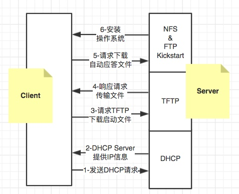
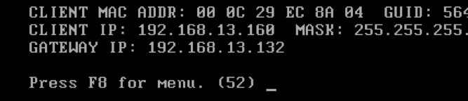
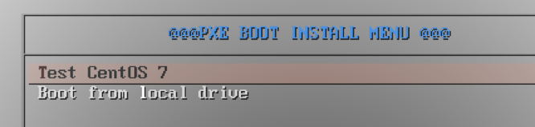

# PXE 自动化安装

## 解决问题和注意事项：
* 其实前面讲过了自定义光盘安装，但是光盘也有一定的弊端的，因为自定义光盘还是需要很多人工干预，而这种PXE网络安装的模式可以更省力，只要主机上架，连线，加电，然后开机，选择安装所需系统，然后远程连接配置好的PXE自动安装系统，既可以完工了。
* 虽然PXE安装可以减少更多的工作量，但是这样PXE在生产中使用需要特别小心，并且也有一定弊端，试想一下，你开放PXE安装其它主机系统的时候，碰巧有一台生产主机重启了，并且开机的引导方式是网络引导启动，这个时候就完蛋了，该系统会被重新PXE一次，所以，要使用这种技术做网络安装，前提一定要做好如下几点：

    1：所需PXE安装区域的所有主机的引导全部置于硬盘引导
    2：PXE安装服务器对所需要安装的系统要做限制
    3：其他主机服务器的IP地址必须置为静态，切勿使用DHCP自动获取

## 技术点 kickstart + pxe
### 什么是Kickstart

* KickStart是一种无人职守安装方式，KickStart的工作原理是通过记录安装过程中所需人工干预填写的各种参数，并生成一个名为ks.cfg的文件；
* 在后续的无人值守安装过程中，如果出现要求填写参数的情况时，安装程序会首先去查找KickStart的文件，匹配到合适的参数时，就采用该参数，如果没有匹配到，责需安装者手工干预。
* 所以，在PXE安装过程中，只需要告诉安装程序从何处取ks.cfg文件，然后默默的等安装完毕，安装程序会根据ks.cfg中设置参数、所需执行的脚本来安装和部署系统，并结束安装。

### 什么是PXE

* PXE 其实是一种引导的方式。进行PXE安装的必要条件是所需安装系统的主机中包含一个支持PXE引导的网卡，即网卡中必须要有 PXE Client。

* PXE (Pre-boot Execution Environment)协议使计算机可以通过网络启动。协议分为 client 和 server 端，PXE client 在网卡的 ROM 中，当计算机引导时完成如下工作：
    
    1. BIOS 把 PXE client 调入内存执行，由 PXE client 将放置在远端的文件通过网络下载到本地运行。
    2. 运行 PXE 协议需要设置 DHCP 服务器和 TFTP 服务器。
    3. DHCP 服务器用来给 PXE client 分配一个 IP 地址，用于网络通信。（DHCP服务器必须添加相应的PXE设置）。
    4. 在 PXE client 的 ROM 中，已经存在了 TFTP Client。PXE Client 通过 TFTP 协议到 TFTP Server 上下载所需的文件。

### PXE 工作流程



1. PXE Client向DHCP发送请求

在主机BIOS中设置启动为PXE网络启动，通过PXE BootROM 发送一个广播请求，向网络中的DHCP服务器请求IP地址等信息。

2. DHCP服务器提供信息

DHCP服务器收到PXE Client的请求，并验证该请求是否合法，验证通过后，将给 PXE Client 一个“提供”响应，这个“提供”响应中包含了为PXE Client分配的IP地址、pxelinux启动程序（TFTP）位置，以及配置文件所在位置。

3. PXE客户端请求下载启动文件

客户端收到DHCP服务器的“回应”后，会再次请求，请求传送启动所需文件。这些启动文件包括：vmlinuz、initrd.img、pxelinux.0、pxelinux.cfg/default等文件。

4. TFTP Server响应客户端请求并传送文件

当服务器再次收到客户端的请求后，双方之间将有更多的信息在进行交互。并由TFTP 协议从TFTP Server下载启动安装所必须的文件（pxelinux.0、pxelinux.cfg/default）。然后根据下载成功的default文件定义来启动引导内核。

5. 下载自动应答文件

客户端通过default文件成功的引导Linux安装内核后，安装程序首先确定以什么介质来安装linux，如果是（NFS, FTP, HTTP）网络安装，则初始化网络，并定位安装源位置。再次申请IP地址，并请求下载自动应答文件ks.cfg文件。

6. 客户端安装操作系统

ks.cfg文件下载成功后，按照该文件的配置请求下载安装过程需要的软件包，客户端将开始安装操作系统。安装完成后，会提示重新引导计算机。一定要将BIOS中的引导模式改到从硬盘启动，否则又会重复的自动安装。

## PXE无人值守安装配置

|名称|角色|IP地址|
|:--|:--|:--|
|Client|Pxe Client|动态|
|dnsmasq|DHCP Server| 192.168.13.132|
|TFTP|TFTP Server | 192.168.13.132|
|Vsftp|FTP Server | 192.168.13.132|

### Dnsmasq
1.	配置主机静态IP地址 （实验主机：192.168.13.132）

2.	安装dnsmasq

    yum -y install dnsmasq

3.	配置文件在/etc/dnsmasq.conf，做为一个工程师在修改任何配置文件之前一定要备份原来的文件，这样会让你在修改出错的时候快速恢复到原来状态，换句话说就是改不好，也不能改坏。
```
    # mv /etc/dnsmasq.conf /etc/dnsmasq.conf.20151010
    # vim /etc/dnsmasq.conf
```
4.	编辑配置文件
>由于里面内容太多了，大多也都是注释，所以我全部删除了，重新写了一些比较关键的进去。

    interface=eno16777736,lo  //服务需要监听并提供服务的端口
    domain=centos7pxe.lan  //域名
    dhcp-range=eno16777736,192.168.13.150,192.168.13.200,255.255.255.0,1h
    //dhcp分配IP地址范围
    dhcp-boot=pxelinux.0,pxeserver,192.168.13.132
    //PXE网络引导地址
    dhcp-option=3,192.168.13.132    //网关
    pxe-prompt="Press F8 for menu.",60   //F8进入，默认60秒等待
    pxe-service=x86PC,"PXE Install CentOS 7",pxelinux  
    //标题描述，x86PC,和pxelinux不要更改
    enable-tftp  //启用内建tftp
    tftp-root=/var/lib/tftpboot  //使用默认TFTP目录

>配置完成后，保存继续向下配置，后续一起启动。

### Tftp-Server
安装tftp-server为下载网络引导文件提供传输
1.	安装tftp-server

    #yum –y install tftp-server
	无须配置，稍后启动即可！

### Syslinux
PXE启动映像文件由syslinux软件包提供，光盘中已提供。
syslinux是一个功能强大的引导加载程序，而且兼容各种介质。更加确切地说：SYSLINUX是一个小型的Linux操作系统，它的目的是简化首次安装Linux的时间，并建立修护或其它特殊用途的启动盘。我们只要安装了syslinux，就会生成一个pxelinux.0，将 pxelinux.0 这个文件复制到 '''tftpboot''' 目录即可：
1.	安装syslinux

    #yum –y install syslinux

2.	拷贝引导文件到tftp目录内

    #cp -r /usr/share/syslinux/* /var/lib/tftpboot

### Pxe引导文件

其实这个引导文件就如同我们光盘内的isolinux.cfg一样，在最初的状态提供我们一个选择菜单，让我们选择相对应的安装选项，那么问题就简单了，既然一样，那么我们直接就拷贝光盘里的isolinux.cfg过来修改即可。
1.	拷贝文件到tftp指定目录
```
    #mount /dev/cdrom /mnt/cdrom
    #mkdir /var/lib/tftpboot/pxelinux.cfg 
    #cp /mnt/cdrom/isolinux/isolinux.cfg  /var/lib/tftpboot/pxelinux.cfg/default
```
2.	编辑后的default文件如下
```
    default vesamenu.c32  
    timeout 600   //等待超时时间，单位为1/10秒

    menu title @@@PXE BOOT INSTALL MENU @@@
    label local
    menu default
    menu label Boot from ^local drive
    localboot 0xffff

    label Testlinux
    menu label ^Test CentOS 7
    kernel centos7/vmlinuz
    append method=ftp://192.168.13.132/pub initrd=centos7/initrd.img 
    append inst.ks=ftp://192.168.13.132/pub/Base.cfg  initrd=centos7/initrd.img
```
>注意kernel 和 initrd部分，指向的centos7目录，这里的目录实际位置/var/lib/tftpboot/centos7目录，安装源的位置在ftp的pub目录

### KickStart 文件修改部分
```
# Install OS instead of upgrade
install
# Use network installation
url --url="ftp://192.168.13.132/pub"
# Use graphical install
```
>此处的Base.cfg文件为kickstart应答文件，可以参考前面章节`自定义光盘的ks文件`部分。

### Vmlinux and initrd
1.	拷贝光盘可用的vmlinux和initrd.img到/var/lib/tftpboot/centos7目录，提供可使用的网络启动。
```
    #mkdir /var/lib/tftpboot/centos7
    #cp /mnt/cdrom/images/pxeboot/vmlinux  /var/lib/tftpboot/centos7/
    #cp /mnt/cdrom/images/pxeboot/initrd.img  /var/lib/tftpboot/centos7/
```
### ftp安装源
基本软件配置已经就绪，那么我们还需一个可以在网络上访问的安装源，你可以采用HTTP，FTP，NFS等协议来提供网络安装源，本文采用VSFTP来建立安装源。
1.	安装配置VSftpd软件
```
    # yum install vsftpd
    # cp -r /mnt/cdrom/* /var/ftp/pub/
    #systemctl restart vsftpd.service
    #systemctl enable vsftpd.service 
```
### 防火墙
既然是要通过网络提供安装，那么这和防火墙绝对脱不了干系，所以我们要配置防火墙，然后才能正常提供安装。

1.	关闭防火墙

    #systemctl  stop firewalld
    #systemctl  disable firewalld

2.	添加防火墙规则
```
    # firewall-cmd --add-service=ftp –permanent
    # firewall-cmd --add-service=dhcp –permanent
    # firewall-cmd --add-port=69/udp --permanent 
    # firewall-cmd --add-service=dns –permanent   //如果有提供DNS功能的话
    # firewall-cmd --reload
```
>1 和 2 选择一种！
### 启动所有服务
1.	启动所需要的服务
```
    # systemctl start dnsmasq
    # systemctl status dnsmasq
    # systemctl start vsftpd
    # systemctl status vsftpd
    # systemctl enable dnsmasq
    # systemctl enable vsftpd
```
2. 启动tftp-server：
```
    编辑#vim /etc/xinetd.d/tftp配置文件，将disable = yes替换成disable = no
    #systemctl  restart xinetd.service
```
## Install测试

测试需要将PXE server 和裸机放置在同一网络，并且裸机设置为网络引导启动。
1.	引导成功如下图



>如果该步无法出现，请监控/var/log/messages日志，查看相关错误

2.	引导成功之后选择要安装的系统



3.	剩下的就是等待安装完成了

## 总结
* 如果是要规范管理安装和管理，PXE是不可或缺的，但是在生产中一定要非常小心使用，因为一旦有疏忽可能会威胁整个生产区域。
* 又或者将他封装在某个已经老旧的笔记本内，需要机器安装系统的时候，这些被上架的新主机和我的笔记本首先点对点网络直连，又或者使用一个单独的交换机，这个交换机是随意可以移动的，用到哪就拿到哪，然后在开始PXE批量安装。

