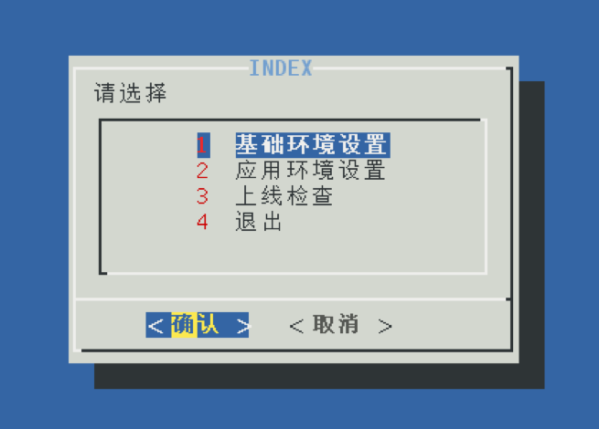

# 自定义光盘
* 做系统管理的朋友们一定都有一种感觉，那就是一提装系统就立马想吐,每个系统的基础软件基本上都有个性化的配置和参数设置，再赶上批量安装，那么多主机等着安装系统并进行基础设置，肯定忙个人仰马翻。
* 有没有什么办法可以快速设置一些基础软件安装的环境配置以及系统必要的安全设置，以及安装后自己把规定的补丁打上。最主要是安装完以后，一定要把光盘弹出来，需要知道哪些机器安装完了，主要是因为IDC机房的服务器主机都是没有显示器的，需要接上显示器，一个一个确认，万一没装完，还要换一个在去配置，如果有这个功能，是不是可以解决很多事情？

## 可以解决的问题

	1：能够自动安装系统，不需要太多的人工干预
	2：能够自动设置系统一些常规参数，减少安装后人工配置
	3：所需应用环境的自动配置，减少人工安装后配置应用安装环境
	4：安装系统后会自动的将近期的补丁自动更新，无须人工单台主机去打补丁
	5：光盘自动弹出，确认安装完成

## 可以选择的方案

1. 卫星服务器  （统一安装平台，可定制安装，可管理系统）
2. PXE 无人值守安装 （统一安装平台，可定制安装）
3. 自定义光盘 （定制安装）

## 该选择哪种呢？
* 其实这3种技术方案都满足当前的需求，也都是成熟的不能在成熟了，但是”因地制宜”，面对当前问题必须选出一个恰当的方案。
* 现场的限制因素如下：如果技术上能完成的事情，更多的需要考虑外在因素。

  1. 考虑IDC机房，多网络隔离并且网络情况复杂，一旦采用平台级别的部署，有可能会误伤其他主机。
  2. 部门太多，分管领导太多，协调太困难。


* 协调太多的部门和领导以及需要在各个已经隔离的网络中进行通信，这显然是一件很困难的事情，并且涉及到更改已有的网络结构和一些安全策略。所以平台级的部署肯定没戏了。
* 最终决定用了一张自定义的自动安装配置光盘来暂时解决这个问题。

## 自定义光盘
### 准备安装源
1.	登录账户：root
2.	挂载光盘到临时目录
```
#mkdir /mnt/cdrom
#mount /dev/cdrom /mnt/cdrom
```
3.	建立ISO源目录
```
#mkdir /newiso
#cp –a /mnt/cdrom/.  /newiso   
不要使用*，要用 . 号替代，如果使用*，隐藏文件不会被拷贝
```

### 修改引导文件
* 在光盘引导的安装阶段，isolinux.cfg文件将决定如何处理用户的输入，并执行对应的安装过程，isolinux.cfg需要指定KS文件位置。KS文件即Kickstart文件（无人值守安装文件）也就是自动安装应答文件。
* 源文件: #vim /newiso/isolinux/isolinux.cfg
```
//配置文件比较长，只列出需要更改和自定义的内容：
timeout 600     //等待时间，倒计时600，就是60秒
menu title CentOS 7    //标题
label linux           //标签，一个标签就是一个选项内容
  menu label ^Install CentOS 7   //自定义名称标识
  kernel vmlinuz     //默认的kernel 光盘位置 （无须修改）
  append initrd=initrd.img inst.stage2=hd:LABEL=CentOS\x207\x20x86_64 quiet
  //引导位置
label check
  menu label Test this ^media & install CentOS 7
  menu default  // 注意，如果该label设置default 参数，意味着如果等待时间结束没有任何选择，将默认选择该label执行
  kernel vmlinuz
  append initrd=initrd.img inst.stage2=hd:LABEL=CentOS\x207\x20x86_64 rd.live.check quiet
```
* 修改后: #vim /newiso/isolinux/isolinux.cfg
```
//配置文件比较长，只列出需要更改和自定义的内容：
timeout 300     // 设置30秒等待
menu title Test CentOS 7    //标题为 Test CentOS 7
label linux       （保留原有，复制新增加一个选项）
  menu label ^Install CentOS 7   
  kernel vmlinuz    
  append initrd=initrd.img initrd=initrd.img inst.stage2=hd:LABEL=centos7 quiet
label Test linux       （新增加选项）
  menu label ^Test CentOS 7   
  menu default   //设置为默认启动,测试阶段用
  kernel vmlinuz    
  append inst.ks=cdrom:/isolinux/KS/Base.cfg initrd=initrd.img inst.stage2=hd:LABEL=centos7 quiet
//增加KS文件指定在光盘的KS文件夹,需在newiso内isolinux下创建KS文件夹
//inst.stage2部分更改LABEL为后面封装光盘的LABEL部分，必须对应。
label check
  menu label Test this ^media & install CentOS 7
  menu default  // 删除默认，后续添加至别的label中作为默认启动
  kernel vmlinuz
  append initrd=initrd.img inst.stage2=hd:LABEL=centos7 quiet
```

### 编写KS文件
* Kickstart文件是无人值守应答文件，即自动化安装的时候可以将一些需要设置的选项写入该文件，比如：磁盘分区大小，时区，需要安装的软件包等等.
* 在已经安装过的CentOS 7系统里，文件名/root/anaconda-ks.cfg即是该系统的ks文件
1.	首先安装system-config-kickstart编辑器
```
#yum –y install system-config-kickstart
```
2.	启动编辑器,配置基础部分
```
#system-config-kickstart
```
3.	利用编辑器制作ks模板文件

|名称|解释|
|:--|:--|
|基本设置|语言中文，时区上海，设置root密码，勾选安装后重新引导系统|
|安装方法|执行新安装，光盘驱动器|
|引导装载程序选项|安装新引导装载程序，在主引导记录（MBR）上安装引导装载程序|
|分区信息|清除主引导记录，删除所有现存分区，初始化磁盘标签，设置磁盘分区大小，不支持LVM分区设置（手动设置完成LVM分区）|
|网络配置|不设置，安装完成后利用脚本进行配置bond网络|
|验证|不做修改，使用 SHA512|
|防火墙设置|Selinux 禁用，防火墙禁用 （后续用到在开启）|
|显示配置|不做修改|
|软件包选择|不做修改,利用模板文件修改ks文件完成|
|预安装脚本|不做修改,修改ks文件完成|
|安装后脚本|不做修改,修改ks文件完成|

### 分区设置
```
//截取于模板文件/root/anaconda-ks.cfg
# Disk partitioning information  
part pv.245 --fstype="lvmpv" --ondisk=sda --size=122379   
//120G的磁盘
part /boot --fstype="xfs" --ondisk=sda --size=500    
//500M的boot 分区
volgroup centos --pesize=4096 pv.245
logvol /  --fstype="xfs" --grow --maxsize=51200 --size=1024 --name=root --vgname=centos 
//根分区 50G
logvol swap  --fstype="swap" --size=2048 --name=swap --vgname=centos 
//交换分区2G
logvol /home  --fstype="xfs" --size=5000 --name=home --vgname=centos 
//Home目录5G
```

### 添加自定义脚本
* 自定义的脚本其实就是需要满足需求的最主要的部分，包括打补丁，系统参数设置，应用安装环境设置等等的一系列集合。
```
%post --nochroot 
//表示安装后运行

#!/bin/bash
mkdir -p /mnt/postconfig
mount /dev/cdrom /mnt/postconfig      
cp -rf /mnt/postconfig/setup  /mnt/sysimage/tmp/ 
//创建临时目录，并拷贝光盘的setup目录到系统，setup目录内是自定义脚本和监控软
//件包    
   
cp -rf /mnt/sysimage/etc/rc.d/rc.local{,.orig}
chmod 755 /mnt/sysimage/etc/rc.d/rc.local
echo "bash /tmp/once" >> /mnt/sysimage/etc/rc.local
//开机制动执行自定义的once脚本

cat<<EOF>/mnt/sysimage/tmp/once  
#!/bin/bash
cd /tmp/setup
tar xvf systools.tar -C /          
mkdir -p /monitor/sysupdata
tar xvf updata.tar -C /monitor/sysupdata/    
bash /tmp/glance/install.sh      
bash /monitor/sysupdata/p-sysupdata.sh  
chkconfig NetworkManager off
cp -rf /etc/rc.d/rc.local.orig /etc/rc.d/rc.local   
rm -rf /tmp/once       
eject  
sleep 2
#reboot   
EOF
//once脚本的内容如上，sysupdata为补丁包，由p-sysupdata.sh自动更新，
//systools为监控软件和环境设置包，由install.sh自动安装
//eject 弹出光驱

chmod 755 /tmp/once
%end
//脚本结束，并赋予once可执行权限
```
### 软件包选择
//截取于模板文件/root/anaconda-ks.cfg
%packages
@base
@core
@desktop-debugging
@dial-up
@fonts
@gnome-desktop
@guest-agents
@guest-desktop-agents
@input-methods
@internet-browser
@multimedia
@print-client
@x11
kexec-tools

%end

### 封装光盘
* 编辑完KS文件后，即可以封装光盘进行测试了，封装光盘的指令为
```
#mkisofs -o /centos7.iso -J -r -v -b isolinux/isolinux.bin -c isolinux/boot.cat -no-emul-boot -boot-load-size 4 -boot-info-table -V "centos7" /newiso

切记这条指令一定要在光盘的目录里执行！！制作好的光盘在”/”目录下.
-V 后面的部分对应isolinux.cfg内的LABEL部分
```

### 环境设置脚本思路


1.	基础环境设置内包含主机名，网卡bond设置，swap等等，我这里设置swap分区，是因为我的生产环境中ks文件中并不设定swap分区，而是安装以后通过这个脚本去检测实际内存大小然后根据比例在添加swap分区。
2.	应用环境设置包含Oracle环境，DB2环境，WAS环境，mysql环境，tomcat环境等等，只要执行对应选项即可完成整个环境的设置。
3.	上线检查部分是对安全选项设置进行检查并修复，包含密码长度，可登录人数，敏感软件的版本信息等等。
1.  也可以在定制光盘选项中，定制不同选项调用不同的部署脚本，也可以大范围减少重复工作量。
各位可以根据实际情况自行发挥编写脚本，总之越方便越好。

## 总结
* 这种看似不起眼的技术，绝对可以简化你在机房部署的工作量，但是还是要做很多重复工作，没办法，因为很多外围因素的限制没有办法使用平台级别的安装，只能采用这样的便捷方便的方法了。

## 备注
### 更改后的isolinux.cfg文件
```
default vesamenu.c32
timeout 600

display boot.msg
…….( 这部分未做更改)


label local
  menu default
  menu label Boot from ^local drive
  localboot 0xffff

label Testlinux
  menu label ^Test CentOS 7
  kernel vmlinuz
  append inst.ks=cdrom:/isolinux/KS/Base.cfg initrd=initrd.img inst.stage2=hd:LABEL=centos7 quiet

label check
  menu label Test this ^media & install CentOS 7
  kernel vmlinuz
  append initrd=initrd.img inst.stage2=hd:LABEL=CentOS\x207\x20x86_64 rd.live.check quiet

label rescue
  menu indent count 5
  menu label ^Rescue a CentOS system
  text help
	If the system will not boot, this lets you access files
	and edit config files to try to get it booting again.
  endtext
  kernel vmlinuz
  append initrd=initrd.img inst.stage2=hd:LABEL=CentOS\x207\x20x86_64 rescue quiet

label memtest
  menu label Run a ^memory test
  text help
	If your system is having issues, a problem with your
	system's memory may be the cause. Use this utility to
	see if the memory is working correctly.
  endtext
  kernel memtest

menu separator # insert an empty line
menu separator # insert an empty line

menu end
```
### 完整KS文件
```
#platform=x86, AMD64, 或 Intel EM64T
#version=DEVEL
# Install OS instead of upgrade
install
# Keyboard layouts
keyboard 'us'# Reboot after installation
reboot
# Root password
rootpw --iscrypted $1$sNu/R9h1$YpjRHla5gPXj.y568c5/m/
# System timezone
timezone Asia/Shanghai
# System language
lang zh_CN
# Firewall configuration
firewall --disabled
# System authorization information
auth  --useshadow  --passalgo=sha512
# Use CDROM installation media
cdrom
# Use graphical install
graphical
firstboot --disable
# SELinux configuration
selinux --disabled

# System bootloader configuration
bootloader --location=mbr
# Clear the Master Boot Record
zerombr
# Partition clearing information
clearpart --all --initlabel 

# Disk partitioning information
part pv.245 --fstype="lvmpv" --ondisk=sda --size=122379
part /boot --fstype="xfs" --ondisk=sda --size=500
volgroup centos --pesize=4096 pv.245
logvol /  --fstype="xfs" --grow --maxsize=51200 --size=1024 --name=root --vgname=centos
logvol swap  --fstype="swap" --size=2048 --name=swap --vgname=centos
logvol /home  --fstype="xfs" --grow --size=500 --name=home --vgname=centos

%post --nochroot  
#!/bin/bash
mkdir -p /mnt/postconfig
mount /dev/cdrom /mnt/postconfig      

cp -rf /mnt/postconfig/setup  /mnt/sysimage/tmp/
cp -rf /mnt/sysimage/etc/rc.d/rc.local{,.orig}
chmod 755 /mnt/sysimage/etc/rc.d/rc.local
echo "bash /tmp/once" >> /mnt/sysimage/etc/rc.local
cat<<EOF>/mnt/sysimage/tmp/once 
#!/bin/bash
cd /tmp/setup
tar xvf systools.tar -C /          
mkdir -p /monitor/sysupdata
tar xvf updata.tar -C /monitor/sysupdata/    
bash /tmp/glance/install.sh      
bash /monitor/sysupdata/p-sysupdata.sh  
chkconfig NetworkManager off
cp -rf /etc/rc.d/rc.local.orig /etc/rc.d/rc.local   
rm -rf /tmp/once       
eject  
sleep 2
#reboot   
EOF
chmod 755 /tmp/once
%end

%packages
@base
@core
@desktop-debugging
@dial-up
@fonts
@gnome-desktop
@guest-agents
@guest-desktop-agents
@input-methods
@internet-browser
@multimedia
@print-client
@x11
kexec-tools

%end
```
