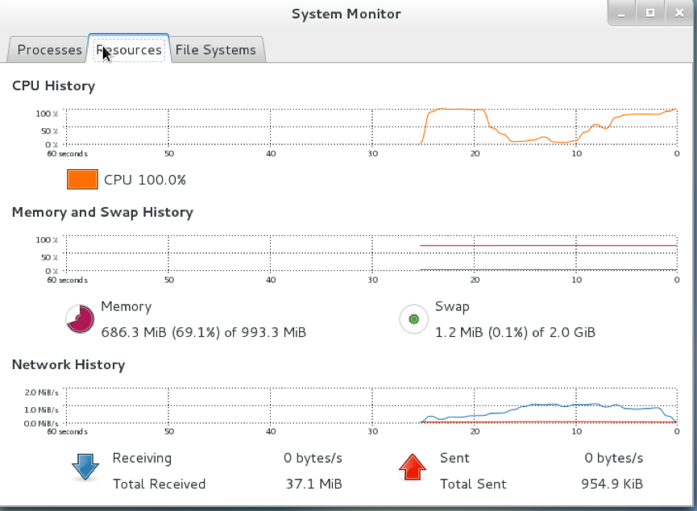
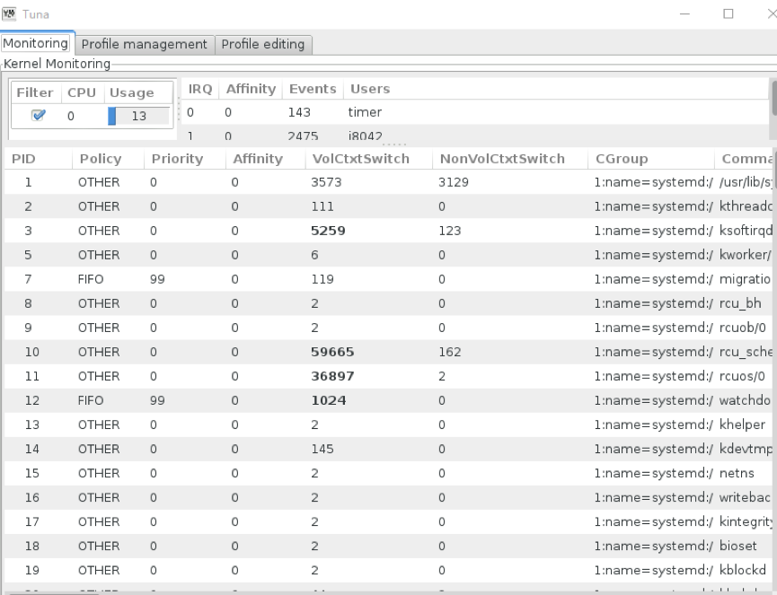

## 性能调优的基本原理
### 调优基础理论

* 调优一度被称为**“黑色艺术”**，该词很形象贴切的描述了调优的工作困难程度，性能调优会涉及到一些超常规的知识，以及需要全面掌握硬件和系统以及软件方面的知识，其实就是综合能力的体现和提炼。同时调优也涉及到对系统的精确监控，包括数据的采集，分析等。
* 性能调优是对特定的应用程序来做调整和配置，似的该应用程序可以获得更大的吞吐量或者是更快的响应时间。通常情况下，调优的主要目的是去除程序运行当中导致数据传输变慢的阻塞。
* 处理器并不会关心资源使用率是在百分之五还是九十五（因为硬件无感知），但作为调优工程师或者用户肯定对调优有明确的目的，并清楚的知道需要在系统的哪些方面做性能提升（人是有感知）。因此在进行调优之前，用户必须预先设定明确的性能调优目标和可被接受的范围。

> 调优之前一定要制定一个标准。找到能反映该应用程序当前运行状况的参数和标准。例如，如果客户需要的是更低的CPU使用率，那么可以通过使用更慢的存储和网络设备来实现。但是这肯定不是客户所期望的。所以在通常情况下，需要客户详细描述他们的目标，这样可以有助于制定正确的标准。

### 写在前面的话

* 在进行性能调优之前必须先明确一个问题，即**“这个问题否是能通过调优解决”**。
* 千万不要有错觉，调优不是万能的，不可能修改一些内核参数就可以解决所有的问题。有些问题是因为性能差的硬件导致，因此即便做了足够的调优也无法弥补这些先天的不足。
* 调优无法弥补应用程序本身的错误和缺陷，同样也没有办法超越硬件的极限。

### 建立硬件模型

* 完备的硬件模型是调优的基本信息来源之一，好的模型会包含硬件中尽可能多的信息，并且可以确保我们全面地了解和掌握清楚硬件的各个组件如何协同运作。 

* 硬件模型应该包括：

  1. 系统配置信息（OS版本，处理器数量及信息，内存大小，缓存大小等）；
  2. 内部和外部存储的大小；
  3. 在该系统上运行的进程列表；
  4. 将要使用的应用程序以及硬件；
  5. 网络配置信息；

  > 通常可以使用sysreport或者sosrepot是收集这些信息。

### 收集信息

* 系统监控主要用于周期性地收集系统数据，确保系统性能达到预期。
* 数据的采集务必确保不会占用更多的系统资源，千万不要因为监控触发系统的超限报警机制。
* 动手之前需要对目标进行深入了解，目标程序的设置参数、运行状态、明确多个应用程序如何相互作用以及使用系统资源。 

### 深入分析

* 可以将整个系统划分为不同的的子系统，在一个action中，并不是所有的子系统都会参于，我们通常只关注参与的子系统，缩小调节范围。就像涉及到运算方面的任务可能不一定会牵涉到磁盘子系统一样。
* 在进行调优时需要考虑对于给定的应用程序，需要调整所涉及的哪些子系统，即哪些层面。对不同的层面进行调优会有不同的效果产生，因此要确定对哪些子系统进行最小的调整即会产生最大的收益。通常需要考虑的层面包括business，application和hardware。
* 而且在调优之前需要充分了解调优的环境并对要调整的系统建立一个模型。这个模型可以采用最简单的绘图工具制定。这样的一个图标可以包含所有组件的所有数据流。并且可能需要单独显示出每一个层面和其他层面关系的详细信息。

### 小试牛刀

#### 排除常规瓶颈

1. 日志是否会成为瓶颈？是否需要取消不必要记录或者对日志采用缓存机制？

2. 是否可以关闭反向DNS解析？

3. 是否需要额外的crontab任务？

   • 关闭/etc/cron.daily/man-db.cron

   • 考虑禁用 /etc/cron.daily/mlocate

4. 是否运行着多余的服务？

   • PC Smart Card Daemon

   • Bluetooth and hidd

   • Avahi (for zero-conf networking)

   > 通常经过以上几点，已经将可能影像系统的常规因素进行排除，在真正的调优之前常规的动作，这只是举例，不同的情况下还请举一反三的多思考。

#### 使用帮助文档（Kernel-document）

* 大脑不可能记住所有的参数和信息（除非你是神通！），所以在对系统进行调优的时候必须要熟悉掌握必要的文档（一定要学会阅读帮助文档，因为大多数时候，答案都在帮助文档）。

* 如果你是对内核参数不能理解，那么需要安装kernel-doc包，以方便进行查询和释义。

* 在使用文档包的时候，grep命令显得尤其重要。通过grep命令可以快速查到相关信息。

  ```
  [root@localhost Packages]# yum -y install kernel-doc*
  [root@localhost Packages]# cd /usr/share/doc/kernel-doc-*/Documentation
  [root@localhost Documentation]# grep -ri 'kernel parameters'
  ```

#### 恢复

* 调优过程中会面临很多风险，对/proc或者/sys文件系统进行的调整有时会导致系统无法启动或者产生其他异常情况。因此在很多时候需要进入到单用户或者救援模式对所调内容进行恢复。
* 使用运行级别S和运行级别1实际上是有区别的。通常在运行级别1时会运行/etc/rc.d/rc1.d目录中的脚本，而运行级别S则不会启动或者停止任何服务。所以如果从运行级别3切换到运行级别S，所有的服务还是处于运行当中。 

### 工具

- 调优最基础的就是先要会使用监控工具，那么最直接的就是先要学会看监控工具，理解常用监控工具的给出的数值含义，然后又方向后续深入。 

#### GNOME桌面系统监控器

这个工具其实和Windows的任务管理器差不多；



**进程**:此选项卡显示关于活动进程和进程间相互关系的具体信息。显示的进程可进行筛选，以便更容易找到某些特定的进程。

**资源**:此选项卡显示目前 CPU 的时间使用量，内存和交换空间用量以及网络使用情况。

**文件系统** : 此选项卡列举了所有安装的文件系统，并提供每个的基本信息，例如文件系统类型、安装点和内存使用情况。\

#### Tuna

* Tuna调试配置细节，如调度器策略、线程优先级以及 CPU 和中断关联。tuna 数据包提供了命令行工具和有同样功能的图形界面。

 安装：yum –y install tuna



#### TOP

* top工具由 procps-ng 数据包提供，提供运行系统中进程的动态视图。它能显示多种信息，包括系统摘要和当前由Linux内核管理的任务列表。它也具有有限的控制流程的能力，并且在系统重启时永久保存配置更改。
* 默认情况下，显示的进程会根据 CPU 使用率比例来调整，以便容易地看出消耗最多资源的进程。显示的信息及操作都是高度可配置型的，这使用户可以专注于所需的不同用量的统计数据。

```
top - 18:12:42 up  1:16,  3 users,  load average: 0.00, 0.05, 0.05 
Tasks: 171 total,   2 running, 169 sleeping,   0 stopped,   0 zombie
%Cpu(s):  0.0 us,  0.0 sy,  0.0 ni,100.0 id,  0.0 wa,  0.0 hi,  0.0 si,  0.0 st
KiB Mem :  1017160 total,    89360 free,   667600 used,   260200 buff/cache
KiB Swap:  2097148 total,  2077056 free,    20092 used.   182892 avail Mem 

  PID USER      PR  NI    VIRT    RES    SHR S %CPU %MEM     TIME+ COMMAND                            
  378 root      20   0       0      0      0 S  0.3  0.0   0:01.30 xfsaild/dm-0                       
15265 root      20   0       0      0      0 S  0.3  0.0   0:00.14 kworker/0:0                        
    1 root      20   0   59796   5864   3080 S  0.0  0.6   0:04.11 systemd 
......

1、显示的内容依次为“系统当前时间 、系统到目前为止已运行的时间、当前登录系统的用户数量、系统负载(任务队列的平均长度)三个值分别为1分钟、5分钟、15分钟前到现在的平均值【这三个一般会小于1，如果持续高于5，请仔细查看那个程序影响系统的运行】”
2、命令的第二行“Tasks: 171 total,   2 running, 169 sleeping,   0 stopped,   0 zombie”显示的内容依次“所有启动的进程数”、“正在运行的进程数”、“挂起的进程数”、“停止的进程数”、“僵尸进程数”。
3、命令第三行“%Cpu(s):  0.0 us,  0.0 sy,  0.0 ni,100.0 id,  0.0 wa,  0.0 hi,  0.0 si,  0.0 st
”显示的内容依次为“用户空间占用CPU百分比”、“内核空间占用CPU百分比”、“用户空间内改变过优先级的进程占用CPU百分比”、“空闲CPU百分比”、“等待输入输出CPU时间百分比”、“CPU服务于硬件中断所耗费的时间总额”、“CPU服务软中断所耗费的时间总额”、“Steal Time”
4、命令第四行“Mem :  1017160 total,    89360 free,   667600 used,   260200 buff/cache
”显示内容依次为“物理内存总量”、“已使用的物理内存”、“空闲物理内存”、“内核缓存内存量”
5、命令第5行“Swap:  2097148 total,  2077056 free,    20092 used.   182892 avail Mem”显示内容依次为“交换区总量”、“已使用交互区总量”、“空闲交换区总量”、“缓冲的交换区总量”
6、命令第6行“PID USER      PR  NI  VIRT  RES  SHR S %CPU %MEM    TIME+  COMMAND ”显示内容依次为“进程ID”、“进程所有者”、“优先级”、“nice值，负值表示高优先级，正值表示低优先级”、“进程使用的虚拟内存总量”、“进程使用的、未被换出的物理内存大小”、“共享内存大小”、“进程状态”、“上次更新到现在的CPU时间占用百分比”、“进程使用的物理内存百分比”、“进程使用CPU总时间”、“命令名、命令行”
```

> Top实用举例： 查看进程的线程资源占用  top –H -p pid , 更多的top实用技巧参见man top 

#### PS

- ps 工具由 procps-ng 数据包提供，提供选定的一组运行进程快照。默认情况下，检测过的组别受限于当前用户所占有的进程，并与运行 ps 的终端相关联。
- 较之于top工具，ps可以提供更多关于进程的信息，但默认情况下提供的是这一数据的单一快照，并通过进程标识符来调整。
- 注意：ps显示瞬间进程状态，并不动态连续；如果想对进程进行实时监控应该用top命

```
ps 常用指令
{ ps -aux | ps –lA | ps -axjf |ps -ef}
参数：
-A ：所有的进程均显示出来，与 -e 具有同样的效用；
-a ： 显示现行终端机下的所有进程，包括其他用户的进程；
-u ：以用户为主的进程状态 ；
-x ：通常与 a 这个参数一起使用，可列出较完整信息。
输出格式规划：
-l ：较长、较详细的将该 PID 的的信息列出；
-j ：工作的格式 (jobs format)
-f ：做一个更为完整的输出
```

```
[root@centos7 pmlogger]# ps -aux 
USER       PID %CPU %MEM    VSZ   RSS TTY      STAT START   TIME COMMAND
root         1  0.0  0.5  59796  5492 ?        Ss   Nov12   0:09 /usr/lib/systemd/systemd --switched-ro
root         2  0.0  0.0      0     0 ?        S    Nov12   0:00 [kthreadd]
……

• USER：该进程属于那个使用者账号的？
• PID ：该进程的进程ID号。
• %CPU：该进程使用掉的 CPU 资源百分比；
• %MEM：该进程所占用的物理内存百分比；
• VSZ ：该进程使用掉的虚拟内存量 (Kbytes)
• RSS ：该进程占用的固定的内存量 (Kbytes)
• TTY ：该进程是在那个终端机上面运作，若与终端机无关，则显示 ?，另外， tty1-tty6 是本机上面的登入者程序，若为 pts/0 等等的，则表示为由网络连接进主机的程序。
• STAT：该程序目前的状态，主要的状态有：
   R ：该程序目前正在运作，或者是可被运作；
   S ：该程序目前正在睡眠当中 (可说是 idle 状态啦！)，但可被某些讯号(signal) 唤醒。
   T ：该程序目前正在侦测或者是停止了；
   Z ：该程序应该已经终止，但是其父程序却无法正常的终止他，造成 zombie (疆尸) 程序的状态
• START：该进程被触发启动的时间；
• TIME ：该进程实际使用 CPU 运作的时间。
• COMMAND：该程序的实际指令.
```

#### vmstat

- 虚拟内存统计数据工具，即 vmstat，提供关于系统进程、内存、分页、输入/输出、中断和 CPU 活动的即时报告。vmstat 让用户设置一组采样间隔以接近实时地观察系统活动。

  ```
  [root@centos7 pmlogger]# vmstat 2 5
  procs -----------memory---------- ---swap-- -----io---- -system-- ------cpu-----
   r  b   swpd   free   buff  cache   si   so    bi    bo   in   cs us sy id wa st
   2  0 242324 309472     36 233660  0    3    17     6   56  114  0  0 99  0  0
   0  0 242324 309456     36 233660  0    0     0     0   57  114  0  0 100  0  0
   0  0 242324 309456     36 233660  0    0     0     0   61  109  0  1 100  0  0
   0  0 242324 309456     36 233660  0    0     0     6   64  118  0  0 100  0  0
   0  0 242324 309456     36 233660  0    0     0     0   50  109  0  0 100  0  0
  Vmstat 秒  次 ，每2秒取一次，共取5次
  
  r： 表示运行队列(就是说多少个进程真的分配到CPU)，我测试的服务器目前CPU比较空闲，没什么程序在跑，当这个值超过了CPU数目，就会出现CPU瓶颈了。这个也和top的负载有关系，一般负载超过了3就比较高，超过了5就高，超过了10就不正常了，服务器的状态很危险。top的负载类似每秒的运行队列。如果运行队列过大，表示你的CPU很繁忙，一般会造成CPU使用率很高。
  b：表示阻塞的进程,这个不多说，进程阻塞，大家懂的。
  swpd：虚拟内存已使用的大小，如果大于0，表示你的机器物理内存不足了，如果不是程序内存泄露的原因，那么你该升级内存了或者把耗内存的任务迁移到其他机器。
  free： 空闲的物理内存的大小，我的机器内存总共8G，剩余3415M。
  buff： Linux/Unix系统是用来存储，目录里面有什么内容，权限等的缓存，我本机大概占用300多M
  cache：cache直接用来记忆我们打开的文件,给文件做缓冲，我本机大概占用300多M(这里是Linux/Unix的聪明之处，把空闲的物理内存的一部分拿来做文件和目录的缓存，是为了提高 程序执行的性能，当程序使用内存时，buffer/cached会很快地被使用。)
  si： 每秒从磁盘读入虚拟内存的大小，如果这个值大于0，表示物理内存不够用或者内存泄露了，要查找耗内存进程解决掉。我的机器内存充裕，一切正常。
  so： 每秒虚拟内存写入磁盘的大小，如果这个值大于0，同上。
  bi： 块设备每秒接收的块数量，这里的块设备是指系统上所有的磁盘和其他块设备，默认块大小是1024byte，我本机上没什么IO操作，所以一直是0，但是我曾在处理拷贝大量数据(2-3T)的机器上看过可以达到140000/s，磁盘写入速度差不多140M每秒
  bo： 块设备每秒发送的块数量，例如我们读取文件，bo就要大于0。bi和bo一般都要接近0，不然就是IO过于频繁，需要调整。
  in： 每秒CPU的中断次数，包括时间中断
  cs： 每秒上下文切换次数，例如我们调用系统函数，就要进行上下文切换，线程的切换，也要进程上下文切换，这个值要越小越好，太大了，要考虑调低线程或者进程的数目,例如在apache和nginx这种web服务器中，我们一般做性能测试时会进行几千并发甚至几万并发的测试，选择web服务器的进程可以由进程或者线程的峰值一直下调，压测，直到cs到一个比较小的值，这个进程和线程数就是比较合适的值了。系统调用也是，每次调用系统函数，我们的代码就会进入内核空间，导致上下文切换，这个是很耗资源，也要尽量避免频繁调用系统函数。上下文切换次数过多表示你的CPU大部分浪费在上下文切换，导致CPU干正经事的时间少了，CPU没有充分利用，是不可取的。
  us：用户CPU时间，我曾经在一个做加密解密很频繁的服务器上，可以看到us接近100,r运行队列达到80(机器在做压力测试，性能表现不佳)。
  sy：系统CPU时间，如果太高，表示系统调用时间长，例如是IO操作频繁。
  id： 空闲 CPU时间，一般来说，id + us + sy = 100,一般我认为id是空闲CPU使用率，us是用户CPU使用率，sy是系统CPU使用率。
  wt：等待IO CPU时间。
  ```

  #### Sar

  - 系统活动报告，即sar，收集及报告系统当天到目前为止发生的活动信息。默认的输出以十分钟为间隔，显示当天 CPU的使用情况（自系统时间0 0 :0 0 :0 0  始）。

  - 用户也可以使用 -i  选项来以秒为单位设置间隔时间，例如，sar -i  6 0  意味着 sa r  每一分钟检查一次CPU 使用率。

  - sar  是通过 to p  工具来手动创建系统活动定期报告的一种有效方法。由 sysstat 数据包提供。

    ```
    Sar命令参数：
    -A：所有报告的总和。 
    -u：CPU利用率 
    -v：进程、I节点、文件和锁表状态。 
    -d：硬盘使用报告。 
    -r：没有使用的内存页面和硬盘块。 
    -g：串口I/O的情况。 
    -b：缓冲区使用情况。 
    -a：文件读写情 况。 
    -c：系统调用情况。 
    -R：进程的活动情况。 
    -y：终端设备活动情况。 
    -w：系统交换活动。
    ```

  #### Tuned 和 tuned-adm

  - tuned是一种后台调节程序，可通过设置调节配置文件使操作系统在特定工作负载下发挥更好的性能。tunedadm 是一个命令行工具，允许用户在不同调节配置文件中进行切换。
  - 常见用例包含一些预定义文件，但是 tuned-adm 允许用户自定义配置文件，既可以是预定义文件中的一个，也可以从头定义。在CentOS 7中，默认文件是 throughput-performance。
  - tuned-adm 提供的文件分为两类：节能文件和性能提升文件。性能提升文件的内容如下，其侧重点分别为：
     	1. 存储和网络的低延迟
     	2. 存储和网络的高吞吐量
     	3. 虚拟计算机性能
     	4. 虚拟主机性能
  - 后续章节讲解使用tuned

  #### Perf

  - perf工具通过使用硬件性能计数器和内核跟踪程序来追踪其他命令和应用程序对系统的影响。不同perf子命令显示并记录常见性能活动的统计数据，并对数据进行分析和报告。

  #### Iostat

  - iostat  工具由 sysstat 数据包提供。它对系统输入/输出设备负载进行监控和报告，以协助管理员就如何在物理磁盘间输入/输出负载做出决定。它是对处理器或设备自 iostat 上次运行或启动的使用率的报告。用户可以通过使用在 iosta t 手册页中定义的参数来在特定设备上关注这些报告的输出：

  #### irqbalance

  - irqbalance  是一个通过分配处理器硬件中断以提高系统性能的命令行工具

  #### ss

  - ss 是一个命令行实用程序，显示 socket 的统计信息，使管理员能够根据时间来评估设备性能。ss 默认打开已建立连接但未在列表内的 TCP socket，也提供很多有用选项来协助管理员筛选出特定 socket 的统计数据。
  - 一个常见的用法是 ss-tmpie，它显示（包括内核信息在内）关于 TCP so cket、内存使用率和使用 socket进程的详细信息。
  - ss 由 iproute 数据包提供。

  #### Numastat

  - numastat  工具以每一个 NUMA 节点为基础了，显示处理器和操作系统的内存统计数据。默认情况下，numasta t  显示每个节点的 NUMA 从内核的内存分配器中缺失的系统统计数据。最佳性能表现为高 numa_hit 值和低 numa_miss 值。Numastat 也提供很多命令行选项来说明系统和进程的内存如何
  - 通过系统中 NUMA 节点进行分配。交叉引用每个节点的 numastat  输出和每个 CPU 的 top  输出是很有用的，可以用来验证进程线程是在内存分配的同一节点上运行。
  - Numastat  由 numactl  数据包提供。

  #### Nomad

  - numad  是一个自动的 NUMA 关联管理后台程序。它监控系统的 NUMA 拓扑和资源使用率，目的是为了动态地提高 NUMA 的资源分配和管理（从而提高系统性能）。numad  可以根据系统的工作负载来为性能基准提供高达 50% 的改善。它还提供预先安置咨询服务，可以通过多种工作关联系统进行查询，以此为最初绑定的CPU 和内存资源的进程提供协助。
  - numad 以一个节点为基础，通过定期访问 /proc 文件系统中的信息来监控可用的系统资源。它能尝试将资源使用率保持在一个特定的等级，并在必要时通过移动 NUMA 节点间的进程来调整资源分配。numad  可以试图通过本地化和隔离系统中 NUMA 节点子集的重要进程来获得 NUMA 的最佳性能。
  - numad  主要对长时间运行程序的系统有用，这些程序消耗大量的资源并包含在总系统资源中的一个子集里。
  - 它也对消耗多个 NUMA 节点资源值的应用程序有用，但当系统资源消耗比例增加时，numad  的优势会减小。
  - 当程序只运行几分钟或不消耗太多资源时，numad  不大可能会提高性能。拥有连续且不可预测的内存访问模式的系统，如大内存数据库，也不大可能受益于 numad 。

  #### Systemtap

  - SystemTap  是一个跟踪和探测工具，使用户可以详尽地监控和分析操作系统的活动，尤其是内核活动。它提供的信息类似于 top 、ps、netstat 和 iostat 工具的输出，但包括筛选和分析所收集数据的额外选项。
  - SystemTap  提供对系统活动和应用程序性能更为深入且更为准确的分析，使用户能够精确地找到系统和应用程序的瓶颈。

  #### Valgrind

  - Valgrind  提供大量的检测及分析工具以帮助提高应用程序的性能。这些工具能检测内存和与线程相关的错误，同样也能检测堆、栈和数组的超限运行，使用户能够轻松地定位和修改应用程序代码错误。它也可以配置缓存、堆和分支预测来确定能增加应用程序速度并最小化内存使用率的因素。
  - Valgrind  通过在合成的 CPU 上运行应用程序来进行分析，并在执行时对现有的应用程序代码进行测试。之后显示的评论会清楚地标识出每个参与应用程序执行的进程至用户指定文件、文件描述符或网络 socket。要注意的是执行测试代码会花上正常执行情况下四至五十倍的时间。
  - Valgrind可以按原样应用于应用程序，不需要进行重新编制。但由于 Valgrind  使用调试信息来定位编码中的问题，若应用程序和支持库没有启用调试信息编制，建议进行程序编制以便能包含该信息。
  - Valgrind  也与 GNU 项目调试器 （gdb）一起使用来提高调试效率。

  - 采集系统数据和对数据进行格式化制图，用于瓶颈分析，通过分析采集到的数据找到性能瓶颈所在，是调优工程师最基本的技能之一。
  - 所以在进行任何调优动作之前，我们应该是先对数据进行采集，然后格式化输出数据，最好是以图标的形式展示，便于后续分析瓶颈。

  ### 单位

  - 长久以来，IT工业挪用十进制来替换准确的二进制数据。例如使用1000来表示1024byte数据。
  - 下面是一个具体的例子显示这两种进制的区别：
    - Ki ,Mi,Gi   ---> 1024
    - K, M, G   ---> 1000
    - Ki是精准的二进制数据描述值而K则是10进制表示法，可以尝试在自己的系统上使用df -h 和 df -H 来看一下
  - 这是意见逻辑混乱的事情，因为Linux系统中目前还没有统一单位，所以，你会在不同的地方看到不同的单位表示，一定要对此注意，也要换算准确。
  - 在调优的时候，一定要注意，有些数字是要求字节，有些要求Ki，有些要求K，一定要主要。

