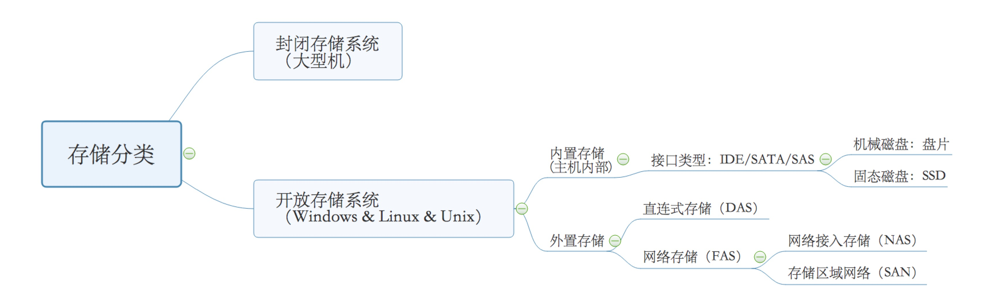

## Hardware 

* 硬件为计算机之根本，足够了解硬件将使得你在调优过程中拥有更大的优势
* 了解硬件的构造和工作原理，以及各个硬件的常用调节参数，这些知识可以让你的调优视野更加宽泛
* 软件和系统调优的极限是绝对不可能超过硬件的极限限制的
* 梳理和记录硬件信息，描述硬件模型

### CPU

- 中央处理器（CPU，Central Processing Unit）是一台计算机的运算核心（Core）和控制核心（ Control Unit）。它的功能主要是解释计算机指令以及处理计算机软件中的数据。
- 整个计算机中最关键的部分，性能的好坏直接影响系统的使用效率，所以我们需要认识CPU，充分了解CPU的工作原理以及可调节的方法。

##### 查看并认识CPU

```
# grep CPU /proc/cpuinfo 
# lscpu

[root@bogon ~]# grep CPU /proc/cpuinfo 
model name	: Intel(R) Core(TM) i5-7300U CPU @ 2.60GHz   <--CPU型号
[root@bogon ~]# lscpu
Architecture:          x86_64                            <--架构
CPU op-mode(s):        32-bit, 64-bit				    <--模式
Byte Order:            Little Endian
CPU(s):                2							<--数量	
On-line CPU(s) list:   0,1							<--在线工作列表
Thread(s) per core:    1							<-- 每核心超线程数
Core(s) per socket:    2							<-- 每物理CPU核心数
Socket(s):             1							<-- 物理CPU数量
NUMA node(s):          1
Vendor ID:             GenuineIntel
CPU family:            6
Model:                 142
Model name:            Intel(R) Core(TM) i5-7300U CPU @ 2.60GHz
Stepping:              9
CPU MHz:               2711.998
BogoMIPS:              5423.99
Hypervisor vendor:     KVM                                
Virtualization type:   full                             
L1d cache:             32K                           <-- 1级数据缓存
L1i cache:             32K						   <-- 1级指令缓存	
L2 cache:              256K						   <-- 2级缓存	
L3 cache:              3072K					   <-- 3级缓存	
NUMA node0 CPU(s):     0,1
Flags:                 fpu vme de pse tsc msr pae mce cx8 apic sep mtrr pge mca cmov pat pse36 clflush mmx fxsr sse sse2 ht syscall nx rdtscp lm constant_tsc rep_good nopl xtopology nonstop_tsc pni pclmulqdq ssse3 cx16 pcid sse4_1 sse4_2 x2apic movbe popcnt aes xsave avx rdrand hypervisor lahf_lm abm 3dnowprefetch fsgsbase avx2 invpcid rdseed clflushopt

Flags: 
LM:64为指令集
pae:物理地址扩展, 为CPU 询址增加4位,就是36位,可以询址64G

<<几核几线程就是指有多少个“Core per Socket”多少个“Thread per Core”,当后者比前者多时，说明启用了超线程技术>>
```

常用的CPU通信手段有哪几种？

1. Desktop & Laptop
  主要使用FSB技术，前端总线——Front Side Bus（FSB），是将CPU连接到北桥芯片的总线。前端总线是处理器与主板北桥芯片或内存控制集线器之间的数据通道，其频率高低直接影响CPU访问内存的速度。

2. PC-Server
  * Inter (QPI)：Intel的QuickPath Interconnect技术缩写为QPI，译为快速通道互联。事实上它的官方名字叫做CSI，Common System Interface公共系统界面，用来实现芯片之间的直接互联，而不是在通过FSB连接到北桥。

  * AMD (Hyper Transport)：HyperTransport技术是一种高速、低延时、点对点的连接，旨在提高电脑、服务器、嵌入式系统，以及网络和电信设备的集成电路之间的通信速度。HyperTransport有助于减少系统之中的布线数量，从而能够减少系统瓶颈，让当前速度更快的微处理器能够更加有效地在高端多处理器系统中使用系统内存。

* 选择CPU ：同系列的情况下，Ghz越高，性能越好，但是散热越大、耗电越高！ 

### memory

- 内存是计算机中重要的部件之一，它是与CPU进行沟通的桥梁。计算机中所有程序的运行都是在内存中进行的，因此内存的性能对计算机的影响非常大。内存(Memory)也被称为[内存储器]，其作用是用于暂时存放CPU中的运算数据，以及与[硬盘]等[外部存储器]交换的数据。只要计算机在运行中，CPU就会把需要运算的数据调到内存中进行运算，当运算完成后CPU再将结果传送出来，内存的运行也决定了计算机的稳定运行。 内存是由[内存芯片]、电路板、[金手指]等部分组成的。 

##### 查看认识内存

```
[root@bogon ~]# free -m
              total        used        free      shared  buff/cache   available
Mem:            991         171         518          13         301         624
Swap:          2047           0        2047

total ： 表示系统的总内存
used ： 表示应用程序已经使用的内存
free ： 表示当前还没有被使用的内存
shared ：表示共享链接库使用的内存
buff/cache ： 表示系统的page cache和buffer使用到的内存
available ： 表示应用程序还可以申请到的内存 

1. 系统当前使用到的内存是：used + buff/cache，used中包含了shared。
2. 所以total = used + buff/cache + free = 28995804 +20791812 + 15909532 = 65697148。
3. available（32578364） <= free + buff/cache（15909532 + 20791812 = 36701344），为什么是小于呢？因为系统的一些page或cache是不能回收的。
```

内存关注点：

 1. 新技术强于老技术，DDR4 要强于 DDR3 

    容量：DDR4理论上每根DIMM模块能达到512GiB > DDR3每个DIMM模块的理论最大容量仅128GiB。速度：DDR3的最高速率为2133MT/s < DDR4的数据传输率也从2133MT/s起步。

    能耗：DDR3的工作电压是1.5V，而DDR4是1.2V，并且能源节省高达40%。

2. 内存中的ECC 是什么？

    ECC：动态内存故障,可用ECC内存校验解决,发现内存某一位失效,然后纠正.但是速度会降低,可以更安全. 只针对1位纠正,发现多位错误就系统挂起.

3. 如果都是DDR4，那么依据什么选择？

    例如：DDR4 2133 和 DDR4 2400，如果主板支持2400，那么一定要选2400，2400和2133代表的是运行频率 ， 2400的内存，全速工作时，提供的数据带宽比2133的更大，所以理论上性能也更好。 

### 存储

* 存储是根据不同的应用环境通过采取安全、合理、有效的方式将数据保存到某些介质上并能够保证有效的访问。
* 存储分类



##### 关注点：

* 机械磁盘:  
  * 寻道时间：指收到系统指令后接收到系统指令后，磁头从开始移动到找到数据所在磁道所需要的平均时间.（越小越好）
  * 转数：转数使用RPM标识，是Revolutions Perminute的缩写，是转/每分钟。RPM值越大，内部传输率就越快，访问时间就越短，硬盘的整体性能也就越好。
  * 容量：实际可用的存储空间，按需选择。
  * 硬盘的缓存：是硬盘控制器上的一块内存芯片，具有极快的存取速度，它是硬盘内部存储和外界接口之间的缓冲器。缓存越大效率越高，速度越快，价格越高。
  * 接口：IDE/SATA/SAS，不同接口传输速率不同，尽可能选择速率较高的。
  * 传输速率：指硬盘读写数据的速度，单位（MB/s）。内部传输率为持续传输率，反映了硬盘缓冲区未用时的性能，主要依赖于硬盘的旋转速度。外部传输率为突发数据传输率或接口传输率，是系统总线与硬盘缓冲区之间的数据传输率，外部数据传输率与硬盘接口类型和硬盘缓存的大小有关。

* 固态磁盘：（非常安静，扇热小，不怕磁铁，不怕震动，但是很贵！！！）

  *  芯片工艺：

     ```
      SLC = Single-Level Cell ，即1bit/cell，速度快寿命长，价格超贵。
      MLC = Multi-Level Cell，即2bit/cell，速度一般寿命一般，价格一般。
      TLC = Trinary-Level Cell，即3bit/cell，也有Flash厂家叫8LC，速度慢寿命短，价格便宜。
      性能比：SLC > MLC > TLC   
      Cell 即是SSD一个存储单元。
      ```

  - 品牌：选择SSD磁盘的时候，建议选择较大生产厂家的品牌产品，切勿山寨。

  - 读写速度：大多数SSD产品都会标明读写速度，建议根据需求综合考虑最大读写速度和平均读写速度，这个数字越大，性能越优秀。

  - 接口：SATA/M.2/PCI-E/mSTAT，一定要选择对应的接口。

  - 断电保护：（依据需求），断电保护可以使SSD磁盘断电的时候，尽可能的减少数据丢失风险。

  - 容量：依据需求购买

### 网络

#### 网卡：	

* 品牌：尽可能的选择大品牌的网卡，做工和售后都有保障。

* 速率：每秒传输二进制信息的位数，单位为位/秒，记作bps或b/s。

  1、10/100Mbps

  2、10/100/1000Mbps

  3、1000Mbps10000Mbp

* 接口：RJ45/标准8位模块化接口，即双绞线接口、光纤接口/链接光纤线缆的物理接口。

* 总线类型：IPCI-E、PCI-X、USB。

* 芯片：主控制芯片是网卡的核心元件，一块网卡性能的好坏，主要是看这块芯片的质量，尽可能选择品牌大厂家的。

* 全双工：网卡在发送数据的同时也能够接收数据。

* 虚拟化支持：如果做虚拟化网卡使用，一定要关注，你选择的网卡是否支持虚拟化功能。

* offloads ：原本网络数据包在协议栈中进行的IP分片、TCP分段、重组、checksum校验等操作，转移到网卡硬件中进行，降低系统CPU的消耗，提高处理性能。

### 在Linux上查看信息

* dmesg
  * dmesg命令用于打印Linux系统开机启动信息，保存在/var/log/dmesg的文件里，启动之后一次写入不在改变。
  * dmesg -c 清除开机信息，但/var/log/dmesg文件中仍然有这些信息。
  * demsg信息太多，建议使用grep/less/more进行查看。
  * 实例：dmesg 过滤 kernel 启动关键字，dmesg中可以看到kernel启动2次,是因为kdump功能。

* dmidecode

  * dmidecode在 Linux 系统下获取有关硬件方面的信息.

  * 查询主机基本信息，服务器生产商和Serial Number等等

    [root@localhost ~]# dmidecode -t 1

  * 查询CPU详细信息

    [root@localhost ~]# dmidecode -t 4

  * 查看最大支持内存数

    [root@localhost ~]# dmidecode|grep -P 'Maximum\s+Capacity'

  * 可以根据dmidecode的type类型来查询，也可以根据关键字来过滤查询，man dmidecode 查找关键字 Type   Information 即可看到所有支持查询的type类型。

* lspci

  * 用于显示当前主机的所有PCI总线信息，以及所有已连接的PCI设备信息。

* lsusb

  * 用于显示本机的USB设备列表，以及USB设备的详细信息。

* ethtool

  * 用于获取以太网卡的配置信息，或者修改这些配置。

* powertop 

  * 需要安装powertop的软件包，用于显示系统耗电使用情况。

## 总结

* 只针对硬件进行简单的介绍，在选择硬件的时候可以根据以上提供的信息进行选配，利用命令查询主机硬件信息，并进行记录，完成简单的硬件信息收集和预估性能上限。