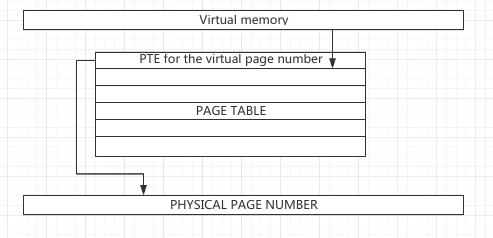
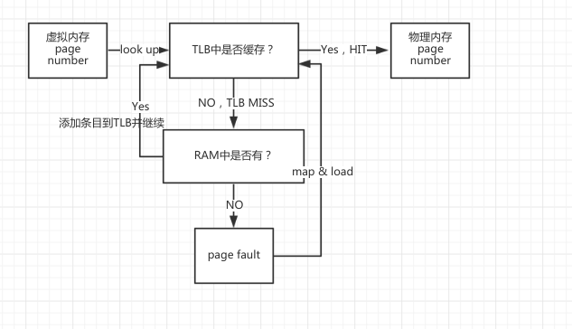

## Memory
* 内存调优是占有非常大的比重的，也是重点中的重点,但是往往我们感受不是那么明显。
* 内存可以调节的参数非常多，具体该调多少,对于Linux的系统运维人员是非常不好掌控的一个尺度，因为大多数都是和编码的有直接关系。

### 虚拟地址和物理地址
* 从286开始，虚拟地址空间和物理地址空间的概念已经被引入，在386时代得到了完全的发展；
* 在32位的Linux系统运行时，任何一个进程都拥有4GB的虚拟内存可使用，而物理内存往往没有4GB大，但是系统不关心，因为应用程序同时使用4GB内存的概率基本为0；
* Kernel一般能够访问物理内存地址，而应用程序只能访问虚拟内存地址；
* 在使用虚拟地址的过程中，存在虚拟地址到物理地址的转换，转换的基本单位是页帧（page frame），因此在真正物理地址上使用的是页帧。在x86架构上，不管是32bit还是64bit，页帧的最小单位为4KB。但是随着用户应用需求的变化，在当今CPU上支持非4KB的页面，即大页。
* 虚拟地址到物理地址翻译的工作由MMU来完成。一个虚拟内存地址进入到MMU被翻译成物理地址才能使用真正的内存。缺点是每访问一次都要花时间，且MMU很贵，翻译过程会占用时间。所以一般CPU会内嵌buffer将其缓存。
* 理想的例子是系统中只有一个进程，而且该进程使用完所有的内存。
* 但实际情况是系统中的进程在使用过程中不断申请内存和分配内存。
* 虚拟内存地址逻辑上是连续的，但是物理地址可以不连续（尽管很多时候我们会尽量要求其连续）。一个页面可以在内存中存在，也可以被交换出去（swap），在内存不足时发生。页帧一般会被彻底镜像到虚拟内存地址的最高空间。

### 查看进程地址空间
* 进程所使用的虚拟内存地址往往可以通过一些工具来查看。
* 比较常用的是/proc/<pid>/statm。另外pmap命令可以显示进程所使用的虚拟地址空间。还有另外一个命令gnome-system-monitor，可以显示进程所使用的虚拟地址。
* 在内存中，一个进程运行时需要的页面数量叫做进程的工作集（working set）。一个进程的工作集在进程的生存时间中不断变化。为了给其他进程在物理内存中的运行提供空间，内核会不断将进程工作集中不用的页面进行调整。如果进程工作集中的某些页面包含了修改过的数据，这些页面必须被写入到磁盘中。如果进程工作集中的页面不包含数据，那么内核只是简单地为其他需要内存的应用程序重分配页面。
* 有时候内核在处理这些工作的时候会占用过多的资源和时间。
* 另外memusage命令可以查看应用程序的堆栈和其他数据，需要通过安装glibc-utils获得。

### 调节进程地址空间
* 通过pam_limits.so来调整系统参数：
    1. Update /etc/security/limits.conf
    bart hard as 15				-->限制用户虚拟内存空间使用：as，单位K；
    @finance hard as 20
    @jre hard stack 100
    • Limiting resident set size (rss) is not currently implemented
    1. Log out and log in
    • Non-privileged users can use ulimit to:
    非特权用户可以使用ulimit来实现：
    • View their own limits
    • Adjust their own soft limits 

> 但真正控制物理内存使用（RSS）在Linux系统上还未实现。用户重新登录之后方可生效。而且普通用户只能够修改soft值而不能修改hard值。

### 物理地址空间
* 由于通过MMU分页的过程非常昂贵，所以将所有的Page table entry（PTE），通过TLB（页表项）进行缓存。缓存的优点：第一次访问经过MMU，而第二次以及后续访问可以通过TLB缓存获得以提高速度。
* 通过下面的命令可以查看page size：
  
    x86info -c
    dmesg
    getconf -a | grep SIZE
    地址翻译的过程存在于TLB中。

* 在内存使用过程中kernel永远不会被交换出去，而且kernel本身会跟踪内存使用。
* 每个页帧代表一个内存真实页，因为页帧带描述项。
* 每个进程都有自己的页表，页表的作用就是从虚拟地址到物理地址部分的寻址。
* 所以整个过程是：内存的使用是由虚拟地址和物理地址之间映射实现，期间由CPU的MMU来进行翻译,并且可以buffer在TLB中。而应用程序只使用虚拟内存。

* 为了高效，计算机上的内存被划分成固定大小的空间，称为page。根据CPU的不同，page的大小也有所不同。在x86架构上，默认的page大小是4KB。但是需要注意的是一个page的数据并不一定要和内存中的一个page对应。在计算机上，内存被划分为页帧，每一个内存的页帧会包含一个页的数据。当应用程序需要访问某个位置的内存，线性地址必须被转换成内存中相应的页帧。如果所需要的页在内存中不存在，内核必须找到该页并且将其读取到页帧中。
* 很多处理器架构支持不同大小的页面。在32位系统上支持4KB，2MB，4MB的页大小。在64位系统上支持4KB，8KB，64KB，256KB，1MB，4MB，16MB和256MB大小的页。TLB的数量一般是固定的，但对于大页，TLB可能也会增大。所以TLB的条目指向的内存越多，意味着TLB的命中率会越高。

### 内存分配
* 在Linux每创建一个进程的时候，不会立即将父进程的内存拷贝一份。所有的进程都是从init进程派生出来（fork）的，但是在每个子进程派生出来之后，先和父进程使用同一块内存地址空间。只有当父子进程写内存的时候，即发生变化，会产生一个技术性的失败（copy on write）才会将内存复制一份。这样做是为了让内存最大限度地最晚分配出来。针对多线程的进程则优势明显，将变化的部分放到其他地址空间，速度快，开销小。
* 当一个进程需要内存的时候，一般kernel都会予以分配，即便物理内存可能已经不够的情况下。因为绝大多数已经存在的进程申请的内存不会立即被使用，所以kernel会将这些内存中不用的一部分释放给新的进程使用。所以原则上kernel会尽可能推迟内存的分配。
* 例如编写一个C语言的程序，当申请内存的时候会发现kernel立即分配，但是这只是一个假象。除非代码把申请的内存立即遍历和写入所有信息，才会将申请到的内存占用。
* 申请内存的时候会产生技术性的失败（page fault）：一种是严重失败，另外一种是轻量失败。
* 轻量失败一般指的是承诺的内存没有分配；而严重失败一般指的是产生交换，即从内存到硬盘的交换。由于硬盘的I/O很慢，所以是严重失败。
* 所以通过命令：ps -o minflt,majflt <pid>,可以看到进程有多少轻量失败和严重失败。
* 当进程使用完内存的时候，kernel也会对其进行回收，而且回收内存也可以调优。策略性回收还是立即回收等等。

##　Page Walk:
* 虚拟内存到物理内存的转换.虚拟内存到物理内存的地址转换存储在页表里面.  page table
* 页表页占内存, 所以存放在内存中,列表之中做一个物理内存的查询,  由一个动作完成  page walk. 由硬件支持完成. 但是动作慢......也是在内存所以慢..时钟周期要看命中率完成.... 最好的解决办法,是能把虚拟内存到物理内存的映射可以缓存起来.
* 64位 page walk 四级划分:  page walk 代价很大. 全局数  --> 上层数--->中层数--->页表,虚拟内存想要到物理内存 需要经过4级别才能到内存页表.  所以代价很大.
* 虚拟内存转换成物理内存的时候,CPU内有个TLB . TLS缓存... 如果发现有虚拟地址到物理地址的镜像关系

* 那么我们就直接使用.叫做TLB hit....  如果没有缓存. 那么会爆出TLS miss.. 不得不做page walk.
    
    1:查询我需要的这部分数据是不是在内存中, 当时kernel 已经曾诺的数据在不内存中.如果存在,则找到数据.并且缓存这次查找的映射关系.
    2:如果这个时候没有办法提供内存. 例如,我承诺你了, 但是你要使用的时候我没有多余的内存分配给你了.
    3:这个时候产生一个技术动作,叫做 page fault. 然后立即分配. 这是好的解决. 最差的情况是 你要的内存事先被交换到交换分区内了. 这个时候代价更大...要从硬盘交换出来.
* page buffer 将我们的虚拟内存到物理内存 缓存起来,来加快查找数据.
* 但是TLB 多大呢?  X86info -c 可以看到TLB 数据.看指令级别和数据级别的.   
    
    TLS = translation look-aside buffer 非常想的CPU内缓存.... 目的就是提速.  TLB 大约10%到15%的速度提升.
    TLB 内存 很贵. 非常不好生产. 设计思想就是搜索快..... 但是TLB 很小.CPU好坏的一个重要指标.而且每次做 上下文切换,TLB都会被彻底的清空... 比如前一个进程时间片到了,换另外一个进程执行,那么TLB将被清空.
* 使用vmstat 1 查看 上下文切换. 最闲页有1000多此交换.
* 所以要想尽办法去利用TLB....

### TLB 增强
* Kernel每次在做context switch的时候会做一次context flush。清空所有的内容。
* 一般context flush的频率非常高。即TLB被清空，下次再读取进来的时候会降低性能。
* 因此如何提高性能？答案是尽量使用物理连续的内存区域，这样可以让TLB的开销比较少，一般该工作是由kernel来实现。Kernel发展到至今，产生了buddy system（兄弟算法），buddy预先占用一定内存，即将一些小页面都统一放到一个大的区域中，即尽量让相同的内容放到同一区域，这样连续性比较高。
* 一般情况下buddy不需要干预。
* 而需要干预的是huge page，即大页。即一次性给足比4K大N多倍的页面，以降低TLB的访问频率和提高TLB的cache命中率，这样同时也降低了MMU的频率。
* 查看buddy相关信息： cat /proc/buddyinfo

### 调整TLB性能
* 针对使用大内存的应用程序: 通常大于8G. 4kib的页来表达. 这个时候会由非常大的性能损失...
* 比如：16Gib oracle SGA. 1000个并发. 需要将16G内存转换成4K的物理页面, 需要4兆个页面. 1000个并发,那么每人都可能用的非常多物理页面. 每个进程的虚拟空间都要去镜像到物理内存区域,那么要花费大量的页表进行描述, 因为每个进程都是独立的. 所以在有16G都不知道够不够.  1半内存做开销了.
* 尤其是业务越繁重,内存越不好用.   x86info -c查看TLB 4 x 4MB
* 使用大页:可以让一个虚拟内存 指向更大的物理内存页.
### 补全图，TLB和大页的映射
    4k    --->  TLB  1条  --->  4k
    2M  ----> TLB 1条   ----> 2M
* TLB 需要描述的对象少了很多, 这样更好的利用的TLB.... 建立2M...因为大页不能切割使用.  必须物理地址连续...不能拼接!!!!  
* 怎么用大页:set  “vm.nr_hugepages=10”  /etc/sysctl.conf
* 你分10个大页, 那么就是10个连续的10个大页. 2M  ... 2M 必须连续.
* 最好的方法是 开机的时候就设置大页... 因为开机的时候非常干净, 因为内存不连续,我们无法分出大页.
* 如果要使用大页, 现在只有2种手段.
    1: 创建伪装文件系统
    mount -t hugetlbfs none /mountpoint
    2: 使用shmget 和 shmat 
* 查看系统上目前的大页大小，通过x86info或者dmesg或者cat /proc/meminfo获得；
* 开启大页支持：修改/etc/sysctl.conf，参数：vm.nr_hugepages=integer
* 启动系统的内核参数：huges=integer	预存大页的大小 （这种方法比较保险）
* 使用的方法：函数调用中有shmat和shmget可以自动调用大页，如果使用mmap读文件，则需要建立一个虚拟文件系统，将其挂载出来，以上述方式挂载。在该目录中使用的对象实际上是大页，从硬盘中拷贝过来的数据，在内存中的物理状态是连续的，因此效率相对较高。而且这种方式也可以作为ram盘来使用。
* RHEL6.2开始,引入了透明的大页使用, TLP (Transparent Huge pages)悄悄的工作, 应用程序不知道. 这个机制在后台,自动去给你拼装大页.有10%的性能提升.
大页不能交换, 但是这个THP可以将大页劈开,进行交换.
* grep Huge /proc/meminfo
* THP: 只要有可能就会合并大页. 如果需要交换就劈开.专用的线程的 kernel 内的 khugepaged. 可以把运行的进程普通的页面换成大页.kernel 自己用的就是大页.
* 大页目前只工作在anonymous 内存内.程序工作过程中,动态生成的内存, 是在是和文件绑定不上的内存, anonymous 内存是可以被交换的.
* 匿名page是和文件不相关的剩余的所有内存单元，可能是程序的数据区、数字、动态分配的内存、有人专门申请的匿名memory区域，可能是mmap对象（非文件）、进程间通讯的内存。统称为匿名page。
* 一般匿名page的大小是非常可观的。
* 一般通过/proc/meminfo查看，并且匿名page可以被交换。一般匿名page=RSS – Shared

### memory cache
* 除了应建的cache之外，在Linux的kernel中cache也是普遍存在的概念。这些cache都和内存有关，但主要的目的就是尽量减少kernel对磁盘的读取。在所有的cache当中，最重要的是page cache，page cache在磁盘I/O中起核心作用。
* 内存使用的原则：
    
    * 针对小的内存对象减少开销；Kernel还有一个实现的方法：slab，也是一种buddy system。Slab设计的初衷就是有利于类似的结构体的申请。
    * 文件系统的元数据，无论读文件和目录，都会以slab对象进行缓存buffer cache；
    * 而disk I/O也称为page cache，page cache大小需要和page size相当；
    * 而drop cache可以将buffer cache和page cache同时丢弃；
    * 进程间通讯，使用的是共享内存，原因是：一、进程间会话；二、相同的内存在只读的情况下可以共享；
    * 网络所有的I/O都可以进行buffer，例如接收和发送的buffer，arp缓存，链接状态跟踪等；

* 当考虑调整内存的时候，需要考虑：什么时候丢弃cache什么时候不丢弃cache？即什么时候回收内存？如果不回收内存，会造成内存很大压力；但如果频繁回收内存，cache得不到最大的发挥。因此需要找到平衡点。
* 所以产生两种方法：

    * 如果将大量的I/O分成小片，这样的话对系统的吞吐量没有明显的感觉；
    * 如果让巨大的I/O瞬间执行完毕，可能排序会更加优秀，但有可能会让用户感觉明显的迟钝。
 
### 内核申请内存的思想：根据需要进行页面缓存
* 页帧的请求一般不会导致内存立即申请，只有在真正使用的时候才会将某部分内存的使用从虚拟内存空间转换成为RSS，还有一些可能是内存的交换；
* 因此通过这种行为，kernel可以帮助我们实现overcommit，也就是说申请超出实际物理内存的内存量。这种行为一般对科学运算等方面的程序更加有用。而真正可以使用的物理内存实际上是物理内存+SWAP，如果进程使用内存超过这个值，就会产生out of memory，并且产生oom-killer而随机杀进程；
* 一般来说，延迟内存的分配直到应用程序真正使用它们会对系统的性能提升带来很大好处。因为很多应用程序尽管申请大内存，但是不会在申请的同时立即使用它们。一旦开始针对一个应用程序分配内存，并不是所申请的内存所有部分都被使用，所以未被使用的部分将被拒绝分配。
* 另外一个需要明确的概念是kernel和用户态进程都得益于虚拟内存。所不太一样的是，当一个kernel进程请求新的内存页面的时候，这个请求一般会立即得到处理。而用户态进程则不一样，在他们请求内存的时候，只有当内存真正被需要的时候才会分配。这种设计会带来一些好处。因此在应用程序真正需要的时候才分配内存就叫做按需分配——demand paging。
* 调整页面分配：

    * vm.min_free_kbytes：这个参数针对某些应用程序经常申请超大的内存然后释放，并频繁进行。由于申请超大内存有两种情况：第一是应用程序的确需要申请超大内存；第二是作为buffer；所以指定该参数表示，表示内核在进行cache过程中，指定部分为应用程序申请内存使用，而不是被buffer。虽然应用程序在申请内存发现内存不够的时候会出现minor page fault。

 ### 调节 vmcommit
* /proc/sys/vm/overcommit_memory

    * vm.overcommit_memory参数中
        0：表示不提供多余内存；
        1：申请多少内核就分配多少，只要不写实际数据则OK，但是一旦写入一定量实际数据，则可能会产生oom-killer随机杀进程，而且杀死的多是用户级进程；一般每个应用程序都带有oom-likely，即更倾向于被杀死的程度；
        2：默认正在使用。如2+50%，表示总的交换分区的大小+50%内存的大小是总共可以承诺的内存，即物理内存的150%+交换为总共可以承诺使用内存大小；
        比如物理内存为1，交换分区为2，那么可使用的值应该是1x1.5 + 2，为kernel承诺应用程序可以使用的内存的大小或者承诺应用程序可以申请的内存大小；
        vm.overcommit_ratio,默认为50，但可以按照需求调整。
        另外在/proc/meminfo中的Committed_AS表示还需要多少RAM就可以避免OOM的情况出现。

### Slab cache
* /proc/slabinfo

    slabtop
    vmstat -m 
    小的内核对象被保存到slab中。
    对于slab的解释：
    指的是内存管理单元先向伙伴系统申请一块较大的物理内存（批发），然后再将其肢解成许多小碎片分配给需要的进程（零售）。当有的进程需要分配一小块内存（一般都小于一个页面，或不是页的整数倍），用来存放某个数据结构（如vm_area_struct），都可以向slab申请零售。

### page cache
* 系统内存有大部分都是在做page cache，主要是在文件读取和文件I/O的时候，例如读目录项、正规文件内容、读写设备文件、mmap函数调用、交换等都会引起page cache。任何时候，在page cache中的数据都是和文件相关。匿名page和page cache都有大量内容从内存中产生，但Page cache和文件相关，不允许被交换；而匿名page是和文件无关的，是可以被交换的。因为page cache是硬盘上已有的内容。
* 区分buffer cache  和 page cache,kernel 2.2 开始: 出现 buffer cache  和 page cache 
实际是在一起的. 都与文件使用相关.
* buffer cache 存储 文件元数据(inodes)也在内, 主要防止内存碎片.目录多的时候,很容易形成内存碎片,有了slab cache 的话,每个分配的内存区域是恒定的. 降低内存的使用碎片.   meta data
* page cache  就是文件内容. block data

    echo n > /proc/sys/vm/drop_caches
        1: block data       page cache
        2: meta data         buffer cache
        3: block and meta data

* 怎么区分 page cache 和 buffer cache
* 页面相关的都是page cache 都是文件内容. page cache 可以被交换出去么? 不可以交换.因为在交换页是磁盘.  没有意义.不能被交换.还不如丢掉.
* buffer cache 文件系统元数据, 大小啊, 权限啊, 属于谁啊.等等..... 所有和文件内容无关的都可以归类在buffer cache 内.  例如dd ,如果源目标是文件, 那么是page cache. 如果是分区.那么是buffer cache.....

* 调整page cache的时候：

    * vm.lowmem_reserve_ratio:做page cache的时候最小预留多少不做page cache，不要将所有内存都作为page cache；
    * vm.vfs_cache_pressure:虚拟文件系统做缓存的时候的缓存率，即VFS做缓存的时候有多么倾向于回收内存。如果该值调高，则kernel比较倾向于回收内存若调低了，kernel会比较倾向于让内容留在缓存中；
    * vm.page-cluster:在做页交换的时候，一次性交换多少页面，若交换频繁，可以调大该值；
    * vm.zone_reclaim_mode:当值为1的时候，zone normal回收打开；当值为2的时候，若系统专门做文件server，即整个内存全部用于共享文件，缓存page buffer。
 
### 匿名页
匿名配置是和文件不相关的剩余的所有内存单元，可能是程序的数据区、数字、动态分配的内存、有人专门申请的匿名memory区域，可能是mmap对象（非文件）、进程间通讯的内存。统称为匿名page。
一般匿名page的大小是非常可观的。
一般通过/proc/meminfo查看，并且匿名page可以被交换。
一般匿名page=RSS – Shared

### SysV IPC
* 进程通信，隐形的内存消耗因素

    * 信号令
    * 消息队列
    * 共享内存
    * ipcs查询共享内存的使用状态
    * ipcs -l 查看系统限制
* /proc/sys/kernel/ 目录下进行调节：
    
    * kernel.sem :一个信号数组最多存储250个信号令；default = 250,
                  信号令的总数是32000个；default = 32000,
                  每调取一个信号令最多可以允许多少个操作；default = 32,
                  信号令数组的个数；default = 128.
    * kernel.msgmnb ：default = 16384.一个单独的消息队列最多可以存储16384字节；
    * kernel.msgmni : default = 16,消息队列最多可以有16个；
    * kernel.msgmax : default = 8192.每个消息的最大值；
    * kernel.shmmni : default = 4096,系统最多可以分配多少个共享内存段；
    * kernel.shmall : 控制共享内存页数，Linux 共享内存页大小为4KB, 共享内存段的大小都是共享内存页大小的整数倍。一个共享内存段的最大大小是16G，那么需要共享内存页数是 16GB/4KB=16777216KB/4KB=4194304。
    * kernel.shmmax : 是核心参数中最重要的参数之一，用于定义单个共享内存段的最大值，shmmax 设置应该足够大；

### 几种页面的状态和类型：
* Free：可以立即被分配的页；
* Inactive Clean：页中的内容已经被写入到磁盘，或者从磁盘读取之后一直没有改变，或者页面可以被分配；即进程使用完，已经被彻底丢弃的页；
* Dirty：该页没有进程在使用以及页内容已经更改，但是还没有写入到磁盘，脏页不能够直接分配；
* Active：页面正在被进程使用；
* 举例：如果将u盘挂载到系统中，一些读写操作之后再umount结束进程，但此时会有很多脏页在系统中，所以需要执行sync，将inactive dirty变成inactive clean。
* 如何查看系统中的脏页和干净页数量

    cat /proc/1/smaps | awk '
    BEGIN { print "Execute before processing input"; }
    /* process input */
    /Shared_Clean/{ CLEAN += $2; }
    /Shared_Dirty/{ DIRTY += $2; }
    END {
    /* execute after processing input */
    print "Shared_Clean: " CLEAN;
    print "Shared_Dirty: " DIRTY;
    }'

### 回收脏页
* 内存不断在变化，因此所有脏页都需要刷到硬盘中，否则数据会丢失。在flush之后，页面就被free出来给其他进程。但如果瞬间flush大量的页面从内存到硬盘，系统会因为I/O紧张而感觉到明显的迟钝。因此要将这些集中并且打的I/O换成更多的小的I/O，则基本上体验不到系统的迟钝。
* 而且flush是kernel的线程，一般无法干预。如果脏页很多flush的数据量会增加，反之就会减少。
* CentOS7 ps -ef | grep flush ,找到kdmflush，所有全局系统进程的脏页数量达到系统总内存的多大比例后，就会触发pdflush/flush/kdmflush等后台回写进程运行。

### 涉及脏页回收的一些参数
* ps axo comm,pid,stat,psr | grep -e kswapd -e fush
* vm.dirty_background_ratio:当脏页达到什么比例的时候，系统就开始考虑将内存中的dirty page往硬盘中进行kdmflush，但不是立即进行flush，默认为10%；
* vm.dirty_expire_centisecs:该数值除以100得到接近30，即当一个页面，脏到什么程度，即脏页存在30s之后才允许进行kdmflush；
* vm.dirty_writeback_centisecs:默认情况下500，即每隔5s，kdmflush就会激活一次；
* vm.dirty_ratio:如果某个进程突然进行暴力I/O，即在物理内存中产生超过%多少的脏页的时候立即进行flush，此时会出现抢线情况，系统将明显变慢，默认该值为20%；
* vm.dirty_background_bytes：控制内存占用的阈值，但是具体的数值.
* vm.dirty_bytes： 控制内存最多占用的阈值，具体的字节数
 
### 回收干净页面：
* 一般sync能够让pdflush立即工作，或者在写代码的时候调用fsync，如果在系统严重崩溃的时候开启魔术键，并用echo s > /proc/sysrq-trigger；快捷键是Alt+SysRq+S。
* 向/proc/sys/vm/drop_caches写入1，会导致所有page cache中的干净页面写入磁盘，但这种操作不会经常进行，因为会比较严重地影响I/O子系统。

### OOM
* 前提条件：所有内存区域都是active，zone normal已经被耗尽，因此会启用oom-killer随机杀死内存，但一般杀死都是占用内存比较大的进程，有时候可能是zone high；
* /prc/pid/oom_score表示某个进程多么不愿意被杀死，数字越小越不愿意被杀死，而越大则越容易被杀死；
* 可以通过修改oom_adj来更改oom_score；
* 可以通过echo f > /proc/sysrq-trigger来调用oom-killer，但如果内存可用则不会真正杀死进程；
* 由于一般情况下oom_score是只读的，所以我们需要通过oom_adj来变相调整oom_adj的值，但是这个更改可能需要在进程被杀之前设置：
* 若echo n > /proc/pid/oom_adj，则在oom_score中会获得2n的值，从刚才的理论来看，如果将oom_adj设为0则可以使某个进程免于被杀；
* 一般可以通过vm.panic_on_oom=1，使得在产生oom不生效；
* vm.overcommit_memory
       0: kernel 很大方,要就给,排除疯狂程序. 就是不着边际的要内存
	   1:  要多少给多少
	   2: 超过我的能力限制,我就不给你.
* vm.overcommit_ratio 设置百分比.   这个百分比可以超出100,swap+物理内存的百分比(默认是50%)  作为虚拟的最大值.

### Detecting memory leaks
* 获得内存溢出的信息；内存溢出（泄露）的大多数原因是因为应用程序申请内存之后而没有及时释放；
* valgrind --tool=memcheck cat /proc/$$/maps
    
    * [root@stationX ~]# valgrind --tool=memcheck cat /proc/$$/statm

 
 ### What is swap?
* Swap out：交换出去的原因是内存不足，因此将一部分进程交换到硬盘以腾出内存页（clean）来供新的进程申请；
* Swap in：当发生major page fault的时候，即严重页面失败，即一个被交换到硬盘的应用程序重新活过来的时候需要被交换到内存中；
* 什么样的页面会被交换？匿名页面和不活动的页面；
* Swap cache：只是一个计数器（记录器），即上次被交换的页面会被记录。用于记录交换出去的东西是否被更改；

 
### 增加交换分区的性能的手段包括：
交换分区单独放硬盘或者分区；对虚拟机设置单独交换；设置多个交换分区（最多32个）；对不同的交换分区设置优先级（高速硬盘的优先级比低速硬盘优先级更高）；
所以一般需要大量使用交换的时候会对交换分区进行调优；

### Tuning swappiness
* 一般kernel多么愿意被交换？一般通过vm.swappiness来设置：
* 调节 . kernel 会检查一个变量叫做 swap_tendency,如果这个值小于100不太想交换,如果大于100非常想交换,
* swap_tendency =  mapped_ratio / 2 + distress + vm_swappiness

    算法: 当前内存使用比例的一版 mapped_ratio / 2系统中有多么的渴望释放内存 distress (0-100),我们无法调节.
* 所以我们只能稍微的影响一下.新版kernel加了个distress.我们变的很难控制了,kernel自己调节的.我们无法干预.
* 可以通过dd一些数据到/dev/shm中消耗内存来测试；

### Tuning swap for think time
* 交换分区的调整方法：
    
    * vm.page-cluster:表示一次性swap in以及swap out的值，如果该值越小越感觉不到被交换；
    * vm.swap_token_timeout:表示内存已经耗尽，交换分区在频繁进行交换过程中，一个进程在再次进行page out之前要等待多久，该值确定一个程序被swap out前要等待多少秒才再次被swap out；

### Tuning swap visit count
1. Create up to 32 swap devices
2. Make swap signatures
mkswap -L myswap /dev/sdb1
3. Assign priority in /etc/fstab
/dev/sda1 		swap 	swap 	pri=3 0 0
LABEL=myswap 	swap 	swap 	pri=3 0 0
/dev/sdc1 		swap 	swap 	pri=3 0 0
/var/swapfile 	swap 	swap 	pri=1 0 0
4. Activate
swapon -a
• View active swap devices in /proc/swaps

/dev/sda1 		swap 	swap 	pri=3 0 0
LABEL=myswap 	swap 	swap 	pri=3 0 0
/dev/sdc1 		swap 	swap 	pri=3 0 0
/var/swapfile 	swap 	swap 	pri=1 0 0

通过上例查看，可以对swap使用卷标，以及可以对同类的设备设置相同的优先级以实现交换的轮询，而显然对基于文件的swap设备的优先级比较低；

## 总结
* 很多时候我们可以直接使用内存的默认参数，但是有一些恶劣的环境需要我们去修改内存的参数来进行调优
* 平时一定要注意采集内存的相关数据，也要设置必要的监控，及时绘图发现内存的走向，持续升高可不是一件好事
* 本章最主要的是了解Linux内存的工作原理，以及相关的必要的设置参数，万不得已的时候，救命之用！
 

