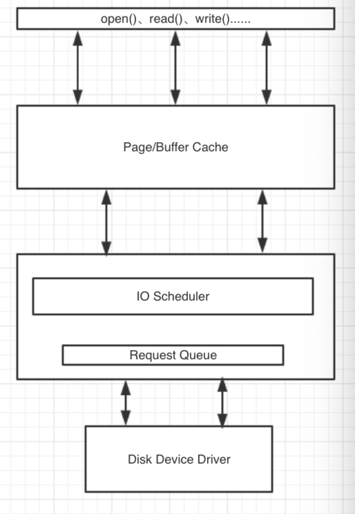

## Disk 

* 需要明确一下，我们为什么要对disk 进行调节？
* 最主要的原因是“慢”，尤其是机械盘，现阶段的主机内除了磁盘还处在原始的机械状态，其余的部件都已经实现芯片化，当然你也可以选择固态磁盘，但是当前固态磁盘的价格比较昂贵，大多用于缓存和加速，很少大范围的应用到直接的数据存储，所以对于机械磁盘的调节方式我们还是有必要掌握一些有效的技能。
* 在掌握调节技能之前，我们先了解一下机械盘的一些特性和影响因素，然后在学习调节方式。

### 影响磁盘IO的物理因素

- 磁盘是电子机械设备，因此会受到一些性能限制，而这些限制则不会存在于晶体管设备上。
- 磁盘由盘片、磁头、柱面和扇区组成。在磁头访问数据的时候，通常会产生两种延迟（旋转延迟和寻道延迟）。现代的ZCAV磁盘在磁盘外圈有更多的线性存储空间。在磁盘以恒定的速度转动时，在相同的时间内可以于外圈访问到更多的数据。
- 不同的磁盘接口对数据的IO有绝对性的影响，传输速率的大小会影响磁盘的IO整体性能。
- 硬盘大小一般等于：磁盘 x 柱面 x 扇区（512字节）

### ZCAV

- 所谓ZCAV，就是在硬盘低级格式化的时候将磁盘的一部分空间屏蔽掉（内部），分区一般从外部向内部分，理论上越往外越快，所以类似交换分区这种不常使用的分区则会被放到内圈；所以一般SCSI硬盘尽管容量不大，但是可能只使用外圈的部分；例如在使用磁盘柜的时候，可以将其中的每个硬盘的第一个分区作为逻辑盘，给最重要的数据使用和访问，之后的分区用于容纳操作系统，再之后的分区用于交换分区等；

### linux如何访问磁盘

* 最低端是驱动程序,在往下就是硬件. 最顶端的程序发起来操作.一个程序发起操作之后,写的对象,读的对象,操作的对象全部都是内存.
* 内存中有2种对象, page cache , buffer cache.
    * page cache:  文件内容缓存
    * buffer cache:  文件元数据缓存
* 选择一个IO调度算法.按照算法排队, 在L值满足的条件下,一次丢给磁盘驱动,然后驱动去做剩下的事情.

### Elevaor算法

* Elevaor算法会重新对请求队列进行调整按照优先级高低进行读取和写入，文件系统元数据通常存储于buffer缓存中；文件数据通常存储在page缓存；很多的驱动器都有自己的内部缓存，而使用Direct IO可以实现绕过kernel缓存的功能。
* 高级的IO请求，例如在Linux虚拟文件系统上产生的读写通常情况下会被转换为块设备请求。而kernel会调度每一个块设备请求最终形成块设备请求队列。每一个物理磁盘都有自己的块设备请求队列。而在队列中的块设备请求就是块设备请求队列描述符数据结构。这些信息描述了内核处理IO请求的时候需要知道的很多细节信息。每一个请求描述符会指向到一个IO传输，而IO传输又会牵涉到一些磁盘操作。
* 当一个进程向设备请求IO时将产生一个请求数据结构并加入到该设备的队列中。请求数据结构包含了一些指针，这些指针会指向磁盘具体的扇区以及其在内存中相对应的页面以及缓冲。如果请求是需要读取数据，那么数据传输的方向会从磁盘到内存，反之则从内存到磁盘。
* 实现一个IO请求会牵涉到一系列的动作，一个高级的磁盘设备操作会将IO请求按照一定的调度算法加到队列中。为了避免加入到队列的请求立即导致IO操作，队列会被分块或者被插入。一旦在队列中有了足够的请求数量，那么队列将会被拔出并执行。
* 基本的IO传输单位是页面。每一个请求的页面会关联内存当中的页面缓存。在/proc/meminfo文件当中会发现一些页面被应用为cache， 而一些页面被应用为buffer cache。在page cache中主要包含了文件的数据信息，而在buffer cache中包含了文件系统的元数据信息。
* 用户态的应用程序一般不会直接访问buffer，所以buffer一般由kernel维护。

### IO调度算法
* CFQ: 完全公平队列. 适合大众化的各种负载.非极端的.
* deadline: 到期就干活.可预知的行为,例如发起IO请求,到时间不管有没有更高的优先级的,你都要去给我IO请求.linux不是时时系统.
    * 虚拟机的物理机器,建议使用deadline.让每个guestos 都能公平的得到东西
* 预想算法: 每次读操作之后多等一会,例如5毫秒.去预想下一个读取.适合于大量的顺序读操作. (CentOS7 已经取消了)
* noop:什么都不做. CPU 不用考虑谁先谁后. 适用于固态磁盘. 适合于虚拟机.
    * guest os... 虚拟机本来就是本来就是文件.在虚拟机内要过缓存,真机也要过缓存,这样浪费资源, 所有真机可以用cfq或者deadline,虚拟机就直接noop.
* 每个磁盘可以有不同算法，互不干扰。

### 算法和队列
* Queue length	
    * 更长的队列可使读操作在写操作被合并，可能会增加延迟
    * 磁盘队列长度 /sys/block/sda/queue/nr_requests
* Scheduler algorithm
    * /sys/block/sda/queue/scheduler
    * noop [deadline] cfq   （默认是deadline）
* 调整的思路
    * 在对磁盘队列进行优化的时候需要优先考虑的是读方面的性能，而且读取也是关键的。因为应用程序在没有数据的情况下无法运行。
    * 当调度IO请求的时候，内核必须处理和实现两个相互矛盾的目标。最有效的访问磁盘的方式是尽量保证连续性访问，即访问的数据在磁盘上按照同样的方向顺序分布。这样对于第500个块的磁盘访问就会在第5000个块之前。
    * 当向队列中增加一个entry，内核将首先尽量将新的请求合并到原有的队列中而形成一个新的更长的队列。如果新产生的请求已经无法合并到现有队列中，该请求将由当前的电梯算法控制而被指派到队列中的另外一个位置。
    * deadline调度算法通过降低性能而获得更短的等待时间。
    * noop算法对等待时间和性能方面都做了折中，只是通过简单的排列来获得CPU周期。
    * cfq算法对所有因素也都做了折中而尽量获得公平性。

### deadline调整
* 调整deadline调度算法：目标是使wait time是可预见的
* 执行echo deadline > /sys/block/sda/queue/scheduler 使用该调度算法
* 在deadline的IO调度算法中，每一个请求都被指派一个过期时间。当过期时间已到，调度器会将请求移到磁盘上。为了减少额外的寻道时间，调度算法会优先处理在附近的请求。
* 可调的参数包括/sys/block/sda/queue/iosched/
    * read_expire -  以毫秒计算的读请求过期时间
    * write_expire -  以毫秒计算的写请求过期时间
    * fifo_batch - 从队列列表中转移到磁盘队列中的请求个数
    * writes_starved - 定义了在写的请求之前会优先执行多少个读的请求？在writes_starved中的读被已到块设备队列之后，一些写将被排到队列中。
    * front_merges - 一般情况下IO请求将被合并到队列的尾部，该参数定义了新的请求是否被合并到队列头部，这种方式将会产生更多的工作量，0表示头部合并将被禁用。
* 优化读写队列时间，当超时限度达到的时候请求必须被执行，当可能时多个请求会从新的位置被调度。
* 用deadline算法保证对于既定的I/O请求以最小的延迟时间，从这一点理解对于 DSS 应用应该会是很适合的。
* 在这个中 deadline 调度算法通过降低性能而获得更短的等待时间，它使用轮询的调度器,简洁小巧,提供了最小 的读取延迟和尚佳的吞吐量,特别适合于读取较多的环境(比如数据库,Oracle 10G 之类).

### noop调整
* 对noop调度器的调整，目标是节省CPU时钟周期
* 通过执行echo noop > /sys/block/sda/queue/scheduler使用该调度算法
* 基本没有需要调整的参数，当CPU时钟周期方面的需求比较迫切时使用，SAN的CPU时钟频率会比主机的CPU时钟频率更加宝贵。
* I/O请求被分配到队列，调度由硬件进行，只有当CPU时钟频率比较有限时进行。
* 对于I/O不那么操心，对所有的I/O请求都用FIFO队列形式处理，默认认为 I/O不会存在性能问题。这也使得CPU也不用那么操心。当然对于复杂一点的应用类型使用这个调度器，用户自己就会非常操心。
* noop调度算法指的是当请求被存储到队列并交由I/O子系统处理时由磁盘硬件对其进行优化。该算法一般只对一些特定的硬件（例如RAM disk和TCQ disk等）。
* 现代磁盘控制器都具备通过tagged command queuing进行优化的功能。Tagged command queuing（TCQ）可以通过由磁盘控制器对I/O请求进行重新排序来减少磁头的动作。通常需要进行重组的I/O请求都会带有一个标识符，这样控制器在接收到这些I/O请求的时候会按照规则进行处理。

### CFQ调整
* 对CFQ（默认）调度器的调整，目标在于针对不同的应用程序提供不同的IO服务。
* 通过执行开echo cfq > /sys/block/sda/queue/scheduler启该调度器
* CFQ调度算法的目的是对所有的进程平均分配IO，一般CFQ IO调度器会保存64个内建队列，并以轮询方式将新的请求附加到队列中。一般请求会从非空队列中提出来并附加到准备上CPU的队列中。IO请求以减少磁头寻道时间的方式来排列。
* 可调的参数包括/sys/block/sda/queue/iosched/
    * quantum -	在每一个周期放入调度队列的请求总数
* 对所有因素也都做了折中而尽量获得公平性,使用QoS策略为所有任务分配等量的带宽,避免进程被饿死并实现了较低的延迟,可以认为是上述两种调度器的折中.适用于有大量进程的多用户系统。
 
 ## 总结
以上是针对磁盘的一些基础调优，根据生产的实际环境，设置磁盘相应的算法，将会事半功倍，设置之前一定要搞清楚你的服务类型是什么？

##The virtual file system (VFS)

vfs图片待补全

cat /proc/filesystems

所有Linux系统上的文件操作都要基于VFS，即虚拟文件系统。VFS为应用程序访问磁盘文件提供了通用的接口，并且隐藏了从文件系统到设备驱动访问的细节。同时以前所提到文件系统的缓存和内存管理也是由VFS进行。在存储文件的时候，文件类型其实是由应用程序对VFS的访问方式而决定的。其中目录项和i节点缓存中与内存管理相关的内容也是由VFS来维护。文件的类型并不是依赖于其以什么方式存储，而是依赖于应用程序在什么层次对其进行访问。
The Virtual File System, or VFS, layer is the interface which handles file system related system calls for the
kernel. It provides a uniform mechanism for these calls to be passed to any one of a variety of different file system
implementations in the kernel such as ext3, msdos, GFS, NFS, CIFS, and so on. For example, if a file on an ext3-
formatted file system is opened by a program, VFS transparently passes the program's open() system call to the kernel
code (device driver) implementing the ext3 file system.
The file system device driver then typically sends low-level requests to the device driver implementing the block
device containing the filesystem. This could be a local hardware device (IDE, SCSI), a logical device (software RAID,
LVM), or a remote device (iSCSI), for example.
Volumes are contrived through device driver access. Whether the volume is provided through a local system bus, or
over an IP network infrastructure, it always provides logical bounds through which a file (or record) data structure is
accessible. Volumes do not organize data, but provide the logical "size" of such an organizing structure.
Use the following command to view which filesystem drivers are currently in the kernel:
cat /proc/filesystems

VFS是系统中的一层，并且也是为内核处理文件系统相关系统相关系统调用的接口。VFS是内核处理和文件系统相关的系统调用的接口，他提供了一种通用的机制将系统调用传递到内核对不同文件系统如ext3，msdocs，NFS，GFS，CIFS等的操作中。例如一个在EXT-3文件系统上的文件被一个应用程序访问，VFS将透明地传递程序的open()系统调用到访问文件系统的内核代码（设备驱动）。
文件系统设备驱动将发送底层的清除到设备驱动，当然该设备上包含了文件系统。这些设备包括本地设备，如IDE，SCSI以及逻辑设备，如软件RAID，LVM，或者其他的远程设备，如iSCSI等。
 
### XFS

### 参考
对磁盘I/O的影响主要因不同设备的访问方式不同而异：
不同的存储设备大概包括两种：字符设备和块设备

对字符设备的访问特点：
顺序I/O；高负载，低延迟；传输的数据块大小会对性能产生影响并且I/O可以被缓冲；由于缓冲方式简单所以提供的可调优的余地很小；
对块设备的访问特点：
随机I/O；平均访问时间高但吞吐量也高；对块设备的访问中，页面是I/O请求的基本单位；因为其复杂的缓冲机制提供了众多可调优的余地。

影响I/O的物理因素：
磁盘是一种机电设备，因此会产生两种类型的延迟：寻道延迟和旋转延迟
磁盘一般由盘片、磁头和电机设备构成，而容量计算方面通常由磁道、扇区、柱面构成。由于每个磁道被规划为多个不同的扇区（每个磁道通常会规划为63个扇区），如果有访问请求需要定位某个磁道上某个扇区的数据，那么磁头转移到该位置需要延迟，该延迟称为寻道时间（seek time），同时磁盘中的盘片本身在旋转的过程中也会产生延迟，也就是说磁盘控制器必须等待磁头已经定位到所请求的扇区（rotational delay）
现代的磁盘设备都会利用这样一个原则，由于盘片的外缘包括了更多的扇区，所以往往可以提供更多的线性存储空间。假如盘片按照恒定的速率转动，在固定时间中数据扇区越靠近外缘，则越会更多地被读取到。
Zoned constant angular velocity （ZCAV）?

大多数的现代磁盘有读写缓存用于加速读写以性能。由于写入缓存有可能在掉电或者当机等某些以外情况下导致数据丢失，所以很多设备商都将写入缓存关闭。但是开启写入缓存可以明显改善磁盘性能。

目前对硬盘速度的认识往往是爆发值速度（burst rate），也就是说这是在固定时间内系统总线上产生的最大传输速度；相对而言内部传输率（internal transfer rate）是衡量硬盘性能很有用的一个参数，该值才是真正磁头读写数据的速度。
计算内部传输速率的公式：data rate = 每磁道扇区数 x 512字节（扇区大小）x 转速（rpm）/60
由此可见，内部传输率计算的是每秒磁头读写产生的数据量
对于新的ZCAV磁盘来说，磁盘内部传输率的计算公式是：
speed = 每磁道扇区数 x 512字节（扇区大小）x 转速（rpm）/60/1000000
平均访问时间 = 平均寻道时间 + 平均等待时间

一般会影响磁盘I/O的因素包括：
操作类型：读取、写入、更改
访问类型：顺序、随机
优化读取方面的访问请求是关键！
对于写入，kernel采用一种“被动接近”方式

在众多的子系统中，I/O子系统是可调性最大的但同时也是瓶颈所在的子系统。从某种意义上说I/O子系统的性能调优是尽量减少写入方面的动作以优化性能。

在对I/O子系统进行性能调优的时候需要考虑其工作量以及服务类型。对于磁盘子系统来说，基本操作包括读取、写入以及修改（先读取然后延迟最后写入）。

访问类型可以分为顺序和随机。影响顺序访问性能的因素主要是磁盘的传输率，一般建立和拷贝一个文件的操作是高层操作并会产生顺序访问的I/O；而随机访问很多时候会受到磁盘寻道时间的影响，NFS文件服务以及用户主目录的读写多会产生随机访问的I/O。

确保优化读取方面的性能是优化I/O子系统的关键。因为读取的速度会使用户直接产生“磁盘有多快”的观念。但对于写入操作而言，kernel就不会主动采用太多的措施去对其进行优化。

有两个不同的步骤服务于I/O请求：
1．	将I/O请求放入到请求队列；
每一个块设备都有自己的队列用于处理读写请求；
在新的队列产生的时候已经处理的空队列将被移除
2．然后及时执行传输操作

Direct I/O会跳过缓冲层：
对于一些自身带有cache功能的应用程序可以使用Direct I/O，其好处是防止重复页帧的产生，因为读写系统的调用速度会因为页面缓存和写前缓存的使用而变慢。

I/O传输的基本单元是页面，从磁盘上每一个数据页面的传输都需要内存中相关的页面缓存中的页面。在/proc/meminfo中可以看到一些内存被用于页面缓存而一些内存被用于缓冲缓存，页面缓存用于缓存文件数据而缓冲缓存用于缓存文件系统元数据。在2.6内核中页面缓存和缓冲缓存已经被合并，但是kernel仍然会跟踪哪个缓存用于数据而哪个缓存用于元数据。

用户空间的应用程序一般不会直接访问缓冲，因此缓冲由kernel来维护。

高级的I/O请求，例如来自VFS的读写请求需要先转换成块设备请求，内核会调度设备请求队列中的每一个块设备请求来执行。而每一个块设备都拥有自己的设备请求队列，存储于设备请求队列中的访问请求实际上以块设备请求描述符的形式存在，这些描述符会提供kernel处理I/O请求所需要的详细信息。一个单独的请求描述符会产生一个I/O传输，并且该传输会调用一些相关的磁盘块。

当一个进程需要请求某个设备上的I/O时，一个特定的请求结构会被放到该设备队列中。这些请求结构包含了指向磁盘某些扇区的指针，并且这些指针又指向内存中用于完成数据传输的相关页面和缓冲。如果数据请求是读取，则数据传输方向是从磁盘到内存；如果数据请求是写入，则数据传输方向是从内存到磁盘。

队列请求一般会从I/O操作中分离，真正的数据传输是由可以和设备进行底层通讯的应用程序完成。实现一个I/O请求是一个相互合作的过程：
上层设备驱动会将I/O请求放到设备请求队列中。这些请求队列是基于调度算法的队列。为了防止单个请求立即产生I/O操作，请求队列通常会被阻止执行，一旦队列中的请求数量达到要求则请求队列就会被放行，而且底层的设备驱动将会在内存和磁盘之间开始进行数据转换和传输。

提高缓冲效率所采用的方法：
增加队列长度，在进行写入操作之前使队列能够容纳更多读方面的请求，增加队列之间的延迟使队列能够具有更多的时间容纳更多的请求。

Kernel会自动按照一定的顺序进行预读。
预读的目的：减少寻道时间、减少磁盘控制器的操作、减少等待时间
但是在有随机访问请求的时候预读功能会关闭。

在对数据的访问中，读取是最关键的。所以一般内核会自动按照其自己的方式对读取访问进行优化。优化的方式是：
在随机访问中，kernel也会假设要读取数据是连续的，并按照这样的顺序进行数据预读。通过对应用程序的预读kernel可以将程序所需要的数据页面缓存到内存中，这样kernel可以快速找到应用程序所需要的数据。这种做法也可以减少磁盘控制器的负载，最终的结果就是减少响应时间。
当然，这种预读的方法对于随机访问和经常要重新读取同一块数据的应用程序是没用的。所以如果kernel发现读取的数据是这种类型就会自动关闭预读功能。

调整缓冲区的方法：
控制队列长度的文件：
[root@localhost ~]# cat /sys/block/sda/queue/nr_requests 
128
预读数据量大小：
[root@localhost ~]# cat /sys/block/sda/queue/read_ahead_kb
128
初始的预读窗口大小是最大值的一半。

预读窗口控制kernel在执行I/O操作时预读的数据量。对于2.6版本的内核，预读通常由两个内部参数计算：当前窗口和预读窗口。当应用程序从缓冲中读取的页面实际上是当前窗口中的一部分，而I/O产生于预读窗口；当应用程序完成从当前窗口的读取，那么预读窗口成为新的当前窗口而新的预读窗口又会产生。如果对页面的访问产生于当前窗口那么新的预读窗口会增加两个页面，反之如果预读命中率比较低，预读窗口就会缩小。

预读窗口的最大值可以通过/sys/block/<dev>/queue/read_ahead_kb来指定，该值需要针对不同的设备采用不同的设定，但该参数可以推算出初始预读窗口的大小，一般情况下初始预读窗口设置为该值得的50%。

针对磁盘物理特性对性能产生的影响，内核会对队列中请求进行排序。
这种排序实际上是合并，通过iostat命令执行之后的rrqm/s和wrqm/s进行衡量。

在考虑I/O调度问题的时候，一方面要尽可能使磁头能够在尽量长时间向一个方向移动但需要防止I/O闲置，也就是需要缩小等待时间。

当向队列中增加一个请求时，kernel会首先尝试将该请求和队列中已经存在的请求进行合并。如果要将新的请求和现有请求进行合并，那么在新的请求中要传输的数据块和已经存在的请求所要传输的数据块必须属于同一个块设备，顺序传输并属于同样的传输类型，但经过扩展的请求所占的磁盘扇区不能超过该设备支持的最大值以，而且所使用的内存段无法超过该设备支持的最大值。

当调度I/O请求的时候，kernel必须要协调两个存在冲突的目标。最有效的访问磁盘驱动器的方式是使访问尽量按照同一个顺序进行，这样对磁盘数据的访问寻址就会按照磁盘上的逻辑块地址增加而增加。也就是说磁盘块500会在磁盘块5000之前被访问。同时kernel必须确保所有的进程及时获得所需要的I/O而不会出现等待I/O的现象。I/O调度必须确保I/O获得的连续性。

升降机算法用于确定在什么地方向队列插入请求或者一个请求是否被合并到其他的请求中去。在Linux 2.6的kernel上提供了对这种算法的支持。

几种不同的I/O队列排序方法：
CFQ（默认）：
对所有的进程平均分配I/O带宽；

Deadline：
优化读写队列时间，当超时限度达到的时候请求必须被执行，当可能时多个请求会从新的位置被调度。
Deadline scheduler用deadline算法保证对于既定的I/O请求以最小的延迟时间，从这一点理解对于 DSS 应用应该会是很适合的。

Anticipatory：
对读操作优化服务时间，在提供一个I/O的时候进行短时间等待，使进程能够提交到另外的I/O。Anticipatory scheduler（as) 曾经一度是Linux 2.6 Kernel的I/O scheduler。Anticipatory的中文含义是“预料的，预想的”，这个词的确揭示了这个算法的特点，简单的说有个I/O发生的时候，如果又有进程请求I/O操作，则将产生一个默认的6毫秒猜测时间，猜测下一个进程请求I/O是要干什么的。这对于随机读取会造成比较大的延时，对数据库应用很糟糕，而对于Web Server等则会表现的不错。这个算法也可以简单理解为面向低速磁盘的，因为那个“猜测”实际上的目的是为了减少磁头移动时间。

Noop：I/O请求被分配到队列，调度由硬件进行，只有当CPU时钟频率比较有限时进行。
Noop对于I/O不那么操心，对所有的I/O请求都用FIFO队列形式处理，默认认为 I/O不会存在性能问题。这也使得CPU也不用那么操心。当然对于复杂一点的应用类型使用这个调度器，用户自己就会非常操心。

对于数据库应用Anticipatory scheduler的表现是最差的。Deadline在DSS环境表现比cfq更好一点，而cfq 综合来看表现更好一些。这也难怪RHEL 4默认的I/O调度器设置为cfq。而RHEL 4比RHEL 3整体I/O改进还是不小的。

如果查看/var/log/boot.msg文件，通过过滤“io sheduler”关键字可以获得当前系统在使用哪种I/O调度器。
在操作系统上可以查到的相关文档：
/usr/src/linux/Documentation/block/as-iosched.txt
/usr/src/linux/Documentation/block/deadline-iosched.txt

对deadline调度算法调整的方法：
[root@localhost ~]# cat /sys/block/sda/queue/scheduler 
noop anticipatory deadline [cfq]
可以调整为：
[root@localhost ~]# echo deadline > /sys/block/sda/queue/scheduler
[root@localhost ~]# cat /sys/block/sda/queue/scheduler 
noop anticipatory [deadline] cfq

可调整的最大队列时间：
[root@localhost ~]# cat /sys/block/sda/queue/iosched/read_expire 		读请求的过期时间
500
[root@localhost ~]# cat /sys/block/sda/queue/iosched/write_expire 		写请求的过期时间
5000

可从调度列表中移动到块设备请求队列中的请求数量：
[root@localhost ~]# cat /sys/block/sda/queue/iosched/fifo_batch 
16

在写操作做被调度之前可以允许的读的数量：
[root@localhost ~]# cat /sys/block/sda/queue/iosched/writes_starved 
2
也就是说读操作比写操作多出的数量。在该数量之外的读请求将被移到设备请求队列，即交由磁盘操作。

是否尝试从前部分合并连续的请求，因为多数情况下请求会被合并到队列的后部：
[root@localhost ~]# cat /sys/block/sda/queue/iosched/front_merges 		这种操作需要更多的工作
1

针对deadline这种I/O调度算法，每一个请求都被分配一个过期时间，该时间到达时调度器会将请求所在的位置移动到硬盘上（我理解为在过期时间达到之前，请求在队列中，一旦到达则被真正提交到硬盘上开始处理），为了防止额外的寻道时间deadline算法也会处理和这些I/O位置比较接近的I/O请求。

对anticipatory调度算法的调整方法：
[root@localhost ~]# cat /sys/block/sda/queue/scheduler 
noop anticipatory deadline [cfq]
可以调整为：
[root@localhost ~]# echo anticipatory > /sys/block/sda/queue/scheduler
[root@localhost ~]# cat /sys/block/sda/queue/scheduler 
noop [anticipatory] deadline cfq

在多数情况下，这种调度算法会使应用程序在执行一个读请求之前，也就是在读取一个新的磁盘块之前会有一小段think time，这一小段的时间磁头可以移动到磁盘其他位置读取其他进程所需要的数据并一起合并到对下一个磁盘块的读取上。这会对应用程序产生一定的延迟。这种I/O调度算法针对某些应用可以提供更好的性能。
读写操作可以分批执行，每个批次的执行都需要占用一定的时间，一般分配给读批次的时间要比给写批次的时间更长。

可调参数有：
[root@localhost ~]# echo "anticipatory" >> /sys/block/sda/queue/scheduler 
[root@localhost ~]# cat /sys/block/sda/queue/scheduler 
noop [anticipatory] deadline cfq 
[root@localhost ~]# cat /sys/block/sda/queue/iosched/antic_expire 在下一个读请求之前所等待的时间
4
也就是控制进程在产生新的I/O请求之前所需要等待的时间。

[root@localhost ~]# cat /sys/block/sda/queue/iosched/read_expire 读请求在多少毫秒之后到期
124
[root@localhost ~]# cat /sys/block/sda/queue/iosched/write_expire 写请求在多少毫秒之后到期
248

[root@localhost ~]# cat /sys/block/sda/queue/iosched/read_batch_expire 
500
在执行写操作之前，允许读操作执行的时间。

[root@localhost ~]# cat /sys/block/sda/queue/iosched/write_batch_expire 
124
在执行读操作之前，允许写操作执行的时间。

对cfq调度算法的调整方法：
[root@localhost ~]# echo cfq > /sys/block/sda/queue/scheduler 
[root@localhost ~]# cat /sys/block/sda/queue/scheduler 
noop anticipatory deadline [cfq]
通过上述方式调整I/O调度算法为CFQ，其目的是为了将I/O带宽平均分配给多个请求I/O的进程。这种调度算法会维持64个I/O内部队列并会对这些队列进行轮询。
针对这种调度算法的可调参数为：
[root@localhost ~]# cat /sys/block/sda/queue/iosched/quantum 	在每一个周期放入调度队列的请求总数
4

[root@localhost ~]# cat /sys/block/sda/queue/iosched/queued 在每一个内部队列中允许的最大请求数
8

对noop调度算法的调整方法：
[root@localhost ~]# echo noop > /sys/block/sda/queue/scheduler 
[root@localhost ~]# cat /sys/block/sda/queue/scheduler 
[noop] anticipatory deadline cfq

Noop调度算法指的是当请求被存储到队列并交由I/O子系统处理时由磁盘硬件对其进行优化。该算法一般只对一些特定的硬件（例如RAM disk和TCQ disk等）。

现代磁盘控制器都具备通过tagged command queuing进行优化的功能。Tagged command queuing（TCQ）可以通过由磁盘控制器对I/O请求进行重新排序来减少磁头的动作。通常需要进行重组的I/O请求都会带有一个标识符，这样控制器在接收到这些I/O请求的时候会按照规则进行处理。

有些应用程序需要对队列长度进行限制，而现代的设备驱动都具备用于控制队列长度的TCO功能，并且该功能可以作为内核参数在系统启动的时候添加。例如要控制SCSI驱动器Lun2的队列长度为64个请求，可以修改/etc/grub.conf并增加下面的内核参数：aic7xxx=tag_info:{{0,0,64,0,0,0,0}}

选择合适的块设备：
IDE：133MiB/s
SATA：300MiB/s
SCSI：320MiB/s
Fibre Channel：256MiB/s
同时对于虚拟化而言尽量使用物理块设备而不要使用文件作为Dom-U的存储，因为使用物理磁盘上的文件作为Dom-U存储会大大降低Dom-U性能并且易于造成数据丢失。如果一定要使用文件作为Dom-U存储，请务必使用tap:aio作为虚拟机的块设备（VBD）。

对于IDE设备进行调优的手段：
多数情况下通过hdparm可以设置IDE硬盘运行参数，但是不建议这样做。因为所设置的参数可能无法和内核完全兼容。

对于SCSI设备进行调优的手段：
SCSI接口采用并行总线架构。连接到总线的设备会通过target标识符或者Lun来进行区分。Lun支持8个不同的设备以不同的标识符连接到target上，或者在target上有一个设备，但是该设备有多个Lun。计算机连接到SCSI总线的连接器是HBA卡也必须被分配标识符。一般来讲标识符数字越低代表优先级越高。

同时SCSI存储设备一般会有物理方面的限制，用户通常无法超过允许的总线长度并且所有的总线都必须被终止。总线的terminator通常是电阻阵列并主要用于防止SCSI信号沿线路回传。第一和最后一个SCSI总线需要被终止，没有终止的SCSI总线会导致服务器性能下降。不过多数现代的SCSI设备都有自行终止的功能。

不管怎样，在使用SCSI总线时候的一个突出问题是在同一个总线上混用不同速度的设备。这将造成速度快的设备减速以适应速度慢的设备。

SCSI概述：
小型计算机系统接口（Small Computer System Interface）更常见的是称为SCSI，这个接口设计用于连接磁带等流设备和磁盘、CD-ROM等块存储设备。它也曾用于其他设备，比如扫描仪和打印机。SCSI设计支持总线上的多个设备。某个叫做控制器（controller）的设备负责管理总线。SCSI设备可以是内置的，也可以是外置的。 

American National Standards Institute（ANSI）已经制订了三个主要版本的SCSI标准。 
SCSI 
是最初的标准（X3.131-1986），现在通常称作SCSI-1。这是在Shugart Associates为实现用于磁盘设备的标准接口而获得的成果中提出的。这个标准支持每条线缆上最多8个设备。SCSI-1使用被动终结（passive termination，下面有更多关于此的内容）。尽管设备可能仍然以某种适当的终止机制在当前的SCSI线缆上使用，但这个标准现在已经被废弃了。数据接口是8位并行的，最大速度为5MBps（megabytes/sec）。SCSI 标准是为磁盘设计的，但它非常灵活为其他设备所使用，特别是扫描仪和更慢的设备，比如Zip（™ 或 ® - gem，请查证）。FConnection使用50连接器线缆，最初是使用Centronics 连接器，但是后来使用的是类似于DB-25 RS-232串行连接器的50-pin D-shell连接器。 
SCSI-2 
是1994年作为ANSI标准X3.131-1994被批准的。这个版本将总线的速度翻倍为10MBps，并引入了所谓的宽型（wide）或16-位数据传输。以10MBps速度运行的16-位总线可以以20MBps的速度传输数据。50-connector线缆用于8-位或窄型（narrow）SCSI设备，而较新的宽型设备使用68-pin线缆。也引入了更高密度的线缆以实现更小且更廉价的连接器。SCSI-2还标准化了SCSI命令集并引入了微分信号（differential signaling）来在速度更高时提高质量。这后来被称为High Voltage Differential（HVD）信号。HVD要求主动终结（active termination）。小心地使用适当的终结，因为有可能在一根线缆上混合使用8-位和16-位设备。SCSI-2支持在同一线缆上最多16个设备，其中最多8个可以是窄型的。 
SCSI-3 
是一组标准而不是一个标准。这就使得可以改进那些变化迅速的技术的标准，同时避免修订那些稳定的技术的标准。在ANSI标准X3.270-1996中定义了总体的体系结构，也称为SCSI-3 Architecture Model （SAM）。较早的SCSI标准现在收录在SCSI Parallel Interface（SPI）标准中。速度再次得到了提高，在速度为160MBps的总线上，当前16-位设备的数据传输能力最高可以到320MBps。 
SCSI-3引入了光纤通道SCSI（Fiber Channel SCSI），每条总路支持最多126个设备，能够在距离为几公里的1GBps或2GBps光纤通道链路上建立连接。这有助于解决使用标准SCSI线缆所不可避免的限制。引入的另一个值得关注的内容是Single Connector Attachment（SCA），它只用于宽型（16-位）设备。SCA是一个80-pin连接器，它综合了68-pin连接器的管脚以及电源和另外一些管脚。SCA设计支持在运行着的系统中安全地进行热插拔，在实现独立磁盘冗余阵列（Redundant Array of Independent disks，RAID）的存储系统以及网络连接的存储和服务器机柜中经常用到它。

在前面我们提到了终结（termination），却没有过多解释。SCSI 总线的电气特性要求总线的每一个末端都要适当地终止。必须为总线使用适当类型的终结器（terminator）；被动的、HVD或者LVD。如果在总线上混合使用宽型和窄型设备，那么要意识到窄型设备的终结可能与宽型设备的终结并不发生在同一位置。如果控制器只控制内置总线或者只控制外置总线，那么它通常会提供终结，或者是自动的，或者是通过BIOS 设置。查阅具体控制器的手册。如果控制器同时控制内置和外置片断，那么它通常不会提供终结。 

有些设备能够提供终结，或者通过一个切换器，或者通过其他方式，比如跳线。同样，去参考设备的手册。否则，通常是通过向线缆插入一个终结器来实现终结。不管使用哪种类型的终结，在同一总线上混合使用宽型和窄型设备时都要特别小心，因为在总线上窄型终结发生的位置可能与宽型设备不同。

包括控制器在内，每一个设备都有一个用数字表示的ID。对于窄型（8-位）SCSI，ID编号的范围是从0到7。宽型设备增加了8到15的编号。窄型设备可能只使用ID编号0到7，而宽型设备可能使用0 到15。控制器通常分配ID 7。可以通过跳线、开关或者拨动设备上的转盘，或者通过软件来设置设备的ID。使用 Single Connector Attachment（SCA）的设备通常拥有自动分配的ID，因为这些设备是可以热插拔的。 
SCSI 总线上的设备有优先级。窄型设备的优先级是从0（最低）到7（最高），所以位置7上的控制器拥有最高的优先级。用于宽型SCSI的额外ID拥有的优先级是从8（最低）到15（最高），15的优先级比0更低。这样完整的优先级顺序是8，9，10，11，12，13，14，15，0，1，2，3，4，5，6，7。较慢的设备和不能容忍延迟的设备（比如 CD 或 DVD 刻录机）应该拥有高优先级ID以确保他们能获得足够的服务。 
RAID 控制器等设备可能为总线来说表现为一个单一的ID，但却组合了多个磁盘。除了ID以外，SCSI 寻址还允许使用逻辑单元编号（Logical Unit Number，LUN）。磁带和单独的磁盘驱动器或者不报告LUN，或者报告LUN为0。 
一个 SCSI 适配器可能支持不止一个SCSI线缆或通道（channel），而且在系统中可能有多个SCSI适配器。所以设备的完全ID包括适配器编号、通道编号、设备ID和LUN。 
CD 刻录机等使用 ide-scsi 模拟的设备和 USB 存储设备也表现为拥有它们自己的适配器。

针对虚拟系统使用的块设备进行调优：
如果虚拟机所使用的块设备是文件的话：
针对Dom-0，尽量使用deadline，anticipatory或者cfq的调度算法；
针对Dom-U，尽量使用noop的调度算法；

如果虚拟机所使用的块设备是真实物理设备的话：
在Dom-0和Dom-U都是用deadline，anticipatory或者cfq的调度算法

如果要使用文件作为虚拟机的设备文件则需要防止所谓的pessimal调度。如果要使用多个文件作为虚拟机的磁盘，那么文件有可能出现碎片甚至文件内容互相交织。

在部署虚拟机的时候，可以利用复制修改配置文件的方式以及在Dom-0上建立LVM snapshot。

虚拟文件系统VFS：
							 Application
								LibC
							 SystemCall
								VFS
			Ext2			Ext3			Vfat			Samba		NFS
				Block I/O						Network
通过上图可以看出，在Linux系统中所有文件处理都要通过VFS。VFS为应用程序访问磁盘文件提供了通用的接口，并且隐藏了从文件系统到设备驱动访问的细节。同时以前所提到文件系统的缓存和内存管理也是由VFS进行。在存储文件的时候，文件类型其实是由应用程序对VFS的访问方式而决定的。

VFS是内核处理和文件系统相关的系统调用的接口，他提供了一种通用的机制将系统调用传递到内核对不同文件系统如ext3，msdocs，NFS，GFS，CIFS等的操作中。

使用命令cat /proc/filesystems可以查看当前系统所支持的文件系统。

Ext2/Ext3文件系统的内部结构如图：
|-----------------------------------块组 0 -----------------------------------------------|-------块组1-----
引导块	超级块	块组描述符	数据块位图	索引节点位图	索引节点表	数据块
Super 	block group	block bit map	inode bit map		inode table	data block
Block	descriptor												inode block

内容包括：
文件系统超级块的一个拷贝：
	在块组0中存放主超级块，而其他的块组中存放备份超级块；

一组块组描述符的拷贝：
	描述了在块组中其他的结构信息；

一个数据块位图表：
	设置/清除一些标志位，这些标志位能够标识每一个数据块是否使用。同时也决定了块组大小。对于4K的一个块，那么块组大小是4096 * 8 个块。

一组索引节点表：
	在块组中存放inode的地方，每个inode为128字节。
	
一个索引节点位图表：
	设置/清除一些标志位，这些标志位能够标识每一个inode块是否使用。

属于文件的一大块数据；即一个数据块：

Ext2/Ext3文件系统会将格式化的磁盘分区规划成一系列被标识的块组。每一个块组包含其自己的inode table，在存储文件的时候会尽量将inode table以及所对应的数据块放到一个块组中，这样做的目的是为了减少磁头寻道时间。而且块组本身提供减少文件碎片的能力。当kernel需要寻找文件所在的数据块时也会尽量在同一个块组中寻找。

文件系统的碎片管理：
任何文件系统中尽量提高顺序顺序访问的时间都可以有效减少磁盘碎片，但是在Ext2/Ext3文件系统中会使用保留块来减少磁盘碎片。
	
尽管磁盘碎片问题对很多文件系统都会产生影响，并且对于ext2和ext3文件系统也提供了一些碎片整理工具，但归根结底不会对这种文件系统产生过大的影响。磁盘碎片之所以影响顺序读写的性能是因为他会导致磁头在磁盘表面的额外移动。所以对于多用户系统来说，不同的进程访问位于磁盘不同位置的文件就会造成文件碎片。Kernel会尽量通过重新排序来减少随机访问的情况出现。
而且，文件系统被规划为块组的方式也可以潜在减少磁盘出现文件碎片的危险。因为在建立一个文件或者扩展一个文件的时候，文件系统设备驱动通常会将文件所需要的块分配到其inode所在的同一个块组。
当访问新的文件或者扩展现有文件的时候，ext2/ext3文件系统会为该文件预先保留8个块的空间，当该文件被关闭的时候这8块空间将被释放。所以在对该文件出现非顺序写操作的时候文件系统将尽量使用文件后面所保留块，在无法从该文件附近找到保留块的时候会尽量去找同块组的空间，只有在同一个块组中无法找到空间的时候才会从其他的块组中分配空间。

如果要查看磁盘文件碎片：
对于某一个文件，使用命令：filefrag –v /path/to/file
对于一个挂载的文件系统，使用命令：dumpe2fs /dev/sda1
对于一个非挂载的文件系统，使用命令fsck /dev/sda1

对磁盘文件碎片进行调优：
在文件系统建立的时候：
# mke2fs –m reserved-percentage
在文件系统建立之后：
# tune2fs –m reserved-percentage
# tune2fs –r reserved-block-count
需要考虑的问题：
如果保留空间调整得太小会降低磁盘性能，调整得太大会浪费磁盘空间。

文件系统的限制：
可建立的最大文件大小：
Ext3：2TB
GFS：16TB（x86/32-bit）/8EB（x86/64-bit）
最大的文件系统大小：
Ext3：16TB
GFS：16TB（x86/32-bit）/8EB（x86/64-bit）

Ext3文件系统的日志（journaling）：
日志文件系统将产生两种不同的对磁盘的写入方式：
d.	将更改之后的块写入日志；
e.	将更改之后的块写入文件系统：
f.	清除日志中的块
不过大多数情况下默认的journal都只是对文件的metadata起作用。

三种不同的挂载方式：
# mount –o data=ordered
# mount –o data=journal
# mount –o data=writeback

对ext3的性能产生比较大影响的是journal的方式，journal方式通常情况下在mount的时候已经指定。默认的journal方式是order，在这种方式下文件系统将改变的文件直接写入到磁盘，然后再将其元数据提交到journal，这种做法保证了任何元数据的更改都可以缓存到journal中。而最快的读写方式是writeback，在该模式下文件系统对文件和元数据的更改将没有顺序，这样一般在元数据被journal之后data才被写入磁盘。这种做法有时会导致文件中可能产生一些旧文件的数据。在journal模式中，数据块和metadata都会被提交到journal中，这种做法会导致访问时间成倍增长。但是data=journal可以将大量的小的随机写操作合并为高效率的线性I/O操作，这样反而会获得一些性能上的补偿。这样即便在完成大I/O的情况下也可以减少大量小的随机写操作引发的寻道时间。

如何提高journal的性能：
默认情况下，journal在文件系统的inode中，大小一般是1024到102400个inode块中。
可以考虑将文件系统的journal单独放到一个设备中，这时journal设备和其文件系统都必须有相同的块大小。这时该journal的主/从设备号会记录到文件系统的超级块中。其结果往往可以减少访问量并且同时减少文件系统和journal设备的服务时间。

对于内部的journal，可以指定journal的大小，如：
# mke2fs –b 4096 –J size=12 /dev/sda1
Journal的大小一般至少有1024个文件系统块。对于文件系统块大小只有1KB的文件系统journal是1MB，对于文件系统块大小有2KB的文件系统journal是2MB，那么对于文件系统块大小是4KB的文件系统journal是4MB，而最大的journal是102400个文件系统块。

要使用多大的journal比较好，通常取决于文件系统的大小以及写操作的频率。对于大量读操作的文件系统一般大的journal不会对性能产生积极的影响，而对于大量写操作的文件系统情况就不一样。因为一般journal设备在满的时候设备驱动将不会提交新的数据请求。

调整journal位置：
f.	卸载文件系统
g.	确认文件系统的块大小以及journal位置：# dumpe2fs /dev/sda1 | less
h.	将文件系统内部journal从当前文件系统中删除：# tune2fs –O ^has_journal /dev/sda1
i.	建立一个外部的journal设备：# mke2fs –O journal_dev –b block-size /dev/sdb1
j.	使文件系统超级块使用外部journal设备：# tune2fs –j –J device=/dev/sdb1 /dev/sda1

其他的mount-time选项：
在挂载的时候关闭访问时间更新：# mount –o noatime，该操作将明显提高ext3文件系统的性能。
因为每一次对文件读写的时候，都需要更新该文件的访问时间戳，在比较繁忙的文件系统上将产生大量的写操作。这些将大大影响ext3和其他以journal保存metadata的文件系统，因为这种访问时间戳就要被写入到journal中。需要注意的是调整文件访问时间戳会影响tmpwatch而导致/tmp目录中的文件不会及时被删除。文件的访问时间戳可以通过stat命令查看：stat /root/install.log

挂载ext3文件系统的时候可以考虑更多的journal提交时间：# mount –o commit=15，单位为s
也就是说在多长时间之后journal向磁盘提交一次数据，也就是每次journal的时间。
默认情况下是5s，表示一次性提交到journal的数据量将会更大，对于文件系统的性能提高是有好处的。但是也有可能在文件系统冲突的时候造成更多数据丢失。

寻找lock contention：
锁的概念：
一个应用程序如果需要对某个文件进行额外的访问则会在打开该文件之前发起一个锁请求。对于共享文件来说，这是防止其他应用程序修改甚至查看该文件的常用手段。直到该应用程序使用完该文件才会将该锁移除。在这种情况下如果有一个文件被锁定，那么其他应用程序对该文件同时进行的访问会被中止，直到锁被释放。所以如果锁的应用不好会造成系统性能的下降。

在Linux系统中的锁机制有两种：advisory或者mandatory，大多数的应用程序使用advisory，这样其他应用程序在打开该文件之前会查看文件是否上锁。有些软件的开发者会在设计应用程序的时候忽略锁的存在。而mandatory锁则由kernel强制发起，如果要开启强制锁，则需要开启文件的SGID但需要关闭文件的组执行权限。

当前的锁可以通过命令：# cat /proc/lock来查看，

如何针对RAID减少访问时间：
RAID0，RAID5和RAID6实际上都在采用轮询方式进行数据写入。那么在这里引入了Chunk size或者Stripe size的概念。
Chunk size是每次写入到阵列中每个成员的单位数据量，除非当前阵列中的某个chunk size被写满，否则阵列不会尝试写其他的磁盘。
因此提高阵列性能的手段包括：
设置chunk size为磁盘块以及文件系统块大小的整数倍数；
设置chunk size可以平均分配请求到所有阵列中的磁盘去；
设置文件系统的跨区可以在阵列所有的磁盘上分发数据块；
对于小文件来讲，阵列的性能是比较差的，所以尽量减少小文件的使用；

最终的方案：
减少对阵列中每个磁盘的访问量（提高吞吐量）；
减少对阵列中每个磁盘的服务时间（减少使用量）；
减少磁盘的热点

Striped阵列可以通过并行地减少对每一个磁盘的访问量以及访问时间来提高阵列性能。因此每向阵列中添加新的磁盘都意味着性能可以得到提高。

Chunk size是一种段大小，其实就是在采用轮询的模式下控制器在写下一个磁盘之前在一个磁盘上写入的数据。一般chunk size都是block size的整数倍数，在某些时候chunk size也被称为stripe size。

大的chunk size对于大数据读写性能的提高有帮助，但是对于小数据读写则反而会产生不良影响。如果平均的I/O请求比chunk小，那么整个的请求将被放到单独的驱动器上，这将抵消阵列所提供的性能优势。而降低chunk大小则意味着文件会被均分成多个小的片，那么增加驱动器数量即意味着一个文件会在更多的驱动器上保留其数据。这显然对提高传输率是有好处的，但是这样做也会降低定位方面的性能。因此通过增加条带大小提高性能实际上是一个相对的概念。

而一个有关于RAID阵列的概念叫做mean-time-between-failure，或者MTBF，中文意思为“平均无故障时间”，也就是一个设备可以连续正常工作的时间。一般阵列的MTBF会小于单盘的MTBF，有一个计算公式为：
	MIN（MTBFdisk1 ……MTBFdiskn）
MTBF（raid-0）=  -----------------------------------------------------------------------------------
	Number of member disks

对条带大小的调优方法：
首先要获得平均访问量（avgrq-sz），可以通过iostat –x /dev/sda以及sar –d来获得；然后根据阵列中的磁盘数量来计算条带，公式为：
Chunk size = avgrq-sz / # data disks

如果要查看当前阵列中的条带大小：
# cat /sys/block/mdX/md/chunk_size
# cat /proc/mdstat| grep –i chunk
# mdadm –detail /dev/md0 | grep –I chunk

Chunk size实际上是一次写入阵列中单个磁盘的数据量，一个衡量chunk size的标准是需要按照阵列中磁盘的数量来划分主要的I/O操作，如果你的阵列是Raid-0的话。对于Raid-5阵列而言应该是磁盘数量减去1。如果不是很清楚应用程序所使用的主要I/O操作大小，那么可以采用32KB到128KB之间的一个值，一般情况下不要将chunk size缩小到32KB以下，而为了提高效率，通常会将chunk size扩大为4KB的倍数，也就是说文件系统所定义的块大小的倍数。

而stripe宽度（chunk size）对RAID性能也十分重要，如果stripe宽度过大，RAID设备会在处理I/O请求的时候产生局部紧张的情况。所以理想的操作是将I/O平均分配到阵列中所有的磁盘上。因此chunk大小应该和平均I/O到每一块磁盘的I/O请求相吻合。

对于RAID-0，数据盘和阵列盘的数量应该一致；
对于RAID-5，数据盘应该是阵列盘数量减去1
对于RAID-6，数据盘应该是阵列盘数量减去2

对文件系统条带的调优：
在RAID阵列的不同磁盘上分发ext2/ext3块位图：
                 Chunk size
Stride = --------------------------------------------------
             File system block size
本质上，条带（strip）就是chunk，只是用的地方不一样。条带一般是指数据分割的时候，被分割的单元。而Chunk是指每个磁盘上的条带的大小。 chunk和strip的单位不一样，chunk是KB，而strip是块的个数。

在文件系统建立的时候，可以使用命令：
# mke2fs –E stride=blocks …… other options

在对已经建立的文件系统进行扩大的时候，可以使用命令：
# resize2fs –S stride=blocks ……other options

完成之后，新的块组将使用新的条带，但是已经存在的块组将不会改变。
Stride这个概念是使用mke2fs命令尝试对分布于阵列的多个不同的磁盘进行ext2指定的块结构优化的时候使用的参数。如果你在阵列上使用ext2或者ext3文件系统，你可以通过-E选项来进行stride的优化。可以为chunk中的文件系统块设置stride参数。

下面是一个具体的例子，假如你现在正在使用RAID0，并且chunk size是32KB，那么命令是：
# mkfs –t ext3 –b 4096 –E stride=8 /dev/md0
有些磁盘控制器会将块组的概念从内核转移到物理层，在这种情况下kernel将无法知道物理层的块组结构。

如何对轮询操作的RAID阵列进行调优：
步骤如下：
4．	检测平均的I/O请求大小：通过sar –d 以及iostat –x /dev/sda
5．	建立一个三个磁盘的RAID-0阵列并指定chunk的大小：
	48 sectors x 512B x 1KiB			avgrq-sz
Chunk = -----------------------------------------------------------=---------------------------=8 KiB
				10
	1 sector x 2	 B					3 disks
   那么按照上述参数建立这个阵列：
   # mdadm –C /dev/md1 --level=0 --raid-devices=3 --chunk=8 /dev/sd[abc]1 –a yes
6．	使用优化选项建立文件系统：
# mke2fs –j –b 4096 –E stride=2 /dev/md1

Raid0或者没有校验值的可以做条带的卷通常都以段的方式来批次写入数据，因此不同的段通常会以轮询的形式被写入到不同的磁盘中。如果使用相同大小的驱动器，那么存储的效率将达到最大化。

按照上述所提到的理论，每次以轮询形式一次写入到单盘中的数据量被称为chunk size。
如果将阵列划分为条带的话可以最大限度提高性能，但是划分条带的缺点是无法实现数据的容错，如阵列中的一块盘失效，那么所有阵列中的数据将丢失，因为会有相当的文件段被写入到其他的磁盘上。
其实就是带区卷（stripe volume）

一般阵列的大小是和组成阵列的所有盘中最小者有关，当然如果阵列中所有的盘都同时更换为大盘的话阵列大小也会增加。同时会产生一个重新同步的动作保证阵列中的数据同步，而且文件系统大小也需要得到相应调整。
对于不是很关键而且不经常变动以及经常备份的数据，可以采用这种类型的卷。

对于在RAID-5和RAID-6上进行写操作的额外负担：
每一个数据的更新需要四次I/O操作：
6.	要更新的数据被从磁盘读取；
7.	已经被更新的数据被写入磁盘，但是校验值错误；
8.	从同样的条带中读取所有其他的块并计算校验信息；
9.	重新写更新后数据以及校验信息
那么假如在写操作占整个I/O的20%以上的时候就不能考虑使用RAID5和RAID6了。
对于RAID5而言，可以使用条带缓存：
# echo 256 > /sys/block/mdX/md/stripe_cache_size
这样系统将缓存所有的读写同步信息；一般情况下默认的条带缓存是每设备128页面

减少服务时间的方法：
在一个3个磁盘的RAID5阵列中增加一个新的spare设备：
# mdadm --add /dev/md0 /dev/hda8
将阵列中的磁盘增加到4块：
# mdadm --grow /dev/md0 --raid-devices=4
监测扩展过程：
# watch –n1 ‘cat /proc/mdstat’
重新调整文件系统：
# resize2fs –S new-stride /dev/md0
一般情况下，如果stride减小的情况下服务时间也会减少。

在2.6.17以及更新的内核中，新的磁盘可以在文件系统在线的时候被加入阵列。这样可以在文件系统在扩展之前获得更大的阵列。默认情况下阵列大小的重新计算是很慢的，但是可以通过修改内核参数来加快该速度。（默认速度是1000）
# echo 25000 > /proc/sys/dev/raid/speed_limit_min

Improving the process with a critical section backup
Raid5和Raid6的critical section：
在RAID阵列中的结构进行重新调整开始的时候RAM中的异常会存在数据丢失的潜在危险。
因此在对阵列进行调整的时候备份关键操作到某个文件将十分重要：
# mdadm --grow /dev/md0 –n4 –backup-file=/tmp/md0-backup
一旦阵列调整完成就会自动删除这个文件。
如果在阵列调整的时候出现问题或者失败则可以从该文件恢复：
# mdadm –A /dev/md0 –backup-fiile=/tmp/md0-backup /dev/sd[a-d]

如果要修改阵列chunk大小，增加新的设备，修改在磁盘上的数据分布或者修改奇偶校验信息的位置和类型等操作，意味着在磁盘上的数据必须被“重组”
# mdadm --grow /dev/md0 --raid-devices=4 –backup-file=/tmp/md0-backup
在重组过程中，mdadm会拷贝最开始的几个条带到/tmp/md0-backup中，并且开始重组。一旦完成mdadm会删除该文件。如果系统出现当机或者意外就可以从备份文件中恢复：
# mdadm --assemble /dev/md0 --backup-file=/tmp/md0-backup /dev/sd[a-d]

对RAID1性能调整的方法：
使用write-intent位图：
在mdadm操作中，write-intent bitmap用于记录RAID阵列从上次同步之后更改的部分，RAID阵列会定期将信息写入到bitmap中。
因为一般情况下如果阵列下一次同步之前断电，重新启动之后将会产生一个完整的同步过程。如果有了write-initent bitmap，那么只有修改过的数据部分才会被同步，这样可以有效减少阵列同步时间。
同时如果阵列中的某个磁盘被取出，阵列就不会清除这个bitmap，所以如果这块盘再被加入到阵列中，阵列将只会同步被更改部分，这将意味着将这块磁盘加入阵列不会引发任何同步动作。--write-intent这个bitmap一般可以写入到磁盘的metadata以及文件系统的某个指定文件中。

另外有些时候--write-intent bitmap会和--write-behind一起使用，并且--write-intent可以被用到标记了--write-most的磁盘上，这样write-behind就可以用于镜像低速远程链路上的计算机的磁盘。如果某个磁盘设置了--write-behind标志，那么需要设置一个outstanding值，默认是256。
Write-behind需要在阵列中的某块盘被标记为write-mostly，那么kernel将不会从该磁盘上读取数据，向这个磁盘写入的数据并非以块的形式写入，而且这种方式支持远程同步。
实际上，write-behind这个功能实际上更改了RAID1的同步行为，因为通常情况下对于RAID1而言，数据要同时完成在两块盘上的写操作才算完成了写的动作。那么该选项的使用可以使得被指定write-mostly的盘暂时不被同步，或者这个同步会在后续完成。这样对于提高性能有比较好的作用。
下面是对这两个选项的解释：

--write-behind=
Specify that write-behind mode should be enabled (valid for RAID1 only). If an argument is specified, it will set the maximum number of outstanding writes allowed. The default value is 256. A write-intent bitmap is required in  order to use write-behind mode, and write-behind is only attempted on drives marked as write-mostly.

--write-mostly
subsequent devices lists in a --build, --create, or --add command will be flagged as ‘write-mostly’. This is valid for RAID1 only and means that the ‘md’ driver will avoid reading from these devices if at all possible. This can be useful if mirroring over a slow link.

具体的操作方法如下：
一般bit-map文件不能预先存在，如果通过-b选择了使用内部的bitmap，那么该bitmap将被存放在元数据中；如果使用外部bitmap，那么该bitmap是一个文件，所以就需要指定该bitmap的全路径名称。但是这个文件不能在raid阵列上，否则会造成系统死锁。

在使用write-intent之前需要阵列已经完成同步并有永久的superblock。如果所有的属性都OK，那么增加write-intent bitmap，在这个例子中使用命令：
# mdadm /dev/mdX –grow --bitmap=internal
监测：
# watch –n .1 ‘cat /proc/mdstat’
如果要关闭write-intent bitmap，执行命令：
# mdadm /dev/mdX --grow --bitmap=none

同时如果要对一个被激活的阵列使用write-intent功能，采用下面的步骤：
1.确定阵列已经同步并有永久的superblock：
# mdadm –detail /dev/mdX | grep –e Persistence –e State
2.然后开启external bitmap：
# mdadm /dev/mdX --grow --bitmap=/absolute/path
3.使用低速链路建立设备：
# mdadm –C /dev/md0 –l1 –n2 –b /tmp/md0 --write-behind=256 /dev/sdc1 --write-mostly /dev/sdd1
在该例子中，将有256个请求将被队列到低速链路上，所有的数据其实都是从sdc1上读取。

### 参考实验
第六章实验：

实验一：测试电梯算法：

首先在被测试服务器上安装测试电梯算法的软件包：

[root@dhcp-129-162 ~]# rpm -qpl elevator-test-0.1-3.i386.rpm 
/usr/local/bin/et_start
/usr/local/bin/reader
/usr/local/bin/writer
/usr/share/doc/elevator-test-0.1
/usr/share/doc/elevator-test-0.1/CHANGELOG
/usr/share/doc/elevator-test-0.1/README

[root@dhcp-129-162 ~]# rpm -ihv elevator-test-0.1-3.i386.rpm 
Preparing...                ########################################### [100%]
   1:elevator-test          ########################################### [100%]

建立测试文件夹并建立一个测试文件：
[root@dhcp-129-162 ~]# mkdir /data2/elvtest/
[root@dhcp-129-162 ~]# cd /data2/elvtest/

[root@dhcp-129-162 elvtest]# dd if=/dev/urandom of=bigfile1 bs=1M count=512

将产生的bigfile1拷贝为bigfile2。

期间可以执行iostat -d -x 5获得磁盘信息。

 
实验二：测试CFQ IO调度算法：

首先确保当前被测试系统正在使用CFQ IO调度算法：

[root@dhcp-129-162 elvtest]# cat /sys/block/sda/queue/scheduler 
noop anticipatory deadline [cfq] 

为了确保测试只发生在磁盘子系统上，并且不受到cache的影响，可以执行下面的命令：

[root@dhcp-129-162 elvtest]# sync
[root@dhcp-129-162 elvtest]# sysctl -w vm.drop_caches=3
vm.drop_caches = 3

开始测试（分别对两个文件进行测试）：

[root@dhcp-129-162 elvtest]# et_start reader bigfile1 
Launching
Reading 131072 pages
Read 20000 pages
Read 40000 pages
Read 60000 pages
Read 80000 pages
Read 100000 pages
Read 120000 pages

real    0m18.955s
user    0m0.081s
sys     0m0.483s

[root@dhcp-129-162 elvtest]# et_start reader bigfile2 
Reading 131072 pages
Read 20000 pages
Read 40000 pages
Read 60000 pages
Read 80000 pages
Read 100000 pages
Read 120000 pages

real    0m19.130s
user    0m0.060s
sys     0m0.489s

 
实验三：测试CFQ IO调度算法在磁盘同时有读写的时候性能：

首先确保page cache不会对测试产生影响：

[root@dhcp-129-162 elvtest]# egrep -i 'cache|buffer' /proc/meminfo 
Buffers:          4440 kB
Cached:         774292 kB
SwapCached:          0 kB

[root@dhcp-129-162 elvtest]# sync 

[root@dhcp-129-162 elvtest]# sysctl -w vm.drop_caches=3
vm.drop_caches = 3

[root@dhcp-129-162 elvtest]# egrep -i 'cache|buffer' /proc/meminfo 
Buffers:           252 kB
Cached:          31196 kB
SwapCached:          0 kB

现在还是开启两个终端，分别测试读和写的情况：

[root@dhcp-129-162 elvtest]# et_start reader bigfile1 
Launching
Reading 131072 pages
Read 20000 pages
Read 40000 pages
Read 60000 pages
Read 80000 pages
Read 100000 pages
Read 120000 pages

real    0m9.920s
user    0m0.053s
sys     0m0.487s

[root@dhcp-129-162 elvtest]# et_start writer bigfile3 2147483648
Writing 524287 pages
Wrote 20000 pages
Wrote 40000 pages
Wrote 60000 pages
Wrote 80000 pages
Wrote 100000 pages
Wrote 120000 pages
Wrote 140000 pages
Wrote 160000 pages
Wrote 180000 pages
Wrote 200000 pages
Wrote 220000 pages
Wrote 240000 pages
Wrote 260000 pages
Wrote 280000 pages
Wrote 300000 pages
Wrote 320000 pages
Wrote 340000 pages
Wrote 360000 pages
Wrote 380000 pages
Wrote 400000 pages
Wrote 420000 pages
Wrote 440000 pages
Wrote 460000 pages
Wrote 480000 pages
Wrote 500000 pages
Wrote 520000 pages

real    7m4.751s
user    0m0.522s
sys     0m15.409s

可见，在同时有读写的时候性能大降。

 
实验四：测试先行（anticipatory）IO调度算法：

首先更改测试机上的调度算法：

[root@dhcp-129-162 elvtest]# echo anticipatory > /sys/block/sda/queue/scheduler 

[root@dhcp-129-162 elvtest]# cat /sys/block/sda/queue/scheduler 
noop [anticipatory] deadline cfq 

清除先前测试时候产生的page cache：

[root@dhcp-129-162 elvtest]# egrep -i 'cache|buffer' /proc/meminfo 
Buffers:        136132 kB
Cached:         599128 kB
SwapCached:          0 kB
[root@dhcp-129-162 elvtest]# sync
[root@dhcp-129-162 elvtest]# sysctl -w vm.drop_caches=3
vm.drop_caches = 3
[root@dhcp-129-162 elvtest]# egrep -i 'cache|buffer' /proc/meminfo 
Buffers:           236 kB
Cached:          31208 kB
SwapCached:          0 kB

继续在两个终端同时执行测试命令：

[root@dhcp-129-162 elvtest]# et_start reader bigfile1 
Launching
Reading 131072 pages
Read 20000 pages
Read 40000 pages
Read 60000 pages
Read 80000 pages
Read 100000 pages
Read 120000 pages

real    0m18.165s
user    0m0.055s
sys     0m0.507s

[root@dhcp-129-162 elvtest]# et_start reader bigfile2 
Reading 131072 pages
Read 20000 pages
Read 40000 pages
Read 60000 pages
Read 80000 pages
Read 100000 pages
Read 120000 pages

real    0m17.231s
user    0m0.058s
sys     0m0.488s

从测试结果上看，似乎比刚才的CFQ要慢。

现在获得系统上和anticipatory相关的一个kernel参数：

[root@dhcp-129-162 elvtest]# cat /sys/block/sda/queue/iosched/antic_expire 
6

并将其更改为12（2倍）：

[root@dhcp-129-162 elvtest]# echo 12 > /sys/block/sda/queue/iosched/antic_expire 
[root@dhcp-129-162 elvtest]# cat /sys/block/sda/queue/iosched/antic_expire 
12

按照前面的例子清除page cache并重新测试：

[root@dhcp-129-162 elvtest]# egrep -i 'cache|buffer' /proc/meminfo 
Buffers:          3108 kB
Cached:         781600 kB
SwapCached:          0 kB
You have new mail in /var/spool/mail/root
[root@dhcp-129-162 elvtest]# sync 
[root@dhcp-129-162 elvtest]# sysctl -w vm.drop_caches=3
vm.drop_caches = 3
[root@dhcp-129-162 elvtest]# egrep -i 'cache|buffer' /proc/meminfo 
Buffers:           224 kB
Cached:          31192 kB
SwapCached:          0 kB

[root@dhcp-129-162 elvtest]# et_start reader bigfile1 
Launching
Reading 131072 pages
Read 20000 pages
Read 40000 pages
Read 60000 pages
Read 80000 pages
Read 100000 pages
Read 120000 pages

real    0m17.290s
user    0m0.041s
sys     0m0.497s

[root@dhcp-129-162 elvtest]# et_start reader bigfile2 
Reading 131072 pages
Read 20000 pages
Read 40000 pages
Read 60000 pages
Read 80000 pages
Read 100000 pages
Read 120000 pages

real    0m18.397s
user    0m0.056s
sys     0m0.514s

差距不是很大。
 
实验五：建立基于快照的虚拟机：

 
实验六：其他的检测：
 
实验七：测评磁盘服务时间：

首先在被测试服务器上安装bonnie++包。

[root@dhcp-129-162 ~]# rpm -q bonnie++
bonnie++-1.03a-3

[root@dhcp-129-162 ~]# rpm -ql bonnie++
/usr/local/bin/bon_csv2html
/usr/local/bin/bon_csv2txt
/usr/local/bin/bonnie++
/usr/local/bin/zcav
/usr/local/share/man/man1/bon_csv2html.1
/usr/local/share/man/man1/bon_csv2txt.1
/usr/local/share/man/man8/bonnie++.8
/usr/local/share/man/man8/bonnie.8
/usr/local/share/man/man8/zcav.8
/usr/share/doc/bonnie++-1.03a
/usr/share/doc/bonnie++-1.03a/changelog.txt
/usr/share/doc/bonnie++-1.03a/copyright.txt
/usr/share/doc/bonnie++-1.03a/credits.txt
/usr/share/doc/bonnie++-1.03a/readme.html

该工具不建议以root身份运行，因此需要检查是否在安装过程中已经建立一个普通账户。
[root@dhcp-129-162 ~]# rpm -q --scripts bonnie++
postinstall scriptlet (using /bin/sh):
useradd disktest &> /dev/null && echo redhat | passwd --stdin disktest
usermod -aG disk disktest &> /dev/null

为了防止测试受到影响，可以将输出放到其他的磁盘分区，最简单的方法是使用tmpfs文件系统：

[root@dhcp-129-162 ~]# mount -t tmpfs none /disk-data/
[root@dhcp-129-162 ~]# df -TH
Filesystem    Type     Size   Used  Avail Use% Mounted on
none         tmpfs     526M      0   526M   0% /disk-data

以disktest用户登录，切换目录到/disk-data，并且运行zcav工具。
[root@dhcp-129-162 ~]# su - disk-data
su: user disk-data does not exist
[root@dhcp-129-162 ~]# su - disktest
[disktest@dhcp-129-162 ~]$ cd /disk-data/
[disktest@dhcp-129-162 disk-data]$ script zcav.out
Script started, file is zcav.out
[disktest@dhcp-129-162 disk-data]$ zcav -c 1 /dev/sda3
#loops: 1, version: 1.03
#block K/s time
0 60839 1.683130
100 59815 1.711921
200 58996 1.735703
300 60652 1.688318
400 55518 1.844419
500 58658 1.745695
600 54441 1.880913
700 60690 1.687247
800 58269 1.757358
900 60939 1.680343
1000 58322 1.755743
1100 58938 1.737399
1200 59816 1.711908
1300 60031 1.705768
1400 61339 1.669384
1500 58662 1.745569
1600 58102 1.762389
1700 60405 1.695220
1800 60031 1.705772
1900 61289 1.670764
………………………………………

表示，以100MB/块为单位读取整个/dev/sda3一次。在读取的时候平均速度为x K/s。
在此期间可以使用实验一的命令增加一些I/O压力。
当整个zcav –c 1 /dev/sda3命令退出时，执行exit退出。所有结果会被保存到zcav.out中，不过内容还未经过修改。

[disktest@dhcp-129-162 disk-data]$ cat zcav.out 
Script started on Tue 25 May 2010 11:51:00 AM CST
[disktest@dhcp-129-162 disk-data]$ zcav -c 1 /dev/sda3
#loops: 1, version: 1.03
#block K/s time
0 59758 1.713567
100 58965 1.736618
200 61939 1.653225
300 59781 1.712914
400 57329 1.786163
500 61288 1.670797
600 54979 1.862497
700 60627 1.688998
800 60267 1.699103
900 60401 1.695325
1000 60955 1.679911
1100 60949 1.680068
1200 60103 1.703736
1300 59481 1.721552
1400 61304 1.670345
1500 60030 1.705813
1600 56760 1.804062
1700 61001 1.678646
1800 60324 1.697477
1900 61278 1.671052
[disktest@dhcp-129-162 disk-data]$ exit
exit
 
Script done on Tue 25 May 2010 11:52:01 AM CST

所以执行下面的脚本，将其中无用的部分去掉：

[disktest@dhcp-129-162 disk-data]$ sed 's/[^A-Za-z0-9#./,: ]//g' zcav.out | awk '/^[0-9]/{print $0}' | sed '/diskdata/d' > zcav.dat

完成之后生成zcav.dat，文件内容如下：

[disktest@dhcp-129-162 disk-data]$ cat zcav.dat 0 59758 1.713567
100 58965 1.736618
200 61939 1.653225
300 59781 1.712914
400 57329 1.786163
500 61288 1.670797
600 54979 1.862497
700 60627 1.688998
800 60267 1.699103
900 60401 1.695325
1000 60955 1.679911
1100 60949 1.680068
1200 60103 1.703736
1300 59481 1.721552
1400 61304 1.670345
1500 60030 1.705813
1600 56760 1.804062
1700 61001 1.678646
1800 60324 1.697477
1900 61278 1.671052

现在可以将zcav.out和zcav.dat都拷贝到disktest用户目录下，并执行gnuplot画图：
gnuplot
gnuplot> set xlabel "block #"
gnuplot> set ylabel "Transfer Rate KB/s"
gnuplot> plot "zcav.dat" using 1:2 with steps
 
