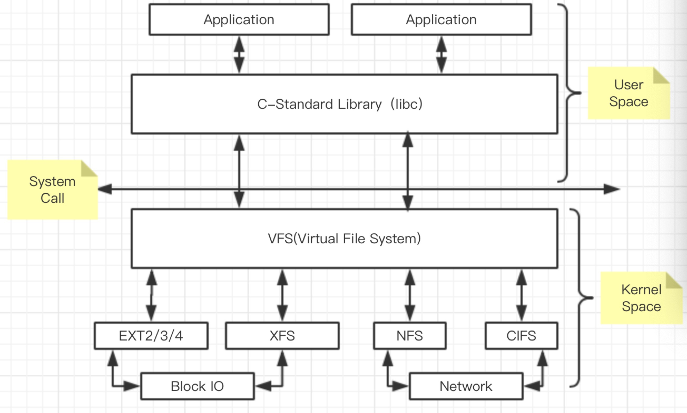

## 磁盘与I/O调度 & Filesystem

* 需要明确一下，我们为什么要对磁盘进行讲解，以及调节？
* 最主要的原因是“慢”，尤其是机械盘，现阶段的主机内除了磁盘还处在原始的机械状态，其余的部件都已经实现芯片化，当然你也可以选择固态磁盘，但是当前固态磁盘的价格比较昂贵，大多用于缓存和加速，很少大范围的应用到直接的数据存储，所以对于机械磁盘的调节方式我们还是有必要掌握一些有效的技能。
* 在掌握调节技能之前，我们先了解一下机械盘的一些特性和影响因素，然后在学习调节方式。

### ZCAV
* 所谓ZCAV，就是在硬盘低级格式化的时候将磁盘的一部分空间屏蔽掉（内部），分区一般从外部向内部分，理论上越往外越快，所以类似交换分区这种不常使用的分区则会被放到内圈；所以一般SCSI硬盘尽管容量不大，但是可能只使用外圈的部分；* 例如在使用磁盘柜的时候，可以将其中的每个硬盘的第一个分区作为逻辑盘，给最重要的数据使用和访问，之后的分区用于容纳操作系统，再之后的分区用于交换分区等；
* 大多数的现代磁盘有读写缓存用于加速读写以性能。由于写入缓存有可能在掉电或者当机等某些以外情况下导致数据丢失，所以很多设备商都将写入缓存关闭。但是开启写入缓存可以明显改善磁盘性能。
* 目前对硬盘速度的认识往往是爆发值速度（burst rate），也就是说这是在固定时间内系统总线上产生的最大传输速度；相对而言内部传输率（internal transfer rate）是衡量硬盘性能很有用的一个参数，该值才是真正磁头读写数据的速度。
* 计算内部传输速率的公式：data rate = 每磁道扇区数 x 512字节（扇区大小）x 转速（rpm）/60，由此可见，内部传输率计算的是每秒磁头读写产生的数据量。
* 对于新的ZCAV磁盘来说，磁盘内部传输率的计算公式是：speed = 每磁道扇区数 x 512字节（扇区大小）x 转速（rpm）/60/1000000，平均访问时间 = 平均寻道时间 + 平均等待时间

### 影响磁盘IO的因素
* 磁盘是电子机械设备，因此会受到一些性能限制，而这些限制则不会存在于晶体管设备上。
* 磁盘由盘片、磁头、柱面和扇区组成。在磁头访问数据的时候，通常会产生两种延迟（旋转延迟和寻道延迟）。现代的ZCAV磁盘在磁盘外圈有更多的线性存储空间。在磁盘以恒定的速度转动时，在相同的时间内可以于外圈访问到更多的数据。
* 不同的磁盘接口对数据的IO有绝对性的影响，传输速率的大小会影响磁盘的IO整体性能。
* 硬盘大小一般等于：磁盘 x 柱面 x 扇区（512字节）
* 对磁盘I/O的影响主要因不同设备的访问方式不同而异，大概包括两种：字符设备和块设备
* 对字符设备的访问特点：顺序I/O；高负载，低延迟；传输的数据块大小会对性能产生影响并且I/O可以被缓冲；由于缓冲方式简单所以提供的可调优的余地很小；
* 对块设备的访问特点：随机I/O；平均访问时间高但吞吐量也高；对块设备的访问中，页面是I/O请求的基本单位；因为其复杂的缓冲机制提供了众多可调优的余地。
* 操作类型：读取、写入、更改
* 访问类型：顺序、随机
  
### 调优的思路
* 优化读取方面的访问请求是关键，对于写入，kernel采用一种“被动接近”方式。
* 在众多的子系统中，I/O子系统是可调性最大的但同时也是瓶颈所在的子系统。从某种意义上说I/O子系统的性能调优是尽量减少写入方面的动作以优化性能。
* 在对I/O子系统进行性能调优的时候需要考虑其工作量以及服务类型。对于磁盘子系统来说，基本操作包括读取、写入以及修改（先读取然后延迟最后写入）。
* 访问类型可以分为顺序和随机。影响顺序访问性能的因素主要是磁盘的传输率，一般建立和拷贝一个文件的操作是高层操作并会产生顺序访问的I/O；而随机访问很多时候会受到磁盘寻道时间的影响，NFS文件服务以及用户主目录的读写多会产生随机访问的I/O。
* 确保优化读取方面的性能是优化I/O子系统的关键。因为读取的速度会使用户直接产生“磁盘有多快”的观念。但对于写入操作而言，kernel就不会主动采用太多的措施去对其进行优化。
* 有两个不同的步骤服务于I/O请求：

    1．  将I/O请求放入到请求队列；
    每一个块设备都有自己的队列用于处理读写请求；
    在新的队列产生的时候已经处理的空队列将被移除
    2．然后及时执行传输操作

### linux如何访问磁盘

* 最低端是驱动程序,在往下就是硬件. 最顶端的程序发起来操作.一个程序发起操作之后,写的对象,读的对象,操作的对象全部都是内存.
* 内存中有2种对象, page cache , buffer cache.
    * page cache:  文件内容缓存
    * buffer cache:  文件元数据缓存
* 选择一个IO调度算法.按照算法排队, 在L值满足的条件下,一次丢给磁盘驱动,然后驱动去做剩下的事情.
* Direct I/O会跳过缓冲层：对于一些自身带有cache功能的应用程序可以使用Direct I/O，其好处是防止重复页帧的产生，因为读写系统的调用速度会因为页面缓存和写前缓存的使用而变慢。
* I/O传输的基本单元是页面，从磁盘上每一个数据页面的传输都需要内存中相关的页面缓存中的页面。在/proc/meminfo中可以看到一些内存被用于页面缓存而一些内存被用于缓冲缓存，页面缓存用于缓存文件数据而缓冲缓存用于缓存文件系统元数据。
* 用户空间的应用程序一般不会直接访问缓冲，因此缓冲由kernel来维护。
* 高级的I/O请求，例如来自VFS的读写请求需要先转换成块设备请求，内核会调度设备请求队列中的每一个块设备请求来执行。而每一个块设备都拥有自己的设备请求队列，存储于设备请求队列中的访问请求实际上以块设备请求描述符的形式存在，这些描述符会提供kernel处理I/O请求所需要的详细信息。一个单独的请求描述符会产生一个I/O传输，并且该传输会调用一些相关的磁盘块。
* 当一个进程需要请求某个设备上的I/O时，一个特定的请求结构会被放到该设备队列中。这些请求结构包含了指向磁盘某些扇区的指针，并且这些指针又指向内存中用于完成数据传输的相关页面和缓冲。如果数据请求是读取，则数据传输方向是从磁盘到内存；如果数据请求是写入，则数据传输方向是从内存到磁盘。
* 队列请求一般会从I/O操作中分离，真正的数据传输是由可以和设备进行底层通讯的应用程序完成。实现一个I/O请求是一个相互合作的过程：
* 上层设备驱动会将I/O请求放到设备请求队列中。这些请求队列是基于调度算法的队列。为了防止单个请求立即产生I/O操作，请求队列通常会被阻止执行，一旦队列中的请求数量达到要求则请求队列就会被放行，而且底层的设备驱动将会在内存和磁盘之间开始进行数据转换和传输。

### 提高缓冲效率所采用的方法：
* Kernel会自动按照一定的顺序进行预读，预读的目的：减少寻道时间、减少磁盘控制器的操作、减少等待时间，但是在有随机访问请求的时候预读功能会关闭。
* 在对数据的访问中，读取是最关键的。所以一般内核会自动按照其自己的方式对读取访问进行优化。优化的方式是：在随机访问中，kernel也会假设要读取数据是连续的，并按照这样的顺序进行数据预读。
* 通过对应用程序的预读kernel可以将程序所需要的数据页面缓存到内存中，这样kernel可以快速找到应用程序所需要的数据。这种做法也可以减少磁盘控制器的负载，最终的结果就是减少响应时间。
* 当然，这种预读的方法对于随机访问和经常要重新读取同一块数据的应用程序是没用的。所以如果kernel发现读取的数据是这种类型就会自动关闭预读功能。
* 控制队列长度的文件：
    
    [root@localhost ~]# cat /sys/block/sda/queue/nr_requests  
    128
* 预读数据量大小：
 
    [root@localhost ~]# cat /sys/block/sda/queue/read_ahead_kb
    128
* 预读窗口控制kernel在执行I/O操作时预读的数据量。对于2.6版本的内核，预读通常由两个内部参数计算：当前窗口和预读窗口。当应用程序从缓冲中读取的页面实际上是当前窗口中的一部分，而I/O产生于预读窗口；当应用程序完成从当前窗口的读取，那么预读窗口成为新的当前窗口而新的预读窗口又会产生。如果对页面的访问产生于当前窗口那么新的预读窗口会增加两个页面，反之如果预读命中率比较低，预读窗口就会缩小。
* 预读窗口的最大值可以通过/sys/block/<dev>/queue/read_ahead_kb来指定，该值需要针对不同的设备采用不同的设定，但该参数可以推算出初始预读窗口的大小，一般情况下初始预读窗口设置为该值得的50%。
* 针对磁盘物理特性对性能产生的影响，内核会对队列中请求进行排序。
* 这种排序实际上是合并，通过iostat命令执行之后的rrqm/s和wrqm/s进行衡量。
* 在考虑I/O调度问题的时候，一方面要尽可能使磁头能够在尽量长时间向一个方向移动但需要防止I/O闲置，也就是需要缩小等待时间。
* 当向队列中增加一个请求时，kernel会首先尝试将该请求和队列中已经存在的请求进行合并。如果要将新的请求和现有请求进行合并，那么在新的请求中要传输的数据块和已经存在的请求所要传输的数据块必须属于同一个块设备，顺序传输并属于同样的传输类型，但经过扩展的请求所占的磁盘扇区不能超过该设备支持的最大值以，而且所使用的内存段无法超过该设备支持的最大值。
* 当调度I/O请求的时候，kernel必须要协调两个存在冲突的目标。最有效的访问磁盘驱动器的方式是使访问尽量按照同一个顺序进行，这样对磁盘数据的访问寻址就会按照磁盘上的逻辑块地址增加而增加。也就是说磁盘块500会在磁盘块5000之前被访问。同时kernel必须确保所有的进程及时获得所需要的I/O而不会出现等待I/O的现象。I/O调度必须确保I/O获得的连续性。

### Elevaor算法

* Elevaor算法会重新对请求队列进行调整按照优先级高低进行读取和写入，文件系统元数据通常存储于buffer缓存中；文件数据通常存储在page缓存；很多的驱动器都有自己的内部缓存，而使用Direct IO可以实现绕过kernel缓存的功能。
* 高级的IO请求，例如在Linux虚拟文件系统上产生的读写通常情况下会被转换为块设备请求。而kernel会调度每一个块设备请求最终形成块设备请求队列。每一个物理磁盘都有自己的块设备请求队列。而在队列中的块设备请求就是块设备请求队列描述符数据结构。这些信息描述了内核处理IO请求的时候需要知道的很多细节信息。每一个请求描述符会指向到一个IO传输，而IO传输又会牵涉到一些磁盘操作。
* 当一个进程向设备请求IO时将产生一个请求数据结构并加入到该设备的队列中。请求数据结构包含了一些指针，这些指针会指向磁盘具体的扇区以及其在内存中相对应的页面以及缓冲。如果请求是需要读取数据，那么数据传输的方向会从磁盘到内存，反之则从内存到磁盘。
* 实现一个IO请求会牵涉到一系列的动作，一个高级的磁盘设备操作会将IO请求按照一定的调度算法加到队列中。为了避免加入到队列的请求立即导致IO操作，队列会被分块或者被插入。一旦在队列中有了足够的请求数量，那么队列将会被拔出并执行。
* 基本的IO传输单位是页面。每一个请求的页面会关联内存当中的页面缓存。在/proc/meminfo文件当中会发现一些页面被应用为cache， 而一些页面被应用为buffer cache。在page cache中主要包含了文件的数据信息，而在buffer cache中包含了文件系统的元数据信息。
* 用户态的应用程序一般不会直接访问buffer，所以buffer一般由kernel维护。

### IO调度算法
* CFQ: 完全公平队列. 适合大众化的各种负载.非极端的.
* deadline: 到期就干活.可预知的行为,例如发起IO请求,到时间不管有没有更高的优先级的,你都要去给我IO请求.linux不是时时系统.
    * 虚拟机的物理机器,建议使用deadline.让每个guestos 都能公平的得到东西
* 预想算法: 每次读操作之后多等一会,例如5毫秒.去预想下一个读取.适合于大量的顺序读操作. (CentOS7 已经取消了)
* noop:什么都不做. CPU 不用考虑谁先谁后. 适用于固态磁盘. 适合于虚拟机.
    * guest os... 虚拟机本来就是本来就是文件.在虚拟机内要过缓存,真机也要过缓存,这样浪费资源, 所有真机可以用cfq或者deadline,虚拟机就直接noop.
* 每个磁盘可以有不同算法，互不干扰。

### 算法和队列
* Queue length	
    * 更长的队列可使读操作在写操作被合并，可能会增加延迟
    * 磁盘队列长度 /sys/block/sda/queue/nr_requests
* Scheduler algorithm
    * /sys/block/sda/queue/scheduler
    * noop [deadline] cfq   （默认是deadline）
* 调整的思路
    * 在对磁盘队列进行优化的时候需要优先考虑的是读方面的性能，而且读取也是关键的。因为应用程序在没有数据的情况下无法运行。
    * 当调度IO请求的时候，内核必须处理和实现两个相互矛盾的目标。最有效的访问磁盘的方式是尽量保证连续性访问，即访问的数据在磁盘上按照同样的方向顺序分布。这样对于第500个块的磁盘访问就会在第5000个块之前。
    * 当向队列中增加一个entry，内核将首先尽量将新的请求合并到原有的队列中而形成一个新的更长的队列。如果新产生的请求已经无法合并到现有队列中，该请求将由当前的电梯算法控制而被指派到队列中的另外一个位置。
    * deadline调度算法通过降低性能而获得更短的等待时间。
    * noop算法对等待时间和性能方面都做了折中，只是通过简单的排列来获得CPU周期。
    * cfq算法对所有因素也都做了折中而尽量获得公平性。

### deadline调整
* 调整deadline调度算法：目标是使wait time是可预见的
* 执行echo deadline > /sys/block/sda/queue/scheduler 使用该调度算法
* 在deadline的IO调度算法中，每一个请求都被指派一个过期时间。当过期时间已到，调度器会将请求移到磁盘上。为了减少额外的寻道时间，调度算法会优先处理在附近的请求。
* 可调的参数包括/sys/block/sda/queue/iosched/
    * read_expire -  以毫秒计算的读请求过期时间
    * write_expire -  以毫秒计算的写请求过期时间
    * fifo_batch - 从队列列表中转移到磁盘队列中的请求个数
    * writes_starved - 定义了在写的请求之前会优先执行多少个读的请求？在writes_starved中的读被已到块设备队列之后，一些写将被排到队列中。
    * front_merges - 一般情况下IO请求将被合并到队列的尾部，该参数定义了新的请求是否被合并到队列头部，这种方式将会产生更多的工作量，0表示头部合并将被禁用。
* 优化读写队列时间，当超时限度达到的时候请求必须被执行，当可能时多个请求会从新的位置被调度。
* 针对deadline这种I/O调度算法，每一个请求都被分配一个过期时间，该时间到达时调度器会将请求所在的位置移动到硬盘上（我理解为在过期时间达到之前，请求在队列中，一旦到达则被真正提交到硬盘上开始处理），为了防止额外的寻道时间deadline算法也会处理和这些I/O位置比较接近的I/O请求。
* 用deadline算法保证对于既定的I/O请求以最小的延迟时间，从这一点理解对于 DSS 应用应该会是很适合的。
* 在这个中 deadline 调度算法通过降低性能而获得更短的等待时间，它使用轮询的调度器,简洁小巧,提供了最小 的读取延迟和尚佳的吞吐量,特别适合于读取较多的环境(比如数据库,Oracle 10G 之类).

### noop调整
* 对noop调度器的调整，目标是节省CPU时钟周期
* 通过执行echo noop > /sys/block/sda/queue/scheduler使用该调度算法
* 基本没有需要调整的参数，当CPU时钟周期方面的需求比较迫切时使用，SAN的CPU时钟频率会比主机的CPU时钟频率更加宝贵。
* I/O请求被分配到队列，调度由硬件进行，只有当CPU时钟频率比较有限时进行。
* 对于I/O不那么操心，对所有的I/O请求都用FIFO队列形式处理，默认认为 I/O不会存在性能问题。这也使得CPU也不用那么操心。当然对于复杂一点的应用类型使用这个调度器，用户自己就会非常操心。
* noop调度算法指的是当请求被存储到队列并交由I/O子系统处理时由磁盘硬件对其进行优化。该算法一般只对一些特定的硬件（例如RAM disk和TCQ disk等）。
* 现代磁盘控制器都具备通过tagged command queuing进行优化的功能。Tagged command queuing（TCQ）可以通过由磁盘控制器对I/O请求进行重新排序来减少磁头的动作。通常需要进行重组的I/O请求都会带有一个标识符，这样控制器在接收到这些I/O请求的时候会按照规则进行处理。

### CFQ调整
* 对CFQ（默认）调度器的调整，目标在于针对不同的应用程序提供不同的IO服务。
* 通过执行开echo cfq > /sys/block/sda/queue/scheduler启该调度器
* CFQ调度算法的目的是对所有的进程平均分配IO，一般CFQ IO调度器会保存64个内建队列，并以轮询方式将新的请求附加到队列中。一般请求会从非空队列中提出来并附加到准备上CPU的队列中。IO请求以减少磁头寻道时间的方式来排列。
* 可调的参数包括/sys/block/sda/queue/iosched/
    * quantum -	在每一个周期放入调度队列的请求总数
* 对所有因素也都做了折中而尽量获得公平性,使用QoS策略为所有任务分配等量的带宽,避免进程被饿死并实现了较低的延迟,可以认为是上述两种调度器的折中.适用于有大量进程的多用户系统。
 
 ## 总结
以上是针对磁盘的一些基础调优，根据生产的实际环境，设置磁盘相应的算法，将会事半功倍，设置之前一定要搞清楚你的服务类型是什么？

### The virtual file system (VFS)

* 所有Linux系统上的文件操作都要基于VFS，即虚拟文件系统。VFS为应用程序访问磁盘文件提供了通用的接口，并且隐藏了从文件系统到设备驱动访问的细节。同时以前所提到文件系统的缓存和内存管理也是由VFS进行。在存储文件的时候，文件类型其实是由应用程序对VFS的访问方式而决定的。其中目录项和i节点缓存中与内存管理相关的内容也是由VFS来维护。文件的类型并不是依赖于其以什么方式存储，而是依赖于应用程序在什么层次对其进行访问。
* VFS是系统中的一层，并且也是为内核处理文件系统相关系统相关系统调用的接口。VFS是内核处理和文件系统相关的系统调用的接口，他提供了一种通用的机制将系统调用传递到内核对不同文件系统如ext3，msdocs，NFS，GFS，CIFS等的操作中。例如一个在EXT-4文件系统上的文件被一个应用程序访问，VFS将透明地传递程序的open()系统调用到访问文件系统的内核代码（设备驱动）。
* 查看当前系统支持的文件系统类型：cat /proc/filesystems
 
### FileSystem
* 了解了Linux的VFS之后，我们就应该针对不同的应用选择不同的文件系统，选择什么还是要根据实际场景去决定的，当前CentOS主推的是XFS和EXT4，所以我们针对这2个文件系统进行分析和说明。

#### XFS
* XFS是一个64位文件系统，最大支持8EB减1字节的单个文件系统，实际部署时取决于宿主操作系统的最大块限制。对于一个32位Linux系统，文件和文件系统的大小会被限制在16TB。
* XFS文件系统在生产环境中表现非常优秀，但是往往体现在大数据量和大文件的情况下，所以对于存储镜像和大文件打包存放需求，建议直接使用XFS，万万不要让XFS去处理小文件。
* 虚拟化的应用现在越来越广泛，作为虚拟化磁盘来源的巨型文件（单一文件好几个G及以上）也就越来越常见。这种巨型文件在处理上需要考虑到效能的问题，否则虚拟磁盘的效率就会不太好看。

#### XFS模式
* XFS系统分为三个部分：资料区（data section），文件系统活动登录区（log section），实时运作（realtime section）
* 资料区（data section）

    这个区域基本上与之前说的EXT家族一样，包括inode、block、superblock等数据都放在这个区块。这个数据区与ext家族的block group类似，分多个储存区群组（allocation groups）。每个储存区群组中都包含了整个文件系统的superblock，剩余空间的管理机制，inode的分配与追踪。此外，inode，block都是系统需要用到时才会动态配置产生，所以格式化动作较EXT家族快了很多。

* 文件系统活动登录区（log section）

    这个区域主要被用来记录文件系统的变化，具体原理和之前说的相同。 
    因为系统所有的动作都会在这个区域做个记录所以这个区域的磁盘活动是相当频繁的，xfs的设计在这里有一个巧妙之处，你可以指定外部的磁盘来作为xfs文件系统的日志管理区块。例如，你可以将SSD磁盘作为xfs的文件系统活动登录区，这样，当系统需要进行任何活动时，就可以更迅速的工作。

* 实时运作区（realtime section）

    当有文件要被建立时，xfs会在这个区段里找一个到数个extent区块，将文件放置在这个区块中，等到分配完毕后，再写入到data section的inode和block中。这个extent区块的大小得要在格式化的时候就先指定，最小值为4K最大可到1G。一般非磁盘阵列的磁盘默认为64K容量，而具有类似磁盘阵列的stripe情况下，则建议extent设定为与stripe一样大较佳。这个extent最好不要乱动，因为可能会影响到实体磁盘的效能。

#### XFS调整journal位置
    1、卸载文件系统
    2、格式化日志磁盘：# mkfs.xfs -l logdev=/dev/sdk1,size=65536b -f /dev/sdm1
    3、进行挂载使用：$ mount -o logdev=/dev/sdk1 /dev/sdb1 /mnt
    4、查看：$ xfs_info /dev/sdb1 

#### ETX4
* ext4 是 ext3 的下一代系统，属于日志型文件系统。支持的文件系统容量高达1EB，文件容量为15TB，显而易见这个容量已经非常高了。
* ext4 继承了先辈们的优良传统，在生产环境中一直稳定运行，并且使用者居高不下，如果不是文件大的离谱，建议使用ext4作为生产主力系统。

#### EXT4 日志模式
* 日志3种模式:
    1、data=ordered：在这种方式下文件系统将改变的文件直接写入到磁盘，然后再将其元数据提交到journal，这种做法保证了任何元数据的更改都可以缓存到journal中。
    2、data=writeback：最快的读写方式是writeback，在该模式下文件系统对文件和元数据的更改将没有顺序，这样一般在元数据被journal之后data才被写入磁盘。这种做法有时会导致文件中可能产生一些旧文件的数据。
    3、data=journal:   journal模式中，数据块和metadata都会被提交到journal中，这种做法会导致访问时间成倍增长。但是data=journal可以将大量的小的随机写操作合并为高效率的线性I/O操作，这样反而会获得一些性能上的补偿。这样即便在完成大I/O的情况下也可以减少大量小的随机写操作引发的寻道时间。

* 三种不同的挂载方式：
    
        # mount –o data=ordered
        # mount –o data=journal
        # mount –o data=writeback

#### 如何提高journal的性能
* 了解日志的类型和挂载使用以后，可以根据不同需求，调节日志模式，将调优发挥到极致，但是，有没有更好的办法调节日志呢？
* 默认情况下，journal在文件系统的inode中，大小一般是1024到102400个inode块中。
* 可以考虑将文件系统的journal单独放到一个设备中，这时journal设备和其文件系统都必须有相同的块大小。
* 该journal的主/从设备号会记录到文件系统的超级块中。其结果往往可以减少访问量并且同时减少文件系统和journal设备的服务时间。
* 对于内部的journal，可以指定journal的大小，如：
    
        # mke2fs –b 4096 –J size=12 /dev/sda1
* Journal的大小一般至少有1024个文件系统块。对于文件系统块大小只有1KB的文件系统journal是1MB，对于文件系统块大小有2KB的文件系统journal是2MB，那么对于文件系统块大小是4KB的文件系统journal是4MB，而最大的journal是102400个文件系统块。
* 要使用多大的journal比较好，通常取决于文件系统的大小以及写操作的频率。对于大量读操作的文件系统一般大的journal不会对性能产生积极的影响，而对于大量写操作的文件系统情况就不一样。因为一般journal设备在满的时候设备驱动将不会提交新的数据请求。
#### 调整journal位置
    1.	卸载文件系统
    2.	确认文件系统的块大小以及journal位置：# dumpe2fs /dev/sda1 | less
    3.	将文件系统内部journal从当前文件系统中删除：# tune2fs –O ^has_journal /dev/sda1
    4.	建立一个外部的journal设备：# mke2fs –O journal_dev –b block-size /dev/sdb1
    5.	使文件系统超级块使用外部journal设备：# tune2fs –j –J device=/dev/sdb1 /dev/sda1

### 其他的mount-time选项
* 在挂载的时候关闭访问时间更新：# mount –o noatime，该操作将明显提高ext4文件系统的性能。因为每一次对文件读写的时候，都需要更新该文件的访问时间戳，在比较繁忙的文件系统上将产生大量的写操作。这些将大大影响ext3和其他以journal保存metadata的文件系统，因为这种访问时间戳就要被写入到journal中。需要注意的是调整文件访问时间戳会影响tmpwatch而导致/tmp目录中的文件不会及时被删除。文件的访问时间戳可以通过stat命令查看：stat /root/install.log

* 挂载ext3文件系统的时候可以考虑更多的journal提交时间：# mount –o commit=15，单位为s，也就是说在多长时间之后journal向磁盘提交一次数据，也就是每次journal的时间。默认情况下是5s，表示一次性提交到journal的数据量将会更大，对于文件系统的性能提高是有好处的。但是也有可能在文件系统冲突的时候造成更多数据丢失。

### 寻找lock contention：
* 锁的概念：一个应用程序如果需要对某个文件进行额外的访问则会在打开该文件之前发起一个锁请求。对于共享文件来说，这是防止其他应用程序修改甚至查看该文件的常用手段。直到该应用程序使用完该文件才会将该锁移除。在这种情况下如果有一个文件被锁定，那么其他应用程序对该文件同时进行的访问会被中止，直到锁被释放。所以如果锁的应用不好会造成系统性能的下降。

* 在Linux系统中的锁机制有两种：advisory或者mandatory，大多数的应用程序使用advisory，这样其他应用程序在打开该文件之前会查看文件是否上锁。有些软件的开发者会在设计应用程序的时候忽略锁的存在。而mandatory锁则由kernel强制发起，如果要开启强制锁，则需要开启文件的SGID但需要关闭文件的组执行权限。

* 当前的锁可以通过命令：# cat /proc/lock来查看，

 ## 总结：
* 文件系统对于系统文件的存储速度和完整性起到至关重要的作用，一定要慎重选择文件系统，分析当前业务场景所需，在根据实际情况进行调优，然后多测试在使用。
* 至于格式化时候使用的参数，要根据实际情况进行调整，这样的调整太多了，满网的资料格式化的时候多看看，除非极特殊环境，其实最懒惰的格式化方法也挺好，不过日志是加速的主要点，想想换成SSD会什么样？
