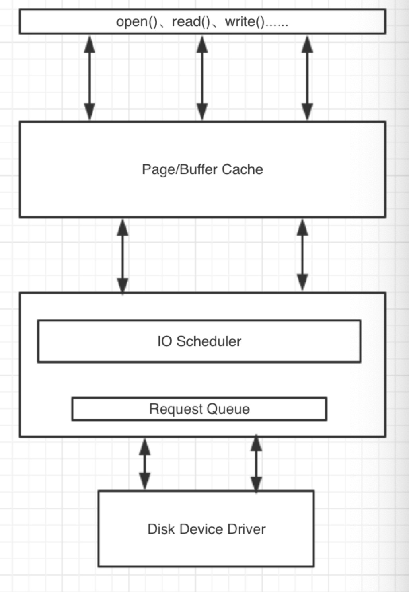

## Disk 

* 需要明确一下，我们为什么要对disk 进行调节？
* 最主要的原因是“慢”，尤其是机械盘，现阶段的主机内除了磁盘还处在原始的机械状态，其余的部件都已经实现芯片化，当然你也可以选择固态磁盘，但是当前固态磁盘的价格比较昂贵，大多用于缓存和加速，很少大范围的应用到直接的数据存储，所以对于机械磁盘的调节方式我们还是有必要掌握一些有效的技能。
* 在掌握调节技能之前，我们先了解一下机械盘的一些特性和影响因素，然后在学习调节方式。

### 影响磁盘IO的物理因素

- 磁盘是电子机械设备，因此会受到一些性能限制，而这些限制则不会存在于晶体管设备上。
- 磁盘由盘片、磁头、柱面和扇区组成。在磁头访问数据的时候，通常会产生两种延迟（旋转延迟和寻道延迟）。现代的ZCAV磁盘在磁盘外圈有更多的线性存储空间。在磁盘以恒定的速度转动时，在相同的时间内可以于外圈访问到更多的数据。
- 不同的磁盘接口对数据的IO有绝对性的影响，传输速率的大小会影响磁盘的IO整体性能。
- 硬盘大小一般等于：磁盘 x 柱面 x 扇区（512字节）

### ZCAV

- 所谓ZCAV，就是在硬盘低级格式化的时候将磁盘的一部分空间屏蔽掉（内部），分区一般从外部向内部分，理论上越往外越快，所以类似交换分区这种不常使用的分区则会被放到内圈；所以一般SCSI硬盘尽管容量不大，但是可能只使用外圈的部分；例如在使用磁盘柜的时候，可以将其中的每个硬盘的第一个分区作为逻辑盘，给最重要的数据使用和访问，之后的分区用于容纳操作系统，再之后的分区用于交换分区等；

### linux如何访问磁盘

* 最低端是驱动程序,在往下就是硬件. 最顶端的程序发起来操作.一个程序发起操作之后,写的对象,读的对象,操作的对象全部都是内存.
* 内存中有2种对象, page cache , buffer cache.
    * page cache:  文件内容缓存
    * buffer cache:  文件元数据缓存
* 选择一个IO调度算法.按照算法排队, 在L值满足的条件下,一次丢给磁盘驱动,然后驱动去做剩下的事情.

### Elevaor算法

* Elevaor算法会重新对请求队列进行调整按照优先级高低进行读取和写入，文件系统元数据通常存储于buffer缓存中；文件数据通常存储在page缓存；很多的驱动器都有自己的内部缓存，而使用Direct IO可以实现绕过kernel缓存的功能。
* 高级的IO请求，例如在Linux虚拟文件系统上产生的读写通常情况下会被转换为块设备请求。而kernel会调度每一个块设备请求最终形成块设备请求队列。每一个物理磁盘都有自己的块设备请求队列。而在队列中的块设备请求就是块设备请求队列描述符数据结构。这些信息描述了内核处理IO请求的时候需要知道的很多细节信息。每一个请求描述符会指向到一个IO传输，而IO传输又会牵涉到一些磁盘操作。
* 当一个进程向设备请求IO时将产生一个请求数据结构并加入到该设备的队列中。请求数据结构包含了一些指针，这些指针会指向磁盘具体的扇区以及其在内存中相对应的页面以及缓冲。如果请求是需要读取数据，那么数据传输的方向会从磁盘到内存，反之则从内存到磁盘。
* 实现一个IO请求会牵涉到一系列的动作，一个高级的磁盘设备操作会将IO请求按照一定的调度算法加到队列中。为了避免加入到队列的请求立即导致IO操作，队列会被分块或者被插入。一旦在队列中有了足够的请求数量，那么队列将会被拔出并执行。
* 基本的IO传输单位是页面。每一个请求的页面会关联内存当中的页面缓存。在/proc/meminfo文件当中会发现一些页面被应用为cache， 而一些页面被应用为buffer cache。在page cache中主要包含了文件的数据信息，而在buffer cache中包含了文件系统的元数据信息。
* 用户态的应用程序一般不会直接访问buffer，所以buffer一般由kernel维护。

### IO调度算法
* CFQ: 完全公平队列. 适合大众化的各种负载.非极端的.
* deadline: 到期就干活.可预知的行为,例如发起IO请求,到时间不管有没有更高的优先级的,你都要去给我IO请求.linux不是时时系统.
    * 虚拟机的物理机器,建议使用deadline.让每个guestos 都能公平的得到东西
* 预想算法: 每次读操作之后多等一会,例如5毫秒.去预想下一个读取.适合于大量的顺序读操作. (CentOS7 已经取消了)
* noop:什么都不做. CPU 不用考虑谁先谁后. 适用于固态磁盘. 适合于虚拟机.
    * guest os... 虚拟机本来就是本来就是文件.在虚拟机内要过缓存,真机也要过缓存,这样浪费资源, 所有真机可以用cfq或者deadline,虚拟机就直接noop.
* 每个磁盘可以有不同算法，互不干扰。

### 算法和队列
* Queue length	
    * 更长的队列可使读操作在写操作被合并，可能会增加延迟
    * 磁盘队列长度 /sys/block/sda/queue/nr_requests
* Scheduler algorithm
    * /sys/block/sda/queue/scheduler
    * noop [deadline] cfq   （默认是deadline）
* 调整的思路
    * 在对磁盘队列进行优化的时候需要优先考虑的是读方面的性能，而且读取也是关键的。因为应用程序在没有数据的情况下无法运行。
    * 当调度IO请求的时候，内核必须处理和实现两个相互矛盾的目标。最有效的访问磁盘的方式是尽量保证连续性访问，即访问的数据在磁盘上按照同样的方向顺序分布。这样对于第500个块的磁盘访问就会在第5000个块之前。
    * 当向队列中增加一个entry，内核将首先尽量将新的请求合并到原有的队列中而形成一个新的更长的队列。如果新产生的请求已经无法合并到现有队列中，该请求将由当前的电梯算法控制而被指派到队列中的另外一个位置。
    * deadline调度算法通过降低性能而获得更短的等待时间。
    * noop算法对等待时间和性能方面都做了折中，只是通过简单的排列来获得CPU周期。
    * cfq算法对所有因素也都做了折中而尽量获得公平性。

### deadline调整
    * 调整deadline调度算法：目标是使wait time是可预见的
    * 执行echo deadline > /sys/block/sda/queue/scheduler 使用该调度算法
    * 在deadline的IO调度算法中，每一个请求都被指派一个过期时间。当过期时间已到，调度器会将请求移到磁盘上。为了减少额外的寻道时间，调度算法会优先处理在附近的请求。
    * 可调的参数包括/sys/block/sda/queue/iosched/
        * read_expire -  以毫秒计算的读请求过期时间
        * write_expire -  以毫秒计算的写请求过期时间
        * fifo_batch - 从队列列表中转移到磁盘队列中的请求个数
        * writes_starved - 定义了在写的请求之前会优先执行多少个读的请求？在writes_starved中的读被已到块设备队列之后，一些写将被排到队列中。
        * front_merges - 一般情况下IO请求将被合并到队列的尾部，该参数定义了新的请求是否被合并到队列头部，这种方式将会产生更多的工作量，0表示头部合并将被禁用。
    * 优化读写队列时间，当超时限度达到的时候请求必须被执行，当可能时多个请求会从新的位置被调度。
    * 用deadline算法保证对于既定的I/O请求以最小的延迟时间，从这一点理解对于 DSS 应用应该会是很适合的。
    * 在这个中 deadline 调度算法通过降低性能而获得更短的等待时间，它使用轮询的调度器,简洁小巧,提供了最小 的读取延迟和尚佳的吞吐量,特别适合于读取较多的环境(比如数据库,Oracle 10G 之类).

### noop调整
* 对noop调度器的调整，目标是节省CPU时钟周期
* 通过执行echo noop > /sys/block/sda/queue/scheduler使用该调度算法
* 基本没有需要调整的参数，当CPU时钟周期方面的需求比较迫切时使用，SAN的CPU时钟频率会比主机的CPU时钟频率更加宝贵。
* I/O请求被分配到队列，调度由硬件进行，只有当CPU时钟频率比较有限时进行。
* 对于I/O不那么操心，对所有的I/O请求都用FIFO队列形式处理，默认认为 I/O不会存在性能问题。这也使得CPU也不用那么操心。当然对于复杂一点的应用类型使用这个调度器，用户自己就会非常操心。
* noop调度算法指的是当请求被存储到队列并交由I/O子系统处理时由磁盘硬件对其进行优化。该算法一般只对一些特定的硬件（例如RAM disk和TCQ disk等）。
* 现代磁盘控制器都具备通过tagged command queuing进行优化的功能。Tagged command queuing（TCQ）可以通过由磁盘控制器对I/O请求进行重新排序来减少磁头的动作。通常需要进行重组的I/O请求都会带有一个标识符，这样控制器在接收到这些I/O请求的时候会按照规则进行处理。

### CFQ调整
* 对CFQ（默认）调度器的调整，目标在于针对不同的应用程序提供不同的IO服务。
* 通过执行开echo cfq > /sys/block/sda/queue/scheduler启该调度器
* CFQ调度算法的目的是对所有的进程平均分配IO，一般CFQ IO调度器会保存64个内建队列，并以轮询方式将新的请求附加到队列中。一般请求会从非空队列中提出来并附加到准备上CPU的队列中。IO请求以减少磁头寻道时间的方式来排列。
* 可调的参数包括/sys/block/sda/queue/iosched/
    * quantum -	在每一个周期放入调度队列的请求总数
* 对所有因素也都做了折中而尽量获得公平性,使用QoS策略为所有任务分配等量的带宽,避免进程被饿死并实现了较低的延迟,可以认为是上述两种调度器的折中.适用于有大量进程的多用户系统。
 
 ## 总结
以上是针对磁盘的一些基础调优，根据生产的实际环境，设置磁盘相应的算法，将会事半功倍，设置之前一定要搞清楚你的服务类型是什么？

## File System - XFS

