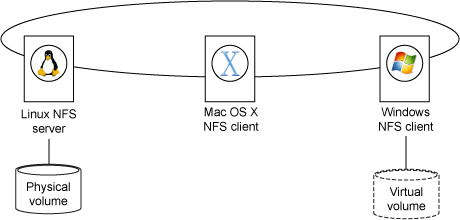
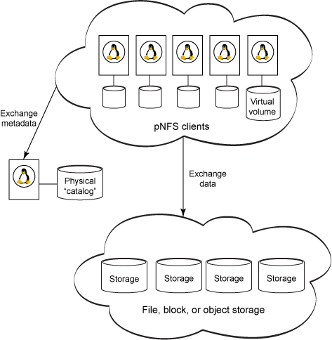
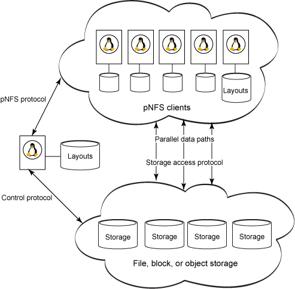

# pNFS  

## pNFS 简介
pNFS是并行网络文件系统，即NFSv4.1，与NFSv3不同的是，它将元数据与数据进行分离，允许客户端直接与数据服务器进行交互。这种机制解决了传统NFS的性能瓶颈问题，从而使得系统获得高性能和高扩展性的特性。

pNFS支持多种协议(Block[FC], Object[OSD], Files[NFS])直接访问数据，需要对客户端功能进行扩展以支持不同的layout(LAYOUT4_FILE, LAYOUT4_BLOCK_VOLUME, LAYOUT4_OSD2_OBJECTS)。NFSv41和pNFS主要由RFC5661(NFSv4.1)、RFC5662(NFSv4.1 XDR)、RFC5663(pNFS Block/Volume Layout)、RFC5664(Object-Based pNFS Operations)描述，这些标准已经于2010.01正式发布。目前，pNFS商业和开源产品都比较少，而且实现方面还不成熟。Linux kernel从2.6.30版本加入了pNFS支持，目前最新版本为2.6.38，pNFS仍处于Expermental，包括Server和Client。对于pNFS感兴趣的用户，可以通过安装新内核和nfs-util来安装配置pNFS，进行测试和体验。

## 传统的NFS结构及工作原理
通过 NFS（由服务器、客户机软件和两者之间的协议组成），一台计算机就可以和同一网络中的其他计算机共享物理文件系统。NFS 隐藏服务器的文件系统的实现和类型。对于在 NFS 客户机上运行的应用程序，共享的文件系统看起来和本地存储一样。
图 1 演示了在包含各种操作系统的网络中部署 NFS 的一般方法。这些操作系统包括支持 NFS 标准的 Linux®、Mac OS X 和 Windows®。（NFS 是 Internet Engineering Task Force 惟一支持的文件系统）。
如图，中间是 NFS 服务器，它共享或导出（用 NFS 的话讲）一个或多个物理附带文件系统（下面的）。上部分的 机器是 NFS 客户机。它们分别使用或挂载 共享的文件系统。客户机通过TCP/IP网络远程访问存放在NFS服务器上的数据。 

在图 1 中，Linux 机器是 NFS 服务器；它共享或导出（用 NFS 的话讲）一个或多个物理附带文件系统。Mac OS X 和 Windows 机器是 NFS 客户机。它们分别使用或挂载 共享的文件系统。实际上，挂载 NFS 文件系统和挂载本地驱动分区的结果是一样的 — 在挂载时，应用程序仅根据访问控制读写文件，而不注意持久化数据所需的技巧。

对于通过 NFS 进行共享的文件系统，Read 和 Write 操作 — 由蓝色阴影表示 — 从客户机（这里是 Windows 机器）遍历到服务器。这个服务器最终执行获取或持久化数据的请求或修改文件元数据的请求，比如权限或最后的修改时间。

NFS 的功能非常强大，从广泛将它用作 Network Attached Storage (NAS) 就可以看出来。它可以在 Transmission Control Protocol (TCP) 和 User Datagram Protocol (UDP) 上运行，并且相对容易管理。此外，NFS 的最新许可版本是 NFS version 4，它提高了安全性、增强了 Windows 和类 UNIX® 系统之间的互操作性，并且通过锁租赁（lock lease）提供更好的排他性。（NFSv4 于 2003 年首次获得批准）。NFS 的基础设施也不昂贵，因为它通常能在普通的 Ethernet 硬件上很好地运行。NFS 能够解决大部分的问题。

不过，NFS 处理高性能计算（HPC）一直不够理想。高性能计算涉及到的数据文件非常庞大，并且 NFS 客户机的数量可能达到几千台。（想一想拥有数千个计算节点的计算集群或网格）。在这里，NFS 是一个负担，因为 NFS 服务器的局限性 — 比如带宽、存储容量和处理器速度 — 限制了总体计算性能。NFS 在这里成了瓶颈。

或者，至少以前 是这样。

NFS 的下一个修改版是 version 4.1，包括一个扩展 Parallel NFS（pNFS），它将普通 NFS 的优势和并行输入输出（I/O）的高传输率结合起来。使用 pNFS 时，客户机也像以前一样可以从服务器共享文件系统，但数据不经过 NFS 服务器。相反，客户机系统将与数据存储系统直接连接，为大型数据传输提供许多并行的高速数据路径。在简短的初始化和握手（handshaking）过程之后，pNFS 服务器开始退出 “舞台”，不再阻碍传输速率。

### NFS的优缺点分析

#### 优点
* 节省本地存储空间，将常用的数据存放在一台NFS服务器上且可以通过网络访问，那么本地终端将可以减少自身存储空间的使用。
* 要在网络中的每个机器上都建有Home目录，Home目录可以放在NFS服务器上且可以在网络上被访问使用。
* 一些存储设备如软驱、CDROM和Zip（一种高储存密度的磁盘驱动器与磁盘）等都可以在网络上被别的机器使用。这可以减少整个网络上可移动介质设备的数量。

#### 缺点
* 有上面的工作原理可以看出，由较少的客户端访问相对较小的数据集时这种结构工作的很好，通过直接连接的存储器能够收到显著的效益(就象你PC上的磁盘）；也就是数据能够由多个客户端共享，能够由任何有NFS能力的客户端访问。可是如果大量的客户端需要访问数据或太大的数据集时，NFS服务器很快就变成了一个瓶颈，抑制了系统性能。
* [NFS 处理高性能计算（HPC）一直不够理想。高性能计算涉及到的数据文件非常庞大，并且 NFS 客户机的数量可能达到几千台。（想一想拥有数千个计算节点的计算集群或网格）。在这里，NFS 是一个负担，因为 NFS 服务器的局限性 — 比如带宽、存储容量和处理器速度 — 限制了总体计算性能。NFS 在这里成了瓶颈。]—IBM解释

## pNFS(Parallel NFS)

 pNFS它将普通 NFS 的优势和并行输入输出（I/O）的高传输率结合起来。使用 pNFS 时，客户机也像以前一样可以从服务器共享文件系统，但数据不经过 NFS 服务器。相反，客户机系统将与数据存储系统直接连接，为大型数据传输提供许多并行的高速数据路径。在简短的初始化和握手（handshaking）过程之后，pNFS 服务器开始退出 “舞台”，不再阻碍传输速率。

### pNFS的概念组织结构

 pNFS的概念组织结构图如下，顶部是计算集群的节点，比如大量便宜的、基于 Linux 的刀片服务器群。左边是 NFS 服务器。底部是一个大型的并行文件系统。 

像 NFS 一样，pNFS 服务器也导出文件系统，并且保留和维护数据仓库中描述每个文件的标准元数据。pNFS 客户机和 NFS 一样 — 在这里是集群中的一个节点 — 挂载服务器导出的文件系统。类似于 NFS，每个节点都将文件系统看作本地的物理附加文件系统。元数据的更改通过网络传回给 pNFS 服务器。然而，与 NFS 不同的是，pNFS 在 Read 或 Write 数据时是在节点和存储系统之间直接 操作的，如图 2 的底部所示。从数据事务中移除 pNFS 服务器为 pNFS 提供了明显的性能优势。

因此，pNFS 保留了 NFS 的所有优点，并且改善了性能和可伸缩性。扩展存储系统的容量几乎不会影响客户机配置，同时还可以增加客户机的数量以提高计算能力。您只需同步 pNFS 目录和存储系统。

## pNFS 的具体细节
那么，它是如何工作的呢？如图 3 所示，pNFS 是由 3 个协议构成的。
### pNFS 的 3 个协议

pNFS 协议 在 pNFS 服务器和客户机节点之间传输文件元数据（正式名称是布局）。可以将布局想象成地图，它描述如何在数据仓库之间分配文件。另外，布局还包含许可和其他文件属性。布局捕捉到元数据并在 pNFS 服务器中持久化这些数据之后，存储系统仅需执行 I/O。

存储访问协议 指定客户机从数据仓库访问数据的方式。可以猜到，每个存储访问协议都定义自己的布局形式，因为访问协议和数据组织必须保持一致。

控制协议同步元数据服务器和数据服务器之间的状态。同步是对客户机隐藏的，比如重新组织介质上的文件。此外，NFSv4.1 并没有规定控制协议；因此它有多种形式，这在性能、成本和特性方面的竞争为供应商提供了灵活性。

有了这些协议之后，您就可以实践以下客户机访问流程：

    客户机为当前的文件请求一个布局。
    客户机通过打开元数据服务器上的文件获得访问权。
    客户机获得授权和布局之后，就可以直接从数据服务器访问信息。根据存储类型所需的存储访问协议，访问继续进行。（后面还对此进行论述）。
    如果客户机更改了这个文件，则会相应地更改布局的客户机实例，并且将所有更改提交回到元数据服务器。
    当客户机不再需要这个文件时，它将提交剩余的更改，并将布局副本返回给元数据服务器，然后关闭文件。

尤其需要注意的是，Read 操作是由一系列协议操作组成的：

    客户机向 pNFS 服务器发送一个 LOOKUP+OPEN 请求。服务器会返回一个文件句柄和状态信息。
    客户机通过 LAYOUTGET 命令请求从服务器获取一个布局。服务器将返回所需的文件布局。
    客户机向存储设备发出一个 READ 请求，该请求同时初始化多个 Read 操作。
    当客户机完成读操作时，它以 LAYOUTRETURN 表示操作结束。
    如果与客户机共享的布局因为分离活动而过时，服务器将发出 CB_LAYOUTRECALL，表明该布局无效，必须清除和/或重新获取。

Write 操作类似于 Read 操作，不同的地方是客户机必须在 LAYOUTRETURN 将文件更改 “发布” 到 pNFS 服务器之前发出 LAYOUTCOMMIT。

布局可以缓存到每个客户机，这进一步提升了性能。如果一个客户机不再使用时，它会自动放弃从服务器获取布局。服务器还能限制 Write 布局的字节范围，以避免配额限制或减少分配开销等等。

为了避免缓存过期，元数据服务器将收回不准确的布局。收回发生之后，每个关联的客户机必须停止 I/O，并且必须重新获取布局或从普通的 NFS 访问文件。在服务器尝试管理文件（比如迁移或重新划分）之前必须执行回收过程。

## 位置是重点

如前所述，每个存储访问协议都定义一个布局类型，并且可以随意添加新的访问协议和布局。为了使 pNFS 可以独立使用，pNFS 的供应商和研究人员已经定义了 3 种存储技巧：文件、块 和对象 存储：

    文件存储 通常是由传统的 NFS 服务器实现的，比如由 Network Appliance 生成的服务器。存储群是由一组 NFS 服务器组成的，并且每个文件都跨越所有服务器或服务器的子集，从而使客户机能够同时获取文件的各个部分。在这里，布局枚举持有文件片段的服务器、每个服务器上文件片段的大小，以及每个片段的 NFS 文件句柄。
    块存储 通常是使用由许多磁盘或 RAID 阵列组成的存储区域网络（SAN）来实现的。许多供应商都提供 SAN 解决方案，包括 IBM 和 EMC。有了块存储之后，文件可以被划分为块并分布到不同的驱动器中。块存储布局将文件块映射到物理存储块。存储访问协议就是 SCSI 块命令集。
    对象存储 类似于文件存储，但有一点不同，这里使用的是对象 ID 而不是文件句柄，并且文件分割功能更加复杂强大。发起 pNFS 开发的 Panasas 公司（pNFS 基于该公司的 DirectFLOW 架构）是 pNFS 对象实现的主要创造者。 

不管布局的类型是什么，pNFS 都使用通用的模式来引用服务器。引用服务器时使用的是惟??的 ID，而不是主机名或卷名。这个 ID 被映射到特定于访问协议的服务器引用。

对于这些存储技术，哪个最好呢？答案是 “依情况而定”。应该采用哪种存储技术由预算、速度、伸缩性、简单性等因素共同决定。

## pNFS实验环境
整个pNFS测试环境由4台服务器组成，其中2台数据服务器，1台元数据服务器和1台客户端，操作系统为CentOS 5.4 X86_64。这里是使用虚拟机来搭建测试环境，主要是为了验证pNFS的功能。如果想测试pNFS性能，建议采用物理服务器来部署测试环境。pNFS实验环境配置如下：
MDS：192.168.233.130
DS1: 192.168.233.131
DS2: 192.168.233.132
Client: 192.168.233.134
4台服务器(DS、MDS和Client)均需要安装配置pNFS kernel和nfs-utils软件。

从RPM安装
对于使用Redhat/CentOS/Fedora的用户来说，pNFS社区已经有人制作了RPM安装包供大家测试，从如下URL下载：
http://fedorapeople.org/~steved/repos/pnfs/
根据OS版本和体系结构选择下载合适的RPMs，其中kernel和nfs-utils安装包是必需的。RPM安装过程中根据提示使用yum或apt-get安装相关的依赖包。kernel安装成功后，需要验证一下/boot和Grub相关信息是否正确，然后reboot机器即可。

 

从源码安装
源码安装相对要比RPM安装复杂许多，但这是很不错的体验，建议搞开发的用户采用这种方式进行安装。Kernel和nfs-utils最新源码可以从如下Git库下载：

[cpp] view plain copy

    git clone git://git.linux-nfs.org/projects/bhalevy/linux-pnfs.git (这个比较大，约1GB)  
    git clone git://linux-nfs.org/~bhalevy/pnfs-nfs-utils.git  

根据内核源码中的Documents/fs/spnfs.txt配置kernel编译选项，make menuconfig时把NFSv41/spnfs的相关选项选中。配置完成后，.config中应该包含以下诸项：
[cpp] view plain copy

    CONFIG_NETWORK_FILESYSTEMS=y  
    CONFIG_NFS_FS=m  
    CONFIG_NFS_V4=y  
    CONFIG_NFS_V4_1=y  
    CONFIG_PNFS=y  
    CONFIG_NFSD=m  
    # CONFIG_PNFSD_LOCAL_EXPORT is not set  
    CONFIG_SPNFS=y  
    CONFIG_SPNFS_LAYOUTSEGMENTS=y  

 

接下来就可以编译和安装内核了

[cpp] view plain copy

    make  
    make modules  
    make modules_install  
    make install  

如果没有生成initramfs，mdinitrd /boot/initramfs-2.6.38-pnfs 2.6.38-pnfs生成。
与RPM安装一样，成功安装kernel后，验证相关信息正确配置后，即可reboot机器。

nfs-utils依赖许多开发库，编译前需要进行安装解决依赖问题。
[cpp] view plain copy

    yum install libtirpc{,-devel} tcp_wrappers{,-devel} libevent{,-devel} nfs-utils-lib{,-devel} libgssglue{,-devel} libnfsidmap{,-devel} libblkid{,-devel} libcap{,-devel} device-mapper-devel  
    sh autogen.sh  
    ./configure --prefix=/usr  
    make  
    make install  

 

配置Data Server
[cpp] view plain copy

    mkdir /export  
    mkdir /export/pnfs  
    vi /etc/export，编辑如下内容：  
    /export/pnfs  *(rw,sync,fsid=0,insecure,no_subtree_check,no_root_squash, pnfs)  
    /etc/init.d/nfs start，启动nfs server。  

每个Data Server均进行如上配置，DS是常规的NFSv4.1服务器。

 

配置Metadata Server
[cpp] view plain copy

    mkdir /export  
    mkdir /export/spnfs  
    mkdir /spnfs  
    mkdir /spnfs/192.168.233.131  (第一个DS mount点)  
    mkdir /spnfs/192.168.233.132  (第二个DS mount点)  

vi /etc/export，编辑如下内容：

[cpp] view plain copy

    /export/spnfs  *(rw,sync,fsid=0,insecure,no_subtree_check,no_root_squash, pnfs)  

vi /etc/spnfsd.conf，编辑如下内容：(可以从nfs-util源码中util/spnfsd/spnfsd.conf复制并修改)

[cpp] view plain copy

    [General]  
    Verbosity = 1  
    Stripe-size = 8192  
    Dense-striping = 0  
    Pipefs-Directory = /var/lib/nfs/rpc_pipefs  
    DS-Mount-Directory = /spnfs  
      
    [DataServers]  
    NumDS = 2  
      
    DS1_IP = 192.168.233.131  
    DS1_PORT = 2049  
    DS1_ROOT = /pnfs  
    DS1_ID = 1  
      
    DS2_IP = 192.168.233.132  
    DS2_PORT = 2049  
    DS2_ROOT = /pnfs  
    DS2_ID = 2  

然后将DS服务器输出目录mount至元MDS上，启动nfs server和spnfs server：
[c-sharp] view plain copy

    mount -t nfs4 -o minorversion=1 192.168.233.131:/pnfs /spnfs/192.168.233.131  
    mount -t nfs4 -o minorversion=1 192.168.233.132:/pnfs /spnfs/192.168.233.132  
    /etc/init.d/nfs start  
    spnfs  

 

配置Client
pNFS支持Block, Object, Files协议，我们这里使用Files协议访问，需要加载nfs_layout_nfsv41_files。
[c-sharp] view plain copy

    modprobe nfs_layout_nfsv41_files  
    mount -t nfs4 -o minorversion=1 192.168.233.130:/ /mnt/pnfs  

 

pNFS测试
cd /mnt/pnfs
dd if=/dev/zero of=f8g bs=4M count=2K
dd中使用top监控DS和MDS系统负载情况，看看IO是不是发生在DS与Client之间。如果MDS I/O负载很高，接近与DS，则安装配置可能有问题。

分别在MDS和DS使用stat查看f8g的属性：
stat /export/spnfs/f8g (MDS上f8g的block数量应该为0，只表现名字空间)
stat /export/pnfs/* (DS1和DS2上f8g对应对象的block数量应该>0，实际存储文件数据)