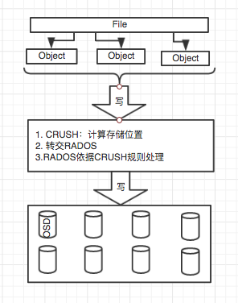
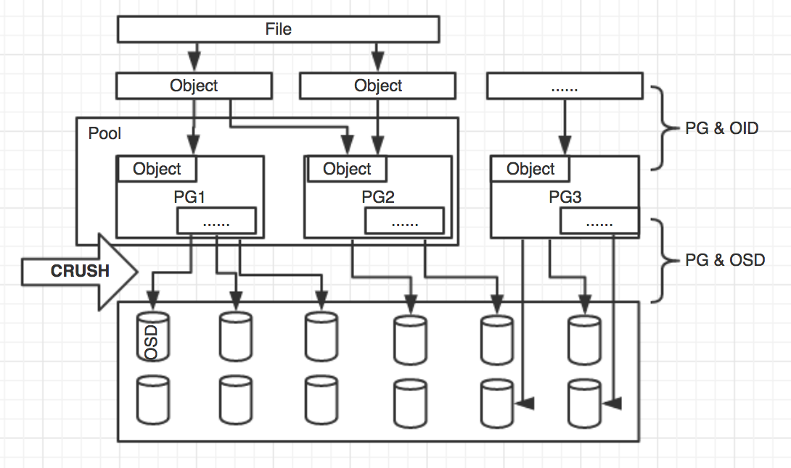
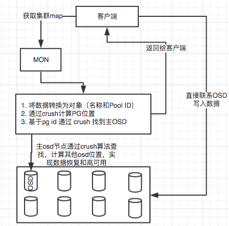
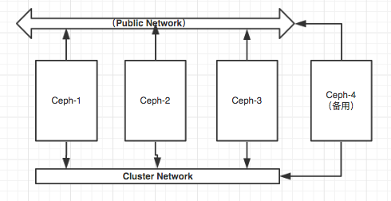
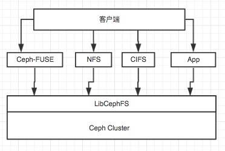

# Ceph 1
## 1. Ceph-简介
* Ceph已然成为开源社区极为火爆的分布式存储开源方案。
* Ceph是一个分布式存储，可以提供对象存储、块存储和文件存储，其中对象存储和块存储可以很好地和各大云平台集成。
* Ceph消除了单一中心节点的依赖，实现了真正的无中心结构的设计。
* 随着这几年OpenStack的的飞起，Ceph也随之成为佼佼者，Ceph的飞速发展离不开OpenStack的带动，时下Ceph已经成为OpenStack的标配开源存储方案。
* Ceph 的高速发展使得版本快速更新，但是依然保持着LTS稳定版，和开发版本，本实例使用LTS版本（）。

## 2. Ceph的哲学思想
    1. 所有组件可自由扩展
    2. 不存在单点故障
    3. 软件定义、开源、广泛的适用性
    4. 适配通用硬件之上,一般指X86架构服务器
    5. 每个组件必须尽可能拥有自我管理和自我修复功能
## 3. Ceph-架构
* Ceph实现并且提供了包括对象、块设备、和文件的存储服务，拥有高可靠、易于管理、开源等特点。如果使用Ceph作为存储架构，无论是在扩展性还是在可靠性上都能得到极大提升。

* RADOS： 提供自我修复特性，为可靠、智能的分布式系统打下了坚固基础。
* LIBRADOS: 允许应用程序直接访问，C/C++、Java和Python等等语言。
* RADOSGW：RESTful协议的网关，兼容S3和Swift，作为对象存储，可以对接网盘之类的应用。
* RBD：通过Linux内核客户端和KVM驱动，基于LIBRADOS之上，提供块设备，时下OpenStack采用这种方式为VM提供块设备。
* Ceph FS：通过Linux内容提供标准的POSIX文件系统。

### 3.1 理解RADOS
* 学习技术精髓尤为关键，RADOS在整个的Ceph结构中可以算是最为关键的技术点，依据上图可以看出，无论是S3和Swift，还是RBD，还是POSIX的CephFS，其实这些都是基于RADOS的衍生，例如，RADOSGW和RBD是基于LIBRADOS的接口，而LIBRADOS的底层RADOS，CephFS是基于RADOS的文件系统。
* 其实RADOS自身已经是一个较为完整的对象存储系统，而Ceph数据也都是由这一层来存储。而且RADOS提供了很多特性，例如高可靠，高可扩展，高性能，自动化等等。RADOS需要物理设备的支撑，这些物理设备都有独立的硬件资源，有独立的操作系统和文件系统，可理解为RADOS就是集群的大脑，负责决策和调度等工作。
* RADOS 主要包括
  * CRUSH算法实现对象寻址，支撑对象读写和其他数据的功能
  * 通过Monitor为集群提供全局配置信息
  * 快照和克隆、数据一致性检查
  * 对象分层、数据自动恢复、数据均衡
* RADOS 原理

* 基于RADOS，使用Ceph作为存储架构，一个Ceph存储集群包含以下两种类型的进程：

1. Ceph Monitors ：通过一堆map，维护着一个集群的健康状态，包括Monitor Map、OSD Map、MON Map、PG Map、CRUSH Map。

      * Cluster map：集群全局信息
      * Monitor map：包含集群fsid，地址和端口，当前版本信息和更新更改等信息
      * OSD map：集群ID，OSD版本信息和修改信息，Pool相关信息，副本数目以及PGP等信息
      * CRUSH map：包含集群存储设备信息，故障域结构和存储数据时定义失败域的规则等信息
      * MDS map：存储当前MDS的状态信息以及修改时间、数据和元数据pool id、集群MDS数量等信息
      * PG map：当前PG版本，时间戳、空间使用比例、PG ID、对象数目、状态、OSD状态等信息

>一个常规Ceph集群应该包含多个Monitor节点，推荐奇数，建议3节点，Monitor是通过法定数来选择Leader并通过Pasox算法实现数据一致性，而法定数是必须要保持半数以上的节点存活，所以建议最小量3节点，如果leader不幸死机或者出现故障，则其他节点有资格成为leader。

  2. Ceph OSDs（object storage daemon）：负责存储数据
      * OSD将数据以对象的形式存储到集群中每个节点的物理磁盘上。
      * 客户端从Monitor获取Cluster map后，客户端将直接与OSD进行I/O交互,避免增加往外的处理开销。 <----重要
      * OSD中的每个对象都一个主副本，若干从副本，分布在不同节点上，某些情况下从OSD可以成为主OSD。
      * OSD借助Linux的文件系统实现，文件系统为OSD提供了对象状态，元数据等内部信息，支持BTRFS、XFS、EXT4.
      * 一个osd守护进程仅与ceph集群中的一个磁盘绑定
      * osd的文件系统可以分为日志区域和数据区域，可以在同一OSD设备，也可以分开2个OSD设备，大多数做法是使用SSD做OSD日志区域，HDD设备做数据区域，因为写入数据时，会先写日志，后写数据，所以提供日志写入，变相会提高洗能。
> RADOS对象和RADOS GW 以及 S3 的接口对象不同含义，详见下文。RADOS 指的是数据存储的基本单元，默认4MB，由3部分组成：唯一对象标志（ID）、对象数据、对象元数据（RADOS增加了Level DB等本地Key Value的形式来存储对象的元数据）。

### 3.2 理解CRUSH
1. 什么是CRUSH？
* 在大规模的分布式系统中，如何平均的分布数据和负载以及最大化系统的利用率，并且能够摆脱扩展的瓶颈和系统故障？普通的分布式系统都会用多个中心节点去解决这个问题，但是每次集群数据变动都会出现例如元数据查询瓶颈，导致workload非常之大。
* 而CRUSH算法是将数据分布的查询变成了计算操作，由客户端完成，尽可能的较少集中或者热点的产生。CRUSH是受控复制的分布式算法，在Ceph中控制数据分布的方法。它只需要一个集群的描述map和规则就可以根据一个整型的输入得到存放数据的设备列表。
2. CRUSH能干什么？

* Ceph的后端是一个对象存储（RADOS），所有的数据都会按照一个特定的size（默认是4M）被切分成若干个对象，也就是上面的Objects。
* 每一个Object都有一个Objectid（oid），每个object都有对应的pgid。有了这个pgid后，Client就会执行CRUSH算法得到一个OSD列表。然后对它们进行筛选，根据副本数找出符合要求的OSD。CRUSH作用可以简单的理解为，根据pgid得到一个OSD列表。
* CRUSH 是公平的，她会均衡集群节点上的OSD写数据，不同速度差异的磁盘可以设置不同权重（SSD和HDD）
* CRUSH 原理

3. Object
* 数据存储的基本单元，默认4MB，由3部分组成：唯一对象标志（ID）、对象数据、对象元数据.
4. PG（Placement Group）
* ceph将object映射到PG，然后从PG映射到OSD。object可以是数据文件的一部分，也可以是journal file，也可以目录文件。
* 可理解为一个放置策略组，它是对象的集合，集合里的所有对象具有相同的放置策略；
* 对象的副本都分布在相同的OSD列表上。一个对象只能属于一个PG，一个PG对应于放置在其上的OSD列表。一个OSD上可以分布多个PG。
* 一个对象只能属于一个PG，一个PG包含多个对象。
* 一个PG的副本分布在对应的OSD列表，在一个OSD上可以分布多个PG。
* 在数据存储到cesh时，先打散成一系列对象，再结合基于对象名的哈希操作、复制级别、PG数量，产生目标PG号。根据复制级别的不同，每个PG在不同的OSD上进行复制和分发。可以把PG想象成存储了多个对象的逻辑容器，这个容器映射到多个具体的OSD。PG存在的意义是提高ceph存储系统的性能和扩展性。
5. Pool
Pool是一个抽象的存储池，它规定了数据冗余的类型以及对应的副本分布策略。目前实现了两种Pool类型：
Replicated类型和Erasure Code类型。一个Pool由多个PG构成。
6. PG & Object ID
Ceph在使用过程中会产生唯一的Object ID，OID实际是由文件的元数据，条带化产生的Object序号共同生成IOD,在经过Ceph集群指定的函数进行计算，产生pgid。
7. PG & OSD
Ceph集群中由PG映射到实际存储数据的OSD中，该映射规则是CRUSH算法来确定的：
  1. 通过PGID进行计算，获取副本数个OSD集合，最先的OSD作为主OSD，其他为从OSD。
  2. 副本分布不同的OSD节点上。
> 以上主要内容还需要深入理解。

## 4. Ceph 安装
### 4.1 Ceph 实例图

>GlusterFS实例架构图-实例采用生产常用配置进行，涵盖多种故障测试和恢复的技术点。

### 4.2 试验环境

|系统版本|磁盘数量|网卡数量|ip地址|主机名称|虚拟化|备注|
|:---|:---|:---|:---|:---|:---|:---|:---|:---|
|CentOS 7.4|4Vdisk|2|192.168.56.101(cluster)  192.168.57.3(public)|Ceph-1|Vbox|Ceph集群节点1|
|CentOS 7.4|4Vdisk|2|192.168.56.102(cluster)  192.168.57.4(public)|Ceph-2|Vbox|Ceph集群节点2|
|CentOS 7.4|4Vdisk|2|192.168.56.103(cluster)  192.168.57.5(public)|Ceph-3|Vbox|Ceph集群节点3|
|CentOS 7.4|4Vdisk|2|192.168.56.107(cluster)  192.168.57.6(public)|Ceph-4|Vbox|Ceph集群节点4|
|CentOS 7.4|2Vdisk|1|192.168.57.7（public）|client|Vbox|测试客户端|

### 4.3 测试内容和环境说明
1. 完成Ceph集群安装和配置，利用Clinet进行测试。

### 4.4 安装准备（以下操作均是所有节点）

    1. 更改主机名
    2. 添加主机hosts列表 （Private Netowork）
    3. 关闭防火墙，关闭SElinux
    4. 各主机之间 SSH 免密码登录(所有节点间的相互免密)
    5. 配置NTP时钟源

### 4.5 安装Ceph
1. 获得国内yum源 (所有节点)

        # rpm -Uvh http://mirrors.aliyun.com/ceph/rpm-jewel/el7/noarch/ceph-release-1-1.el7.noarch.rpm
2. 安装Ceph-deploy部署工具（Ceph有2种安装方式，一种是deploy部署工具，快速简单；一种是手动部署，复杂度高，但是加强记忆）（所有节点）

        # yum -y update
        # yum -y install ceph-deploy
3. 创建Ceph集群

        [root@Ceph-1 ceph]# mkdir /etc/ceph ; cd /etc/ceph
        [root@Ceph-1 ceph]# ceph-deploy new ceph-1
        [root@Ceph-1 ceph]# ls
        ceph.conf  ceph-deploy-ceph.log  ceph.mon.keyring
        在当前目录下使用ls和cat命令检查ceph-deploy输出结果，可以看到一个ceph配置文件，一个密钥环以及为新集群创建的日志文件。
4. 安装所有节点的Ceph

        [root@Ceph-1 ceph]# ceph-deploy install ceph-1 ceph-2 ceph-3
         如果安装中断，可以使用上述命令再次进行安装，如果想重新开始安装，执行以下命令来清空配置。
         # ceph-deploy purgedata {ceph-node} [{ceph-node}]
         # ceph-deploy forgetkeys
         清空Ceph包，需执行：
         # ceph-deploy purge {ceph-node} [{ceph-node}]
5. 安装完成后在所有节点上查看Ceph版本及健康情况：

         # ceph -v   <----注意输出的内容，5dc1e4c05cb68dbf62ae6fce3f0700e4654fdbbe 一定是相同的，在所有节点上。
6. 在ceph-node1上创建一个Monitor

        [root@Ceph-1 ceph]# ceph-deploy mon create-initial
        通过ceph -s 命令可以查看到只有mon存在
        [root@Ceph-1 ceph]# ceph -s
        cluster f35c031d-5b4c-4d5a-bbfb-36bf5823e859
        monmap e13: 1 mons at {ceph-1=192.168.57.3:6789/0}
            election epoch 21, quorum 0 ceph-1
7. 创建OSD盘，先查看，在创建

        [root@Ceph-1 ceph]# ceph-deploy disk list ceph-1
        [ceph-1][DEBUG ] /dev/sdb other, unknown
        [ceph-1][DEBUG ] /dev/sdc other, unknown
        [ceph-1][DEBUG ] /dev/sdd other, unknown   <----发现3块磁盘没有使用

        清除空磁盘
        [root@Ceph-1 ceph]# ceph-deploy disk zap ceph-1:/dev/sdb ceph-1:/dev/sdc

        创建OSD
        [root@Ceph-1 ceph]# ceph-deploy osd create ceph-1:/dev/sdb ceph-1:/dev/sdc

        查看状态
        [root@Ceph-1 ceph]# ceph -s
        cluster f35c031d-5b4c-4d5a-bbfb-36bf5823e859
        osdmap e9: 2 osds: 2 up, 2 in
            flags sortbitwise,require_jewel_osds

        查看主机磁盘
        [root@Ceph-1 ceph]# lsblk
        sdb               8:16   0    8G  0 disk
        ├─sdb1            8:17   0    3G  0 part /var/lib/ceph/osd/ceph-0
        └─sdb2            8:18   0    5G  0 part
        sdc               8:32   0    8G  0 disk
        ├─sdc1            8:33   0    3G  0 part /var/lib/ceph/osd/ceph-1
        └─sdc2            8:34   0    5G  0 part
        sdd               8:48   0    8G  0 disk

        继续完成所有节点的osd创建
        [root@Ceph-1 ceph]# ceph-deploy disk zap ceph-2:/dev/sdb ceph-2:/dev/sdc ceph-3:/dev/sdb ceph-3:/dev/sdc
        [root@Ceph-1 ceph]# ceph-deploy osd create ceph-2:/dev/sdb ceph-2:/dev/sdc ceph-3:/dev/sdb ceph-3:/dev/sdc

        查看结果如下
        [root@Ceph-1 ceph]# ceph osd tree
          ID WEIGHT  TYPE NAME       UP/DOWN REWEIGHT PRIMARY-AFFINITY
          -1 0.01740 root default
          -2 0.00580     host ceph-1
           0 0.00290         osd.0        up  1.00000          1.00000
           1 0.00290         osd.1        up  1.00000          1.00000
          -3 0.00580     host ceph-2
           2 0.00290         osd.2        up  1.00000          1.00000
           3 0.00290         osd.3        up  1.00000          1.00000
          -4 0.00580     host ceph-3
           4 0.00290         osd.4        up  1.00000          1.00000
           5 0.00290         osd.5        up  1.00000          1.00000

8. 扩展集群到3个MON（为了集群的稳定）

        [root@Ceph-1 ceph]# vim /etc/ceph/ceph.conf
        添加： public_network = 192.168.57.0/24     <----对外提供服务网络
              cluster_network = 192.168.56.0/24    <----Ceph内部数据网络

        同步文件
        [root@ceph-1 ceph]# ceph-deploy --overwrite-conf config push ceph-1 ceph-2 ceph-3

        添加另外2个mon进入
        [root@Ceph-1 ceph]# ceph-deploy mon create ceph-2 ceph-3
        [root@Ceph-1 ceph]# ceph mon stat
        e15: 3 mons at {ceph-1=192.168.57.3:6789/0,ceph-2=192.168.57.4:6789/0,ceph-3=192.168.57.5:6789/0}, election epoch 26, quorum 0,1,2 ceph-1,ceph-2,ceph-3

        删除mon节点：
        # ceph-deploy mon destroy ceph-2 ceph-3

9. 创建pool

        [root@ceph-1 ~]# ceph osd pool create testpool 512
        pool 'testpool' created

        查看testpoo，lpg_num 和 pgp_num
        [root@ceph-1 ~]# ceph osd lspools
        0 rbd,1 testpool,
        [root@ceph-1 ~]# ceph osd pool get testpool  pg_num
        pg_num: 512
        [root@ceph-1 ~]# ceph osd pool get testpool  pgp_num
        pgp_num: 512

10. 调整pg_num大小和pgp_num大小：

        查看OSD详细信息
        [root@ceph-1 ~]# ceph osd dump |grep size|grep rbd
        pool 0 'rbd' replicated size 3 min_size 2 crush_ruleset 0 object_hash rjenkins pg_num 64 pgp_num 64 last_change 1 flags hashpspool stripe_width 0
        [root@ceph-1 ~]# ceph osd dump |grep size|grep testpool
        pool 1 'testpool' replicated size 3 min_size 2 crush_ruleset 0 object_hash rjenkins pg_num 512 pgp_num 512 last_change 46 flags hashpspool stripe_width 0

        通过查看得到如下数据：OSD数量、副本卷数量（默认3副本）、pool数量、来计算最新的PG数量。（相关公式如下描述）
        [root@ceph-1 ~]# ceph osd pool set rbd pg_num 256
        set pool 0 pg_num to 256
        [root@ceph-1 ~]# ceph osd pool set rbd pgp_num 256
        set pool 0 pg_num to 256

11. 相关定义

        创建pool之前，需要覆盖默认的pg_num，官方推荐：
        1. 若少于5个OSD， 设置pg_num为128。
        2. 5~10个OSD，设置pg_num为512。
        3. 10~50个OSD，设置pg_num为4096。
        4. 超过50个OSD，可以参考pgcalc计算。
        5. 计算PG数：PG总数=（OSD总数*100）/副本数

        概念：（pg_num 和 pgp_num 概念及关系）
        1. pg_num: 创建PG的数量
        2. pgp_num: 是控制PG到OSD的映射分布数量
        3. 建议2者一一对应，默认创建就是--对应。
        4. pg_num增大将会增加pg的数量，使得数据分步到更多的pg中，但是pg到osd的映射关系无变化；
        5. pgp_num增大将会调整新增pg到osd的映射，这样保障数据在osd层面的均匀分布，也只有在此时才会引发rebalance。
        6. 计算Pool的PG数量 = （（OSD总数*100）/副本数）/pool数量

12. 创建Ceph FS文件系统

        CephFS 提供了一个任意大小且兼容POSIX的分布式文件系统,依赖于MDS元数据服务。
        MDS：ceph-mds 是 Ceph 分布式文件系统的元数据服务器守护进程。一或多个 ceph-mds 例程协作着管理文件系统的命名空间、协调到共享 OSD 集群的访问。
        cephfs
        [root@ceph-1 ceph]# ceph-deploy mds create ceph-1 ceph-2 ceph-3
        [root@ceph-1 ceph]# ceph mds stat
        e4:, 3 up:standby

        创建新的pool，做为cephfs输出，可以删除原有pool
        [root@ceph-1 ceph]# ceph osd pool delete testpool testpool --yes-i-really-really-mean-it
        pool 'testpool' removed
        [root@ceph-1 ceph]# ceph osd pool delete rbd rbd  --yes-i-really-really-mean-it
        pool 'rbd' removed

        依据上面计算，PG总量是512，每个pool分取256.
        [root@ceph-1 ceph]# ceph osd pool create cephfs_data 256
        pool 'cephfs_data' created
        [root@ceph-1 ceph]# ceph osd pool create cephfs_metadata 256
        pool 'cephfs_metadata' created

        创建cephfs文件系统
        [root@ceph-1 ceph]# ceph fs new testcephfs cephfs_metadata cephfs_data
        new fs with metadata pool 4 and data pool 3

        查看：
        [root@ceph-1 ceph]# ceph fs ls
        name: testcephfs, metadata pool: cephfs_metadata, data pools: [cephfs_data ]
        [root@ceph-1 ceph]# ceph mds stat
        e7: 1/1/1 up {0=ceph-3=up:active}, 2 up:standby <---- 1主 2备

13. 挂载使用

        安装ceph-fuse
        [root@client ~]# rpm -Uvh http://mirrors.aliyun.com/ceph/rpm-jewel/el7/noarch/ceph-release-1-1.el7.noarch.rpm
        [root@client ~]# yum -y install ceph-fuse    <---- 一定要使用匹配的客户端进行挂载
        [root@client /]# ceph-fuse -m 192.168.57.5:6789  /cephfsmnt/
        如何客户端落后于当前集群，试着使用ceph -v查看，并升级ceph-common

14. 取消挂载

        [root@client ~]# fusermount -u /cephfsmnt/

15. 配额

        设置 (设置为0即为不限制)
        # setfattr -n ceph.quota.max_bytes -v 100000000 /some/dir    <----100MB
        # setfattr -n ceph.quota.max_files -v 10000 /some/dir    <----10000 个文件

        查看
        # getfattr -n ceph.quota.max_bytes /some/dir
        # getfattr -n ceph.quota.max_files /some/dir

16. OSD 黑名单机制

        # ceph osd blacklist add 172.16.79.251:0/3271

17. 文件写满处理

        [root@client cephfsmnt]# cp 1.img 5.img
        cp: 写入"5.img" 出错: 设备上没有空间
        cp: 扩展"5.img" 失败: 设备上没有空间
        cp: failed to close "5.img": 设备上没有空间   <----提示设备已无空间使用

        [root@ceph-2 ~]# ceph health detail
        HEALTH_WARN 4 near full osd(s)
        osd.1 is near full at 94%
        osd.2 is near full at 91%
        osd.3 is near full at 90%
        osd.4 is near full at 92%    <----报出几个osd已经接近使用上限 （95%默认，剩余空间无法支撑写入数据）

        此处有2个方案处理：
        1： 扩容（扩展OSD数量）  <----推荐使用
          1-1：配置ceph-4主机的yum源，参考上述ceph安装源
          1-2：执行ceph安装：[root@ceph-1 ceph]# ceph-deploy install ceph-4
          1-3：清空ceph-4的磁盘：[root@ceph-1 ceph]# ceph-deploy disk zap ceph-4:/dev/sdb ceph-4:/dev/sdc
          1-4：创建osd：[root@ceph-1 ceph]# ceph-deploy osd create ceph-4:/dev/sdb ceph-4:/dev/sdc
          1-5：Ceph会自动均衡数据到新的osd，但是在生产环境中，遇到业务高峰，去均衡数据，这会让性能大打折扣，所以一般情况下会先设置不均衡
              [root@ceph-1 ceph]# ceph osd set noin
              set noin
              [root@ceph-1 ceph]# ceph osd set nobackfill
              set nobackfill
          1-6：非业务高峰期，在进行均衡
              [root@ceph-1 ceph]# ceph osd unset noin
              unset noin
              [root@ceph-1 ceph]# ceph osd unset nobackfill
              unset nobackfill

        2：临时扩展上限比例，默认情况下full的比例是95%，而near full的比例是85%，所以需要根据实际情况对该配置进行调整。
          # vim /etc/ceph/ceph.conf
          [global]
              mon osd full ratio = .98
              mon osd nearfull ratio = .80   <----不推荐，因为解决不了最终的问题，治标不治本，另外我没有在大数据量的生产验证过，所以无法估算影响面积！

         PS：如果遇到osd down的状态，可以尝试使用 systemctl start ceph-osd@1.service 来启动，使用# ceph osd tree来确认状态，如果还是down的状态，建议查看/var/log/ceph/ 目录中的osd日志，来进行分析。

18. 磁盘不等，数据分布不均匀，数据在均衡（权重）
    * ceph的数据存储结构“file->object->pg->OSD->physics disk”，所以一旦PG设置过小，那么PG到OSD的映射不均，则会造成OSD数据分布不均。这样的问题还请参考前文，调节pg_num和pgp_num.
    * 但是当磁盘不在对等的情况下，变相会采用权重进行控制数据分布，Ceph中的OSD权重如下：

          1. 一在crush自动设置的weight，这个值是根据OSD所在硬盘空间大小算出来的，1T的硬盘可用空间，这个值为1.
          2. 人为添加的用以表示数据分布权重值的 reweight，这个值介于0-1之间，越小表示分布权重越低。
          3. # ceph osd tree  <----进行查看
          4. # ceph osd crush reweight <osd> <weight>  <----重新设置
          5. 使用官方提供自动设置工具，# ceph osd reweight-by-utilization  <----自动进行校对，推荐

19. 对于文件系统的灾难恢复（较高难度，尽可能地恢复损坏的文件系统）

      以下这部分内容用于灾难恢复，如果你没有足够的信心建议你不要去做，因为这有可能会使事情变得更糟糕。

          1. 导出日志，任何有风险的操作前，都要进行备份。
             [root@ceph-1 ~]# cephfs-journal-tool journal export backup-20180308.bin
          2. 从日志恢复,此命令会把日志中可恢复的 inode/dentry 写入后端存储
             [root@ceph-1 ~]# cephfs-journal-tool event recover_dentries summary
          3. 日志截载，高风险，有可能回留下孤儿对象和破坏权限规则
             [root@ceph-1 ~]# cephfs-journal-tool journal reset
          4. 擦除MDS表，重置日志后，可能MDS表（InoTable、SessionMap、SnapServer）的内容就不再一致了
             [root@ceph-1 ~]# cephfs-table-tool all reset session <----要重置 SessionMap
             session可替换为其他需要重置的表，snap或者inode
          5. MDS图重置，注意！有可能会丢失数据
             [root@ceph-1 ~]# ceph fs reset testcephfs  --yes-i-really-mean-it
             Error EINVAL: all MDS daemons must be inactive before resetting filesystem: set the cluster_down flag and use `ceph mds fail` to make this so
             如果出现如下错误，需要在所有节点执行
             # ceph mds cluster_down
             然后执行 ：（这里是3个MDS的节点，所有要全部fail掉）
             [root@ceph-1 ~]# ceph mds fail ceph-1
             [root@ceph-1 ~]# ceph mds fail ceph-2
             [root@ceph-1 ~]# ceph mds fail ceph-3
          6. 元数据对象丢失的恢复（取决于丢失或被篡改的是哪种对象）
             [root@ceph-1 ~]# cephfs-table-tool 0 reset session <----会话表
             [root@ceph-1 ~]# cephfs-table-tool 0 reset snap    <----SnapServer 快照服务器
             [root@ceph-1 ~]# cephfs-table-tool 0 reset inode    <---- InoTable 索引节点表
             [root@ceph-1 ~]# cephfs-journal-tool --rank=0 journal reset  <---- Journal 日志
             [root@ceph-1 ~]# cephfs-data-scan init    <---- 根索引节点（ / 和所有 MDS 目录）

             根据数据存储池中的内容重新生成丢失文件和目录的元数据对象。首先扫描所有对象以计算索引节点的尺寸和 mtime 元数据；然后，从每个文件的第一个对象扫描出元数据并注入元数据存储池。
             PS:所有运行 scan_extents 阶段的例程都结束后才能开始 scan_inodes
             [root@ceph-1 ~]# cephfs-data-scan scan_extents "cephfs_data"   <----时间比较长
             [root@ceph-1 ~]# cephfs-data-scan scan_inodes "cephfs_data"
          7. 启动校验
              [root@ceph-1 ~]# systemctl start ceph-mds.target  <----所有节点执行
              [root@ceph-1 ~]# ceph mds cluster_up   <----所有节点执行
              启动后挂载进行数据校验

20. 删除osd

          1. 踢除osd
          [root@ceph-1 ~]# ceph osd out osd.6
          [root@ceph-1 ~]# ceph osd out osd.7 <---- 尽可能的少
          踢出集群后，Ceph会自动均衡数据，将被剔除的osd数据拷贝到别的osd上。
          2. 观察数据迁移
          [root@ceph-1 ~]# ceph -w
          直到数据迁移返回状态到 “ active+clean ”
          3. 停止osd并删除osd
          [root@ceph-4 ~]# service ceph-osd@6 stop
          [root@ceph-4 ~]# service ceph-osd@7 stop  <----对应的节点停止
          此时ceph osd tree看到的状态为“down”
          [root@ceph-1 ~]# ceph osd crush remove osd.6
          [root@ceph-1 ~]# ceph osd crush remove osd.7
          [root@ceph-1 ~]# ceph osd rm osd.6
          [root@ceph-1 ~]# ceph osd rm osd.7
          [root@ceph-1 ~]# ceph auth del osd.6
          [root@ceph-1 ~]# ceph auth del osd.7

> 删除集群

          停止所有进程：sudo stop ceph-all
          卸载所有ceph程序：ceph-deploy uninstall [{ceph-node}]
          删除ceph相关的安装包：ceph-deploy purge {ceph-node} [{ceph-data}]
          删除ceph相关的配置：ceph-deploy purgedata {ceph-node} [{ceph-data}]
          删除key：ceph-deploy forgetkeys
          卸载ceph-deploy管理：
          yum -y remove ceph-deploy

## 相关map查看

          Mon Map： [root@ceph-1 ~]# ceph mon dump
          OSD Map:  [root@ceph-1 ~]# ceph mon dump
          PG Map:   [root@ceph-1 ~]# ceph pg dump | more
          MDS Map:  [root@ceph-1 ~]# ceph mds dump
          CRUSH Map: [root@ceph-1 ~]# ceph osd crush dump
## 总结
* 本章到这里，基本算是将Ceph安装完了，并且以CephFS的形式对外输出， 其实CephFS对外输出效果和NFS以及Samba都是集中的NAS存储，可以为企业提供集中NAS存储。
* 其实这只是基础的基础，后面的内容将讲解Ceph RBD的输出，结合虚拟化对外提供服务。
