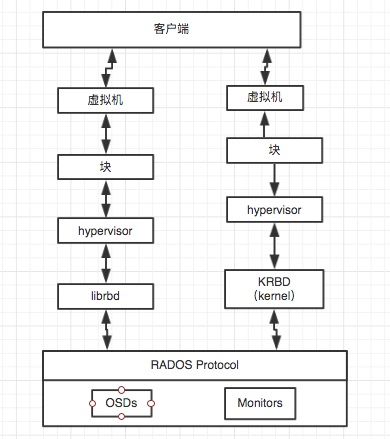

# Ceph 2  RBD

## RBD 块设备
* 块设备实际可以归属到SAN的序列，为其他主机提供额外的磁盘，也可以作为罗设备使用， 例如，集群做HA需要的SAN存储，即可以使用Ceph的RBD模式供给，VM虚拟化需要使用的块设备存储，也可以使用RBD模式供给。
* Ceph 块设备是精简配置的、大小可调且将数据条带化存储到集群内的多个 OSD 。 Ceph 块设备利用 RADOS 的多种能力，如快照、复制和一致性。 Ceph的RADOS块设备（ RBD ）使用内核模块或librbd库与OSD交互。
* 目前RBD主要服务对象是OpenStack，为VM提供块设备。
* Ceph块的架构图

* Ceph中的块设备有如下特性：
  * resizeable：随意设置大小。
  * 精简置备：用多少占多少，不会一次给予。
  * striped：切割成若干小块保存。

## 创建块设备

1. 清空上次实验所用到的CephFS文件系统和pool。

    [root@ceph-1 ~]# service ceph-mds@ceph-1 stop   <----所有mds主机
    [root@ceph-1 ~]# ceph mds fail 0
    [root@ceph-1 ~]# ceph mds fail 1
    [root@ceph-1 ~]# ceph mds fail 2  <----实例中是3个mds
    [root@ceph-1 ~]#  ceph fs rm testcephfs --yes-i-really-mean-it  <----删除cephfs
    [root@ceph-1 ~]# ceph osd pool delete cephfs_metadata cephfs_metadata --yes-i-really-really-mean-it
    [root@ceph-1 ~]# ceph osd pool delete cephfs_data cephfs_data --yes-i-really-really-mean-it   <----删除pool

2. 创建块设备（可以在任意一台ceph节点上创建）

    创建rbdpool
    [root@ceph-1 ~]# ceph osd pool create rbdpool 512
    pool 'rbdpool' created

    创建一个名为ceph-rbd1、大小为10G的RBD设备
    [root@ceph-1 ~]# rbd create ceph-rbd1 --size 10240 -p rbdpool
    注意：默认情况下rbd镜像会保存在ceph集群的rbd池中，可以使用-p参数改变池

    列出rbdpool 内的设备
    [root@ceph-1 ~]# rbd ls rbdpool
    ceph-rbd1

    列出rbd详细信息
    [root@ceph-1 ~]# rbd --image ceph-rbd1 info -p rbdpool

3. 调整块设备大小

    块设备都是精简设备，只有实际发生写入数据的时候才会占用物理空间，通过--size来设置最大的空间上限，而resize命令可以调节大小。
    [root@ceph-1 ~]# rbd resize --size 4096 rbdpool/ceph-rbd1 --allow-shrink
    Resizing image: 100% complete...done.

## 使用块设备

1. 完善hosts文件对应关系表
2. 利用ceph-4主机模拟客户端
3. ceph-4安装ceph软件包

    [root@ceph-1 ceph]# ceph-deploy install ceph-4
4. 管理节点上下发管理文件，授权访问集群

    [root@ceph-1 ceph]# ceph-deploy admin ceph-4

5. 客户端检查是否可以访问集群中的rbd设备

    [root@ceph-4 ~]# rbd ls -p rbdpool
    ceph-rbd1

6. 映射rbd到客户端

    [root@ceph-4 ~]# rbd map --image rbdpool/ceph-rbd1
    rbd: sysfs write failed
    RBD image feature set mismatch. You can disable features unsupported by the kernel with "rbd feature disable".
    In some cases useful info is found in syslog - try "dmesg | tail" or so.
    rbd: map failed: (6) No such device or address
    出现该错误，一些特性在客户端上无法支持。

7. 原因如下：

    1. rbd create 的时候可以使用 --image-format 指定格式。
    2. format 1 - 新建 rbd 映像时使用最初的格式。此格式兼容所有版本的 librbd 和内核模块，但是不支持较新的功能，像克隆。
    3. format 2 - 使用第二版 rbd 格式， librbd 和 3.11 版以上内核模块才支持。此格式增加了克隆支持，使得扩展更容易，还允许以后增加新功能。
    4. 默认使用format 2.所以挂载会出错。也就是说，需要关闭一些特性。
    5. jewel 版本，默认格式2的rbd 块支持如下特性，默认全部开启；
       layering: 支持分层
       striping: 支持条带化 v2
       exclusive-lock: 支持独占锁
       object-map: 支持对象映射（依赖 exclusive-lock ）
       fast-diff: 快速计算差异（依赖 object-map ）
       deep-flatten: 支持快照扁平化操作
       journaling: 支持记录 IO 操作（依赖独占锁）

8. 解决方法

    1. 重新创建rbd，支持layering
    [root@ceph-4 ~]# rbd remove rbdpool/ceph-rbd1    <----删除rbd
    Removing image: 100% complete...done.
    [root@ceph-4 ~]# rbd create rbdpool/ceph-rbd1 --size 10G --image-format 2 --image-feature  layering     <----新建rbd
    2. 查看并关闭其他特性
    [root@ceph-4 ~]# rbd info rbdpool/ceph-rbd1
	   features: layering, exclusive-lock, object-map, fast-diff, deep-flatten

     [root@ceph-4 ~]# rbd feature disable rbdpool/ceph-rbd1 exclusive-lock object-map fast-diff deep-flatten

    [root@ceph-4 ~]# rbd info rbdpool/ceph-rbd1
    	features: layering     <----关闭后只有一个特性

    3. 编译安装更高内核版本来支持新的features

9. 再次映射挂载

    [root@ceph-4 ~]# rbd map --image rbdpool/ceph-rbd1
    /dev/rbd0

    [root@ceph-4 ~]# rbd showmapped
    id pool    image     snap device
    0  rbdpool ceph-rbd1 -    /dev/rbd0

10. 格式化挂载使用，fdisk-->mkfs.xfs-->mount

11. 确认挂载可以使用

    [root@ceph-4 ~]# df -H
    文件系统                 容量  已用  可用 已用% 挂载点
    /dev/rbd0                 11G   35M   11G    1% /rbdtest

12. 取消挂载，取消映射

    [root@ceph-4 ~]# umount /dev/rbd0
    [root@ceph-4 ~]# rbd unmap /dev/rbd0
    [root@ceph-4 ~]# rbd showmapped

## 其他功能

### 快照
* 快照是映像在某个特定时间点的一份只读副本。Ceph块设备的一个高级特性是你可以为映像创建快照来保留其历史。Ceph支持分层快照，可以简单地、快速的克隆映像（例如vm映像）。
* 如果在做快照时让有IO进行，建议停止IO操作。
* 针对挂载过来的块设备进行分区使用，然后写入文件。

    [root@ceph-4 rbdtest]# ls
    messages
* 创建、查看快照

    [root@ceph-4 rbdtest]# rbd snap create rbdpool/ceph-rbd1@snap     <----@snap为快照名称，@为分割

    [root@ceph-4 rbdtest]# rbd snap ls rbdpool/ceph-rbd1
    SNAPID NAME     SIZE
    6 snap 10240 MB

* 写入新数据

    [root@ceph-4 rbdtest]# cp /etc/hosts ./
    [root@ceph-4 rbdtest]# ls
    hosts  messages

* 进行数据回滚

    [root@ceph-4 /]# umount /rbdtest      <----必须要umount!!!!!
    [root@ceph-4 /]# rbd snap rollback rbdpool/ceph-rbd1@snap
    Rolling back to snapshot: 100% complete...done.
    [root@ceph-4 /]# mount /dev/rbd0 /rbdtest/
    [root@ceph-4 /]# ls /rbdtest/
    messages

*  删除快照

    [root@ceph-4 /]# rbd snap rm rbdpool/ceph-rbd1@snap

### 克隆

* Ceph支持块设备创建多个COW克隆，（COW参考LVM章节），这样可以更快的创建镜像，例如使用虚拟机模板创建很多相通的虚拟机，而且还要保护模板不被篡改。
* 仅支持  format 2 。
* 创建过程： 创建Block Device Image ----> 创建快照 ----> 保护快照 ----> 克隆快照
* 创建format 2 的rbd镜像

    [root@ceph-4 /]# rbd create rbd2 --size 10240 --image-format 2 -p rbdpool

* 创建rbd镜像快照

    [root@ceph-4 /]# rbd snap create rbdpool/rbd2@snapshot1
    [root@ceph-4 /]# rbd snap ls rbdpool/rbd2
     SNAPID NAME          SIZE
     8 snapshot1 10240 MB

* 创建COW镜像前需要先保护这个快照，这是非常重要的一步

    [root@ceph-4 /]# rbd snap protect rbdpool/rbd2@snapshot1

* 通过快照创建一个克隆的RBD镜像

    [root@ceph-4 /]# rbd clone rbdpool/rbd2@snapshot1 rbdpool/clone_rbd2
    [root@ceph-4 /]# rbd info --image rbdpool/clone_rbd2
    rbd image 'clone_rbd2':
    size 10240 MB in 2560 objects
    order 22 (4096 kB objects)
    block_name_prefix: rbd_data.25ce03d1b58ba
    format: 2
    features: layering, exclusive-lock, object-map, fast-diff, deep-flatten
    flags:
    parent: rbdpool/rbd2@snapshot1    <----父镜像，目前来讲还是和父镜像有关系，读取的源还是父镜像
    overlap: 10240 MB

* 独立克隆镜像 。合并

    [root@ceph-4 /]# rbd flatten rbdpool/clone_rbd2
    Image flatten: 100% complete...done.  <----因为摆脱了父镜像，那么就要包含父镜像的信息，所以占用空间会比较大。
    [root@ceph-4 /]# rbd info --image rbdpool/clone_rbd2  <----再次查看已经发现和父镜像没关系了
* 如果你不再使用父镜像，可以先移除它的保护状态，再删除它

    [root@ceph-4 /]# rbd snap unprotect rbdpool/rbd2@snapshot1
    [root@ceph-4 /]# rbd snap rm rbdpool/rbd2@snapshot1

>此处其实较为有意思的是，是否需要进行独立，这就好比我们在用vmware虚拟机和vbox虚拟机的时候，对某个虚拟机做了复制，你会选择“链接复制”或者“全量复制”的道理是一样的，我建议如果原始的父镜像不使用，一直处理原始状态，可以采用链接复制，也就是克隆不合并，如果父镜像也要使用，那么还是选择“全量复制”，即合并信息，当然，这取决于你的需求。合并的完成时间和数据量是成正比的。

### OpenStack 支持
* Ceph 块设备最常见的用法是作为虚拟机的块设备镜像，利用块设备的快照和克隆技术，在已经完成的原始快照上进行快速部署虚拟机，拥有快照和COW的技术，可以让部署更便捷和迅速，因为客户端每次启动一个新的虚拟机将不许要下载整个image。
* Libvirt 库是管理程序和软件之间的一个虚拟机抽象层，所以开发者和系统管理员只需要关注管理器的通用管理框架、通用API 、以及virsh即可，对应的包括：QEMU/KVM、XEN、LXC、VirtualBox等。
* 而现在Ceph用的最多的就是为OpenStack提供块设备存储空间。可以理解为Openstack ----> libvirt --(configures)--> QEMU ----> librbd ----> MON & OSDs
* Ceph和Openstack对接的实例部分，还请参考 OpenStack 部分内容。

### 缓存参数
* Ceph 块设备的用户空间实现（即librbd）不能利用 Linux 页缓存，所以它自己实现了内存缓存，名为“ RBD 缓存”。 RBD 缓存行为就像硬盘缓存一样。当 OS 发送了 barrier 或 flush 请求时，所有脏数据都会写入 OSDs 。这意味着只要 VM 会正确地发送 flush 命令，使用回写缓存和常见物理硬盘一样安全。此缓存用最近最少使用（ Least Recently Used, LRU ）算法，而且在回写模式下它能合并相邻请求以提高吞吐量。
* RBD 选项应该位于 ceph.conf 配置文件的 [client] 段下，可用选项有：

|名称|描述|默认值|约束条件|
| :--- | :--- | :--- | :---- |
| rbd cache | 允许为 RADOS 块设备（ RBD ）提供缓存 | true| 无  |
| rbd cache size | RBD 缓存大小，单位是字节 | 32 MiB | 无  |
| rbd cache max dirty | 使缓存触发回写的 dirty 临界值，单位是字节。<b>若为 0 ，直接使用透写缓存  | 24 MiB | 必须小于 rbd cache size |
| rbd cache target dirty | 缓存开始向数据存储写回数据前的 dirty target。<b>不会阻塞到缓存的写动作于 | 16 MiB | 必须小于 rbd cache size |
| rbd cache max dirty age | 写回开始前，脏数据在缓存中的暂存时间 | 1.0  | 无  |
| rbd cache writethrough until flush | 开始进入透写模式，并且在收到首个 flush 请求后切换到回写模式。<b>启用该项保守但安全，以防 rbd 之上的虚拟机内核太老而不能发送 flush ，<b>例如 Linux 2.6.32 之前的 virtio 驱动。 | true   | 无 |

### 预读参数
* RBD 支持预读或预取功能，以此优化小块的顺序读。此功能通常应该由访客操作系统（在虚拟机的情况下）处理，但是引导加载程序可能不会发出高效的读请求。如果停用缓存功能，预读也会自动被禁用。
                                   
|名称|描述|默认值|约束条件|
| :--- | :--- | :--- | :---- |
|rbd readahead trigger requests|触发预读的顺序读请求数量。|10|无|
|rbd readahead max bytes | 预读请求的最大尺寸。如果是零，禁用预读|512 KiB|无|
|rbd readahead disable after bytes|从 RBD 映像读取这么多字节后，预读功能将被禁用，直到关闭。<b>这样访客操作系统一旦启动后就可以接管预读了。设为 0 时仍开启预读。|50 MiB|无|

## 总结
本章节主要讲解RBD的配置和管理，同时介绍了RBD一些特性，这些特性都是在为OpenStack中的VM提供块设备服务的时候常用到的，所以还是先要熟悉熟悉。