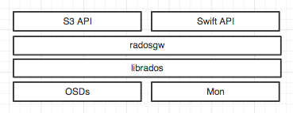
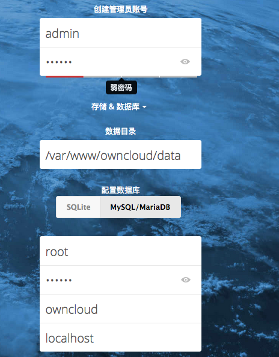
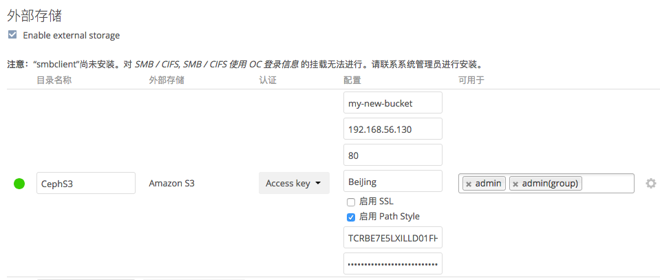

# Ceph 对象网关

* Ceph的对象网关是构建在Librados之上的对象存储接口，支持如下2种接口：
    1. S3,亚马逊S3 RESTful接口
    2. Swift，兼容OpenStack Swift接口
* 如果要了解对象存储，有必要先了解一下“对象”，以及Ceph的对象工作模式。

## 对象存储
1. 什么是对象  

    * 包含了文件数据以及相关的属性信息，可以进行自我管理，对象可以是任何东西，可以是日志，可以是归档数据，可以是影音视频等等。
    * 对象是对象存储的基本单位，每个Object都是数据和自身属性的集合体。数据属性是可以根据应用的需求进行设置的，包括数据的分布。

2. 什么是对象存储

    * 对象存储和传统存储的区别简要如下：
        * 传统存储模式是将文件数据和元数据都存储在一起，没有做元数据和数据的单独区分，每个存储的block会告诉你下一个block位置在哪，换句话讲，即使你有每次读取1000个block的能力，但是实际上你也只能一个一个的去读取。
        * 对象存储是将元数据独立起来存储，称之为“元数据服务器”，元数据服务器主要存储对象的属性（主要是对象的数据被打散存放到了那几台分布式服务器中的信息），如果这个时候你访问对象存储，首先和元数据服务器做交互，拿到这个分布的地图，然后直接访问地图中的位置，并且是分布式的同时读取，那么速度上是不是快了很多？
        * 对象存储还需要具备对象存储管理软件，正是利用以上特点，将块存储和文件存储做了美妙的结合。

3. 为什么使用对象存储？
        
    * 简单理解就是一句话“数据太多了，读写太慢了”。
    * 一旦形成海量的数据存储（含大小文件），无论是从并发的读取和写入上都将出现瓶颈，使得响应越来越慢，传统存储模式难以摆脱复杂的“树”装结构，一旦“量”上来了，树就会越来越大，响应越来越迟钝，存储空间也越来越紧张，扩容困难。

4. 如何区分什么场景使用对象存储？

    * 如果应用是需要直接裸盘映射的，比如数据库，那么这时候还是要使用块设备来存储。
    * 如果应用挂载的是NAS（文件共享系统，例如NFS，SMB），这些实际可以进行改造，然后使用对象存储，如果改造成本太大，分析远期收益不乐观的情况下，还是建议保持原有结构，可以使用GlusterFS或者CephFS做无缝对接，最起码实现了分布式的后端存储，不在为存储空间而担忧。
    * 如果应用可以改造或者兼容到S3和Swift的模式，那么将无条件使用对象存储。

5. Ceph中对象网关结构图

* Ceph 对象存储使用 Ceph 对象网关守护进程（ radosgw ），它是个与 Ceph 存储集群交互的 FastCGI 模块。因为它提供了与 OpenStack Swift 和 Amazon S3 兼容的接口， RADOS 要有它自己的用户管理。 Ceph 对象网关可与 Ceph FS 客户端或 Ceph 块设备客户端共用一个存储集群。 S3 和 Swift 接口共用一个通用命名空间，所以你可以用一个接口写如数据、然后用另一个接口取出数据。

6. 术语

* accesskey、secretkey：S3的密钥key，accesskey进行身份识别、secretkey进行数字签名，共同完成应用接入的授权认证。
* bucket：逻辑存储空间、用于存放对象的容器，对象必须存储在特定的bucket中。每个bucket可以存放无限制个对象，但是bucket之下不能在创建bucket。
* service：S3提供给用户的存储，其中可以包含1到N个bucket。
* region ：标识物理位置
* object：对象，泛指一个文档、图片或视频文件等，尽管用户可以直接上传一个目录，但是ceph并不按目录层级结构保存对象， ceph所有的对象扁平化的保存在bucket中。

## 利用Ceph 对象网关实现开源云盘系统（OwnCloud 社区版）

### 部署
1. 安装对象网关
* 0.8版本开始，Ceph对象网关运行在Civerweb上（集成在Ceph-radosgw守护进程内），不在是apache和FastCGI，Civetweb默认运行在 7480 端口上。

        [root@ceph-1 ceph]# ceph-deploy rgw create ceph-2  <----在ceph-2中创建网关
        
        访问 http://ceph-2:7480,测试网关服务是否正常加载并开启。

2. 修改端口到80，使用常规HTTP访问逻辑
* 如果觉得7480 这个端口比较绕，可以尝试修改端口到80

        [root@ceph-1 ceph]# vim /etc/ceph/ceph.conf
        [client.rgw.ceph-2]
        rgw_frontends = "civetweb port=80"
        
        [root@ceph-1 ceph]# ceph-deploy --overwrite-conf config push ceph-1 ceph-2 ceph-3
        [root@ceph-2 ~]# systemctl restart ceph-radosgw@rgw.ceph-2.service    <----重启生效

3. 设置分片
* Ceph 对象网关在 index_pool 中存储 bucket 的索引数据，默认情况下是资源池 .rgw.buckets.index，很多用户不做调整，导致大量的对象存放在一个buket中，从而产生索引的性能下降。
* rgw_override_bucket_index_max_shards 参数有助于防止大量对象存在时的产生性能瓶颈，默认为0（关闭状态），非0则为开启。
* 在 [global] 中进行添加

        [root@ceph-1 ceph]# vim ceph.conf
            rgw_override_bucket_index_max_shards = 1
        [root@ceph-1 ceph]# ceph-deploy --overwrite-conf config push ceph-1 ceph-2 ceph-3
        [root@ceph-2 ~]# systemctl restart ceph-radosgw@rgw.ceph-2.service    <----看清楚在哪重启的！

4. S3测试使用
* 创建S3接口账户和Swift接口账户，验证能否访问网关

        [root@ceph-1 ceph]# radosgw-admin user create --uid="S3user" --display-name="S3"
            "access_key": "TCRBE7E5LXILLD01FH3O",
            "secret_key": "9TwNNYTS2sux1IOOlmeuCMerptBzdAEEMMTIqV2H"   <----返回数据中，这2个key是用来访问时候做验证的。

        创建S3下的Swift子账户
        [root@ceph-1 ceph]# radosgw-admin subuser create --uid=S3 --subuser=S3user:swift --access=full
        生成swift用户key
        [root@ceph-1 ceph]# radosgw-admin key create --subuser=S3user:swift --key-type=swift --gen-secret

        测试访问：
        [root@ceph-2 ~]#  yum install python-boto

        创建python脚本   <----替换access和secret的key，替换host和port。

        [root@ceph-2 ~]# cat s3test.py
        import boto
        import boto.s3.connection

        access_key = 'TCRBE7E5LXILLD01FH3O'
        secret_key = '9TwNNYTS2sux1IOOlmeuCMerptBzdAEEMMTIqV2H'
        conn = boto.connect_s3(
                aws_access_key_id = access_key,
                aws_secret_access_key = secret_key,
                host = 'ceph-2', port = 80,
                is_secure=False, calling_format = boto.s3.connection.OrdinaryCallingFormat(),
                )

        bucket = conn.create_bucket('my-new-bucket')
        for bucket in conn.get_all_buckets():
            print "{name} {created}".format(
                name = bucket.name,
                created = bucket.creation_date,
        )

        运行测试
        [root@ceph-2 ~]# python s3test.py
        my-new-bucket 2018-03-14T03:50:08.303Z      <----返回正常

5. 测试Swift
* Swfit的访问可以通过命令行。首先安装相关软件包

        [root@ceph-2 ~]# yum install python-setuptools
        [root@ceph-2 ~]# easy_install pip
        [root@ceph-2 ~]# pip install --upgrade setuptools
        [root@ceph-2 ~]# pip install --upgrade python-swiftclient
        [root@ceph-2 ~]# swift -A http://172.16.0.138/auth/1.0 -U S3user:swift -K '9hUj6Z3gZGyjj0SGIVn52JswLWdLMlFG91PNnwjI' list
        my-new-bucket    <----返回结果

### 调试配置，简单使用
* Ceph 对象网关是 Ceph 存储集群的一个客户端，作为 Ceph 存储集群的客户端，它需要：

        1. 需要为网关实例配置一个名字 .
        2. 存储集群的一个用户名，并且该用户在keyring中有合适的权限.
        3. 存储数据的资源池.
        4. 网关实例的一个数据目录.
        5. Ceph 配置文件中有一个实例配置入口.
        6. web 服务器有一个配置文件跟 FastCGI 交互.

1. 用户和key
* 每一个实例必须有一个用户名和key来跟 Ceph 存储集群通信。权限方面要注意，每个key最少要有读权限，也可以选择为 monitor 提供写的权限，如果你给 key 分配了写权限, Ceph 对象网关将具备自动新建资源池的能力; 此时,它将会根据默认的 PG 值(不是最合适的)或者你在 Ceph 配置文件中指定的 PG 数. 如果你允许 Ceph 对象网关自动新建资源池，请确保你首先定义好了合理的默认 PG 值. 

        生成对象网关的用户和key，创建了一个名为gateway的用户，并将密钥文件存储在/etc/ceph目录下
        [root@ceph-1 ceph]# ceph auth get-or-create client.radosgw.gateway osd 'allow rwx' mon 'allow rwx' -o /etc/ceph/ceph.client.radosgw.keyring
        分发到rgw
        [root@ceph-1 ceph]# scp /etc/ceph/ceph.client.radosgw.keyring ceph-2:/etc/ceph/

2. 存储池
* rgw需要存储池来存储数据，如果授权用户具有相关权限，rgw将会自动创建存储池，如果使用默认的区域（region）和可用区（zone），将包含如下的池： rados lspools进行查看

        .rgw.root
        .rgw.control
        .rgw.gc
        .rgw.buckets
        .rgw.buckets.index
        .rgw.buckets.extra
        .log
        .intent-log
        .usage
        .users
        .users.email
        .users.swift
        .users.uid

* 建议删除默认创建的pool

        ceph osd pool delete .rgw.root .rgw.root --yes-i-really-really-mean-it
        使用命令，依次循环删除原有pool，重新创建，设置合理的pg和pgp
* 您也可以手动创建各个存储池：

        ceph osd pool create {poolname} {pg-num} {pgp-num} {replicated | erasure} [{erasure-code-profile}]  {ruleset-name} {ruleset-number}
        范例如下：（不要抄袭，一定要按照自己的pg和pgp设置）
                ceph osd pool create .rgw 128 128    
                ceph osd pool create .rgw.root 128 128   <----bucket 元数据信息  
                ceph osd pool create .rgw.control 128 128 <----该pool上创建若干个普通对象用于watch-notify
                ceph osd pool create .rgw.gc 128 128 <---- 该pool用于记录那些待删除的文件对象
                ceph osd pool create .rgw.buckets 128 128 <---- 存放数据
                ceph osd pool create .rgw.buckets.index 128 128 <---- 存储bucket的文件索引对象。
                ceph osd pool create .log 128 128 <---- 用于存储3种类型log，oplog，meta_log，data_log
                ceph osd pool create .intent-log 128 128 <---- 未使用
                ceph osd pool create .usage 128 128 <---- 存储计量数据统计
                ceph osd pool create .users 128 128 <---- 用于存储用户AK和uid的对应关系
                ceph osd pool create .users.email 128 128 <---- 用于存储用户email和uid的对应关系
                ceph osd pool create .users.swift 128 128 <---- 用于存储swift key和uid的对应关系
                ceph osd pool create .users.uid 128 128  <---- 用于存储用户信息，每个用户都有一个唯一的uid作为对象名
> 实验是选择的默认创建，生产中要进行规划，自行创建，一定要计算好pg的值。

3. 添加rgw配置 -- Civetweb --

        [root@ceph-1 ceph]# vim /etc/ceph/ceph.conf
        [client.radosgw.gateway]    <----和keyring内的名称要一致
        host = {hostname}
        keyring = /etc/ceph/ceph.client.radosgw.keyring
        log file = /var/log/radosgw/client.radosgw.gateway-node1.log
        rgw_frontends = civetweb port=80     <----默认7480，已经更改为80了，实例1。

* --- Nginx ---

        [root@ceph-1 ceph]# vim /etc/ceph/ceph.conf
        [client.radosgw.gateway]
        rgw_frontends = fastcgi
        host = {hostname}
        keyring = /etc/ceph/ceph.client.radosgw.keyring
        rgw_socket_path = /var/run/ceph/ceph.radosgw.gateway.sock
        log_file = /var/log/ceph/radosgw.log
        rgw_print_continue = false
        rgw_content_length_compat = true

        配置nginx服务，在/etc/nginx/nginx.conf文件的http段下添加如下内容：

        http {
        server {
                listen   80 default;
                server_name {hostname};
            location / {
                    fastcgi_pass_header Authorization;
                    fastcgi_pass_request_headers on;
                    fastcgi_param QUERY_STRING  $query_string;
                    fastcgi_param REQUEST_METHOD $request_method;
                    fastcgi_param CONTENT_LENGTH $content_length;
                    fastcgi_param CONTENT_LENGTH $content_length;

                    if ($request_method = PUT) {
                            rewrite ^ /PUT$request_uri;
                    }

                    include fastcgi_params;
                    fastcgi_pass unix:/var/run/ceph/ceph.radosgw.gateway.sock;
                }

                location /PUT/ {
                    internal;
                    fastcgi_pass_header Authorization;
                    fastcgi_pass_request_headers on;

                    include fastcgi_params;
                    fastcgi_param QUERY_STRING  $query_string;
                    fastcgi_param REQUEST_METHOD $request_method;
                    fastcgi_param CONTENT_LENGTH $content_length;
                    fastcgi_param  CONTENT_TYPE $content_type;
                    fastcgi_pass unix:/var/run/ceph/ceph.radosgw.gateway.sock;
                }
        }
        <--fastcgi_pass 指向的路径需要与ceph.conf中配置的路径一致-->
* 同步配置文件

        [root@ceph-1 ceph]# ceph-deploy --overwrite-conf config push ceph-1 ceph-2 ceph-3

4. 启动rgw实例

        [root@ceph-2 ~]# radosgw -c /etc/ceph/ceph.conf -n client.radosgw.gateway

5. 高并发处理
* 有时为了提高rgw的并发能力，需要部署多个rgw实例。其实也很简单，在多个节点上部署多个rgw实例：只需要安装rgw包，并将ceph.conf文件，密钥文件，前端配置文件拷贝到相应的节点，然后启动实例就好。

        拷贝key
        [root@ceph-1 ~]# scp /etc/ceph/ceph.client.radosgw.keyring ceph-3:/etc/ceph/    
        同步配置文件
        [root@ceph-1 ceph]# ceph-deploy --overwrite-conf config push ceph-1 ceph-2 ceph-3
        启动
        [root@ceph-2 ~]# radosgw -c /etc/ceph/ceph.conf -n client.radosgw.gateway

> 到这Ceph的对象网关可以简单的运行起来了。

### 结合 OwnCloud
* KDE 社区开发的免费软件，提供私人的 Web 服务。当前主要功能包括文件管理、文件分享、音乐、日历、联系人等等，可在PC和服务器上运行，是一款基于php的网盘。
* 要预先部署LAMP环境，这个不是难事吧？？？？

        1. # yum -y install mariadb-server mariadb   <----安装mysql
        2. # systemctl start mariadb.service    <----启动mysql
        3. # systemctl enable mariadb.service    <----随机启动mysql
        4. # mysql_secure_installation    <----设置mysql密码
        5. # yum -y install httpd    <----安装apache
        6. # systemctl start httpd.service    <----启动apache
        7. # systemctl enable httpd.service    <----随机启动apache
        8. # rpm -Uvh http://rpms.remirepo.net/enterprise/remi-release-7.rpm  <----添加repo库
        9. # yum -y install yum-utils    <----安装yum-utils
        10. # yum-config-manager --enable remi-php71     <----安装php7.1
        11. # yum -y install php php-opcache    <----安装php7.1
        11. # yum -y install php-mysql    <----安装php-MySQL模块
        12. # yum -y install php-gd php-ldap php-odbc php-pear php-xml php-xmlrpc php-mbstring php-soap curl curl-devel  php-zip php-intl   <----安装php其他通用模块，一定要确认安装成功，建议2次！
        13. # systemctl restart httpd.service    <----重新启动apache
>以上部分我将LAMP部署在ceph-1的主机上了，ceph-2作为对象存储接入。
* OwnCloud 部署

1. 下载部署 
 
        [root@ceph-1 ~]# wget https://download.owncloud.org/community/owncloud-10.0.7.tar.bz2
        [root@ceph-1 ~]# tar xvf owncloud-10.0.7.tar.bz2   -C /var/www/
        [root@ceph-1 ~]# cd /var/www/owncloud/
        [root@ceph-1 owncloud]# mkdir data
        [root@ceph-1 owncloud]# chown apache:apache config
        [root@ceph-1 owncloud]# chown apache:apache data
        [root@ceph-1 owncloud]# chown apache:apache apps
        [root@ceph-1 owncloud]# cd /var/www/html
        [root@ceph-1 html]# ln -s ../owncloud/core
        [root@ceph-1 html]# vim /etc/httpd/conf.d/owncloud.conf
        <Directory /var/www/owncloud>
            AllowOverride All
        </Directory>
        Alias /owncloud /var/www/owncloud

2. 访问测试：http://ip/owncloud/，并进行设置

>使用mariaDB，并输入数据库密码。本例未考虑安全使用，所以使用root账户，实际环境应该规划数据库结构。

* 对接S3接口
        
        1. 输入账户密码进行登录，右上角显示的账户名称处，下拉选项，选择设置。
        2. 在左侧选项卡中选择存储，并开启外部存储
        3. 进行设置

>如果这时忘记了链接Ceph的S3的账户和密钥key，可以使用如下指令查询：

        [root@ceph-1 ceph]# radosgw-admin metadata list user
        [
        "S3user"
        ]
        [root@ceph-1 ceph]# radosgw-admin user info --uid=S3user
* 测试使用

        通过页面选择添加外部存储所设置的目录，进行上传测试。

## 总结
以上内容为Ceph的对象存储搭建和使用，其实对象存储很多内容，所以在第四章中，也会在讲讲这部分内容，针对CEPH的对象管理。