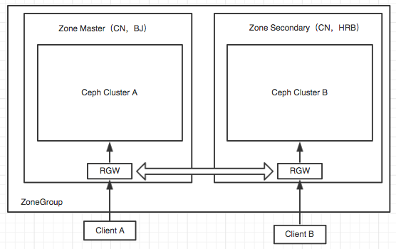

# Ceph 对象网关-2

* 前章所说的都是在默认的情况下最经典的搭建方式，可是很多时候我们会面临众多的用户，这个对于CEPH的对象存储的压力还是非常大的，所以要做好提前规划。
* 规划中有几个要素如下：
    * 主机尽可能的大内存，否则levelDB和OSD会因为数据量的压力产生问题
    * 主机一定要配置SSD磁盘来做元数据的pool（.rgw.buckets.index）
    * 合适的sata盘组成数据资源池（.rgw.buckets的pool）
    * 一定要设置“rgw_override_bucket_index_max_shards”分片，否则单bucket数据多了，绝对是个灾难
    * 网络尽可能的万兆，并且要区分public和cluster
    * 规划好pg和pgp
    * 做好bucket的数量规划，例如每一个部门使用一个bucket？还是一个公司公用一个bucket，这个要好好划分，计算好量。

## 创建bucket
* 前面几个都可以处理，但是分出不同的bucket就需要新建了，所以需要熟悉s3调试工具。
1. 调试对象存储 s3cmd

        [root@ceph-1 ceph]# yum install s3cmd -y
2. 配置s3cmd进行S3接口测试

        [root@ceph-1 ceph]# s3cmd --configure
        Access Key: TCRBE7E5LXILLD01FH3O         <----输入access key
        Secret Key: 9TwNNYTS2sux1IOOlmeuCMerptBzdAEEMMTIqV2H    <----输入 Secret key
        Default Region [US]:           <----地区默认，可以不更改
        S3 Endpoint [s3.amazonaws.com]: 192.168.56.130     <----输入 IP
        DNS-style bucket+hostname:port template for accessing a bucket [%(bucket)s.s3.amazonaws.com]: 192.168.56.130:80/my-new-bucket    <----输入IP + bucket
        Encryption password:        <----回车默认
        Path to GPG program [/usr/bin/gpg]:     <----回车默认
        Use HTTPS protocol [Yes]: no      <----输入no，不使用https
        HTTP Proxy server name:    <----回车默认
        Test access with supplied credentials? [Y/n] y  <----输入Y
        Save settings? [y/N] y    <----输入 Y
        Configuration saved to '/root/.s3cfg'  

3. 帮助命令：s3cmd --help
4. 创建bucket
        
        [root@ceph-1 ceph]# s3cmd mb s3://my-test-bucket
        Bucket 's3://my-test-bucket/' created

        [root@ceph-1 ceph]# radosgw-admin buckets list
        [
            "my-test-bucket",
            "my-new-bucket"
        ]
5. 同样可以将该bucket对接到owncloud上，并且为单独的用户服务。其实也可以这样操作，在你前端的注册部分，如果用户注册合法通过，将调用API创建一个bucket出来，这样就可以了，省的后端在创建，还要去做对应。

## zone同步（多活机制）

* RGW很容易就解决了网盘问题，但是有没有想过类似网盘这类服务，是不是该考虑下高可靠和高可用呢？不可能读取和写入全部都集中在中心服务器吧，带宽和数据压力会直接压垮整个网盘或者类似使用RGW的服务。
* 还好RGW提供了很多解决方案，不仅可以容灾，还可以借助DNS和负载均衡，CDN等技术提供就近访问，分散流量并且实现客户的高速访问。
* 什么是多活？

        * 多活指的是多个数据中心可以同时对多个对象存储业务提供服务，同一对象存储业务可以从不同的数据中心接入访问得到同样一份数据。
        * 对于Ceph， 多个数据中心可以在一个集群中，也可以分布在不同集群中。
* 术语
        * Region：地区，它包含一个或多个域。一个包含多个 region 的集群必须指定一个主 region。（比如：中国，CN。北京，BJ）
        * Zone: 域、是一个或多个 Ceph 对象网关例程的逻辑分组。每个 region 有一个主域处理客户端请求。zone不可以跨集群。（Zone的划分一般以集群为单位，多个集群可以划分成zone1和zone2）
        * realm：代表一个唯一的命名空间，有一个或多个zonegroup组成。在同一个realm中的不同zonegroup只能同步元数据。在realm中有period的概念，表示zonegroup的配置状态，修改zonegroup，必须更新period。

* 结构图

* 从数据的访问和bucket的创建来说，简单的2句话：
        * 所有的bucket创建都需要在zone master进行，即使Ceph ClusterB 收到指令也要转发给 zone master来进行创建，同时ClusterB 在创建。
        * 所有数据请求，创建对象，上传对象等等都各自处理各自的。

* 从数据同步来说：
        * master zone ：拥有元数据变化通知线程，如果元数据发生变化，通知其他zone进行同步
        * 其他 zone：拥有元数据变化接收线程，如果发生接收到元数据变化，将与maater zone 同步
        * 数据同步都是相等的，都拥有数据变化通知线程，如果发生数据变化，将及时通知其他zone进行数据同步
        * 每个zone还有数据同步处理线程，用于数据同步。

>使用ceph-2模拟zone-master，ceph-4模拟zone-slave来实现同步，实际生产实现，还需要考虑主备切换、网络、用户群体等等因素所在。

* 实施
* Ceph rgw需要使用多个pool来存储相关的配置及用户数据。删除默认创建的rgw，自行创建，利用命名格式管理和区分不同的zone，本例以（master 和 secondary）来做前缀。

        1. 删除原有rgw pool，参考前章内容。
        2. 在CEPH-4 主机创建单节点ceph集群
                1. 安装ceph-deploy部署工具。
                2. 安装ceph软件
                3. 修改/etc/ceph/ceph.conf文件，global添加如下：
                        osd_crush_chooseleaf_type = 0   <----表示故障域为osd，默认的是为host。因为是单节点，所以要设置故障域为osd才能使得pg达到active+clean状态。
                        osd_pool_default_size = 3   <----表示副本数为3
                        public_network = 网络地址  <----添加网络
                4. 创建mon，# ceph-deploy mon create-initial
                5. 初始化osd，# ceph-deploy disk zap ceph-4:sd{b,c,d}
                6. 创建osd，# ceph-deploy osd create ceph-4:sd{b,c,d}
                7. 安装对象网关，# ceph-deploy rgw create ceph-4
               
        3. 删除原有pool，创建自定义的pool
         
                ceph-2 主机执行：
                # for i in `ceph osd pool ls | grep .`; do ceph osd pool delete $i $i  --yes-i-really-really-mean-it;done

                # ceph osd pool create .rgw.root 16 16
                # ceph osd pool create zone_master_xcl.rgw.control 16 16
                # ceph osd pool create zone_master_xcl.rgw.data.root 16 16
                # ceph osd pool create zone_master_xcl.rgw.gc 16 16
                # ceph osd pool create zone_master_xcl.rgw.log 16 16
                # ceph osd pool create zone_master_xcl.rgw.intent-log 16 16
                # ceph osd pool create zone_master_xcl.rgw.usage 16 16
                # ceph osd pool create zone_master_xcl.rgw.users.keys 16 16
                # ceph osd pool create zone_master_xcl.rgw.users.email 16 16
                # ceph osd pool create zone_master_xcl.rgw.users.swift 16 16
                # ceph osd pool create zone_master_xcl.rgw.users.uid 16 16
                # ceph osd pool create zone_master_xcl.rgw.buckets.index 32 32
                # ceph osd pool create zone_master_xcl.rgw.buckets.data 32 32
                # ceph osd pool create zone_master_xcl.rgw.meta 16 16

                ceph-4 主机执行：
                # for i in `ceph osd pool ls | grep .`; do ceph osd pool delete $i $i  --yes-i-really-really-mean-it;done

                # ceph osd pool create .rgw.root 16 16
                # ceph osd pool create zone_secondary_xcl.rgw.meta 16 16
                # ceph osd pool create zone_secondary_xcl.rgw.control 16 16
                # ceph osd pool create zone_secondary_xcl.rgw.data.root 16 16
                # ceph osd pool create zone_secondary_xcl.rgw.gc 16 16
                # ceph osd pool create zone_secondary_xcl.rgw.log 16 16
                # ceph osd pool create zone_secondary_xcl.rgw.intent-log 16 16
                # ceph osd pool create zone_secondary_xcl.rgw.usage 16 16
                # ceph osd pool create zone_secondary_xcl.rgw.users.keys 16 16
                # ceph osd pool create zone_secondary_xcl.rgw.users.email 16 16
                # ceph osd pool create zone_secondary_xcl.rgw.users.swift 16 16
                # ceph osd pool create zone_secondary_xcl.rgw.users.uid 16 16
                # ceph osd pool create zone_secondary_xcl.rgw.buckets.index 32 32
                # ceph osd pool create zone_secondary_xcl.rgw.buckets.data 32 32
        4. 创建realm 、synchronization-user（同步用户）、zonegroup、zone

                ceph-2主机操作：（Ceph-2这个主机做了一些修改，对外服务的端口调整到88了，同步用的端口调整到80，当然也可以利用原有80，这里多加了一个实例而已）
                # radosgw-admin realm create --rgw-realm=realm_xcl --default
                # radosgw-admin zonegroup create --rgw-zonegroup=xcl --endpoints=http://ceph-2:80 --rgw-realm=realm_xcl --master --default
                # radosgw-admin user create --uid="synchronization-user" --display-name="Synchronization User" --system       <----记录下key
                # radosgw-admin zone create --rgw-zonegroup=xcl --rgw-zone=zone_master_xcl --master --default --endpoints=http://ceph-2:80
                
                清除原有默认配置
                # radosgw-admin zonegroup remove --rgw-zonegroup=default --rgw-zone=default
                # radosgw-admin period update --commit
                # radosgw-admin zone delete --rgw-zone=default
                # radosgw-admin period update --commit
                # radosgw-admin zonegroup delete --rgw-zonegroup=default
                # radosgw-admin period update --commit

                清除原有多余的pool
                # rados rmpool default.rgw.control default.rgw.control --yes-i-really-really-mean-it
                #rados rmpool default.rgw.data.root default.rgw.data.root --yes-i-really-really-mean-it
                #rados rmpool default.rgw.gc default.rgw.gc --yes-i-really-really-mean-it
                #rados rmpool default.rgw.log default.rgw.log --yes-i-really-really-mean-it
                #rados rmpool default.rgw.users.uid default.rgw.users.uid --yes-i-really-really-mean-it

                增加同步用户
                # radosgw-admin zone modify --rgw-zone=zone_master_xcl --access-key=U3PM234OAS5TZOD4IGWO --secret=V5exIikkI9BI2aqNePFaRZLt2h6u904xblbD6GEf

                更新数据
                # radosgw-admin period update --commit

                调整对应的实例ceph.conf
                [client.rgw.ceph-2]
                host = ceph-2
                rgw_zone=zone_master_xcl     <----一定注意是这么写！！！
                rgw_frontends = civetweb port=80

                [client.radosgw.gateway.ceph-2]
                host = ceph-2
                keyring = /etc/ceph/ceph.client.radosgw.keyring
                #log file = /var/log/radosgw/client.radosgw.gateway-1.log
                rgw_frontends = civetweb port=88    <----88端口对网盘提供服务
                
                启动实例：
                PS：88端口启动的时候是：
                # radosgw -c /etc/ceph/ceph.conf -n client.radosgw.gateway.ceph-2
                ceph-2实例：
                # systemctl start ceph-radosgw@rgw.ceph-2.service

        5. ceph-4主机操作：

                realm pull到ceph-2:80,并设置对应的access和secret密钥
                # radosgw-admin realm pull --url=http://ceph-2:80 --access-key=U3PM234OAS5TZOD4IGWO --secret=V5exIikkI9BI2aqNePFaRZLt2h6u904xblbD6GEf

                设置realm_xcl为default
                # radosgw-admin realm default --rgw-realm=realm_xcl

                设置同步账户
                # radosgw-admin zone create --rgw-zonegroup=xcl --rgw-zone=zone_secondary_xcl --access-key=U3PM234OAS5TZOD4IGWO --secret=V5exIikkI9BI2aqNePFaRZLt2h6u904xblbD6GEf --endpoints=http://ceph-4:80

                删除默认zone
                # radosgw-admin zone delete --rgw-zone=default
                
                删除多余pool
                # rados rmpool default.rgw.control default.rgw.control --yes-i-really-really-mean-it
                # rados rmpool default.rgw.data.root default.rgw.data.root --yes-i-really-really-mean-it
                # rados rmpool default.rgw.gc default.rgw.gc --yes-i-really-really-mean-it
                # rados rmpool default.rgw.log default.rgw.log --yes-i-really-really-mean-it
                # rados rmpool default.rgw.users.uid default.rgw.users.uid --yes-i-really-really-mean-it

                更新
                # radosgw-admin period update --commit

                启动
                systemctl restart ceph-radosgw@rgw.ceph-4.service
>以上为止，所有的东西都处理完成了，可以利用owncloud将2个存储都挂载上，这时候在一侧传东西，另外一侧就会看到，当然，这需要一个同步的时间。
* 这个上述实例中配置较为复杂，如果配置错了怎么处理？ 
                * 上述关键点在于realm、zonegroup、zone的配置
                * 查看配置可以使用 ： radosgw-admin realm|zonegroup|zone list --rgw=realm|zonegroup|zone  (name)
                * 配置错误可以使用 modify 修改或者干脆直接删除 delete 
                * 查看详细信息可以使用 radosgw-admin realm|zonegroup|zone get --rgw=realm|zonegroup|zone  (name)
                * 别忘记更新 period update --commit

* 切换
        * 如果 master zone 失效了，则切换到 secondary zone，因为master 失效以后将无法新增bucket，但是原有bucket的数据上传和下载都没有问题。
        测试步骤如下：
                1. 关闭ceph-2主机上的同步实例
                2. 利用s3cmd指令链接ceph-4进行bucket创建
                3. 结果为失败：
                        
                        [root@ceph-1 ~]# s3cmd mb s3://my-test-ceph4-bucket
                        ERROR: S3 error: 400 (InvalidArgument)
                4. 开启ceph-2主机上的同步实例，再次使用s3cmd进行创建即可成功
        * 但是这会出现一个问题，如果master长时间没有响应，或者需要很长时间修复，这个时间段要如何新增bucket？是不是该进行master 和 secondary的角色转换了？
                1. 切换角色

                        [root@ceph-4 ~]# radosgw-admin zone modify --rgw-zone=zone_secondary_xcl  --master --default
                        [root@ceph-4 ~]# radosgw-admin period update --commit
                        [root@ceph-4 ~]# systemctl restart ceph-radosgw@rgw.ceph-4.service
                2. 再次创建
                        [root@ceph-1 ~]# s3cmd mb s3://my-test-ceph4-bucket1
                        Bucket 's3://my-test-ceph4-bucket1/' created
> 原来的master恢复以后，将自动成为secondary.如需要调整，可以使用上述命令更改回去。

        [root@ceph-4 ~]# radosgw-admin sync status
        ......
        metadata sync no sync (zone is master)  <----注意这里谁是master
        ......
        另外一侧为：metadata sync syncing

> 注意：
        
        在更改哪个区域是元数据 Master 时必须小心。如果一个区域没有从目前的主区域完成同步元数据，它将无法提供未同步的剩余的条目，晋升为Master，这些更改将会丢失。为此，需要等待radosgw同步元数据完成。
        类似地，如果当前Mater zone正在处理元数据的更改，而另一个区域正在被提升为Master，那么这些更改很可能会丢失。为了避免这种情况，关闭radosgw实例的建议。提升之后一个区后，再重新启动。

## 总结：
到现在位置RGW算是勉强可以支撑运行，但是还是有很多细节，无法一一展现，在上线使用之前，一定要多多进行测试。