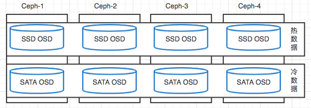

#Ceph - 调优相关

* 分布式存储Ceph如果想要进行大规模的使用和在生产中使用的优雅顺畅，那么调优是必不可少的环节，下面将介绍一些常用的调优手段，针对整体进行调优，更多的细节还是需要在场景中进行测试，逐步进行调节，然后达到最优的性能。

## SSD 融合
* 依借SSD的速度优势，来加速分布式存储已经成为现阶段的主流技术手段，在Ceph中将SSD进行融合，提供更快更优秀的分布式存储性能。
### 可以分为如下4种融合模式：

####  1. OSD的Journal盘  

 
>OSD的Journal盘 

* Ceph使用SSD作为日志盘提高访问性能，加速客户端读写操作
* journal的特点是数据小，而且journal的写都是顺序写
* 关闭硬件磁盘cache（# hdparm -W 0 /dev/hda 0），Ceph中调用flags |= O_DIRECT | O_DSYNC来进行写模式和写缓存，而kernel不对硬件缓存做管理，所以当O_DSYNC达到数据量而进入磁盘硬件缓存之后，即立刻返回成功标识，但是数据并没有真正的写到磁盘中。

* 步骤如下：

        # ceph-deploy disk zap ceph-4:sdd:/dev/sdb
        # ceph-deploy disk zap ceph-4:sdc:/dev/sdb    <----这里假设sdb是SSD

        # ceph-deploy osd prepare ceph-4:sdd:/dev/sdb
        # ceph-deploy osd prepare ceph-4:sdc:/dev/sdb   <----每个数据盘单独的SSD分区

#### 2. SSD pool 和 SAS & SATA pool 混用
* 按照不同数据源的读写需求进行数据规则指定，将读写要求高的数据存放在SSD上，加速访问，其余的在SATA 或 SAS上。
* 对于对接了OpenStack来讲，比如Nova及Cinder Volume这部分对IO性能有较高要求的，存放在SSD上，其他的数据可以存放在SATA 或 SAS上。
* 这里引出另外一个问题，如果是需要访问其余的数据，会不会很慢？思考一下Ceph的副本读取方式。
* Ceph每次都是读取主osd的数据，只有在有问题的时候，才会选择其余的OSD数据，所以优化一下这个混用的方式。
* 而且这个数据是有风险的，所有的数据都在SSD上，并不在机械磁盘上，如果出现问题，可能没有办法找回数据了。要知道现在的SSD寿命还是短于机械磁盘的。 
 

* 步骤如下：（Ceph-4模拟Ceph集群，osd.0和osd.1为ssd磁盘，osd.2为sata盘）

        1. 在Ceph集群中，添加ceph-4-ssd 和ceph-4-sata 的 host
        [root@ceph-4 ~]# ceph osd crush add-bucket ceph-4-ssd host
        [root@ceph-4 ~]# ceph osd crush add-bucket ceph-4-sata host

        2. 创建ssd root 和 sata root
        [root@ceph-4 ~]# ceph osd crush add-bucket ssd root
        [root@ceph-4 ~]# ceph osd crush add-bucket sata root

        3. 移动host到对应的ssd和sata中
        [root@ceph-4 ceph]# ceph osd crush move ceph-4-ssd  root=ssd
        [root@ceph-4 ceph]# ceph osd crush move ceph-4-sata  root=sata

        4. 移动osd到对应的hosts中 （osd.0和osd.1属于ssd，osd.2属于sata）
        [root@ceph-4 ceph]# ceph osd crush set osd.0 1.0 host=ceph-4-ssd
        [root@ceph-4 ceph]# ceph osd crush set osd.1 1.0 host=ceph-4-ssd
        [root@ceph-4 ceph]# ceph osd crush set osd.2 1.0 host=ceph-4-sata

        5. 导出crushmap进行编辑，添加规则
        [root@ceph-4 ceph]# ceph osd getcrushmap -o 1.txt  <----导出
        [root@ceph-4 ceph]# crushtool -d 1.txt -o 2.txt <----转为可读
        [root@ceph-4 ceph]# vim 2.txt   <----进行编辑

        6. 添加规则
        rule ssd {
                ruleset 1
                type replicated
                min_size 1
                max_size 10
                step take ssd
                step chooseleaf firstn 0 type host
                step emit
        }
        rule sata {
                ruleset 2
                type replicated
                min_size 1
                max_size 10
                step take sata
                step chooseleaf firstn 0 type host
                step emit
        }

        7. 生成新的map，导入集群
        [root@ceph-4 ceph]# crushtool -c 2.txt -o ssd_map
        [root@ceph-4 ceph]# ceph osd setcrushmap -i ssd_map

        8. 创建pool，关联到不同规则
        [root@ceph-4 ceph]# ceph osd pool create ssd 512 512
        [root@ceph-4 ceph]# ceph osd pool create sata  512 512
        [root@ceph-4 ceph]# ceph osd pool set ssd crush_ruleset 1
        [root@ceph-4 ceph]# ceph osd pool set ssd crush_ruleset 2

        9. 查看pool详细信息
        [root@ceph-4 ceph]# ceph osd pool ls detail

#### SSD存储主数据，SATA & SAS存储副本数据
* 将主数据放在SSD上，其他副本放在sata磁盘上，因为ceph主要是读写主副本
* 这样即最大限度的利用了SSD 的性能，也最大限度的节约了SSD容量，使数据读写都能得到良好的响应

* 步骤如下：（利用上次实验环境，添加新的规则即可，将新的规则应用到新创建的pool）

        1. 导出并添加新的规则到 crush map
        rule ssd-sata {
                ruleset 3
                type replicated
                min_size 1
                max_size 10
                step take ssd
                step chooseleaf firstn 1 type host
                step emit
                step take sata
                step chooseleaf firstn -1 type host
                step emit
        }
        2. 将新map导入集群后，创建pool，应用规则（参考前面实例）
        [root@ceph-4 ceph]# # ceph osd pool create ssd-sata 512 512
        [root@ceph-4 ceph]# ceph osd pool set ssd-sata crush_ruleset 3

#### 热数据和冷数据 （Cache Tiering）
* 将热点数据至于SSD，冷数据至于sata，实际就是利用ssd作为一个cache层来使用。
* 充分利用ssd的高性能特性，加速的热点数据的读写，增强对业务的响应，客户是无感知的。
* 主要使用的模式如下：
        * Write-back：客户端直接与cache层进行交互，写的时候直接写到cache层，然后agent迁移到冷数据区，读的时候也是在cache层，如果数据不在cache层，则由agent从冷数据去迁移到cache层。较为适合交易频繁的数据变更类型，例如影像增删改查，业务系统交易数据等。
        * read-only：写在冷数据区，读在cache层。适合一次写多次读的场景，例如银行的信贷业务，一次采集影像信息，进行合同生成录入，后端业务人员多次调用影像进行审核。

* 步骤如下：（需要有2个池，一个是ssd cache池，一个是sata数据池。沿用前面的map文件）

        1. 创建各自的池，应用各自的规则       
        [root@ceph-4 ceph]# ceph osd pool create ssd.cache 256 256
        [root@ceph-4 ceph]# ceph osd pool set ssd.cache crush_ruleset 1
        [root@ceph-4 ceph]# ceph osd pool create sata-pool  256 256
        [root@ceph-4 ceph]# ceph osd pool set sata-pool  crush_ruleset 2

        2. 创建cache tiring 模式
        [root@ceph-4 ceph]# ceph osd tier add sata-pool ssd.cache  <----管理缓存和和存储池
        [root@ceph-4 ceph]# ceph osd tier cache-mode ssd.cache writeback <----设置writeback缓存模式
        [root@ceph-4 ceph]# ceph osd tier set-overlay sata-pool ssd.cache <----设置客户端和缓存池交互

* 缓存调优参数：

* 目标的大小和类型：  
1.  Bloom Filter作为hit_set_type类型；Bloom filter 是由 Howard Bloom 在 1970 年提出的二进制向量数据结构，它具有很好的空间和时间效率，被用来检测一个元素是不是集合中的一个成员
        
        #  ceph osd pool set ssd.cache hit_set_type bloom 

2. hit_set_count和hit_set_period定义了HiSet达到的次数和HitSets存储的时间，把超时的数据丢弃的方法，允许Ceph决定一个客户端可以取出一个对象一次，还是在一个时间段取出多次（“时间”和“热度”）
		
        #  ceph osd pool set ssd.cache hit_set_count 1
        #  ceph osd pool set ssd.cache hit_set_period 1800  
        #  ceph osd pool set ssd.cache target_max_bytes 30000000000 
	
		
3. 在writeback模式下，读操作未命中时，min_read_recency_for_promote 该值默认情况下为1，如果近期访问过，说明object比较热，可以提升到cache 中。统计时间越长、 min_read_recency_for_promote 或 min_write_recency_for_promote 取值越高， ceph-osd 进程消耗的内存就越多，特别是代理正忙着刷回或赶出对象时，此时所有 hit_set_count 个 HitSet 都要载入内存。
		
        #  ceph osd pool set ssd.cache min_read_recency_for_promote 1
        #  ceph osd pool set ssd.cache min_write_recency_for_promote 1   <----同上
	

* CACHE SIZING缓存大小

* 缓存层代理主要有两个功能：

    1. Flushing: 代理识别变化（脏）对象，并且将他们发送到存储池来达到持久化存储。
    2. Evicting: 代理识别出没有变化的数据并且将不经常使用的数据从缓存中移除。

1. 相对大小：
		
* 缓存代理刷新/清除对象和缓冲池大小有关。当缓存池达到一定比例的变动对象时，缓存代理会刷新数据，把这部分数据存储到后端存储池中。设置cache_target_dirty_ratio执行如下： 
        
        #  ceph osd pool set ssd.cache cache_target_dirty_ratio .4
	设置值为0.4，当变动的对象达到缓冲池(the cache pool)容量的40%时，就刷新缓存#  ceph osd pool set ssd.cache cache_target_dirty_high_ratio .6
	当缓冲池达到一定百分百的容量时，缓存代理会清除一些对象来维持一定空闲的存储空间#  ceph osd pool set ssd.cache cache_target_full_ratio .8
	设置值为0.8，当达到缓冲池容量的80%时，就会清除缓存中一些未变动的数据
		
		
2. 绝对大小：

        # ceph osd pool set ssd.cache target_max_bytes 1000000000000  <----字节 （1T）
        缓存代理(The cache tiering agent)能根据总字节数和总对象数刷新/清除对象。设置字节数的最大值。
        
        # ceph osd pool set ssd.cache target_max_objects 1000000   <----字节 （1M）
        设置最大对象数

>2个方式限制都是有效的，你可以任选其一，如果都设置了，那么谁触发，就执行谁。

* 缓存周期
		
	设置一个脏对象刷新到后端存储的最小时间
        # ceph osd pool set ssd.cache cache_min_flush_age 600   <----秒（10分钟）
        设置对象多久没有访问后从缓存池中移除
        # ceph osd pool set ssd.cache cache_min_evict_age 1800   <----秒（30分钟）

> 以上设置都可以通过 `# ceph osd pool ls detail` 进行查看
		
* 清除缓存层
1. read-only：不存在修改数据，都是读取数据，所以可以直接清除缓存内容
	* 禁用  # ceph osd tier cache-mode ssd.cache none
	* 移除  # ceph osd tier remove sata-pool ssd.cache
2. writeback: 因为writeback缓存层可能会有脏数据，你必须按照以下的步骤来确保你不会丢失任意在缓存中的脏对象
	* forward # ceph osd tier cache-mode ssd.cache forward <----任何新的写入对象会直接写入后端存储
	* 刷新数据  （等待系统自动刷新）
	* 查看 # rados -p ssd.cache ls  <----查看并确实是否都刷新到后端
	* 手动 # rados -p ssd.cache cache-flush-evict-all   <----手动刷新都后端
	* 删除覆盖 # ceph osd tier remove-overlay sata-pool   <----删除覆盖层，使客户端不再直接和缓存交互
	* 移除缓冲池 # ceph osd tier remove sata-pool ssd.cache  

## 总结
后续补全，太累了！