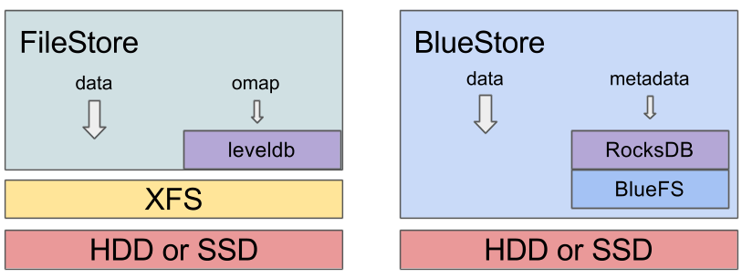
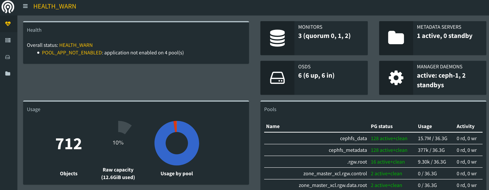
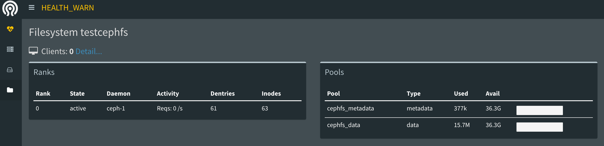

# Ceph-6 Luminous版本

* Ceph新长支持稳定版本Luminous（12.x.x），已经release了，有那些激动人心的功能，先让我们了解一下。

* Ceph拥有一个操作简单，基于Web的内置仪表板，用于监控群集状态，Ceph luminous 新功能之内置dashboard。

* **RADOS:**

  * **BlueStore:**
    * ceph-osd的新后端存储BlueStore已经稳定，是新创建的OSD的默认设置。 BlueStore通过直接管理物理HDD或SSD而不使用诸如XFS的中间文件系统，来管理每个OSD存储的数据，这提供了更大的性能和功能。
    * BlueStore支持Ceph存储的所有的完整的数据和元数据校验。
    * BlueStore内嵌支持使用zlib，snappy或LZ4进行压缩。（Ceph还支持zstd进行RGW压缩，但由于性能原因，不为BlueStore推荐使用zstd）。
    * 擦除编码池现在完全支持覆盖，允许它们与RBD和CephFS一起使用。

  * **ceph-mgr:**

    - ceph-mgr是一个新的后台进程，这是任何Ceph部署的必须部分。虽然当ceph-mgr停止时，IO可以继续，但是度量不会刷新，并且某些与度量相关的请求（例如，ceph df）可能会被阻止。我们建议您多部署ceph-mgr的几个实例来实现可靠性。
    - ceph-mgr后台进程包括一个基于REST的管理API。 API仍然处于实验阶段，有一定的限制，但未来将成为Ceph基于API管理的基础。
    - 集群的总体可扩展性有所提高。我们已经成功测试了多达10,000个OSD的集群。
    - 目前，每个OSD都具有与其相关联的设备类（例如，hdd或ssd），允许CRUSH规则将数据简单地映射到系统中的设备的子集。通常不需要手动编写CRUSH规则或手动编辑CRUSH。
    - 可以优化CRUSH权重，以保持OSD之间数据的近乎完美的分布。
    - 还有一个新的upmap异常处理机制，允许单个PG移动以实现完美的分发（这需要客户端）。
    - 每个OSD目前可以根据后端设备是HDD还是SSD来调整其默认配置。一般不需要手动调整。
    - 原型mclock QoS排队算法现在是可用的；
    - 现在有一种退出机制，可以防止OSD出现对当前不能处理IO对象或PG的请求过载情况。
    - OSD更换过程简化，变得更加强大了。
    - 您可以使用ceph功能来查询所有连接的后台程序和客户端的支持功能和版本。
    - 通过ceph osdset-require-min-compat-client连接到集群，您可以配置最旧的Ceph客户端版本，但 Ceph将阻止您启用会破坏与这些客户端的兼容性的功能。
    - 包括osd_recovery_sleep，osd_snap_trim_sleep和osd_scrub_sleep的几个睡眠设置，已经被重新实现，并且可以有效地工作。（这些在某些情况下用于解决问题，限制后台工作。）

  * **RGW:**

    - 目前，RGW支持最终用户请求服务，通过ElasticSearch进行RGW元数据搜索，并且还支持自定义元数据字段。查询语言是一组RESTful API，用户可以通过其元数据来搜索对象。还添加了允许自定义元数据字段控制的新API。
    - RGW支持动态存储桶索引分片。随着桶中的对象数量的增加，RGW将自动重新构建桶索引。不需要用户干预或桶大小容量规划。
    - RGW引入了上传对象的服务器端加密，用于管理加密密钥的三个选项有：自动加密（仅推荐用于测试设置），客户提供的类似于Amazon SSE-C规范的密钥，以及通过使用外部密钥管理服务 OpenstackBarbician）类似于Amazon SSE-KMS规范。
    - RGW具有初步的类似AWS的存储桶策略API支持。现在，策略是一种表达一系列新授权概念的方式。未来，这将成为附加身份验证功能的基础，例如STS和组策略等。
    - RGW通过使用rados命名空间合并了几个元数据索引池。

  * **RBD:**

    - RBD目前通过新的–data-pool选项来创建rbd，对擦除编码池具有完整的，稳定的支持。
    - RBD镜像的rbd-mirror后台进程是可用的。我们建议您多部署几个rbd镜像来实现可靠性。
    - 在创建集群期间，不再自动创建默认的“rbd”池。另外，当没有指定池时，rbd CLI使用的默认池的名称可以通过新的rbd default pool = 配置选项来覆盖。
    - 通过新的rbd trash CLI命令初始支持延迟映像删除。镜像，即使是由克隆主动使用的镜像，也可以移动到垃圾桶，并在以后删除。
    - 新的管理池级别的rbd mirror poolpromote和rbd mirror pool demote命令可以批量提升/降级池内所有的镜像文件。
    - 镜像现在可以通过rbd mirroringreplay delay = 配置选项支持可配置的复制延迟。
    - 当对象映射功能启用时，可改进丢弃处理功能。
    - rbd CLI导入和复制命令现在可以检测稀疏并保留稀疏区域。
    - 快照可以包含创建时间戳.

  * ###  CephFS:

    - 现在，多个活动的MDS后台程序是稳定的。活动的MDS服务器的数量可以基于活动的CephFS文件系统进行上下调整。
    - CephFS目录分片现在是稳定的，默认情况下在新的文件系统上启用。要使其在现有的文件系统上启动，要使用“ceph fs set allow_dirfrags”。大型或非常繁忙的目录被分割并（可能）自动分布在多个MDS后台驻留程序中。
    - 在不需要自动负载均衡的情况下，目录子树可以明确固定到特定的MDS后台程序。

  * **Cli优化：**

    - 针对Cli进行了调整优化，很多命令焕然一新，输出信息更加丰富。

### 发行版的兼容性

- CentOS 7或后续版本。我们已放弃对CentOS 6的支持（以及RHEL 6其它的衍生系列，如Scientific Linux 6）。
- Debian Jessie 8.x或后续版本。 Debian Wheezy 7.x的g++对C++11的支持并不完整（而且没有systemd）。
- Ubuntu Trusty 14.04或后续版本。 Ubuntu Precise 12.04已不再被支持。
- Fedora 22或后续版本。

> 以上内更新内容信息，均来自Ceph社区！

### 升级和重新部署

* 说在前面的话，我不建议立刻升级，因为release的版本日期太近了，如果你是生产环境，并且你的ceph运行稳定，我不建议你现在进行升级，至少在多等待一段时间，稳定后在升级。如果你要使用L版本的新特性，那您可以尽情升级，但是无论如何操作，请您记住，数据是最重要的，还请备份和妥善处理数据。
* 下面将从2个方式进行讲解：1、J升级到L。2、部署L版本。

#### **J升级到L**

* 当前Ceph集群是运行的Jewel (v10.2.z)版本，并且是实验环境，所以不存在数据问题，如有有数据，建议一定要天前处理。

* 但是还是以这个实验环境模拟完全的生产环境进行升级，积累经验，整个升级过程保证生产环境运行。

* 升级的时候你当前的集群一定是健康的状态，否则没有任何意义，只会越来越糟。

  ```
  确认开启sortbitwise，底层排序
  PS：该标志将表明hobject_t的将以 bitwise fashion方式排序，对象将在OSDs中以按位方式排序，并且此标志默认在Infernalis和Jewel发布版本中启用。
  [root@ceph-1 ceph]# ceph -s
              flags sortbitwise,require_jewel_osds

  如果未开启，还请使用如下指令进行开启：
  [root@ceph-1 ceph]# ceph osd set sortbitwise

  停止集群负载，设置noout标志，防止升级过程中节点的启停导致数据负载进行重新分配
  [root@ceph-1 ceph]# ceph osd set noout

  替换升级yum源(所有节点)
  # sed -i 's/jewel/luminous/' /etc/yum.repos.d/ceph.repo   <----此处可以自行替换成国内的163或者ali的源

  使用Ceph-deploy实现自动升级 (所有节点)
  # yum install ceph-deploy

  首先升级管理节点(First)，然后升级监控系统（Mon节点），最后升级OSD节点(一定要按照顺序来)
  # ceph-deploy install --release luminous ceph-1   (对所有节点进行升级)

  重新启动mon监控
  [root@ceph-1 ceph]# systemctl restart ceph-mon.target

  创建Luminous版本的管理区
  PS：
  CEPH MGR是负责跟踪运行指标和Ceph集群的当前状态，包括存储的利用率，目前的性能指标，以及系统的负载。Ceph mgr守护进程也是基于主机的Python的插件，包括一个基于Web的仪表板和其他API。通常至少有两个mgr构建高可用性。
  [root@ceph-1 ceph]# ceph-deploy mgr create ceph-1 ceph-2 ceph-3 <---实例是3节点mon

  重启osd节点(所有节点)
  # systemctl restart ceph-osd.target

  提升到luminous，以前版本的将不能加入集群
  [root@ceph-1 ceph]# ceph osd require-osd-release luminous

  取消noout，允许数据负载
  [root@ceph-1 ceph]# ceph osd unset noout
  ```


  ```
  原有osd的XFS转为bluestore：(新特性之一)
  bluestore架构如下:
  ```

  

  ```
   BlueStore 整体架构分为四个部分：
      1. BlockDevice为最底层的块设备，抛弃了XFS本地文件系统,BlueStore直接操作块设备。
      2. BlueFS是一个小的文件系统，文件和元数据都缓存在内存中，持久化内容被保存在文件系统的日志文中，如果重新mount，将会replay，再次加载所有的元数据到内存中。其数据和日志文件都直接保存BlockDevice。
      3. RocksDB KV数据库。
      4. BlueStore依赖RocksDB和BlockDevice实现的ceph的对象存储，元数据都保存在RocksDB这个KV数据库中， 其对象的数据直接保存在BlockDevice中。

  BlueStore其实最重点的在于，实现了用户态的文件系统，实现了aio的写入方式，关键bluestore功能包括：
  	1. 存储设备的直接管理。这避免了任何中间的抽象层（比如XFS本地文件系统），可能会限制性能或增加复杂度。
  	2. 元数据管理与rocksdb。我们将rocksdb的键/值数据库来管理内部的元数据，如从对象名称映射到磁盘上的块的位置。
  	3. 完整数据和元数据校验和。默认情况下，所有的数据和元数据写入bluestore是由一个或多个校验保护。没有数据或元数据将从磁盘读取或返回未经验证的用户。
  	4. 内置压缩。在写入磁盘之前，可以随意压缩写入的数据。
  	5. 多设备元数据分层。bluestore允许其内部日志被写入到一个单独的高速设备（如SSD，NVMe，或NVDIMM）提高性能。如果有大量的快速存储可用，内部元数据也可以存储在更快的设备上。
  	6. 高效写拷贝。RBD和cephfs快照靠写时拷贝克隆机制。
  	
  	FileStore 转换为 BlueStore：
  	其实这是个复杂的过程，你可以选择最安全的方式，即将原有OSD一个个踢出，然后在重新以bluestore的格式加进来，也可以使用转换的方式，但是转换也要一个一个来，因为确实存在风险，数据折腾不起！
  	当然网络上有很多filestore转换到bluestore的方式，也很方便，这里就不多说了，我采用的是一个一个剔除，然后在重新加入进来，同步完成之后在进行下一个osd的步骤，尽可能的减少操作风险。
  	你也可以继续使用原有的格式，不升级到bluestore。
  ```

  ​

### 部署L

```
1. 重新部署L版本按照参考第一章节内容，但是要替换yum源到Luminous，可以使用ali的源，也可以使用ceph官方的源。
[root@ceph-1 ceph]# cat /etc/yum.repos.d/ceph.repo
[Ceph]
name=Ceph packages for $basearch
baseurl=http://download.ceph.com/rpm-luminous/el7/$basearch
enabled=1
gpgcheck=1
type=rpm-md
gpgkey=https://download.ceph.com/keys/release.asc
priority=1

[Ceph-noarch]
name=Ceph noarch packages
baseurl=http://download.ceph.com/rpm-luminous/el7/noarch
enabled=1
gpgcheck=1
type=rpm-md
gpgkey=https://download.ceph.com/keys/release.asc
priority=1

[ceph-source]
name=Ceph source packages
baseurl=http://download.ceph.com/rpm-luminous/el7/SRPMS
enabled=1
gpgcheck=1
type=rpm-md
gpgkey=https://download.ceph.com/keys/release.asc
priority=1

2. 然后安装ceph-deploy 2.0版本，继续安装步骤即可。

3. 同样的方法和参数创建mon，加入mon

4. 启动mgr
# ceph-deploy mgr create ceph-1 ceph-2 ceph-3 <---实例是3节点mon

5. 创建osd的地方稍有区别：
	* 创建为bluestore，L版本已经将osd支持bluestore，所以直接创建为bluestore，当然你也可以使用filestore，同时ceph官方已经不推荐ceph-disk这个指令了，全新的工具是ceph-volume，来更好的支持bluestore，创建ceph的bluestore的时候，可以支持“整块磁盘”、“逻辑卷”、“磁盘分区”的几种格式，但是整块磁盘会自动创建LV。
	* 创建的格式可以是整个bluestore在一块磁盘或者LV上，也可是将block.wal和block.db拆分，放到高速的SSD上来加快响应速度。
	
6. 清空磁盘
# ceph-deploy disk zap ceph-1 /dev/sdb
[root@ceph-1 ceph]# ceph-deploy disk zap ceph-1 /dev/sdb
[ceph_deploy][ERROR ] Traceback (most recent call last):
[ceph_deploy][ERROR ]   File "/usr/lib/python2.7/site-packages/ceph_deploy/util/decorators.py", line 69, in newfunc
[ceph_deploy][ERROR ]     return f(*a, **kw)
[ceph_deploy][ERROR ]   File "/usr/lib/python2.7/site-packages/ceph_deploy/cli.py", line 128, in _main
[ceph_deploy][ERROR ]     parser = get_parser()
[ceph_deploy][ERROR ]   File "/usr/lib/python2.7/site-packages/ceph_deploy/cli.py", line 84, in get_parser
[ceph_deploy][ERROR ]     for ep in pkg_resources.iter_entry_points('ceph_deploy.cli')
[ceph_deploy][ERROR ]   File "/usr/lib/python2.7/site-packages/pkg_resources.py", line 2260, in load
[ceph_deploy][ERROR ]     entry = __import__(self.module_name, globals(),globals(), ['__name__'])
[ceph_deploy][ERROR ]   File "/usr/lib/python2.7/site-packages/ceph_deploy/osd.py", line 337
[ceph_deploy][ERROR ]     if False:
[ceph_deploy][ERROR ]    ^
[ceph_deploy][ERROR ] IndentationError: unexpected indent
[ceph_deploy][ERROR ]
出现错误信息，是deploy的一个小bug(感谢帮忙测试和修复的程序员小妹妹！)

7. 进行bug修复
# vim /usr/lib/python2.7/site-packages/ceph_deploy/osd.py
336         if args.debug:    <---- 336行 修改为 ----> if False:
再测执行则通过！# ceph-deploy disk zap ceph-1 /dev/sdb

8.创建osd  <----整盘创建
# ceph-deploy osd create ceph-1 --data /dev/sdb    <----整盘创建

9. 查看信息
[root@ceph-1 ceph]# ll /var/lib/ceph/osd/ceph-0/
总用量 48
-rw-r--r-- 1 ceph ceph 186 4月  24 16:39 activate.monmap
lrwxrwxrwx 1 ceph ceph  93 4月  24 16:39 block -> /dev/ceph-271ca8a5-10c8-4a08-851a-03274f2ba8f1/osd-block-9fff0b56-b5df-46f2-b51d-552aaf825dda
-rw-r--r-- 1 ceph ceph   2 4月  24 16:39 bluefs

[root@ceph-1 ceph]# pvs /dev/sdb
  PV         VG                                        Fmt  Attr PSize   PFree
  /dev/sdb   ceph-271ca8a5-10c8-4a08-851a-03274f2ba8f1 lvm2 a--  <20.00g    0 
  
[root@ceph-1 ceph]# lvs ceph-271ca8a5-10c8-4a08-851a-03274f2ba8f1


10. 如果是磁盘分区同上步骤，但是要提前做好分区。

11. 如果是拆分创建，将db和wal拆分到ssd磁盘上，则需要提前规划和设计ssd磁盘(每分区10G空间的标准量，GPT分区)，创建命令为：
# ceph-deploy osd create ceph-1 --data /dev/sdd --block-db /dev/sdc1 --block-wal /dev/sdc2

12. 如果是vg/lv格式，需要提前创建和规划vg/lv，然后将设备(/dev/sdd)部分替换为vg/lv的格式即可。

13. 添加了OSD 之后，即可以按照先前的方法来创建cephfs，rbd和RGW了。
```
### dashboard

* Ceph now has a simple, built-in web-based dashboard for monitoring cluster status

* Ceph的dashboard当前还是比较弱，但是随着日后的丰富会更加完善

* 当前的功能主要集中在对Ceph集群的监控上，由于是原生自带的，所以还是建议使用。

  ```
  查看Ceph的mgr module哪些是开启的，哪些是关闭的
  [root@ceph-1 ceph]# ceph mgr module ls
  {
      "enabled_modules": [
          "balancer",
          "restful",
          "status"
      ],
      "disabled_modules": [
          "dashboard",     <----dashboard 处于关闭状态
          "influx",
          "localpool",
          "prometheus",
          "selftest",
          "zabbix"
      ]
  }

  开启dashboard模式
  [root@ceph-1 ceph]#  ceph mgr module enable dashboard

  处于开启状态的dashboard
  [root@ceph-1 ceph]# ceph mgr module ls
  {
      "enabled_modules": [
          "balancer",
          "dashboard",
          "restful",
          "status"
      ],
      "disabled_modules": [
          "influx",
          "localpool",
          "prometheus",
          "selftest",
          "zabbix"    <----支持zabbix
      ]
  }

  查看开启接口
  [root@ceph-1 ceph]# ceph mgr services
  {
      "dashboard": "http://192.168.57.148:8888/"    <----8888自定义的端口
  }

  自定义端口指令如下
  ceph config-key put mgr/dashboard/server_port 8888
  ```

  Dashboard界面如下

  

  


#### 总结：

```
本章节主要在于讲述J到L版本的升级以及重新部署L版本的全新Ceph，至于后续的操作都和J版本几乎没多大出入，例如Cephfs，Rbd，RGW都可以按照前面章节的实例进行完成，以及使用Ceph的新特性。
```

