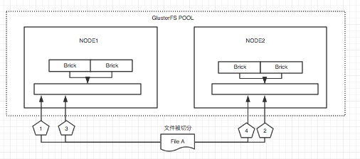
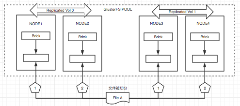
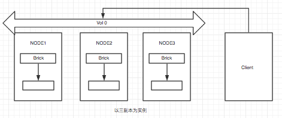

# GlusterFS云存储实施方案

## GlusterFS介绍
### 简单介绍
* GlusterFS是Scale-Out存储解决方式Gluster的核心，它是一个开源的分布式文件系统，具有强大的横向扩展能力，通过扩展可以支持数PB存储容量和处理数千client。
* GlusterFS借助TCP/IP或InfiniBandRDMA网络将物理分布的存储资源聚集在一起，使用单一全局命名空间来管理数据。
* GlusterFS基于可堆叠的用户空间设计，可为各种不同的数据负载提供优异的性能。

### GlusterFS特点
1. 扩展性和高性能
        
        GlusterFS利用双重特性来提供几TB至数PB的高扩展存储解决方式。Scale-Out架构同意通过简单地添加资源来提高存储容量和性能，磁盘、计算和I/O资源都能够独立添加，支持10GbE和InfiniBand等快速网络互联。Gluster弹性哈希（ElasticHash）解除了GlusterFS对元数据server的需求，消除了单点故障和性能瓶颈，真正实现了并行化数据訪问。

2. 高可用性
        
        GlusterFS能够对文件进行自己主动复制，如镜像或多次复制，从而确保数据总是能够訪问，甚至是在硬件故障的情况下也能正常訪问。自我修复功能能够把数据恢复到正确的状态，并且修复是以增量的方式在后台运行，差点儿不会产生性能负载。GlusterFS没有设计自己的私有数据文件格式，而是採用操作系统中主流标准的磁盘文件系统（如EXT3、ZFS）来存储文件，因此数据能够使用各种标准工具进行复制和訪问。

3. 全局统一命名空间
        
        全局统一命名空间将磁盘和内存资源聚集成一个单一的虚拟存储池，对上层用户和应用屏蔽了底层的物理硬件。存储资源能够依据须要在虚拟存储池中进行弹性扩展，比方扩容或收缩。当存储虚拟机映像时，存储的虚拟映像文件没有数量限制，成千虚拟机均通过单一挂载点进行数据共享。虚拟机I/O可在命名空间内的全部server上自己主动进行负载均衡，消除了SAN环境中常常发生的訪问热点和性能瓶颈问题。

4. 弹性哈希算法
        
        GlusterFS採用弹性哈希算法在存储池中定位数据，而不是採用集中式或分布式元数据server索引。在其它的Scale-Out存储系统中，元数据server一般会导致I/O性能瓶颈和单点故障问题。GlusterFS中，全部在Scale-Out存储配置中的存储系统都能够智能地定位随意数据分片，不须要查看索引或者向其它server查询。这样的设计机制全然并行化了数据訪问，实现了真正的线性性能扩展。

5. 弹性卷管理
        
        数据储存在逻辑卷中，逻辑卷能够从虚拟化的物理存储池进行独立逻辑划分而得到。存储server能够在线进行添加和移除，不会导致应用中断。逻辑卷能够在全部配置server中增长和缩减，能够在不同server迁移进行容量均衡，或者添加和移除系统，这些操作都可在线进行。文件系统配置更改也能够实时在线进行并应用，从而能够适应工作负载条件变化或在线性能调优。

6. 基于标准协议
        
        Gluster存储服务支持NFS,CIFS, HTTP, FTP以及Gluster原生协议，全然与POSIX标准兼容。现有应用程序不须要作不论什么改动或使用专用API，就能够对Gluster中的数据进行訪问。这在公有云环境中部署Gluster时很实用，Gluster对云服务提供商专用API进行抽象，然后提供标准POSIX接口。

### 术语
0 术语简介
GlusterFS是一个开源的分布式文件系统
Brick:GFS中的存储单元，通过是一个受信存储池中的服务器的一个导出目录。可以通过主机名和目录名来标识，如'SERVER:EXPORT'
Client: 挂载了GFS卷的设备
Extended Attributes:xattr是一个文件系统的特性，其支持用户或程序关联文件/目录和元数据。
FUSE:Filesystem Userspace是一个可加载的内核模块，其支持非特权用户创建自己的文件系统而不需要修改内核代码。通过在用户空间运行文件系统的代码通过FUSE代码与内核进行桥接。
Geo-Replication
GFID:GFS卷中的每个文件或目录都有一个唯一的128位的数据相关联，其用于模拟inode
Namespace:每个Gluster卷都导出单个ns作为POSIX的挂载点
Node:一个拥有若干brick的设备
RDMA:远程直接内存访问，支持不通过双方的OS进行直接内存访问。
RRDNS:round robin DNS是一种通过DNS轮转返回不同的设备以进行负载均衡的方法
Self-heal:用于后台运行检测复本卷中文件和目录的不一致性并解决这些不一致。
Split-brain:脑裂
Translator:
Volfile:glusterfs进程的配置文件，通常位于/var/lib/glusterd/vols/volname
Volume:一组bricks的逻辑集合

### 模块化堆栈式架构简单介绍
GlusterFS採用模块化、堆栈式的架构，可通过灵活的配置支持高度定制化的应用环境，比方大文件存储、海量小文件存储、云存储、多传输协议应用等。每一个功能以模块形式实现，然后以积木方式进行简单的组合，就可以实现复杂的功能。比方，Replicate模块可实现RAID1，Stripe模块可实现RAID0，通过两者的组合可实现RAID10和RAID01，同一时候获得高性能和高可靠性。例如以下图所看到的：

每一个功能模块就是一个Xlator，不同的xlator在初始化后形成树，每一个xlator为这棵树中的节点，glusterfs要工作，就必定会涉及到节点之间的调用。
调用主要包含2个方面，父节点调用子节点，子节点调用父节点，如当父节点向子节点发出写请求则要调用子节点的写操作，当子节点写操作完毕后，会调用父节点的写回调操作。父子节点的调用关系可用下图说明：

### GlusterFS总体工作流程

1. 首先是在客户端， 用户通过glusterfs的mount point 来读写数据， 对于用户来说，集群系统的存在对用户是完全透明的，用户感觉不到是操作本地系统还是远端的集群系统。
2. 用户的这个操作被递交给 本地linux系统的VFS来处理。

3. VFS 将数据递交给FUSE 内核文件系统:在启动 glusterfs 客户端以前，需要想系统注册一个实际的文件系统FUSE,如上图所示，该文件系统与ext3在同一个层次上面， ext3 是对实际的磁盘进行处理， 而fuse 文件系统则是将数据通过/dev/fuse 这个设备文件递交给了glusterfs client端。所以， 我们可以将 fuse文件系统理解为一个代理。

4. 数据被fuse 递交给Glusterfs client 后， client 对数据进行一些指定的处理（所谓的指定，是按照client 配置文件据来进行的一系列处理， 我们在启动glusterfs client 时需要指定这个文件。

5. 在glusterfs client的处理末端，通过网络将数据递交给 Glusterfs Server，并且将数据写入到服务器所控制的存储设备上。
>这样， 整个数据流的处理就完成了。

### GlusterFS 主要模块介绍
Gluterfs总体採用堆栈式架构，模仿的函数调用栈，各个功能模块耦合度低，且非常多模块可自由结合形成不同的功能。以下主要介绍一下Glusterfs的主要模块：

  1. DHT模块
    该xlator主要实现了文件的哈希分布，将0到2的32次方依据子卷的个数平均划分若干个区间，文件到达DHT时，会依据文件名称计算所得的哈希值所在的区间，来决定该文件落在哪个子卷上。当中各个子卷的哈希区间记录在父文件夹的扩展属性中。此外，该模块还实现了数据迁移和扩容功能。

  2. AFR模块
    该xlator主要实现了文件级别的镜像冗余功能,类似raid1功能，只是不是块级别的。数据到达AFR时，会将ChangeLog加1，然后写数据，待所有子卷所有写成功后，再将ChangeLog减1。若须要修复时，依据ChangeLog推断哪个是source卷。实际的修复流程很复杂，包含meta，entry等。冗余卷没有主从之分，不论什么一个子卷都能够保证上层的读写请求，可在不影响上层应用的情况下运行修复功能。

  3. Stripe模块
    该xlator主要实现了文件的写条带，即文件到达Stripe时，会将文件按固定大小的条带写入各个子卷，类似raid0功能。在高版本号中，有两种模式：写空洞文件模式和聚合模式。该模块原理和实现都较DHT和AFR模块简单，且代码量较少，在此不再赘述。

## GlusterFS卷介绍
1. 分布卷
在分布式卷文件被随机地分布在整个砖的体积。使用分布式卷，你需要扩展存储，冗余是重要或提供其他硬件/软件层。(簡介：分布式卷，文件通过hash算法随机的分布到由bricks组成的卷上。卷中资源仅在一台服务器上存储，在存储池中非镜像或条带模式。)
 

2. 复制卷
复制卷创建跨多个砖的体积的文件的副本。您可以使用复制卷在环境中的高可用性和高可靠性是至关重要的。(簡介：复制式卷，类似raid1，replica数必须等于volume中brick所包含的存储服务器数，可用性高。创建一个两两互为备份的卷，存储池中一块硬盘损坏，不会影响到数据的使用，最少需要两台服务器才能创建分布镜像卷。)
 

3. 条带卷
条带卷条纹砖之间的数据的容量。为了达到最佳效果，你应该使用条带卷，只有在高并发环境下，访问非常大的文件。(簡介：条带式卷，类似与raid0，stripe数必须等于volume中brick所包含的存储服务器数，文件被分成数据块，以Round Robin的方式存储在bricks中，并发粒度是数据块，大文件性能好。)
 

4. 分佈式条带卷（復合型）
分布式条带卷条带文件在集群中的两个或两个以上的节点。为了达到最佳效果，你应该使用分布式条带卷的要求是扩展存储和高访问非常大的文件的并发环境是至关重要的。(簡介：分布式的条带卷，volume中brick所包含的存储服务器数必须是stripe的倍数(>=2倍)，兼顾分布式和条带式的功能。每个文件分布在四台共享服务器上，通常用于大文件访问处理，最少需要 4 台服务器才能创建分布条带卷。)
 

5. 分布式復制卷（復合型）
分配文件在复制砖的体积。您可以使用分布式复制卷要求规模的环境中存储和高可靠性是至关重要的。分布复制卷也提供了更好的读取性能在大多数环境。(簡介：分布式的复制卷，volume中brick所包含的存储服务器数必须是 replica 的倍数(>=2倍)，兼顾分布式和复制式的功能。)
 

6. 条带復制卷（復合型）
条带復制卷条带数据在复制集群中的砖。为了达到最佳效果，你应该使用条纹复制卷在高并发环境下并行访问非常大的文件和性能是至关重要的。在此版本中，这种类型的卷配置仅支持地图减少工作量。

 

7. 分布式条带復制卷(三種混合型)
分布式条带复制卷分布条带数据在复制砖集群。为了获得最佳效果，你应该使用分布在高并发的条带复制卷环境下并行访问非常大的文件和性能是至关重要的。在此版本中，这种类型的卷配置仅支持地图减少工作量。

 

## GFS实施安装
### 基础环境配置
1. 安装准备

        建议普通pc-server（多磁盘并且配合SSD为主）
        CentOS 7.2 x86_64
        GlusterFS 3.6 相关RPM
2. 系统安装

        Pc-server主机需要安装CentOS7.2 系统
        选择标准最小安装模式. 

3. 系统设置

        1:配置主机名，例如：{gfs1 , gfs2, gfs3 }备注：主机名一旦确认不可修改
        2:配置双网卡bond输出(Active-Backup)或者“InfiniBand”
4. 其他配置
	    
        关闭防火墙 (service iptables stop)
	    关闭Selinux (vim /etc/selinux/config , enabled 改成 disabled)
	    系统优化(rc.local)
	        echo deadline > /sys/block/sdb/queue/scheduler 
            echo 65536 > /sys/block/sdb/queue/read_ahead_kb

5. 磁盘分区和格式化并挂载
        
        #fdisk /dev/sdb    (可分为 sdb1 )磁盘分区为整区
6. 格式化和挂载
        可以采用lvm技术，使用lvm cache进行加速
        #pvcreate – dataalignment  /dev/sdb1
        #vgcreate gfs /dev/sdb1 ; vgextend gfs /dev/sdc1
        #lvcreate –n lv_gfs –L 3.27T /dev/gfs

        直接格式化和挂载，后面使用flashcache技术进行加速 
        #mkfs.xfs -i size=512 -n size=8192 -d su=256k,sw=3 /dev/gfs/lv_gfs
        #mount /dev/gfs/lv_gfs  /data
>所有参与存储的机器都要进行该步骤

### GlusterFS安装
1. 配置本地yum仓库,升级操作系统
        
        执行指令 yum update  升级操作系统
        1：给出本地yum库创建步骤
2. 安装Glusterfs 软件包
        
        使用指令yum –y localinstall glusterfs*.rpm
3. 安装完成后启动GlusterFS
	
        #/etc/init.d/glusterd start
        #chkconfig glusterd off
	    备注：设置不随机启动，添加的/etc/rc.local中进行启动，后续有详细步骤 
4. 每个主机节点在/etc/hosts文件内添加相应的主机对应关系

### GlusterFS启动
1. 主要进程表：

        gluster：服务器端的CLI，运行添加节点，删除节点之类都是它发命令给glusterd
        glusterd：运行于服务器端的守护进程，它打开了gluster才能用，它把gluster的命令传递给glusterfsd
        glusterfsd：服务器端主要干活的，它接受服务器端的管理指令和客户端的数据请求，配合底层VFS和文件系统完成工作
        glusterfs：运行于客户端，接收fuse的指令，因为客户端的APP都是通过FUSE和glusterfs通信的，它接收到请求后传给glusterfs，再通过RPC传给服务器端的gluserfsd
        Brick GFS中的存储单元，通过是一个受信存储池中的服务器的一个导出目录

2. 在每个节点上启动glusterd服务

        #service glusterd start   

### GlusterFS常用指令
1. 卷信息
        
        #gluster volume info  和  # gluster volume status
2. 启动/停止卷
        
        # gluster volume start/stop VOLNAME
3. 删除卷
        
        # gluster volume delete VOLNAME
4. 添加Brick
   
        # gluster volume add-brick VOLNAME NEW-BRICK
5. 移除Brick
        
        # gluster volume remove-brick VOLNAME BRICK start/status/commit
6. I/O信息查看

        Profile Command 提供接口查看一个卷中的每一个 brick 的 IO 信息。
        #gluster volume profile VOLNAME start
        //启动 profiling，之后则可以进行 IO 信息查看
        #gluster volume profile VOLNAME info
        //查看 IO 信息，可以查看到每一个 Brick 的 IO 信息
        # gluster volume profile VOLNAME stop
        //查看结束之后关闭 profiling 功能

* 节点管理-gluster peer command
1. 节点状态

        #gluster peer status //在 serser0 上操作，只能看到其他节点与 server0 的连接状态
        Number of Peers: 2
        Hostname: server1
        Uuid: 5e987bda-16dd-43c2-835b-08b7d55e94e5
        State: Peer in Cluster (Connected)
        Hostname: server2
        Uuid: 1e0ca3aa-9ef7-4f66-8f15-cbc348f29ff7
        State: Peer in Cluster (Connected)
2. 添加节点
        #gluster peer probe HOSTNAME
        #gluster peer probe server2 //将server2 添加到存储池中

3. 删除节点
        #gluster peer detach HOSTNAME
        #gluster peer detach server2 将 server2 从存储池中移除
        //移除节点时，需要确保该节点上没有 brick，需要提前将 brick 移除
* 创建卷
1. 分布式卷

        # gluster volume create NEW¬VOLNAME [transport [tcp | rdma | tcp,rdma]] NEW¬BRICK...
        For example, to create a distributed volume with four storage servers using tcp:
        # gluster volume create test¬volume server1:/exp1 server2:/exp2 server3:/exp3 server4:/exp4
        Creation of test¬volume has been successful
        Please start the volume to access data.

2. 复制卷

        # gluster volume create NEW¬VOLNAME [replica COUNT] [transport [tcp |rdma | tcp,rdma]] NEW¬BRICK...
        For example, to create a replicated volume with two storage servers:
        # gluster volume create test¬volume replica 2 transport tcp server1:/exp1 server2:/exp2
        Creation of test¬volume has been successful
        Please start the volume to access data.
3. 条带卷

        # gluster volume create NEW¬VOLNAME [stripe COUNT] [transport [tcp |
        rdma | tcp,rdma]] NEW¬BRICK...
        For example, to create a striped volume across two storage servers:
        # gluster volume create test¬volume stripe 2 transport tcp server1:/exp1 server2:/exp2
        Creation of test¬volume has been successful
        Please start the volume to access data.
4. 分佈式条带卷（復合型）

        # gluster volume create NEW¬VOLNAME [stripe COUNT] [transport [tcp |
        rdma | tcp,rdma]] NEW¬BRICK...
        For example, to create a distributed striped volume across eight storage servers:
        # gluster volume create test¬volume stripe 4 transport tcp server1:/exp1 server2:/exp2
        server3:/exp3 server4:/exp4 server5:/exp5 server6:/exp6 server7:/exp7 server8:/exp8
        Creation of test¬volume has been successful
        Please start the volume to access data.
5. 分布式復制卷（復合型）

        # gluster volume create NEW¬VOLNAME [replica COUNT] [transport [tcp |
        rdma | tcp,rdma]] NEW¬BRICK...
        For example, four node distributed (replicated) volume with a two¬way mirror:
        # gluster volume create test¬volume replica 2 transport tcp server1:/exp1 server2:/exp2 server3:/exp3 server4:/exp4
        Creation of test¬volume has been successful
        Please start the volume to access data.
        For example, to create a six node distributed (replicated) volume with a two¬way mirror:
        # gluster volume create test¬volume replica 2 transport tcp server1:/exp1 server2:/exp2 server3:/exp3 server4:/exp4 server5:/exp5 server6:/exp6
        Creation of test¬volume has been successful
        Please start the volume to access data.
6. 条带復制卷（復合型）

        # gluster volume create NEW¬VOLNAME [stripe COUNT] [replica COUNT]
        [transport [tcp | rdma | tcp,rdma]] NEW¬BRICK...
        For example, to create a striped replicated volume across four storage servers:
        # gluster volume create test¬volume stripe 2 replica 2 transport tcp server1:/exp1
        server2:/exp2 server3:/exp3 server4:/exp4
        Creation of test¬volume has been successful
        Please start the volume to access data.
        To create a striped replicated volume across six storage servers:
        # gluster volume create test¬volume stripe 3 replica 2 transport tcp server1:/exp1
        server2:/exp2 server3:/exp3 server4:/exp4 server5:/exp5 server6:/exp6
        Creation of test¬volume has been successful
        Please start the volume to access data.
7. 分布式条带復制卷(三種混合型)

        # gluster volume create NEW¬VOLNAME [stripe COUNT] [replica COUNT]
        [transport [tcp | rdma | tcp,rdma]] NEW¬BRICK...
        For example, to create a distributed replicated striped volume across eight storage servers:
        # gluster volume create test¬volume stripe 2 replica 2 transport tcp server1:/exp1
        server2:/exp2 server3:/exp3 server4:/exp4 server5:/exp5 server6:/exp6 server7:/exp7
        server8:/exp8
        Creation of test¬volume has been successful
        Please start the volume to access data.
* 卷管理
1. 卷信息

        #gluster volume info
        //该命令能够查看存储池中的当前卷的信息，包括卷方式、包涵的 brick、卷的当前状态、卷名及 UUID 等。
2. 卷状态

        #gluster volume status
        //该命令能够查看当前卷的状态，包括其中各个 brick 的状态， NFS 的服务状态及当前 task执行情况，和一些系统设置状态等。
3. 启动||停止卷

        # gluster volume start/stop VOLNAME
        //将创建的卷启动，才能进行客户端挂载； stop 能够将系统卷停止，无法使用；此外 gluster
        未提供 restart 的重启命令
4. 删除卷
        # gluster volume delete VOLNAME
        //删除卷操作能够将整个卷删除，操作前提是需要将卷先停止
* Brick管理
1. 添加 Brick

        若是副本卷，则一次添加的 Bricks 数是 replica 的整数倍； stripe 具有同样的要求。
        # gluster volume add-brick VOLNAME NEW-BRICK
        #gluster volume add-brick dht_vol server3:/mnt/sdc1
        //添加 server3 上的/mnt/sdc1 到卷 dht_vol 上。
2. 移除 Brick

        若是副本卷，则移除的 Bricks 数是 replica 的整数倍； stripe 具有同样的要求。
        #gluster volume remove-brick VOLNAME BRICK start/status/commit
        #gluster volume remove-brick dht_vol start
        //GlusterFS_3.4.1 版本在执行移除 Brick 的时候会将数据迁移到其他可用的 Brick 上，当数据迁移结束之后才将 Brick 移除。 执行 start 命令，开始迁移数据，正常移除 Brick。
        #gluster volume remove-brick dht_vol status
        //在执行开始移除 task 之后，可以使用 status 命令进行 task 状态查看。
        #gluster volume remove-brick dht_vol commit
        //使用 commit 命令执行 Brick 移除，则不会进行数据迁移而直接删除 Brick，符合不需要数据迁移的用户需求。
        PS：系统的扩容及缩容可以通过如上节点管理、 Brick 管理组合达到目的。
        (1)扩容时，可以先增加系统节点，然后添加新增节点上的 Brick 即可。
        (2)缩容时，先移除 Brick
3. 替换 Brick

        #gluster volume replace-brick VOLNAME BRICKNEW-BRICK start/pause/abort/status/commit
        #gluster volume replace-brick dht_vol server0:/mnt/sdb1 server0:/mnt/sdc1 start
        //如上，执行 replcace-brick 卷替换启动命令，使用 start 启动命令后，开始将原始 Brick 的数据迁移到即将需要替换的 Brick 上。
        #gluster volume replace-brick dht_vol server0:/mnt/sdb1 server0:/mnt/sdc1 status
        //在数据迁移的过程中，可以查看替换任务是否完成。
        #gluster volume replace-brick dht_vol server0:/mnt/sdb1 server0:/mnt/sdc1 abort
        //在数据迁移的过程中，可以执行 abort 命令终止 Brick 替换。
        #gluster volume replace-brick dht_vol server0:/mnt/sdb1 server0:/mnt/sdc1 commit
        //在数据迁移结束之后，执行 commit 命令结束任务，则进行 Brick 替换。 使用 volume info
        命令可以查看到 Brick 已经被替换。

* 挂载gfs的方法

        #mkdir /gfs
        #mount.glusterfs  gfs1.hrb:/gfs  /gfs
        备注：也可通过smb和nfs的方式进行挂载

### GlusterFS Top监控
Top command 允许你查看 bricks 的性能例如： read, write, file open calls, file read calls, file
write calls, directory open calls, and directory real calls所有的查看都可以设top数，默认 100

    # gluster volume top VOLNAME open [brick BRICK-NAME] [list-cnt cnt]
    //查看打开的 fd
    #gluster volume top VOLNAME read [brick BRICK-NAME] [list-cnt cnt]
    //查看调用次数最多的读调用
    #gluster volume top VOLNAME write [brick BRICK-NAME] [list-cnt cnt]
    //查看调用次数最多的写调用
    # gluster volume top VOLNAME opendir [brick BRICK-NAME] [list-cnt cnt]
    # gluster volume top VOLNAME readdir [brick BRICK-NAME] [list-cnt cnt]
    //查看次数最多的目录调用
    # gluster volume top VOLNAME read-perf [bs blk-size count count] [brick BRICK-NAME] [list-cnt
    cnt]
    //查看每个 Brick 的读性能
    # gluster volume top VOLNAME write-perf [bs blk-size count count] [brick BRICK-NAME]
    [list-cnt cnt]
    //查看每个 Brick 的写性能

### 7.性能优化参数 （补全优化含义）
    #gluster vol set gfs ……
    performance.io-cache: on
    performance.read-ahead: on
    performance.quick-read: on
    performance.write-behind-window-size: 1073741824
    performance.flush-behind: on
    performance.write-behind: on
    performance.client-io-threads: on
    performance.io-thread-count: 64
    performance.cache-refresh-timeout: 1
    performance.cache-size: 4GB

## 实际操作案例
1. 实施部署
        
        GFS安装-参考GlusterFS安装部分

2. 配置双副本GFS

        gluster peer info
        gluster peer status
        gluster peer probe g3.com
        gluster peer probe g4.com
        gluster volume create gfs replica 2 g3:/data g4:/data force

3. 双副本添加主机

        gluster peer info
        gluster peer status
        gluster peer probe g3.com
        gluster peer probe g4.com
        gluster volume add-brick gfs g3:/data g4:/data force
4. 进行资源重新平衡

        Gluster volume rebalance gfs status
        Gluster volume rebalance gfs start

## IO加速/ssd加速
### 背景知识：
1. 在计算机系统中，cache几乎无处不在，CPU、LINUX、MYSQL、IO等系统中均能见到cache的身影。Cache是容量与性能之间取平衡的结果，以更低的成本，获得更高的收益。
2. 在计算机硬件发展的几十年来，传统的机械硬盘逐步成为整个系统的瓶颈，性能增长十分缓慢。对于依赖IO性能的应用Flash disk(SSD/FusionIO等)的出现，改变了这一切。
3. Flash disk将硬盘从机械产品变成了电气产品，功耗更小，性能更好，时延更优。但新的技术还存在一些问题，价格以及稳定性。
4. Flashcache是Facebook技术团队的一个开源项目，最初是为加速MySQL设计。Flashcache通过在文件系统（VFS）和设备驱动之间新增了一次缓存层，来实现对热门数据的缓存。

### Flashcache在内核的层次：

* 一般用SSD作为介质的缓存，通过将传统硬盘上的热门数据缓存到SSD上，然后利用SSD优秀的读性能，来加速系统。这个方法较之内存缓存，没有内存快，但是空间可以比内存大很多。
* Flashcache最初的实现是write backup机制cache，后来又加入了write through和write around机制：
1. write backup: 先写入到cahce， 然后cache中的脏块会由后台定期刷到持久存储。
2. write through: 同步写入到cache和持久存储。
3. write around: 只写入到持久存储。

### 谁适合用Flashcache
读多写少。
高压力备库。
数据量很大（ 例如4TB） ， 热门数据也很大（ 800GB） ， 不必要或者不舍得全部买内存来缓存。
### 谁不适合用Flashcache
数据量不大的话， 一般Flashcache就没什么用武之地了， 内存就可以帮你解决问题了。
另外Flashcache的加入也使得系统的复杂度增加了一层， 如果你坚持KISS原则（ Keep it simple, Stupid!） ， 也可
以弃用之。

### 基本原理图

### 安装加速
        下载地址： https://github.com/facebookarchive/flashcache
        #Unzip flashcache-master.zip
        #Make ; make install
### Flash cache配置
1. 首次创建Flashcach设备

                请注意， 设备上的文件将会被清空
                首先确保hdd的分区没有被挂载， 如果挂载了， 卸载之
                [root@localhost flashcache-master]# umount /dev/sda5
                [root@localhost flashcache-master]# flashcache_create -p back cachedev /dev/sdb /dev/sda5
                这样Linux就虚拟除了一个带缓存的块设备：
                [root@localhost flashcache-master]# ls -lah /dev/mapper/cachedev
                [root@localhost mapper]# mkfs.ext3 cachedev
2. 使用该设备
                
                [root@localhost flashcache-master]# mount /dev/mapper/cachedev /data/
3. 如何重建flashcache

                umount /data
                dmsetup remove cachedev
                flashcache_destroy /dev/sdb
4. 查询状态

                dmsetup status cachedev
                dmsetup table cachedev
                dmsetup info cachedev
5. flashcache内核参数设置

                dev.flashcache.fast_remove:删除flashcache卷时不同步脏缓存块。 这个选项用来快速删除。
                dev.flashcache.zero_stats:统计信息归零。
                dev.flashcache.reclaim_policy:缓存回收规则。 有两种算法： 先进先出FIFO(0),最近最少用LRU(1).默认是FIFO。
                dev.flashcache.write_merge:启用写入合并， 默认是开启的。
                dev.flashcache.dirty_thresh_pct:flachcache尝试保持每个单元的脏块在这个n%以下。 设置低增加磁盘写入和降低块重写， 但是增加了块读取缓存的可用性。
                dev.flashcache.do_sync:调度清除缓存中的所有脏块。
                dev.flashcache.stop_sync:停止同步操作。
                dev.flashcache.cache_all:全局缓存模式： 缓存所有和全部不缓存。 默认是缓存所有。
                dev.flashcache.fallow_delay:清除脏块的间隔。 默认60s.设置为0禁止空闲， 彻底清除。
                dev.flashcache.io_latency_hist:计算IO等待时间， 并绘制直方图。
                dev.flashcache.max_clean_ios_set:在清除块时， 每单元最大写入出错。
                dev.flashcache.max_clean_ios_total:在同步所有块时， 最大写入问题。
                dev.flashcache.debug:开启debug。
                dev.flashcache.do_pid_expiry:在白/黑名单上启用逾期的pid列表。

