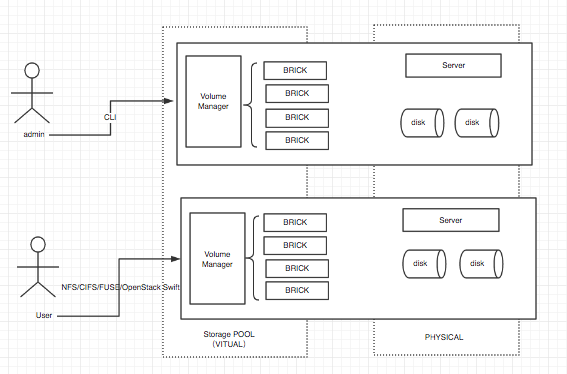
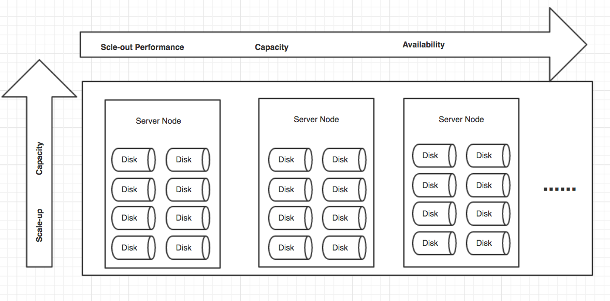
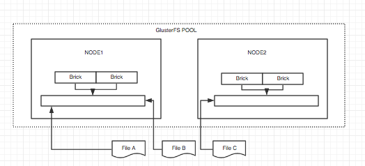
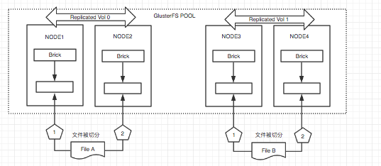
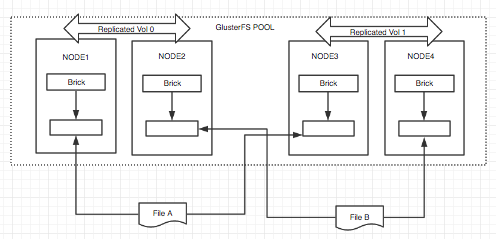

# GlusterFS 基础

## 1. GlusterFS介绍
### 1.1 简单介绍
* GlusterFS是Scale-Out存储解决方式Gluster的核心，它是一个开源的分布式文件系统，具有强大的横向扩展能力，通过扩展可以支持数PB存储容量和处理数千client。
* GlusterFS借助TCP/IP或InfiniBandRDMA网络将物理分布的存储资源聚集在一起，使用单一全局命名空间来管理数据。
* GlusterFS基于可堆叠的用户空间设计，可为各种不同的数据负载提供优异的性能。
* GlusterFS支持SMB，CIFS，NFS等等posix协议，但是本章只推荐FUSE挂载使用方式。

### 1.2 GlusterFS架构

GlusterFS具有巨大的可伸缩性、高弹性、优秀的处理能力，在扩展系统中，最大的难度是跟踪元数据逻辑位置和物理位置。例如ceph是通过创建元数据服务器来解决这一问题，其他的分布式系统也都类似。但是随着系统的的逐步扩展，磁盘数量和文件逐步增多，中心的元数据服务器将成为性能瓶颈，元数据也成为中心故障点。
不同的是，GlusterFS是不需要元数据服务器的，采用定位算法使用弹性哈西算法来记录文件，这总无元数据服务器的架构确保了更好的性能，和扩展的线性能力，以及高可靠性。

### 1.2 GlusterFS特点

GlusterFS具有高扩展性和高性能、高可用性、全局统一命名空间、弹性哈希算法、 弹性卷管理、基于标准协议。

### 1.3 术语
|选项|描述|
|:---|:---|
|GlusterFS|开源的分布式文件系统
|Brick|GFS中的存储单元，通过是一个受信存储池中的服务器的一个导出目录。可以通过主机名和目录名来标识，如'SERVER:EXPORT'，Brick是底层的RAID或磁盘经XFS或ext4文件系统格式化而来，所以继承了文件系统的限制，每个节点上的brick数是不限的，理想的状况是，一个集群的所有Brick大小都一样
|Client| 挂载了GFS卷的设备
|Extended Attributes:xattr|是一个文件系统的特性，其支持用户或程序关联文件/目录和元数据。
|FUSE|Filesystem Userspace是一个可加载的内核模块，其支持非特权用户创建自己的文件系统而不需要修改内核代码。通过在用户空间运行文件系统的代码通过FUSE代码与内核进行桥接。
|GFID|GFS卷中的每个文件或目录都有一个唯一的128位的数据相关联，其用于模拟inode
|Namespace|每个Gluster卷都导出单个ns作为POSIX的挂载点
|Node|一个拥有若干brick的设备
|RDMA|远程直接内存访问，支持不通过双方的OS进行直接内存访问。
|RRDNS|round robin DNS是一种通过DNS轮转返回不同的设备以进行负载均衡的方法
|Self-heal|用于后台运行检测复本卷中文件和目录的不一致性并解决这些不一致。
|Volfile|glusterfs进程的配置文件，通常位于/var/lib/glusterd/vols/volname
|Volume|Volume是brick的逻辑组合
|Subvolume|一个在经由至少一个的转换器处理之后的brick，被称为sub-volume
|Glusterd|后台管理进程，需要在存储集群中的每个节点上都要运行
|Quorum|该参数设置了在一个可信的存储池中最多可失效的主机节点数量，超出该值则认为该可信存储池已不可用了
|Rebalance|当一个brick被加入或移除后，会有一个修复进程对数据分布进行重新计算与优化

### 1.4 GlusterFS 主要模块介绍
Gluterfs总体採用堆栈式架构，模仿的函数调用栈，各个功能模块耦合度低，且非常多模块可自由结合形成不同的功能。以下主要介绍一下Glusterfs的主要模块：

  1. DHT模块
    主要实现了文件的哈希分布，在文件到达DHT时，会依据文件名称计算所得的哈希值所在的区间，用于决定文件应该写入哪个子卷上。当中各个子卷的哈希区间记录在父文件夹的扩展属性中。该模块还实现了数据迁移和扩容功能。

  2. AFR模块
    主要实现了文件级别的镜像冗余功能,块级别的镜像荣誉。在数据到达AFR时，会将ChangeLog加1，然后写数据，待所有子卷所有写成功后，再将ChangeLog减1。若须要修复时，依据ChangeLog推断哪个是source卷，可在不影响上层应用的情况下运行修复功能。

  3. Stripe模块
    主要实现了文件的写条带，即文件到达Stripe时，会将文件按固定大小的条带写入各个子卷，类似raid0功能。

## 2. GlusterFS常用卷介绍
1. 分布卷

分布式卷，文件通过hash算法随机的分布到由bricks组成的卷上。

2. 复制卷

复制式卷，类似raid1，replica数必须等于volume中brick所包含的存储服务器数，可用性高。

3. 条带卷

条带式卷，类似与raid0，文件被分成数据块，以Round Robin的方式存储在bricks中，对大文件支持较好，但是有条件限制，条带数=brickserver数量。

4. 分佈式条带卷（復合型）
分布式的条带卷，volume中brick所包含的存储服务器数必须是stripe的倍数(>=2倍)，兼顾分布式和条带式的功能。每个文件分布在四台共享服务器上，最少需要 4 台服务器才能创建分布条带卷。

5. 分布式復制卷（復合型）
分布式的复制卷，volume中brick所包含的存储服务器数必须是 replica 的倍数(>=2倍)，兼顾分布式和复制式的功能。

6. 条带復制卷（復合型）
条带復制卷条带数据在复制集群中的砖。为了达到最佳效果，你应该使用条纹复制卷在高并发环境下并行访问非常大的文件和性能是至关重要的。

## 3. GFS实施安装
### 3.1 GlusterFS 实例图

>GlusterFS实例架构图-实例采用生产常用配置进行，涵盖多种故障测试和恢复的技术点。

### 3.2 试验环境
|系统版本|磁盘数量|网卡数量|ip地址|主机名称|虚拟化|Brick|Cache|备注|
|:---|:---|:---|:---|:---|:---|:---|:---|:---|
|CentOS 7.4|4Vdisk|2|192.168.56.104(public)  192.168.57.3(private)|NODE1|Vbox|sdb1,sdc1|sdd1|GlusterFS集群节点1|
|CentOS 7.4|4Vdisk|2|192.168.56.105(public)  192.168.57.4(private)|NODE2|Vbox|sdb1,sdc1|sdd1|GlusterFS集群节点2|
|CentOS 7.4|4Vdisk|2|192.168.56.102(public)  192.168.57.5(private)|NODE3|Vbox|sdb1,sdc1|sdd1|GlusterFS集群节点3|
|CentOS 7.4|2Vdisk|1|192.168.56.103（public）|client|Vbox|测试客户端|

### 3.3 测试内容和环境说明
1. 完成Gluster集群安装和配置，利用Clinet进行测试。

### 3.4 安装准备（以下操作均是所有节点）
1. 安装准备

        建议普通pc-server（多磁盘并且配合SSD）
        CentOS 7.4 x86_64

2. 系统安装

        Pc-server主机需要安装CentOS7.2 系统
        选择标准最小安装模式.

3. 系统设置

        1:配置主机名，例如：{node1 , node2, node3 }备注：主机名一旦确认不可修改
        2:配置双网卡bond输出(Active-Backup)或者“InfiniBand”
4. 其他配置

        1. 关闭防火墙
        #systemctl  stop firewalld
        #systemctl  disable firewalld
      	2. 关闭Selinux (vim /etc/selinux/config , enabled 改成 disabled)
      	3. 系统优化(rc.local)
	      echo deadline > /sys/block/sdb/queue/scheduler
        echo 65536 > /sys/block/sdb/queue/read_ahead_kb
        4. 添加hosts对应关系
        # vim /etc/hosts
        192.168.57.3 node1
        192.168.57.4 node2
        192.168.57.5 node3
        192.168.57.6 node4

5. 磁盘分区和格式化并挂载

        #fdisk /dev/sdb
        #fdisk /dev/sdc
6. 格式化和挂载

        （选用）可以采用lvm技术
        #pvcreate – dataalignment  /dev/sdb1
        #vgcreate gfs /dev/sdb1 ; vgextend gfs /dev/sdc1
        #lvcreate –n lv_gfs –L 3.27T /dev/gfs

        直接格式化和挂载，后面使用flashcache技术进行加速
        #mkfs.xfs -i size=512 -n size=8192 -d su=256k,sw=3 /dev/gfs/lv_gfs
        #mount /dev/gfs/lv_gfs  /data
        此处，实例和生产尽量采用整盘分区的，并且后面实例不打算采用lvm-cache，而是采用falsh-cache，所有直接格式化磁盘，整盘作为brick使用。
        为什么不用lvm，因为现在单盘已经达到4T，每个主机可以容纳12块，每块盘的数据承载量已经很大，无需增加lvm进行逻辑上的融合管理，同时引入lvm也增加了架构复杂度。

### 3.5 GlusterFS安装
1. 升级操作系统，安装GlusterFS 软件包

        # yum update
        # yum install -y centos-release-gluster
        # yum install -y glusterfs glusterfs-server glusterfs-fuse glusterfs-rdma
3. 安装完成后启动GlusterFS

        # systemctl start glusterd.service
        # systemctl enable glusterd.service
	备注：设置不随机启动，添加的/etc/rc.local中进行启动，后续有详细步骤

### 3.6 GlusterFS启动
1. 主要进程表：

|进程|描述|
|:---|:---|
|gluster|服务器端的CLI，运行添加节点，删除节点之类都是它发命令给glusterd
|glusterd|运行于服务器端的守护进程，它打开了gluster才能用，它把gluster的命令传递给glusterfsd
|glusterfsd|服务器端主要干活的，它接受服务器端的管理指令和客户端的数据请求，配合底层VFS和文件系统完成工作
|glusterfs|运行于客户端，接收fuse的指令，因为客户端的APP都是通过FUSE和glusterfs通信的，它接收到请求后传给glusterfs，再通过RPC传给服务器端的gluserfsd Brick GFS中的存储单元，通过是一个受信存储池中的服务器的一个导出目录

### 3.7 配置GlusterFS
1. 在node1节点上配置，将node2和node3节点加入到gluster集群中

        [root@node1 ~]# gluster peer probe node2
        [root@node1 ~]# gluster peer probe node3

2. 查看状态

        [root@node1 ~]# gluster peer status
        因为node1本机在集群中，所以只显示其他2个成员节点

3. 创建GlusterFS目录(在三个节点上都运行):

        # mkdir /glusterfs{,1}

4. 挂载磁盘到对应目录，sdb1对应glusterfs，sdc1对应gluster1(在三个节点上都运行):

        磁盘分区
        # mkfs.xfs /dev/sdb1; mkfs.xfs /dev/sdc1
        挂载磁盘到指定目录
        mount /dev/sdb1 /glusterfs ; mount /dev/sdc1 /glusterfs1

5. 创建3副本卷（无论你使用什么卷类型，请记住，如果你要上生产，一定要和副本卷混合使用！切记！莫不要单独使用条带卷和分布式卷！双副本一定要加入仲裁卷防止脑裂，参考后面脑裂仲裁卷的部分。）

        [root@node1 ~]# gluster volume create Gluster-mod replica 3 arbiter 1  node1:/glusterfs node2:/glusterfs node3:/glusterfs force
        replica 3，3副本， arbiter 1，1个仲裁卷
6. 查看卷信息

        [root@node1 /]# gluster vol info

        Volume Name: Gluster-mod
        Type: Replicate
        Volume ID: a46d6dec-8acb-44b5-b00f-f6105a7b2de0
        Status: Created
        Snapshot Count: 0
        Number of Bricks: 1 x (2 + 1) = 3    <----含有1个仲裁卷
        Transport-type: tcp
        Bricks:
        Brick1: node1:/glusterfs
        Brick2: node2:/glusterfs
        Brick3: node3:/glusterfs (arbiter)
        ......
7. 启动卷
        [root@node1 ~]# gluster vol start Gluster-mod
        volume start: Gluster-mod: success

### 3.8 客户端挂载验证

1. 创建挂载点

        [root@client ~]# mkdir /glustermnt

2. 安装gluster-fuse挂载软件包，不推荐使用其他方式挂载！

        [root@client ~]# yum -y install gluster-fuse  <----理解fuse的作用

3. 挂载使用

        编辑host文件，创建glusterfs集群表
        [root@client ~]# vim /etc/hosts
        192.168.56.104 node1
        192.168.56.105 node2
        192.168.56.102 node3
        192.168.56.101 node4
        [root@client ~]# mount.glusterfs node1:/Gluster-mod /glustermnt
        [root@client ~]# mount |grep node1
        node1:/Gluster-mod on /glustermnt type fuse.glusterfs (rw,relatime,user_id=0,group_id=0,default_permissions,allow_other,max_read=131072)

        写入数据：
        [root@client ~]# cp /var/log/messages /glustermnt/
        [root@client ~]# ls /glustermnt/
        messages
        确认写入成功后，到node1，node2，node3的挂载点去查看，你会发现每个挂载点下面都有这个文件，但是仲裁盘的目录下大小是0，为什么呢？后面讲解。

## 总结
本章主要讲解GlusterFS的架构和卷的模式，重点理解GlusterFS的卷模式。GlusterFS的安装和使用相对较为简单，注意一定要细心，一旦上了生产，这些参数都很难在做修改。
应用：文档、图片、音频、视频、云存储、虚拟化存储、高性能计算(HPC)、日志文件、RFID数据、对1M起的文件很适合， 但是对小文件不适合，越大越high，小文件则需要进行相关的调优。

