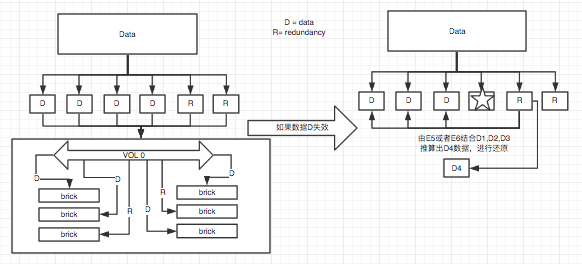

# GlusterFS 高级特性
## 1. 配额
* 磁盘配额可以限制磁盘空间的使用,避免因某个用户的过度使用磁盘空间而造成其他用户无法正常工作甚至影响系统运行。在服务器管理中此功能非常重要，尤其是对GlusterFS这样的大型分布式文件系统，更是要严加控制。

      1. 设置配额
      [root@node3 ~]# gluster volume quota Gluster-mod enable
      volume quota : success
      [root@node3 ~]# gluster volume quota Gluster-mod limit-usage / 20GB  <----限制 Gluster-mode中 / 最大使用 20GB 空间
      volume quota : success
      [root@node3 ~]# gluster volume quota Gluster-mod limit-usage /quotadir 2GB   <----限制Gluster-mod中的 /quotadir 目录配额2G
      volume quota : success
      [root@node3 ~]# gluster volume quota Gluster-mod list
      Path                   Hard-limit  Soft-limit      Used  Available  Soft-limit exceeded? Hard-limit exceeded?
      -------------------------------------------------------------------------------------------------------------------
      /                       20.0GB     80%(16.0GB)    2.1GB  17.9GB              No                   No
      /quotadir                2.0GB     80%(1.6GB)     0Bytes   2.0GB              No                   No

      2. 查看选项
      [root@node3 ~]# gluster volume set Gluster-mod quota-deem-statfs on <----开启配额查看
      [root@node3 ~]# gluster volume set Gluster-mod quota-deem-statfs on <----关闭配额查看

      3. 内存更新
      从性能角度考虑，配额缓存在客户端的目录容量里。如果发生多个客户同时都往同一个目录写数据，可能会发生一种情况，某些客户端一直写入数据到目录直到超出配额限制。
      这里就有一个误区，客户端写入的数据即使超出目录的磁盘容量限制，依然允许写入新数据，因为客户端存在缓存，而实际的缓存大小和真实的GlusterFS数据大小是不同步的。当缓存超时，则服务器会刷新缓存，进行同步，才不会允许进一步的数据写入。
      [root@node3 ~]# gluster volume set Gluster-mod features.hard-timeout 5 <----5秒刷新
      [root@node3 ~]# gluster volume set Gluster-mod features.soft-timeout 5 <----5秒刷新

      4. 设置提醒时间
      提醒时间是一个当使用信息达到软限制写入日志后的提醒频率（默认一周）
      [root@node3 ~]# gluster volume quota Gluster-mod alert-time 2d  <----修改为2天

      5.  删除磁盘限制
      [root@node3 ~]# gluster volume quota Gluster-mod remove /
      [root@node3 ~]# gluster volume quota Gluster-mod remove /quotadir

## 2. RDMA
* RDMA(Remote Direct Memory Access)“远程直接数据存取”，该技术是为了解决网络传输中服务器端数据处理的延迟。RDMA通过网络把资料直接传入计算机的存储区，RDMA允许用户态的应用程序直接读取或写入远程内存，而无内核干预和内存拷贝发生。它消除了外部存储器复制和上下文切换的开销，因而能解放内存带宽和CPU周期用于改进应用系统性能。
* 目前，大致有三类RDMA网络，分别是Infiniband、RoCE、iWARP，
    * 如果你的GlusterFS集群非常大，推荐使用Infiniband。 <----推荐使用
    * RoCE，一个允许在以太网上执行RDMA的网络协议，需要网卡支持。
    * iWARP，一个允许在TCP上执行RDMA的网络协议，需要网卡支持。
* 如果生产的系统使用了Infiniband，可以尝试使用RDMA的传输模式，在GlusterFS集群中进行如下更改

      [root@client ~]# umount /glustermnt
      [root@node1 ~]# gluster volume stop Gluster-mod
      [root@node1 ~]# gluster volume set Gluster-mod config.transport tcp,rdma <----模拟环境没办法支持rdma所有使用tcp,rdma
      ## config.transport 可以是tcp,rdma 或者 tcp 或者 rdma，如果是支持rdma的环境，可以使用rdma单独模式。
      [root@node1 ~]# gluster volume start Gluster-mod
      [root@client ~]# mount -t glusterfs -o transport=tcp  node1:/Gluster-mod /glustermnt  <----模拟环境使用tcp，可将TCP改为rdma模式
>rdma 端口使用 24008

## 3. Trash Translator
* trash translator的功能，Trash translator为glusterfs卷内删除的文件提供一个回收站，可以帮助用户获取和恢复临时被删除的数据。每个块都会保留一个隐藏的目录.trashcan，它将会被用于存放被从各个块删除的文件。

          1. 开启Trash，默认5M之内保存
          [root@node1 ~]# gluster volume set Gluster-mod features.trash on
          2. 设置回收站保存过滤大小（单位字节），范例为500M
          [root@node1 ~]# gluster volume set Gluster-mod features.trash-max-filesize 524288000
          3. 写入文件，1个日志文件，一个大于600M的dd空文件
          [root@client glustermnt]# cd /glustermnt
          [root@client glustermnt]# cp /var/log/messages ./
          [root@client glustermnt]# dd if=/dev/zero of=./600.img bs=1M count=600
          4. 删除2个文件
          [root@client glustermnt]# rm -rf ./*
          5. Trashcan中进行查看，大于500M的未被保存
          [root@client glustermnt]# ls .trashcan/
          messages_2018-02-23_032730      <----注意时间戳
          6. 复位该文件，进行查看
          [root@client glustermnt]# cp .trashcan/messages_2018-02-23_032730 /glustermnt/messages

该功能有利有弊，还请结合实际环境使用，如果环境中删除操作比较多，尽量不要使用，因为浪费不起空间。如果只是增加较多，为了防止误删除，可以使用该功能。但是回收站不是万能的，一定切记。

## 4. profile 监控分析
* 监控GlusterFS卷在不同的参数。有助于监测量的GlusterFS容量规划和性能调优任务。使用这些信息，您可以识别和排除问题。
* 可以使用卷和配置文件命令查看性能，并识别卷的每个brick的瓶颈/热点。这有助于查看性能时获得重要的性能信息。

        1. 开启监控
        [root@node1 ~]# gluster volume profile Gluster-mod start
        2. 查看监控
        [root@node1 ~]# gluster volume profile Gluster-mod info
        Brick: node1:/glusterfs1
        ------------------------
        Cumulative Stats:
           Block Size:                 16b+                 128b+                 256b+
         No. of Reads:                    0                     0                     0
        No. of Writes:                    1                     2                     7
        ......
        3. 关闭监控
        [root@node1 ~]# gluster volume profile Gluster-mod stop

## 5. Top
* Top command可以统计到read、wirte、file open calls、file write calls、directory open calls、 directory real calls.
* 指令：

      gluster volume top <VOLNAME> {open|read|write|opendir|readdir|clear} [nfs|brick <brick>] [list-cnt <value>]
      gluster volume top <VOLNAME> {read-perf|write-perf} [bs <size> count <count>] [brick <brick>] [list-cnt <value>]

* 范例：
    1. 查看当前打开的文件数、最大打开的文件数量并列出靠前的open calls

      [root@node1 ~]# gluster volume top  Gluster-mod  open list-cnt 10
    2. 查看那些排名靠前的读文件请求read calls

      [root@node1 ~]# gluster volume top  Gluster-mod  read list-cnt 10
>同上替换相关的open、read、write、opendir等等参数即可统计相关信息。
    3. 查看brick的读性能和写性能

      [root@node1 ~]# gluster volume top Gluster-mod  read-perf bs 256 count 1  list-cnt 10
      [root@node1 ~]# gluster volume top Gluster-mod  write-perf bs 256 count 1  list-cnt 10

>这些top监控有利于我们去分析每个brick的负载能力和找到性能瓶颈，有针对行的进行优化，也可以找到热点文件和统计用户相关的动作信息，例如是读取多还是写入多？哪些文件是热点？集群brick的服务性能如何等等数据。

## 6. Statedump统计信息
* Statedump是一种导出GlusterFS运行环境和当前状态信息的机制，支持导出以几个方面的统计信息：

    - mem - Dumps the memory usage and memory pool details of the bricks.
    - iobuf - Dumps iobuf details of the bricks.
    - priv - Dumps private information of loaded translators.
    - callpool - Dumps the pending calls of the volume.
    - fd - Dumps the open fd tables of the volume.
    - inode - Dumps the inode tables of the volume.

* 范例：

    1. 更改导出文件路径

      [root@node1 ~]# gluster volume set  Gluster-mod  server.statedump-path /root/
    2. 导出数据文件

      [root@node1 ~]# gluster volume statedump Gluster-mod
      [root@node1 ~]# ls
      glusterfs1.7293.dump.1519369847   glusterfs.7284.dump.1519369846     ......

## 7. 快照功能 <----这部分删除，没什么用，生产中几乎用不到。
* GlusterFS 3.6版本发布了基于卷的快照功能，该功能是基于thinly provisioned LVM snapshot，需要满足以下4个条件来进行使用：

    1. Brick必须是独立的thinly provisioned LVM
    2. Brick LVM不能存储除了Brick以外的数据
    3. 不应该是厚置备
    4. 版本3.6以上
* 主要特性
  1. Crash Consistency（碰撞一致性检测）当快照正在建立时，碰撞检测会保证快照的一致性。当快照被恢复时，会保证数据恢复到快照建立时的状态。
  2. Online Snapshot（在线快照）在建立快照的过程中，其关联数据仍旧可用。
  3. Quorum Based（仲裁机制）仲裁机制用于维护Bricks出现down时volume的可用性。
    - 仲裁机制在以下几种场景会生效：
      - n个Brick（n为奇数），若m（m>= (n/2 + 1)）个Brick是UP状态，仲裁机制生效；
      - n个Brick（n为偶数），若first brick和m（m>= n/2 ）个Brick是UP状态，仲裁机制生效。

    - 而在以下几种场景不会生效：
      - replica2集群下，若有任一个Brick处于down状态，仲裁机制将不会生效；
      - 快照创造失败的场景。
  4. Barrier这个特性主要用来确保快照的一致性。
  在快照创建过程中，会触发某些FOPS的锁机制，用来保证Crash Consistency。这个过程默认为2分钟，如果在这个默认时间快照不能成功创建，那么这些FOPS将处于unbarrier状态。在创建快照的过程中，一旦出现unbarrier，那么快照创建就失败。

* 快照管理：
1. 创建快照

        gluster snapshotcreate <snapname> <volname> [no-timestamp] [description<description>] [force]
        快照创造时，默认会在用户给定的名称后加上时间戳，可以通过设置[no-timestamp]这个选项不添加以后缀时间戳的命名方式。
2. 克隆快照

        gluster snapshot clone <clonename><snapname>
        克隆快照时，被克隆的快照要处于激活状态。克隆成功的复本和快照共享后端的存储空间，不会额外占用磁盘空间。
3. 恢复快照

        gluster snapshot restore <snapname>
        在volume离线时，快照才能被恢复。一旦快照被成功恢复后，会被该快照从快照列表中删除。
4. 删除快照

        gluster snapshot delete(all|<snapname>|volume <volname>)
5. 列出所有的可用快照

        gluster snapshot list [volname]
6. 查询快照信息

        gluster snapshot info [(snapname | volume<volname>)]
7. 查询快照状态

        gluster snapshot status [(snapname | volume<volname>)]
8. 配置快照

        snapshot config [volname]([snap-max-hard-limit \] \[snap-max-soft-limit ]) | ([auto-delete<enable|disable>]) | ([activate-on-create <enable|disable>])
        该命令用来显示或设置快照的配置项。
        1. 不带参数时，将显示所有卷的快照配置；
        2. volname参数，显示该卷对应的快照配置；
        3. 参数为具体配置项时，会对快照这项配置进行覆盖式赋值；
        4. snap-max-soft-limit参数，全局配置，设置卷对应最大快照的个数；
        5. auto-delete参数，全局配置，该项被设置为enable时，当创建新快照，将会删除时间最久远的旧快照。
        该项被设置为disabled时，若卷的快照个数已经达到soft-limit上限时，再成功创建新快照，会提示用户；若卷的快照个数达到hard-limit时，将无法创建新快照。
        6. activate-on-create参数，默认值为disabled。若设置为enable，创建快照后就激活该快照。
9. 激活快照

        gluster snapshot activate <snapname>
10. 去激活快照

        gluster snapshot deactivate <snapname>
11. 访问快照

        Mount方式
        这种方式只能通过FUSE mount访问快照，使用mount-t glusterfs :/snaps//命令。
        示例，访问主机名node1卷名为vol快照名为Gluster-mod：mount -t glusterfs node1:/snaps/Gluster-mod/vol/mnt/snapshot

>这个技术作为了解即可，实际用途不大，很简单的一个道理，有谁用GlusterFS不用复制卷的情况下，那么可以使用这个快照技术来做数据备份。

## 纠错卷（Dispersed Volume）3.6版本以后
* Dispersed Volume 基于 ErasureCodes（纠错码）的卷类型，类似于RAID5或者6。通过配置冗余级别提高可靠性，在保证较高的可靠性同时，对比副本卷可以提升物理存储空间的利用率。
* erasure code是一种技术，它可以将n份原始数据，增加m份数据，并能通过n+m份中的任意n份数据，还原为原始数据。定义中包含了encode和decode两个过程，将原始的n份数据变为n+m份是encode，之后这n+m份数据可存放在不同的device上，如果有任意小于m份的数据失效，仍然能通过剩下的数据还原出来。

* 文件是被分割成大小相同的Chunk(块)，而每个Chunk又被分割成fragment，而冗余信息的Fragment也随之生成，且同一个Fragment只会保存一个Brick上。
* Redundancy是均匀分布存储在所有的Brick，磁盘的有效空间是Brick-Redundancy。在数据恢复时，只要足够多个个Fragment（可以是数据，也可以是冗余信息）可用，就能正常恢复数据。
* 推荐配置 6 Brick 配置 2 redundancy，例如：每个磁盘1T计算，则总空间大小6T，可用空间4T（约67%），redundancy空间2T（约33%）。
* 同副本卷对比

* 创建纠错卷（范例为2+1模式，3个brick配置1个redundancy，disperse至少配置为2，redundancy配置至少为1，所以配置disperse卷最少需要3brick）

      # gluster volume create  disp-vol disperse 3 node3:/glusterfs node3:/glusterfs1 node3:/glusterfs2 force
      # gluster volume create disperse <count> [redundancy <count>] [transport tcp| rdma | tcp,rdma]
      要求disperse<count>必填，redundancy 数量可指定，如不指定系统将进行自动计算。
> 其实从上面的图中也可以分析得出，如果你对性能要求非常高，可以使用副本卷，如果你对空间要求高，而又要有一定的容错保障，则可以使用纠错卷，试着可以将副本卷用于生产系统直接服务，而容错卷用于灾备。

## 灾备（Geo-replication）
* 地域复制是系统提供的灾备功能，能够将系统的全部数据进行异步的增量备份到另外的磁盘中。
* Geo-replication可以基于局域网、城域网或互联网实现逻辑存储卷的镜像复制，使用主从模式工作，底层复制基于rsync实现。可以是1对1的关系，也可以是1对多的关系。
* Master需要是一个GlusterFS逻辑存储卷
* Slave需要是另一个GlusterFS存储卷。
* 必要条件是可以通过SSH进行访问
* GlusterFS 3.6版本以上
* rsync 3.0.7版本以上
* 严格的NTP服务器

实例：
  1. 安装glusterfs-geo-replication.x86_64软件包支持Geo-replication
    # yum -y install glusterfs-geo-replication
  2. 2个glusterfs集群，一侧为双副本或者分布式卷用于IOPS较高的生产，一侧使用纠错卷用于灾备（磁盘利用率高）
  2. 主从节点间建立SSH免密码登录

    # ssh-keygen  <----所有主机生成key
    # ssh-copy-id root@node2   <----拷贝key到所有节点，实现所有节点间的免密码访问，切记是所有节点
  3. 主节点创建会话标记（node1为主节点，geo为主节点卷名称，disp-vol为备节点卷名称）

    [root@node1 /]# gluster volume geo-replication geo root@node3::disp-vol create
    命令格式：
    gluster volume geo-replication <master_volume> \
    [<slave_user>@]<slave_host>::<slave_volume> \
    create [ssh-port <port>] push-pem|no-verify [force]
  4. 查看状态

    [root@node1 /]# gluster volume geo-replication status
  5. 开启同步

    [root@node1 /]# gluster volume geo-replication geo root@node3::disp-vol start
  6. 其他相关指令

    [root@node1 /]# gluster volume geo-replication
    Usage:
    volume geo-replication [<VOLNAME>] [<SLAVE-URL>] {create [[ssh-port n] [[no-verify]|[push-pem]]] [force]|start [force]|stop [force]|pause [force]|resume [force]|config|status [detail]|delete [reset-sync-time]} [options...]

  7. 从备份恢复数据

    1. 如果是副本卷，还请使用副本卷的恢复方式，如果双副本坏掉，那么可以尝试如下恢复，如果是分布式卷，那么这时候数据已经丢了，可以尝试如下恢复。
    2. 模拟双副本挂掉，使用前例中kill的方式，杀死进程，并使用新卷进行替换（一定是杀死双副本所有节点的卷输出，模拟Master集群的数据丢失）
    [root@node1 /]# gluster volume status
    Status of volume: geo
    Gluster process                             TCP Port  RDMA Port  Online  Pid
    ------------------------------------------------------------------------------
    Brick node1:/glusterfs                      49152     0          Y       12707
    Brick node2:/glusterfs                      49152     0          Y       10244
    3. node1和node2分别kill掉brick进程12707和10244，这个时候现在的主节点数据已经全部挂掉了，不可能依靠本地恢复了。
    [root@node1 /]# kill -9 12707
    [root@node2 ~]# kill -9 10244
    [root@node1 /]# gluster volume status
    Status of volume: geo
    Gluster process                             TCP Port  RDMA Port  Online  Pid
    ------------------------------------------------------------------------------
    Brick node1:/glusterfs                      N/A       N/A        N       N/A
    Brick node2:/glusterfs                      N/A       N/A        N       N/A
    4. 主节点的brick坏掉，这时候Geo-replication session的状态会变为“Faulty”。
    [root@node1 /]# gluster volume geo-replication geo root@node3::disp-vol status
    5. 停止”Geo-replication session”，停止所有的主节点session
    [root@node1 /]# gluster volume geo-replication geo root@node3::disp-vol stop
    6. 其实双副本卷都挂掉了，基本上这个卷已经是废了，你新建恢复和”替换”恢复已经区别不大了，步骤如下
    7. 分布式卷 ，先添加卷到geo，然后在移除已经损坏的卷
    [root@node1 /]# gluster volume add-brick geo node1:/glusterfs1 node2:/glsuterfs1 force
    [root@node1 /]# gluster volume remove-brick geo node1:/glusterfs node2:/glusterfs force
    8. 在从节点恢复数据
    [root@node3 /]# mount.glusterfs node3:/disp-vol /mnt
    [root@node3 /]# mkdir /geomnt
    [root@node3 /]# mount.glusterfs node1:/geo /geomnt/
    [root@node3 /]# rsync -PavhS --xattrs --ignore-existing /mnt/ /geomnt/
    [root@node3 mnt]# umount /geomnt/
    9. 重新启动geo-replication
    [root@node1 /]# gluster volume geo-replication geo root@node3::disp-vol start
    10. 其他设置
    启动：gluster volume geo-replication geo root@node3::disp-vol start
    停止：gluster volume geo-replication geo root@node3::disp-vol stop
    删除：gluster volume geo-replication geo root@node3::disp-vol delete
    暂停：gluster volume geo-replication geo root@node3::disp-vol pause
    继续：gluster volume geo-replication geo root@node3::disp-vol resume
    >以上参数均可以添加force强制执行
    查看状态： gluster volume geo-replication geo root@node3::disp-vol status detail
    全量备份，忽略客户端删除：
    [root@node1 /]# gluster volume geo-replication geo root@node3::disp-vol config ignore-deletes true

## 总结
本章技术都作为主要的技术点，可以在生产中活学活用，可以深入掌握，了解的深入了，才能更好的驾驭这套分布式存储。 
