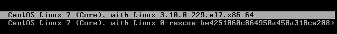
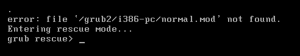
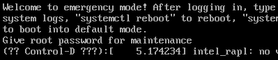
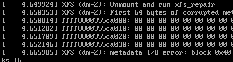
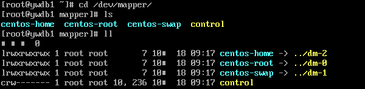
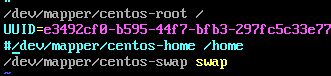

## 系统急救
* 生产过程中密码忘记是十分常见的事情，这个取决于规章制度，比如有专门记录密码的管理员和记录密码的excel表格对应，会减少出现这样的情况，但是，也有一些意外发生，比如密码修改之后没有进行确认，疏忽的将密码记录到表格内，导致下次无法使用的悲惨局面.
* 变更过程中往往会需要重新启动系统，但是却出现了无法正常启动系统的情况，比如grub升级丢失或者因为修改参数错误导致系统无法进入,这个时候，背后是不是直冒冷汗？

`建议参考如下案例，举一反三的思考，如何使用这些可以保命的急救手段！`

## 单用户模式
系统可以由硬盘启动，不过没有网络连接，可以使用一个维护shell。该模式会试着挂载文件系统，如果文件系统无法被挂载，那么该模式也就无法使用。
##### 实际操作
1.	在Grub 引导界面按下“e”进入修改模式（下图即使grub引导界面）

2.	找到如下行进行修改

		linux16 /vmlinuz-3.10.0………. rhgb quiet LANG=zh_CN.UTF-8
		修改为：（在rhgb quiet LANG=zh_CN.UTF-8之后添加rd.break）
		linux16 /vmlinuz-3.10.0……… UTF-8 rd.break

3.	修改后启动
		
		修改界面直接按 ”ctrl+x”,直到出现switch_root:/#

4.	只读变成读写
	
		当前模式的 /  是只读模式，即ro模式挂载，为了修改能成功，必须将 /  由只读挂载为读写模式，即rw。
		#mount –o remount,rw /sysroot
		#chroot /sysroot

5.	通知Selinux重新relabel一下规则

		touch /.autorelabel

6.	修改密码
		
		#passwd     //输入新的密码即可

7.	重新引导启动

		#exec /sbin/init
		等待启动的过程中Selinux刷新规则后即可使用新密码

## Resuce模式
救援模式能让使用者由系统光盘启动基本的Linux环境，而不是由硬盘来启动。通过使用救援模式，即使硬盘系统无法启动Linux，我们依然能够存取在改硬盘上的数据和修复无法启动的系统错误。

#### 如何进入resuce
1.	进入resuce模式需要系统光盘引导，所以是先将CentOS 7 的光盘放入。
2.	开机引导后在光盘选项界面选择”Troubleshooting”选项
3.	选择”Resuce a CentOS system”即可进入
4.	Resuce模式选择继续执行”Continue”继续执行
5.	在确认2个”OK”，即进入到sh-4.2#的shell模式
6.	到这里已经进入到了resuce模式了，我们可以使用chroot /mnt/sysimage将当前的resuce模式转到磁盘系统。

#### Resuce grub案例
1.	某次在升级系统内核的时候，勿动了grub的文件，确切点说是误删除了/boot内的某些grub文件，导致系统无法启动，启动系统之后情况如下：

	

	
2.	别说修改密码了，或者修改参数了，就是连基础的引导都过不了，其实这个时候系统的数据是没问题的，磁盘上的数据也都还在，只是grub无法引导到linux系统，我们只要简单的修复一下即可引导完成了。

3.	修复方法如下：
	
		1:进入光盘的resuce模式
		2:chroot /mnt/sysimage  //转入需要修复的磁盘系统
		3:grun2-install /dev/sda   //安装grub2，注意后面的盘符，即boot安装在的磁盘

4. 安装完成如下图

	

5.	注意，因为修复grub可能涉及grub的配置文件，所以将备份的grub.cfg文件拷贝到/boot/grub2/下，然后启动即可。像grub这么重要的文件，还是建议你列在备份之内。

6.	如果没有备份文件，那么就只能辛苦点了，使用grub2-mkconfig 重新生产一份了。

## Emergency 模式
所谓的emergency模式，既是系统可以启动，开机进入尽可能小的系统环境中，根目录会被挂载为只读，在这种模式下系统不会挂载任何文件系统和启动服务。这种修复模式启动的时候你会看到如下界面：

`提示你输入密码，然后使用”回车”进行确认`

#### 密码输入后，步骤如下：
1.	这里模拟XFS文件系统下home分区损坏，导致进入修复模式，看到的截图如下：

2.	其实生产中长遇见这样的情况，就是某个磁盘或者分区损坏但是系统并没有问题，这样也会导致我们无法正常启动，就需要进入该模式。
3.	如果你问我，如果你不知道是home坏了，那你如何判断？在启动的时候会给出很多出错的信息，你看这些信息，留意观察，比如这里给出的XFS （dm-2）这个提示，你在给予密码，然后”回车”拿到shell之后，执行如下操作将会看到谁是dm-2了。

4.	既然已经损坏，将dm-2的挂载在/etc/fstab中注销，启动时候不挂载dm-2。

5.	以上步骤完成后，既可以正常启动系统，进入之后在处理和修复home2，记得修复之前一定要先备份系统内其他重要数据。

`如果你想开机的时候进入emergency去处理一些问题，那么可以在grub界面的linux16 尾行添加”system.unit=emergency.target” 即可。`

### 总结
* 以上3种手段都是用于处理特殊情况的，可以解决的问题可不止上述范例这么多，试着举一反三的使用如上方法。
* 生产环境中，一定要以数据安全为主，一旦发生系统故障，可以尝试使用这3种方法来进行修复和抢救重要数据。