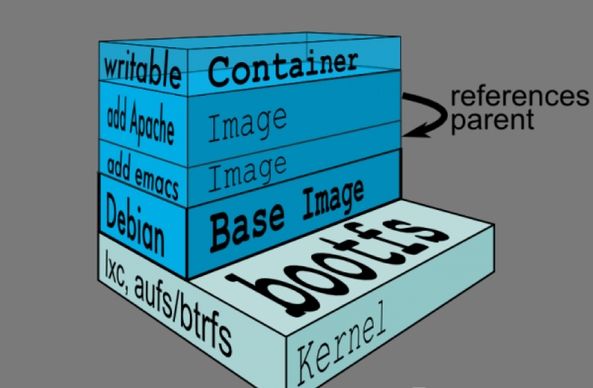
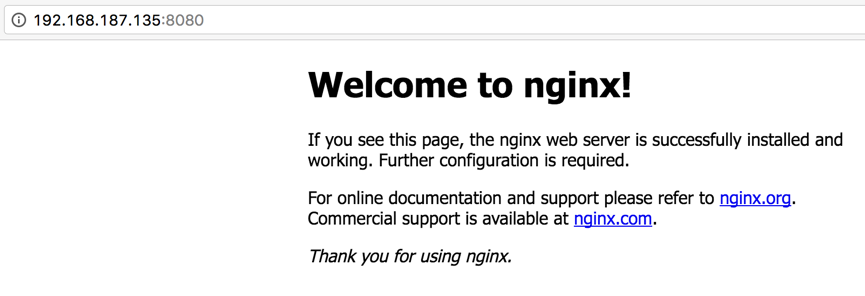

# 容器（Docker）
## Docker介绍
* Docker 提供了一个可以运行你的应用程序的封套(envelope)，或者说容器。它原本是 dotCloud 启动的一个业余项目，并在前些时候开源了。它吸引了大量的关注和讨论，导致 dotCloud 把它重命名到 Docker Inc。它最初是用 Go 语言编写的，它就相当于是加在 LXC（LinuX Containers，linux 容器）上的管道，允许开发者在更高层次的概念上工作。
* Docker 扩展了 Linux 容器（Linux Containers），或着说 LXC，通过一个高层次的 API 为进程单独提供了一个轻量级的虚拟环境。Docker 利用了 LXC， cgroups 和 Linux 自己的内核。和传统的虚拟机不同的是，一个 Docker 容器并不包含一个单独的操作系统，而是基于已有的基础设施中操作系统提供的功能来运行的。
* Docker类似虚拟机的概念，但是与虚拟化技术的不同点在于下面几点：
    1. 虚拟化技术依赖物理CPU和内存，是硬件级别的；而docker构建在操作系统上，利用操作系统的containerization技术，所以docker甚至可以在虚拟机上运行。
    2. 虚拟化系统一般都是指操作系统镜像，比较复杂，称为“系统”；而docker开源而且轻量，称为“容器”，单个容器适合部署少量应用，比如部署一个redis、一个memcached。
    3. 传统的虚拟化技术使用快照来保存状态；而docker在保存状态上不仅更为轻便和低成本，而且引入了类似源代码管理机制，将容器的快照历史版本一一记录，切换成本很低。
    4. 传统的虚拟化技术在构建系统的时候较为复杂，需要大量的人力；而docker可以通过Dockfile来构建整个容器，重启和构建速度很快。更重要的是Dockfile可以手动编写，这样应用程序开发人员可以通过发布Dockfile来指导系统环境和依赖，这样对于持续交付十分有利。
    5. Dockerfile可以基于已经构建好的容器镜像，创建新容器。Dockerfile可以通过社区分享和下载，有利于该技术的推广。
* Docker 会像一个可移植的容器引擎那样工作。它把应用程序及所有程序的依赖环境打包到一个虚拟容器中，这个虚拟容器可以运行在任何一种 Linux 服务器上。这大大地提高了程序运行的灵活性和可移植性，无论需不需要许可、是在公共云还是私密云、是不是裸机环境等等。
* Docker也是一个云计算平台，它利用Linux的LXC、AUFU、Go语言、cgroup实现了资源的独立，可以很轻松的实现文件、资源、网络等隔离，其最终的目标是实现类似PaaS平台的应用隔离。
* Docker 由下面这些组成：
    1. Docker 服务器守护程序（server daemon），用于管理所有的容器。
    2. Docker 命令行客户端，用于控制服务器守护程序。
    3. Docker 镜像：查找和浏览 docker 容器镜像。

### Docker 和 KVM 对比
>待补全
### Docker特性
1. 文件系统隔离：每个进程容器运行在完全独立的根文件系统里。
2. 资源隔离：可以使用cgroup为每个进程容器分配不同的系统资源，例如CPU和内存。
3. 网络隔离：每个进程容器运行在自己的网络命名空间里，拥有自己的虚拟接口和IP地址。
4. 写时复制：采用写时复制方式创建根文件系统，这让部署变得极其快捷，并且节省内存和硬盘空间。
5. 日志记录：Docker将会收集和记录每个进程容器的标准流（stdout/stderr/stdin），用于实时检索或批量检索。
6. 变更管理：容器文件系统的变更可以提交到新的映像中，并可重复使用以创建更多的容器。无需使用模板或手动配置。
7. 交互式Shell：Docker可以分配一个虚拟终端并关联到任何容器的标准输入上，例如运行一个一次性交互shell。
## Docker基础概念
Container和Image 在Docker的世界里，Image是指一个只读的层（Layer），这里的层是AUFS里的概念，最直观的方式就是看一下docker官方给出的图：

* Docker使用了一种叫AUFS的文件系统，这种文件系统可以让你一层一层地叠加修改你的文件，最底下的文件系统是只读的，如果需要修改文件，AUFS会增加一个可写的层（Layer），这样有很多好处，例如不同的Container可以共享底层的只读文件系统（同一个Kernel），使得你可以跑N多个Container而不至于你的硬盘被挤爆了！这个只读的层就是Image！而如你所看到的，一个可写的层就是Container。
* 那Image和Container的区别是什么？很简单，他们的区别仅仅是一个是只读的层，一个是可写的层，你可以使用docker commit 命令，将你的Container变成一个Image，也就是提交你所运行的Container的修改内容，变成一个新的只读的Image，这非常类似于git commit命令。

## Docker 包括三个基本概念
•	镜像（Image）
•	容器（Container）
•	仓库（Repository）

### Docker 镜像
* Docker 镜像就是一个只读的模板。
* 例如：一个镜像可以包含一个完整的 ubuntu 操作系统环境，里面仅安装了 Apache 或用户需要的其它应用程序。镜像可以用来创建 Docker 容器。
* Docker 提供了一个很简单的机制来创建镜像或者更新现有的镜像，用户甚至可以直接从其他人那里下载一个已经做好的镜像来直接使用。
* 容器是从镜像创建的运行实例。它可以被启动、开始、停止、删除。每个容器都是相互隔离的、保证安全的平台。
* 可以把容器看做是一个简易版的 Linux 环境（包括root用户权限、进程空间、用户空间和网络空间等）和运行在其中的应用程序。
>注：镜像是只读的，容器在启动的时候创建一层可写层作为最上层

### Docker 容器
* Docker 利用容器来运行应用。它可以被启动、开始、停止、删除。每个容器都是相互隔离的、保证安全的平台。
* 可以把容器看做是一个简易版的 Linux 环境（包括root用户权限、进程空间、用户空间和网络空间等）和运行在其中的应用程序。
>注：镜像是只读的，容器在启动的时候创建一层可写层作为最上层。

###Docker 仓库
* 仓库是集中存放镜像文件的场所。有时候会把仓库和仓库注册服务器（Registry）混为一谈，并不严格区分。实际上，仓库注册服务器上往往存放着多个仓库，每个仓库中又包含了多个镜像，每个镜像有不同的标签（tag）。
* 仓库分为公开仓库（Public）和私有仓库（Private）两种形式。最大的公开仓库是 Docker Hub，存放了数量庞大的镜像供用户下载。 国内的公开仓库包括 Docker Pool等，可以提供大陆用户更稳定快速的访问。
* 当然，用户也可以在本地网络内创建一个私有仓库。当用户创建了自己的镜像之后就可以使用 push 命令将它上传到公有或者私有仓库，这样下次在另外一台机器上使用这个镜像时候，只需要从仓库上 pull 下来就可以了。
>Docker 仓库的概念跟 Git 类似，注册服务器可以理解为 GitHub 这样的托管服务。

## Docker使用
### Docker安装
1. 关闭防火墙
    
        [root@docker-1 ~]#systemctl disable firewalld.service
2. 关闭selinux

        [root@docker-1 ~]#vi /etc/selinux/config
        SELINUX=disabled
3. 修改主机名

        [root@docker-1 ~]#hostnamectl set-hostname docker-1
        [root@docker-1 ~]# yum -y install docker-io
        使用yum源安装centOS 的Docker。
4. 查看版本

        [root@docker-1 ~]# docker version
        Client:
        Version:         1.10.3
        API version:     1.22
        Package version: docker-common-1.10.3-46.el7.centos.14.x86_64
        Go version:      go1.6.3
        Git commit:      cb079f6-unsupported
        Built:           Fri Sep 16 13:24:25 2016
        OS/Arch:         linux/amd64
        Cannot connect to the Docker daemon. Is the docker daemon running on this host?

5. 启动docker并设置为自动启动
        
        [root@docker-1 ~]# systemctl start docker.service; systemctl enable docker.service
6. 关闭docker并设置为不随机启动

        [root@docker-1 ~]# systemctl stop docker.service;systemctl disable docker.service

## Docker指令介绍
### Docker 镜像管理指令:
    docker images：列出本地所有镜像
    docker search <IMAGE_ID/NAME>：查找image
    docker pull <IMAGE_ID>：下载image
    docker push <IMAGE_ID>：上传image
    docker rmi <IMAGE_ID>：删除image
### 容器管理
    docker run -i -t <IMAGE_ID> /bin/bash：-i：标准输入给容器    -t：分配一个虚拟终端    /bin/bash：执行bash脚本
    -d：以守护进程方式运行（后台）
    -P：默认匹配docker容器的5000端口号到宿主机的49153 to 65535端口
    -p <HOT_PORT>:<CONTAINER_PORT>：指定端口号
    - -name： 指定容器的名称
    - -rm：退出时删除容器

    docker stop <CONTAINER_ID>：停止container
    docker start <CONTAINER_ID>：重新启动container
    docker ps - Lists containers.
    -l：显示最后启动的容器
    -a：同时显示停止的容器，默认只显示启动状态

    docker attach <CONTAINER_ID> 连接到启动的容器
    docker logs <CONTAINER_ID>  : 输出容器日志
    -f：实时输出
    docker cp <CONTAINER_ID>:path hostpath：复制容器内的文件到宿主机目录上
    docker rm <CONTAINER_ID>：删除container
    docker rm `docker ps -a -q`：删除所有容器
    docker kill `docker ps -q`
    docker rmi `docker images -q -a`
    docker wait <CONTAINER_ID>：阻塞对容器的其他调用方法，直到容器停止后退出

    docker top <CONTAINER_ID>：查看容器中运行的进程
    docker diff <CONTAINER_ID>：查看容器中的变化
    docker inspect <CONTAINER_ID>：查看容器详细信息（输出为Json）
    -f：查找特定信息，如docker inspect -f '{{ .NetworkSettings.IPAddress }}'
        docker commit -m "comment" -a "author" <CONTAINER_ID>  ouruser/imagename:tag
        docker extc -it <CONTAINER> <COMMAND>：在容器里执行命令，并输出结果

### 网络管理
    docker run -P：随机分配端口号
    docker run -p 5000:5000：绑定特定端口号（主机的所有网络接口的5000端口均绑定容器的5000端口）
    docker run -p 127.0.0.1:5000:5000：绑定主机的特定接口的端口号
    docker run -d -p 127.0.0.1:5000:5000/udp training/webapp python app.py：绑定udp端口号
    docker port <CONTAINER_ID> 5000：查看容器的5000端口对应本地机器的IP和端口号
    使用Docker Linking连接容器：
    Docker为源容器和接收容器创建一个安全的通道，容器之间不需要暴露端口，接收的容器可以访问源容器的数据
    docker run -d -P --name <CONTAINER_NAME> --link <CONTAINER_NAME_TO_LINK>:<ALIAS>  

### 数据管理
1. Data Volumes：volume是在一个或多个容器里指定的特殊目录
2. 数据卷可以在容器间共享和重复使用
3. 可以直接修改容器卷的数据
4. 容器卷里的数据不会被包含到镜像中
5. 容器卷保持到没有容器再使用它

        可以在容器启动的时候添加-v参数指定容器卷，也可以在Dockerfile里用VOLUMN命令添加
        docker run -d -P --name web -v /webapp training/webapp python app.py
        也可以将容器卷挂载到宿主机目录或宿主机的文件上，<容器目录或文件>的内容会被替换为<宿主机目录或文件>的内容，默认容器对这个目录有可读写权限
        docker run -d -P --name web -v <宿主机目录>:<容器目录> training/webapp python app.py
        可以通过指定ro，将权限改为只读
        docker run -d -P --name web -v <宿主机目录>:<容器目录>:ro training/webapp python app.py
        在一个容器创建容器卷后，其他容器便可以通过--volumes-from共享这个容器卷数据，如下：
        docker run -d -v /dbdata --name db1 training/postgres echo Data-only container for postgres
        首先启动了一个容器，并为这个容器增加一个数据卷/dbdata，然后启动另一个容器，共享这个数据卷
        docker run -d --volumes-from db1 --name db2 training/postgres
        此时db2使用了db1的容器卷，当容器db1被删除时，容器卷也不会被删除，只有所有容器不再使用此容器卷时，才会被删除
        docker rm -v：删除容器卷
        除了共享数据外，容器卷另一个作用是用来备份、恢复和迁移数据
        docker run --volumes-from db1 -v /home/backup:/backup ubuntu tar cvf /backup/backup.tar /dbdata
        启动一个容器数据卷使用db1容器的数据卷，同时新建立一个数据卷指向宿主机目录/home/backup，将/dbdata目录的数据压缩为/backup/backup.tar
        docker run -v /dbdata --name dbdata2 ubuntu /bin/bash
        docker run --volumes-from dbdata2 -v /home/backup:/backup busybox tar xvf /backup/backup.tar
        启动一个容器，同时把backup.tar的内容解压到容器的backup

## 使用Docker容器
### 下载并运行docker容器
    [root@docker-1 ~]# docker pull centos   （下载基础的centOS容器镜像）
    Using default tag: latest
    Trying to pull repository docker.io/library/centos ... 
    latest: Pulling from docker.io/library/centos
    8d30e94188e7: Pull complete 
    Digest: sha256:2ae0d2c881c7123870114fb9cc7afabd1e31f9888dac8286884f6cf59373ed9b
    Status: Downloaded newer image for docker.io/centos:latest
    或者下载已经配置好的nginx容器镜像
    [root@docker-1 ~]# docker pull nginx
    或者先搜索容器镜像，然后选择下载
    [root@docker-1 ~]# docker search nginx
    INDEX       NAME       DESCRIPTION           STARS     OFFICIAL   AUTOMATED
    docker.io   docker.io/nginx    Official build of Nginx.  4379      [OK]       
    镜像来源和镜像名称，以及描述，最主要的是STARS，受欢迎程度。
### 使用CentOS镜像容器，并进行登录访问
    [root@docker-1 ~]# docker run -itd centos
    fc603a7ea5716012e20dd72c4fa7df71131008a460854201d06dcfd5f777f14d
    [root@docker-1 ~]# docker ps -a
    CONTAINER ID        IMAGE               COMMAND                  CREATED             STATUS                      PORTS               NAMES
    fc603a7ea571        centos              "/bin/bash"              7 seconds ago       Up 6 seconds                                    focused_goldberg
    [root@docker-1 ~]# docker exec -it fc603a7ea571 /bin/bash
    [root@fc603a7ea571 /]# cat /etc/re
    redhat-release  resolv.conf     
    [root@fc603a7ea571 /]# cat /etc/redhat-release 
    CentOS Linux release 7.2.1511 (Core)
    一旦登录即可对该容器进行相关配置

## 修改/保存 docker容器

下载的容器如果不能满足需求，可以在该容器基础之上进行修改或者安装软件，然后保存并生产新的镜像，后续可以直接使用，可以上传到社区提供给大家。
    
    登录到容器后，可以直接使用yum进行安装,但是取决于你的容器是否配置yum源了，以及是否能够连接到外部网络
    [root@fc603a7ea571 /]# yum -y install vim
    安装后记得退出并保存当前容器状态。
    [root@docker-1 ~]# docker commit -m "comment" -a "author" fc603a7ea571 xcl/cnetOSvim

## Docker桥接网络
Docker启动的服务需要对外提供访问，那么我们可以将外部端口映射到docker容器端口进行访问，也可以桥接触docker容器网络来获取外部IP，然后进行访问
    
    [root@docker-1 ~]# docker run -itd -p 8080:80 nginx
    66ab54bee6723906492573b56909a762ea3bf942aba1e96f8c0e7253db389575
    [root@docker-1 ~]# docker ps -a
    CONTAINER ID        IMAGE               COMMAND                  CREATED             STATUS                         PORTS                           NAMES
    66ab54bee672        nginx               "nginx -g 'daemon off"   3 seconds ago       Up 1 seconds                   443/tcp, 0.0.0.0:8080->80/tcp   naughty_easley

